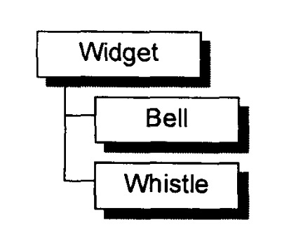
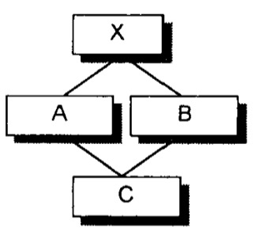

# Default Corstructor的建构操作

[TOC]

​		Default Corstructor 要在需要的时候被编译器产生出来

​		那到底什么时候才是需要的时候呢？？？

​		现有以下代码：

```c++
class Foo { 
public: 
  int val; 
  Foo *pnext;
};

void foobar()
{
	//程序要求bar‘s members 都被清为0 
	Foo bar;
	if ( bar.val || bar.pnext )
			//do Some thing
	//..
}
```

​		在这个例子中，想要的到的语意是要求 Foo 有个 Default Corstructor，可以初始化他的两个 member 。这个符合 “ 在需要的时候 ” ？

​		答案是 no。其间的差距在于一个是程序需要，一个是编译器需要。如果程序需要，那就是程序员的责任；本例要承担责任的是设计 class Foo 的人，是的，上述程序**<u>不会</u>**合成一个 Default Corstructor。

​		那么，什么时候才会合成出一个 default constructor 呢？当编译器需要它的时候！此外，被合成出来的 constructor 只执行编译器所需的行动。也就是说，即使有需要为 class Foo 合成一个 default constructor，那个 constructor 也不会将两个data members val 和 pnext 初始化为 0。为了让上一段码正确执行，class Foo 的设计者必须提供一个明显的 default constructor，将两个 members 适当地初始化。

​		C++ Standard 然后开始一一叙述在什么样的情况下这个 implicit default constructor 会被视为 trivial。一个 nontrivial default constructor 在 ARM 的术语中就是编译器所需要的那种，必要的话会由编译器合成出来。下面的四小节分别讨论 nontrivial default constructor 的四种情况.


## “带有 Default Constructor” 的 Member Class Object

​		如果一个 class 没有任何 constructor ， 但它内含一个 member object ，而后者有 default constructor ， 那么这个 class 的 implicit default constructor 就是“nontrivial”，编译器需要为此 class 合成出一个 default constructor。 不过这个合成操作只有在 constructor 真正需要被调用时才会发生。

​		举个例子，在下面的程序片段中，编译器为 class Bar 合成一个default constructor：

```c++
class Foo{
public:
	Foo(),
	Foo(int)...
};

class Bar { 
public:
	Foo foo;
	char *str;
};

void foo_bar ()
{
	Bar bar; // Bar::foo 必须在此处初始化
				 	 // Bar::foo 是一个 member object, 而其 class Foo
				 	 //				拥有 default constructor, 符合本小节主题
	if(str){...}
}
```

​		**<u>被合成的 *Bar* default constructor 内含必要的代码，能够调用 class *Foo* 的default constructor 来处理 member object *Bar::foo*，但它并不产生任何码来初始化 *Bar::str*。</u>**

​		是的，将 *Bar::foo* 初始化是编译器的责任，将 *Bar::str* 初始化则是程序员的责任。被合成的 default constructor 看起来可能像这样:

```c++
// Bar 的 default cons tructor 可能会被这样合成
// 被 member foo 调用 class Foo 的 default constructor
inline Bar::Bar ()
{
	//伪代码
	foo.Foo::Foo() ;
}
```

​		再一次请你注意，被合成的 default constructor 只满足编译器的需要，而不是程序的需要。

​		为了让这个程序片段能够正确执行，字符指针 str 也需要被初始化。让我们假设程序员经由下面的 default constructor 提供了 str 的初始化操作:

```c++
//程序员定义的default constructor
Bar::Bar() { 
  str = 0; 
}
```


​		现在程序的需求获得满足了，但是编译器还需要初始化 member object *foo*。由于 default constructor 已经被明确地定义出来，编译器没办法合成第二个。“噢，伤脑筋”，你可能会这样说。编译器会采取什么行动呢？

​		编译器的行动是：<u>**“如果 class *A* 内含一个或一个以上的 member class objects ，那么 class *A* 的每一个 constructor 必须调用每一个 member classes 的 default constructor ” 。编译器会扩张已存在的 constructors，在其中安插一些码，使得 user code 在被执行之前，先调用必要的 default constructors。**</u>

​		沿续前一个例子，扩张后的 constructors 可能像这样:

```c++
// 扩张后的 default constructor
// C++ 伪代码

Bar::Bar() {
		foo.Foo::Foo();	// 附加上的 compiler code
		str = 0;				// explicit user code
)
```

​		如果该 class 中有多个 member object 且该 class 没有 default constructor 该如何组织 default constructor 构建顺序呢？

​		沿续前一个例子，扩张后的 constructors 可能像这样:

```c++

class A{
  A();
};
class B{
  B();
};
class C{
  C();
};
class Bar{
  A a;
  C c;			//注意顺序
  B b;			//注意顺序
  char *str;
};


// 扩张后的 default constructor
// C++ 伪代码

Bar::Bar() {
		a.A::A();	
		c.C::C();	
		b.B::B();	// 附加上的 compiler code
  
		str = 0;				// explicit user code
)
```


## “ Default Constructor ” 的 Base Class

​		类似的道理，如果一个没有任何 constructors 的 class 派生自一个 “ 带有default constructor ” 的 base class， 那么这个 derived class 的 default constructor 会被视为 nontrivial，并因此需要被合成出来。它将调用上一层 base classes 的 default constructor ( 根据它们的声明次序 ) 。对一个后继派生的 class 而言，这个合成的 constructor 和一个 “ 被明确提供的 default constructor ” 没有什么差异。

​		如果设计者提供多个 constructors， 但其中都没有 default constructor 呢？编译器会扩张现有的每一个 constructors， 将 “ 用以调用所有必要之 default constructors ” 的程序代码加进去。它不会合成一个新的 default constructor ，这是因为其它 “ 由 user 所提供的 constructors ” 存在的缘故。如果同时亦存在着 “ 带有 default constructors ” 的 member class objects，那些 default constructor 也会被调用——在所有 base class constructor 都被调用之后。


## “带有一个Virtual Function ” 的 Class

​		另有两种情况，也需要合成出 default constructor：
1. class 声明 ( 或继承 ) 一个 virtual function。
2. class 派生自一个继承串链，其中有一个或更多的、virtual base classes。

不管什么情况，由于缺乏 user 声明的 constructors，编译器会详细记录合成一个 default constructor 的必要信息。以下面程序为例：

```c++
class Widget{
public:
	virtual void flip() = 0;
	//...
}

void flip(const Widget& widget){
  widget.flip();
}

void foo(){
  Bell b;
  Whistle w;
  
  flip( b );
  flip( w );
}
```



下面两个扩张操作会在编译期间发生：

1. 一个 virtual function table 会被编译器产生出来，内放 class 的 virtual function 地址。
2. 在<u>每一个</u> class object 中，一个额外的 pointer member（也就是 vptr）会被编译器合成出来，内含相关的 class vtbl 的地址。

​        此外，widget.flip() 的**虚拟印发操作（virtual invocation）**会被重写改写，以使用 widget 的 vptr 和 vtbl 中的 flip() 条目：

```c++
// widget.flip() 的虚拟引发操作的转变
( *widget.vptr[1] )( &widget );
```

​		其中：

- 1 表示 flip() 在 virtual table 中的固定索引；
- &widget 代表要交给“被调用的某个 flip() 函数实体 ” 的 this 指针。

​        为了让这个机制发挥工序，编译器必须为每个 Widget (或其派生类之) object 的 vptr 设定初值，放置适当的 virtual table 地址。对于 class 所定义的每个 constructor ，编译器会安插一些码来做这样的事情。对于那些为声明任何 constructor，以便正确地初始化每一个 class object 的 vptr。


## “带有一个 Virtual Base Class ”的 Class

​		virtual base class 必须保证其在每一个 derived class object 中的位置，能够在于执行期准备妥当。

​		比如下列代码：

```c++
class X {
public:
  int i;
}
class A : public virtual X {
public:
  int j;
};
class B : public virtual X {
public:
  double d;
};
class C : public A, public B {
public:
  int k;
};

//无法在编译时期决定（resolve）出 pa->X::i 的位置
void foo(const A* pa) {
  pa->i = 1024;
}

main() {
  foo(new A);
  foo(new C);
  //...
}
```



​		编译器无法固定住 *foo()* 之中 “ 经由 *pa* 而存取的 *X::i* ”的实际偏移位置，因为 *pa* 的真正类型可以改变。编译器必须改变 “ 执行存取操作 ” 的那些码，使 *X::i* 可以延迟至执行期才决定下来。

​		原先 cfront 的做法是靠 “ 在 derived class object 的每一个 virtual base classes 中安插一个指针 ” 完成。所有 “ 经由 reference 或 pointer 来存取一个 virtual base class ” 的操作都可以通过相关指针完成。

​		在我的例子中，foo() 可以被改写如下，以符合这样的实现策略:

```c++
//可能的编译器转变操作
void foo( const A* pa ) {
   pa->_vbcX->i = 1024; 
} 
```

​		其中 *_vbcX* 表示编译器所产生的指针，指向 virtual base class X。

​		正如你所臆测的那样， _vbcX ( 或编译器所做出的某个什么东西 ) 是在 class object 建构期间被完成的。

​		对于 class 所定义的每一个 constructor ，编译器会安插那些 “ 允许每一个 virtual base class 的执行期存取操作 ” 的码。如果 class 没有声明任何 constructors， 编译器必须为它合成一个 default constructor.


## 总结

​		有四种情况，会导致 “ 编译器必须为未声明 constructor 之 classes 合成一个
default constructor ”. C++ Stardand 把那些合成物称为 implicit nontrivial default
constructors。

​		被合成出来的 constructor 只能满足编译器 ( 而非程序 ) 的需要。它之所以能够完成任务，是借着 “ <u>调用 member object 或 base class 的 default constructor</u> ” 或是 “ <u>为每一个 object 初始化其 virtual function 机制或 virtual base class机制</u> ” 而完成。

​		至于没有存在那四种情况而又没有声明任何 constructor 的 classes，我们说它们拥有的是 implicit  trivial  default  constructors，它们实际上并不会被合成出来.

​		<u>**在合成的 default constructor 中，只有 base class subobjects 和 member class objects 会被初始化。所有其它的 nonstatic data member，如整数、整数指针、整数数组等等都不会被初始化。**</u> 这些初始化操作对程序而言或许有需要，但对编译器则并非必要。如果程序需要一个 “ 把某指针设为 0 ”  的 default constructor，那么提供它的人应该是程序员。

​	C++新手一般有两个常见的误解:

1. 任何 class 如果没有定义 default connstructor， 就会被合成出一个来。
2. 编译器合成出来的 default constructor 会明确设定 “ class 内每一个 data member 的默认值”.

​        如你所见，没有一个是真的!