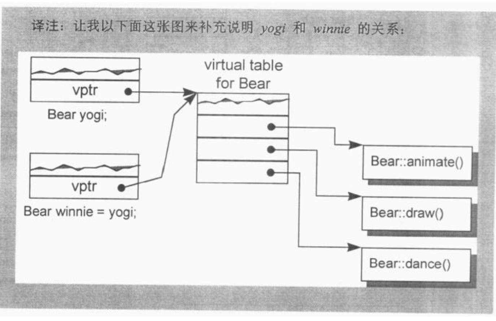
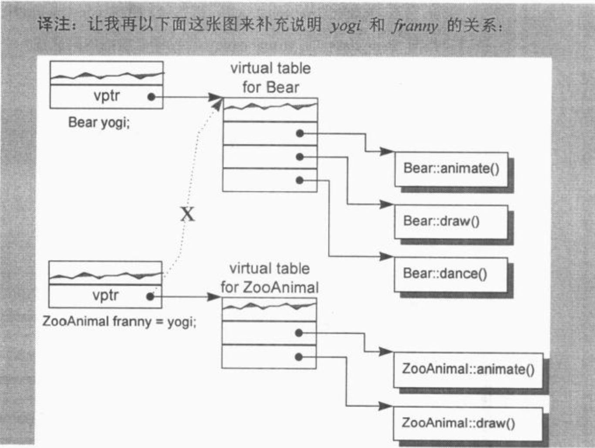
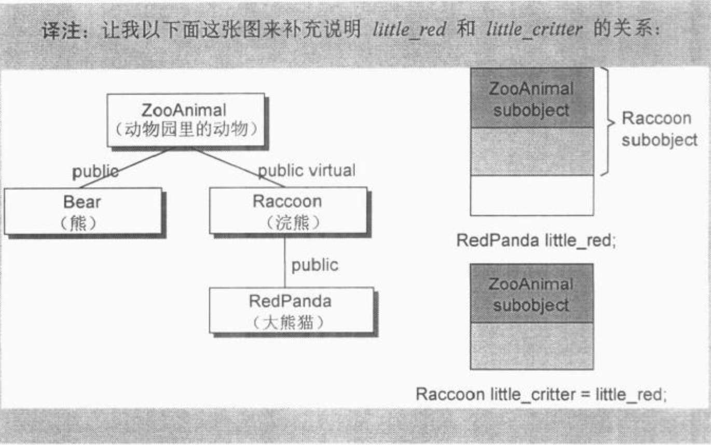

# Copy Constructor的建构操作

[TOC]

有三种情况，会以一个 object 的内容作为另一个 class object的初值：

```c++
//第一种：
c1ass X { ... };
X x;

//明确地以一个object 的内容作为另一个class object的初值.
XXX = x;

//第二种：
extern void foo(X x) ;
void bar() {
	X xx;
  
	// 以 xx 作为 foo() 第一个参数的初值 ( 不明显的初始化操作 )
	foo(XX);
  
	//...
}

//第三种：当函数传回一个 class object
X foo_bar () {
	X xx;
	//...
	return xx ;
}
```

​		假设 class 设计者明确定义了一个 copy constructor (这是一个 constructor，有一个参数的类型是其 class type )，像下面这样:

```c++
//user-defined copy constructor 的实例
//可以是多参数形式，其第二参数及后继参数以一个默认值供应之
X::X( const X& x);
Y::Y( const Y& y, int = 0);
```

​		那么在大部分情况下，当一个 class object 以另一个同类实体作为初值时，上述的 constructor 会被调用。这可能会导致一个暂时性 class object 的产生或程序代码的蜕变 ( 或两者都有 ) 。


## Default Memberwise Initialization

​		如果 class 没有提供一个 explicit copy constructor 又当如何?

​		当 class object 以 “ 相同 class 的另一个 otject ” 作为初值时，其内部是以所谓的 **default memberwise initializatior** 手法完成的，<u>也就是把每一个内建的或派生的 data member ( 例如一个指针或一数目组)的值，从某个 object 拷贝一份到另一个 object 身上。</u>不过它并不会拷贝其中的 member class object， 而是以递归的方式施行 memberwise initializalion。例如，考虑下面这个 class 声明:

```c++
class String {
public:
//... 没有 explicit copy constructor 
private:
	char *str ;
	int len;
);
```

一个 String object 的 default memberwise initialization 发生在这种情况之下:

```c++
String noun("book");
String verb = noun ;
```

其完成方式就好像个别设定每一个 members 一样:

```c++
//语意相等
verb.str = noun.str;
verb.len = noun.len;
```

如果一个 String object 被声明为另一个class 的 member，像这样:

```c++
class word {
public:
	//...没有 explicit copy constructor
private:
	int		 _occurs;
	String _word; //String object 成为 class word 的一个 member！
};
```

​		那么一个 Word object 的 default memberwise initialization 会拷贝其内建的  member __occurs_ ， 然后再于 String member object *_word* 身上递归实施 memberwise initialization。

​		“ 如果一个 class 未定义出 copy constructor，编译器就自动为它产生出一个 ”这句话不对，而是应该：Default constructors 和 copy constructors 在**必要**的时候才由编译器产生出来。 

​		这个句子中的 “必要 ” 意指当 class 不展现 bitwise copy semantics 时。C++ 
Standard 仍然保留了 ARM 的意义，但是将相关讨论更形式化如下：

​		一个 class object 可以从两种方式复制得到，一种是被初始化 ( 也就是我们这里所关心的 )，另一种是被指定 ( assignment， 第5章讨论之 )。从概念上而言这两个操作分别是以 copy constructor 和 copy assignment operator 完成的。

​		就像 default constructor 一样，C++ Standard 上说，如果 class 没有声明一个copy constructor，就会有**隐含的声明 ( implicitly declared )** 或 **隐含的定义( implicitly defined )**出现。

​		和以前一样，C++ Standard 把 copy constructor 区分为 trivial 和 nontrivial 两种。只有 nontrivial 的实体才会被合成于程序之中。决定一个 copy constructor 是否为 trivial 的标准在于 class 是否展现出所谓的 “ bitwisecopy semantics ”。下一节我将说明 “ class 展现出 bitwise copy semantics ” 这句话是什么意思。


## Bitwise Copy Semantics (位逐次拷贝)

有下列程序片段：

```c++
#include "Word.h"

word noun("book");

void foo(){ 
	Word verb = noun ;
	//...
}
```

​		很明显 *verb* 是根据 *noun* 来初始化。但是在尚未看过 class *Word* 的声明之前，我们不可能预测这个初始化操作的程序行为。如果 class *Word* 的设计者定义了一个copy constructor， verb 的初始化操作会调用它。但如果该 class 没有定义 explicit copy constructor，那么是否会有一个编译器合成的实体被调用呢?

​		这就得视该 class 是否展现 " **bitwise copy semantics** " 而定。举个例子，已知下面的 class *Word* 声明:

```c++
//以下声明展现了bitwise copy semantics .
class Word {
public:
	Word (const char* ) ;
	~Word () {
  	delete [] str; 
  }
	//...
private:
	int   cnt;
	char *str;
);
```

​		这种情况下并不需要合成出一个 default copy constructor，因为上述声明展现
了 “ default copy semantics ” ，而 verb 的初始化操作也就不需要以一个函数调用
收场。然而，如果 class *Word* 是这样声明:

```c++
//以下声明并未展现出bitwise copy semantics
class Word {
public:
	Word(const String&);
	~Word();
	//...
private :
	int cnt ;
	String str;
};
```

其中 String 申明了一个 explicit copy constructor:

```c++
class String (
public:
	String(const char *t);
	String(const String&);
	~String() ;
	//..
};
```

​		在这个情况下，编译器必须合成出一个 copy constructor 以便调用 member class String object 的 copy constructor：

```c++
//一个被合成出来的 copy constructor
// C++ 伪码
inline Word: :Word( const Word& wd)
{
	str.String::String(wd.str);
	cnt = wd.cnt;
}
```

​		有一点很值得注意：在这被合成出来的 copy constructor 中，如整数、指针、数组等等的 nonclass members 也都会被复制，正如我们所期待的一样。


## 不要 Bitwise Copy Semantics !

​		什么时候一个 class 不展现出 “ bitwise copy semantics ” 呢？有四种情况:

1. 当 class 内含一个 member object 而后者的 class 声明有一个 copy constructor 时(不论是被 class 设计者明确地声明，就像前面的 String 那样；或是被编译器合成，像 class *Word* 那样)
2. 当 class 继承自一个 base class 而后者存在有一个( copy constructor 时
   (再次强调，不论是被明确声明或是被合成而得).
3. 当 class 声明了一个或多个 virtual functions 时。
4. 当 class 派生自一个继承串链，其中有一个或多个 virtual base classes 时.

​        前两种情况中，编译器必须将 member 或 base class 的 “ copy constructors 调用操作 ” 安插到被合成的 copy constructor 中。前一节 class *Word* 的 “ 合成而得的 copy constructor ” 正足以说明情况 1。情况 3 和 4 有点复杂，是我们接下来要讨论的题目。


## 重新设定 Virtual Table 的指针

​		回忆编译期间的两个程序扩张操作 ( 只要有一个 class 声明了一个或多个 virtual functions 就会如此 )：

- 增加一个 virtual function table ( vtbl )，内含每一个有作用的 virtual function 的地址。
- 将一个指向 virtual function table 的指针 ( vptr ) ，安插在每一个 class 
  object 内。

​        很显然，如果编译器对于每一个新产生的 class object 的 vptr 不能成功而正确地设好其初值，将导致可怕的后果。因此，**<u>当编译器导入一个 vptr 到 class 之中时，该 class 就不再展现 bitwise semantics了。</u>**

​		现在，编译器需要合成出一个 copy constructor，以求将 vptr 适当地初始化，下面是个例子。

​		首先，我们定义两个 classes，ZooAnimal 和 Bear：

```c++
class ZooAnimal {
public:
	ZooAnimal() ;
	virtual ~ZooAnimal () ;
  
	virtual void animate () ;
	virtual void draw() ;
	//...
private:
	// ZooAnimal 的 animate() 和 draw()
	// 所需要的数据
);
 
class Bear:public ZooAnimal {
pub1ic:
	Bear();
	void animate();	//虽未明写virtual, 它其实是virtual
	void draw();		//虽未明写virtual, 它其实是virtual
	virtual void dance () ;
	//...
private :
	// Bear 的 animate() 和 draw() 和 dance()
	// 所需要的数据
);
```

​		*ZooAnimal* class object 以另一个 *ZooAnimal* class object 作为初值，或 *Bear* class object 以另一个 *Bear* class object 作为初值，都可以直接靠 “ bitwise copy semantics ” 完成 ( 除了可能会有的 pointer member 之外。为了简化，这种情况被我剔除 ) 。举个例子：

```c++
Bear yogi;
Bear winnie = yogi ;
```

​		*yogi* 会被 default *Bear* constructor 初始化。而在 constructor 中，*yogi* 的 vptr 被设定指向 *Bear* class 的 virtual table (靠编译器安插的码完成)。因此，把 *yogi* 的 vptr 值拷贝给 *winnie* 的 vptr 是安全的.



​		**<u>当一个 base class object 以其 derived class 的 object 内容做初始化操作时，其 vptr 复制操作也必须保证安全</u>**，例如：

```c++
ZooAnimal franny = yogi; // 这会发生切割(sliced)行为
```

​		<u>*franny* 的 vptr 不可以被设定指向 *Bear* class 的 virtual table</u> ( 但如果 *yogi* 的vptr 被直接 “ bitwise copy ” 的话，就会导致此结果 )，否则当下面程序片段中的*draw()* 被调用而 *franny* 被传进去时，就会“ 炸毁 ” ( blow up ) :

```c++
void draw(const ZooAnimal& zoey ) { 
  zoey.draw(); 
}

void foo() {
	// franny 的 vptr 指向 ZooAnimal 的 virtual table,
	// 而非 Bear 的 virtual table (彼由 yogi 的 vptr 指出)
	ZooAnimal franny = yogi;
  
	draw(yogi);			// 调用 Bear::draw( )
	draw(franny); 	// 调用 ZooAnimal::draw()
}
```



​		也就是说，合成出来的 *ZooAnimal* copy constructor 会明确设定 object 的 vptr 指向 *ZooAnimal* class 的 virtual table，而不是直接从右手边的 class object 中将其 vptr 现值拷贝过来。


## 处理 Virtual Base Class Subobject

​		Virtual base class 的存在需要特别处理。一个 class object 如果以另一个  object 作为初值，而后者有一个 virtual base class subobject，那么也会使 “ bitwise copy semantics ” 失效。

​		每一个编译器对于虚拟继承的支持承诺，都表示必须让 “ derived class object中的 virtual base class subobject 位置 ” 在<u>执行期</u>就准备妥当。

​		维护 “位置的完整性 ” 是编译器的责任。“ Bitwise copy semantics ” 可能会破坏这个位置，所以编译器必须在它自己合成出来的 copy constructor 中做出仲裁。举个例子，在下面的声明中，*ZooAnimal* 成为 *Raccoon* 的一个 virtual base class：

```c++
class Raccoon : public virtual ZooAnimal {//raccoon浣熊
public:
	Raccoon() { /*  设定	private data 初值*/ }
	Raccoon(int val) { /* 设定	private data 初值 */ }
	//...
private :
	//所有必要的数据
};
```

​		编译器所产生的代码 ( <u>用以调用 *ZooAnimal* 的 default constructor、将 *Raccoon* 的 vptr 初始化，并定位出 *Raccoon* 中的 *ZooAnimal* subobject</u> ) 被安插在两个 *Raccoon* constructors 之内，成为其先头部队。

​		那么 “ memberwise 初始化 ” 呢？噢，一个 virtual base class 的存在会使 bitwise copy semantics 无效。其次，**<u>问题并不发生于 “ 一个 class object 以另一个同类的 object 作为初值 ” 之时，而是发生于 “ 一个 class object 以其 derived classes 的某个 object 作为初值 ” 之时</u>**。例如，让 Raccoon object 以一个 RedPanda object 作为初值，而 RedPanda 申明如下：

```c++
class RedPanda : public Raccoon {
public:
	RedPanda() { /* 设定 private data初值*/ }
	RedPanda( int va1 ) { /* 设定 private data初值*// }
	//...
private:
	//所有必要的数据
};
```

​		**<u>我再强调一次，如果以一个 *Racoon* object 作为另一个 *Raccoon* object 的初值，那么“ bitwise copy ” 就绰绰有余了</u>**：

```c++
//简单的 bitwise copy 就足够了
Raccoon rocky;
Raccoon little_critter = rocky ;
```

​		然而如果企图以一个 *RedPanda* object 作为 *lttle_critter* 的初值，编译器必须判断 “ 后续当程序员企图存取其 *ZooAnimal* subobject 时是否能够正确地执行 ” ( 这是一个理性的程序员所期望的 )  :

```c++
//简单的 bitwise copy 还不够，
//编译器必须明确地将 litt1e_critter 的
//  virtual base class pointer/offset 初始化

RedPanda little_red ;
Raccoon little_critter = little_red;
```

​		在这种情况下，为了完成正确的 *little_critter* 初值设定，编译器必须合成一个copy constructor，安插一些码以设定 virtual base class pointer/offset 的初值 ( 或只是简单地确定它没有被抹消 ) ，对每一个 members 执行必要的 memberwise 初始化操作，以及执行其它的内存相关工作。



​		在下面的情况中，编译器无法知道是否 “ bitwise copy semantics " 还保持着，因为它无法知道 ( 没有流程分析 ) *Raccoon* 指针是否指向一个真正的 *Raccoon* object，或是指向一个 derived class object：

```c++
//简单的 bitwise copy 可能够用，也可能不够用
Raccoon *ptr;
Raccoon little_critter = *ptr;
```

​		这里有一个有趣的问题：当一个初始化操作存在并保持着 “ bitwise copy semantics ” 的状态时，如果编译器能够保证 object 有正确而相等的初始化操作，是否它应该压抑 copy constructor 的调用，以使其所产生的程序代码优化？至少在合成的 copy constructor 之下，程序副作用的可能性是零，所以优化似乎是合理的。如果 copy constructor 是由 class 设计者提供的呢？这是一个颇有争议的题目，我将在下一节结束前回来讨论之.

​		


## 总结

​		让我做个总结：我们已经看过四种情况，在那些情况下 class 不再保持 “ bitwise copy semantics ” ，而且 default copy constructor 如果未被声明的话，会被视为是 nontrivial。在这四种情况下，如果缺乏一个已声明的 copy constructor ,编译器为了正确处理 “ 以一个 class object 作为另一个 class object 的初值 ”，必须合成出一个 copy constructor。

​		下一节将讨论编译器调用 copy constructor 的策略，以及这些策略如何影响我们的程序。

