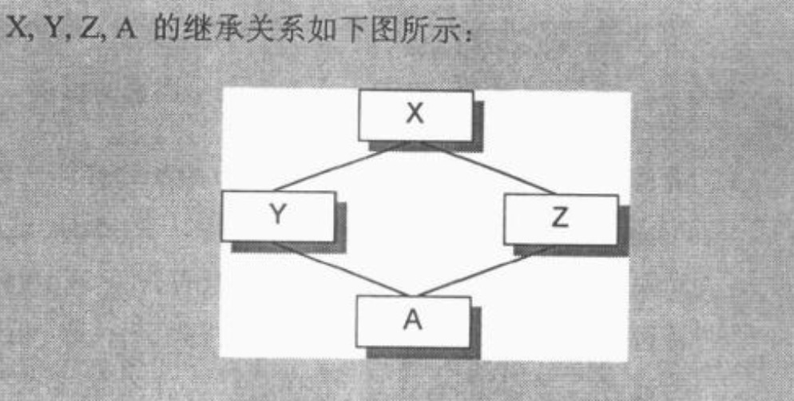
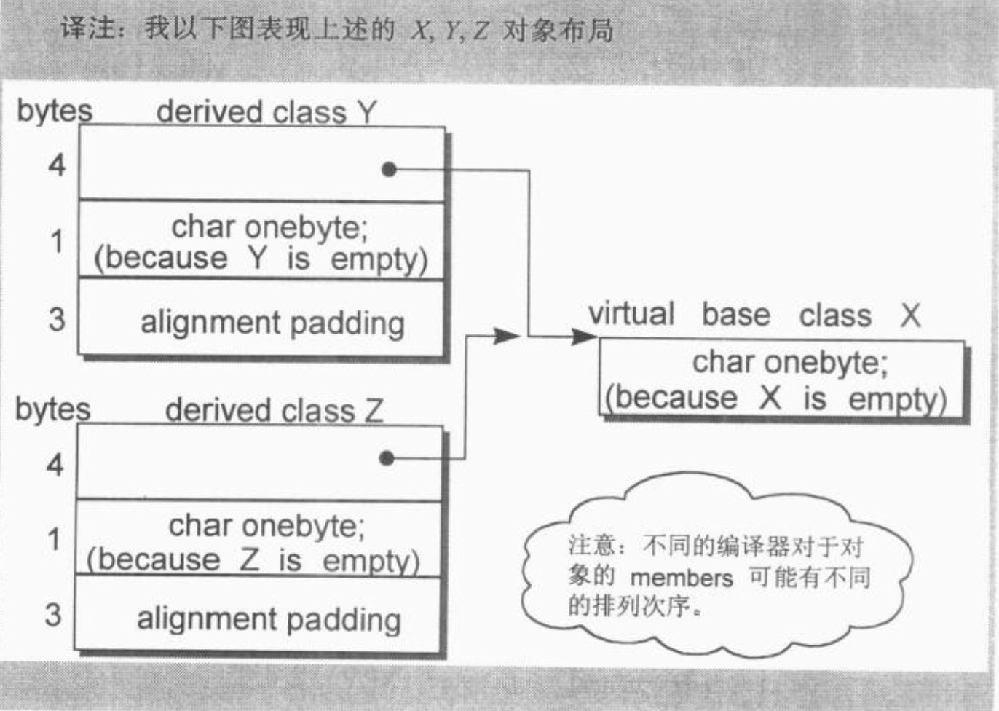
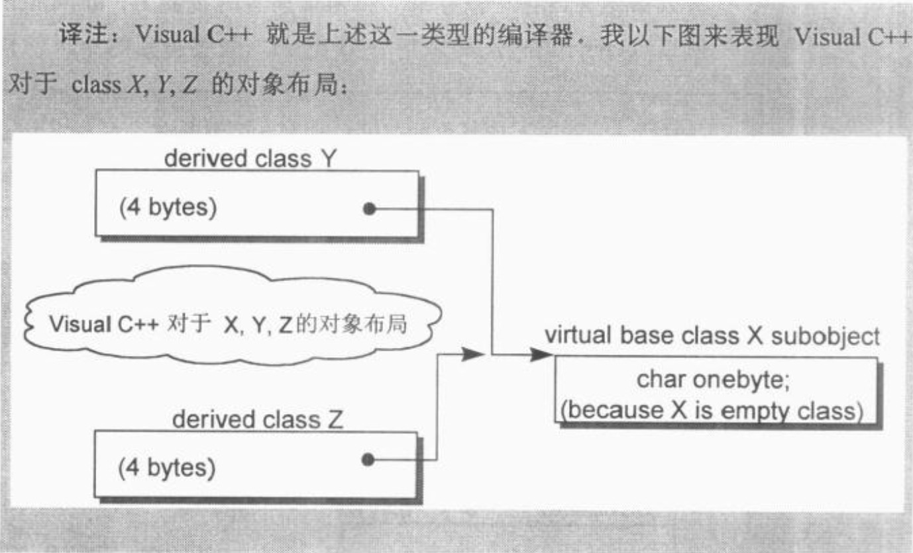

现有下列代码：

```
class X {

};
class Y : public virtual X {

};
class Z : public virtual X {

};
class A : public Y, public Z {

};
```



​		上述 X,  Y,  Z,  A 中没有任何一个 c lass 内含明显的数据，其间只表示了继承关系。所以发信者认为每一个 class 的大小都应该是 0。当然不对 ! 即使是 class X 的大小也不为 0 :

`sizeof X 的结果为 1
sizeof Y 的结果为 8
sizeof Z 的结果为 8
sizeof A 的结果为 12`

​		让我们依次看看每一个 class 的声明，并看看它们为什么获得上述结果。

​		一个空的class 如:

```c++
//sizeof X == 1
class X {};
```

​		事实上并不是空的，它有一个隐晦的 1 byte，那是被编译器安插进去的一个
 char。这使得这个 class 的两个 objects 得以在内存中配置独一无二的地址：

```c++
X a, b;
if( &a == &b) 
  cerr<< "yipes!"<<endl;
```

​		让我们感到惊讶和沮丧的，是 Y 和 Z 的 sizeof 结果：

```c++
//sizeof Y == sizeof Z == 8
c1ass Y : public virtual X {
  
};
class Z : public virtual X {
  
};
```

​		Y 和 Z 的大小都 8 。这个大小和机器有关，也和编译器有关。事实上 Y 和 Z 的大小受到三个因素的影响：

1. **语言本身所造成的额外负担( overhead )**   当语言支持 virtual base classes 时，就会导致一些额外负担。**<u>在 derived class 中，这个额外负担反映在某种形式的指针身上，它或者指向 virtual base class subobject，或者指向一个相关表格，表格中存放的若不是 virtual base class subobject 的地址，就是其偏移量(offset) 。</u>**在输出的机器上，指针是 4 bytes 。
2. **编译器对于特殊情况所提供的优化处理**  Virtual base class X subobject 的 1 bytes 大小也出现在 class Y 和 Z 身上。传统上它被放在 derived class 的固定 ( 不变动 ) 部分的尾端。某些编译器会对 empty virtual base class 提供特殊支持 ( 以下第 3 点之后的一段文字对此有比较详细的讨论) 。输出机器使用的编译器，显然并未提供这项特殊处理。
3. **Alignment 的限制** class Y 和 Z 的大小截至目前为 5 bytes。在大部分机器上，群聚的结构体大小会受到 alignment 的限制，使它们能够更有效率地在内存中被存取。在输出的机器上，alignment 是 4 bytes，所以 class Y 和 Z 必须填补 3  bytes。最终得到的结果就是 8 bytes。



​		Empty virtual base class 已经成为 C++ OO 设计的一个特有术语了。它提供一个 virtual interface， 没有定义任何数据。

​		某些新近的编译器对此提供了特殊处理。**<u>在这个策略之下，一个 empty virtual base class 被视为 derived class object 最开头的一部分，也就是说它并没有花费任何的额外空间。</u>**这就节省了上述第 2 点的 1 bytes (因为既然有了 members， 就不需要原本为了 empty class 而安插的一个 char )，也就不再需要第3 点所说的 3 bytes 的填补。只剩下第 1 点所说的额外负担。在此模型下，Y 和 Z 的大小都是 4 而不是 8。



​		那么，你期望 class A 的大小是什么呢？

​		很明显，某种程度上必须视你所使用的编译器而定。首先，请你考虑那种并未特别处理 empty virtual base class 的编译器。如果我们忘记 Y 和 Z 都是“虚拟派生”自 class X，我们可能会回答 16，毕竟 Y 和 Z 的大小都是 8。

​		然而当我们对 class A 施以 sizeof 运算符时，得到的答案竟然是 12。到底是怎么回事?

​		记住，**<u>一个 virtual base class subobject 只会在 derived class 中存在一份实体，不管它在 class 继承体系中出现了多少次!</u>**  classA 的大小由下列几点决定:

- 被大家共享的唯一一个 class X 实体，大小为 1 byte。
- Base class Y 的大小，减去 “ 因 virtual base class X 而配置 ” 的大小，结果是 4 bytes。Base class Z 的算法亦同。加起来是 8 bytes.
- class A 自己的大小: 0 byte。
- classA 的 alignment 数量 ( 如果有的话 )。前述三项总合，表示调整前
  的大小是 9 bytes。 class A 必须调整至 4 bytes 边界，所以需要填补 3
  bytes。结果是 12 bytes。

​        现在如果我们考虑那种 “ 特别对 empty virtual base class 做了处理 ” 的编译器呢？

​		一如前述，class X 实体的那 1 byte 将被拿掉，于是额外的 3 bytes 填补额也不必了，因此 class A 的大小将是 8 bytes。注意，如果我们在 virtual base class X 中放置一个 ( 以上 ) 的 data members， 两种编译器( “ 有特殊处理 ” 者和 “ 没有特殊处理 ” 者 ) 就会产生出完全相同的对象布局。


