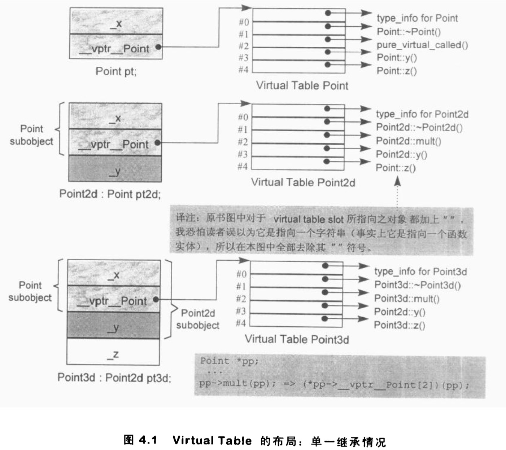
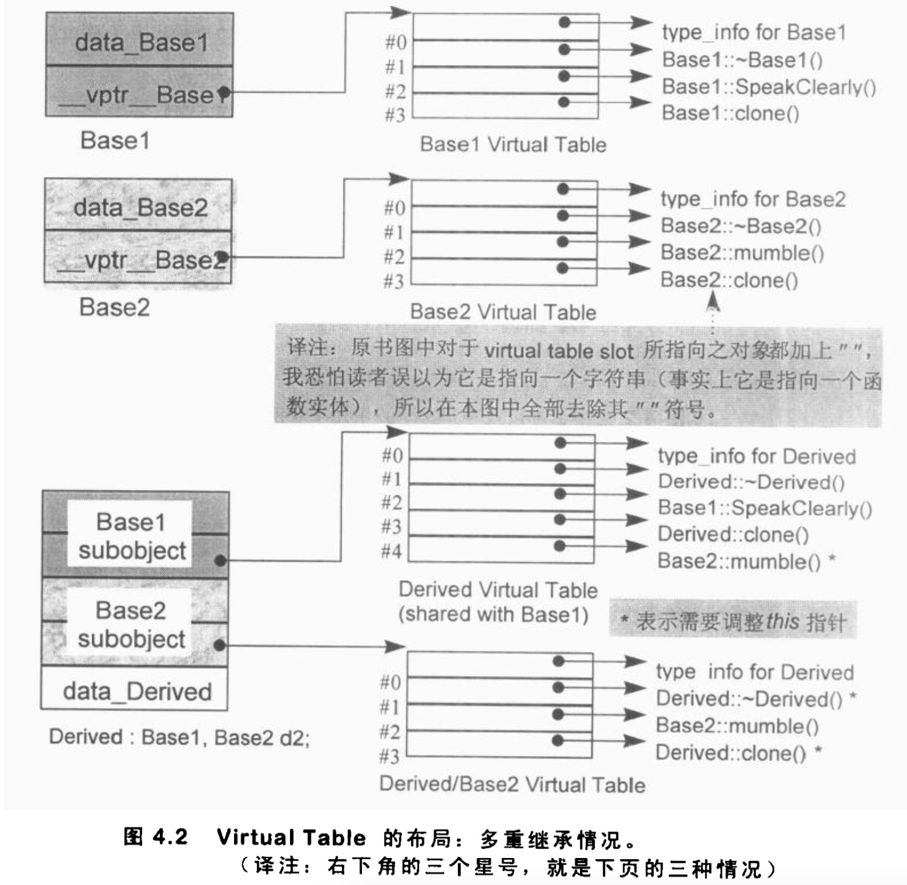
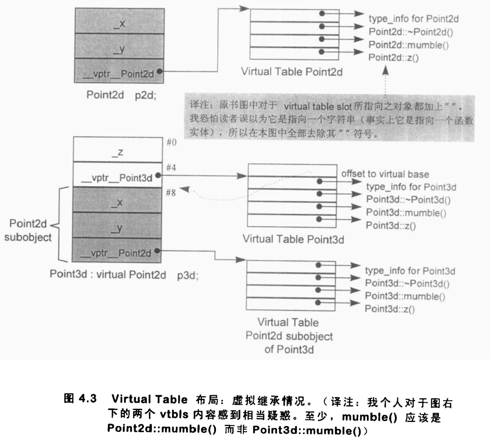

# Virtual Member Functions ( 虚拟成员函数)

[TOC]

​		我们已经看过了 virtual function 的一般实现模型 : 每一个 class 有一个 **virtual  table** , 内含该 class 之中有作用的 virtual function 的地址，然后每个 object 有一个 vptr ,  指向 virtual  table 的所在。在这一节中，我要走访一组可能的设计，然后根据单一继承、多重继承和虚拟继承等各种情况，从细节上探究这个模型。

​		为了支持 virtual function 机制,必须首先能够对于多态对象有某种形式的 “ **执行期类型判断法 ( runtime type resolution )** ”。也就是说，以下的调用操作将需要 ptr 在执行期的某些相关信息,

`ptr->z ( );`

​		如此一来才能够找到并调用 z() 的适当实体。

​		或许最直接了当但是成本最高的解决方法就是把必要的信息加在 ptr 身上。在这样的策略之下，一个指针 ( 或是一个 reference ) 含有两项信息:

1. 它所参考到的对象的地址 ( 也就是当前它所含有的东西 ) ;
2. 对象类型的某种编码, 或是某个结构 ( 内含某些信息,用以正确决议出 z() 函数实例 ) 的地址。

​        这个方法带来两个问题，第一，它明显增加了空间负担，即使程序并不使用多态 ( polymorphism ) ; 第二，它打断了与 C 程序间的链接兼容性。

​		如果这份额外信息不能够和指针放在一起，下一个可以考虑的地方就是把它放在对象本身。但是哪一个对象真正需要这些信息呢 ? 我们应该把这些信息放进可能被继承的每一个聚合体身上吗 ? 或许吧 ! 但请考虑一下这样的 C struct 声明:

`struct  date{ int m, d, y;}` 

​		严格地说，这符合上述规范。然而事实上它并不需要那些信息。加上那些信息将使 C struct 膨胀并且打破链接兼容性，却没有带来任何明显的补偿利益。

​		“ 好吧，”你说，“只有面对那些明确使用了 class 关键词的声明，才应该加上额外的执行期信息。” 这么做就可以保留语言的兼容性了，不过仍然不是一个够聪明的政策。举个例子，下面的 class 符合新规范:

`class  date{ int m, d, y;}`

​		但实际上它并不需要那份信息。下面的 class 声明虽然不符合新规范，却需要那份信息 : 

`struct geom { public: virtual ~geom(); };`

​		在 C++ 中，多态 ( polymorphism ) 表示“以一个 public base class 的指针 ( 或reference)，寻址出一个 derived class object ” 的意思。例如下面的声明:

`Point * ptr;`

​		我们可以指定 ptr 以寻址出一个 Point2d 对象:

`ptr = new Point2d;`

或是一个 Point3d 对象:

`ptr = new Point3d;`

​		ptr 的多态机能主要扮演一个**输送机制 ( transport mechanism )** 的角色，经由它，我们可以在程序的任何地方采用一组 public derived 类型。这种多态形式被称为是消极的( passive)，可以在编译时期完成—— virtual base class 的情况除外。

​		当被指出的对象真正被使用时，多态也就变成积极的 ( active ) 了。下面对于virtual function 的调用，就是一例:

`//“ 积极多态(active polymorphism) ”的常见例子
ptr->z() ;`

​		在 runtime type identification (RTTI) 性质于1993 年被引人C++语言之前，C++对“积极多态( active polymorphism)”的唯一支持,就是对于 virtual function call 的决议(resolution)操作。有了 RTTI, 就能够在执行期查询一个多态的pointer或多态的reference 了。

```c++
//"积极多态(active pol ymorphism) " 的第二个例子
if ( Point3d *p3d = dynamic_cast<Point3d *>( ptr ) )
			return p3d->z;
```

​		所以，问题已经被区分出来，那就是 : 欲鉴定哪些 classes 展现多态特性,我们需要额外的执行期信息。如我所说，关键词 class 和 struct 并不能够帮助我们。

​		由于没有导人如 polymorphic 之类的新关键词，因此**<u>识别一个 class 是否支持多态，唯一适当的方法就是看看它是否有任何 virtual function</u>**。只要class 拥有一个 virtual function，它就需要这份额外的执行期信息。


​		下一个明显的问题是，什么样的额外信息是我们需要存储起来的 ? 

​		也就是说，如果我有这样的调用:

`ptr->z();`

其中 z() 是一个 virtual function , 那么什么信息才能让我们在执行期调用正确的 z() 实体 ? 我需要知道 :

- ptr 所指对象的真实类型。这可使我们选择正确的 z() 实体;
- z() 实体位置，以便我能够调用它。

在实现上，首先我可以在每一个多态的 class object 身上增加两个 members :

1. 一个字符串或数字，表示 class 的类型;
2. 一个指针，指向某表格，表格中带有程序的 virtual functions 的执行期地址。

​        表格中的 virtual functions 地址如何被建构起来 ? 在 C++ 中，virtual functions (可经由其 class object 被调用 ) 可以在编译时期获知，此外，这一组地址是固定不变的，执行期不可能新增或替换之。

由于程序执行时，表格的大小和内容都不会改变，所以其建构和存取皆可以由编译器完全掌握，不需要执行期的任何介入。

​		然而，执行期备妥那些函数地址，只是解答的一半而已。另一半解答是找到那些地址。以下两个步骤可以完成这项任务:

1. 为了找到表格，每一个 class object 被安插上一个由编译器内部产生的指针，指向该表格。
2. 为了找到函数地址，每一个 virtual function 被指派一个表格索引值。

​        这些工作都由编译器完成。执行期要做的，只是在特定的 virtual table slot(记录着 virtual function 的地址)中激活 virtual function。

​		一个 class 只会有一个 virtual table。每一个 table 内含其对应的 class object 中所有 active virtual functions 函数实体的地址。这些 active virtual functions 包括:

- 这个 class 所定义的函数实体。它会改写 ( overriding ) 一个可能存在的 base class virtual function 函数实体。 
- 继承自 base class 的函数实体。这是在 derived class 决定不改写 virtual function 时才会出现的情况。
- 一个 pure_virtual_called() 函数实体，它既可以扮演 pure virtual function
   的空间保卫者角色，也可以当做执行期异常处理函数 (有时候会用到 ) ，

​        每一个 virtual function 都被指派一个固定的索引值，这个索引在整个继承体系中保持与特定的 virtual function 的关联。例如在我们的 Point class 体系中:

```c++
class Point {
public:
	virtual ~Point() ;
	virtual Point& mult( float ) = 0;
	//other
  
	float x() const { return x; }
	virtual float y() const { return 0; }
	virtual float Z() const { return 0; }
  //other
  
protected:
	Point( float X = 0.0 ) ;
	float x;
};
```

​		virtual destructor 被赋值slot 1，
​		而 mult() 被赋值 slot 2。
​		此例并没有 mult() 的函数定义 ( 因为它是一个 **pure** virtual function ) , 所以 pure_virtual_called() 的函数地址会被放在 slot2 中。如果该函数意外地被调用，通常的操作是结束掉这个程序。
​		y() 被赋值 slot3 而 z() 被赋值 slot4。x() 的 slot 是多少 ? 答案是没有，因为 x() 并非 virtual function。下图表示 Point 的内存布局和其 virtual table。



当一个 class 派生自 Point 时， 会发生什么事 ? 例如 class Point2d:

```c++
class Point2d : public Point {
public:
	Point2d( float x = 0.0, float y = 0.0)
				:Point(x),__y(y.)()
	~Point2d() ;
  
	// 改写 base class virtual functions
	Point2d& mult ( float ) ;
	float y() const ( return_ у; )
  //……其它操作
protected:
	float _y;
};
```

一共有三种可能性:

1. 它可以继承 base class 所声明的 virtual functions 的函数实体。正确地说，是**<u>该函数实体的地址会被拷贝到 derived class 的 virtual table 相对应的 slot 之中。</u>**
2. 它可以使用自己的函数实体。这表示它自己的函数实体地址必须放在对应的 slot 之中。
3. 它可以加入一个新的 virtual function。 这时候 virtual table 的尺寸会增大一个 slot，而新的函数实体地址会被放进该 slot 之中。

​        Point2d 的 virtual table 在 slot1 中指出 destructor， 而在 slot2 中指出 mult()  ( 取代 pure virtual function )。它自己的 y() 函数实体地址放在 slot3 , 继 承自 Point 的 z() 函数实体地址则放在 slot4。

​		现在，如果我有这样的式子:

​		`ptr->z() ;`

​		那么，我如何有足够的知识在编译时期设定 virtual function 的调用呢?

- 一般而言，我并不知道 ptr 所指对象的真正类型。然而我知道，经由 ptr 可以存取到该对象的 virtual table。
- 虽然我不知道哪一个 z() 函数实体会被调用，**<u>但我知道每一个 z() 函数地址都被放在slot4。</u>**

​        这些信息使得编译器可以将该调用转化为:

​		`( *ptr->vptr[4] ) (ptr)`

​		在这个转化中，vptr 表示编译器所安插的指针 , 指向 virtual table;  4 表示 z() 被赋值的 slot 编号 ( 关联到 Point 体系的 virtual table ) 。唯一一个在执行期才能知道的东西是 : slot4 所指的到底是哪一个  z() 函数实体?

​		在一个单一继承体系中  ,   vitual function 机制的行为十分良好,不但有效率而且很容易塑造出模型来。但是在多重继承和虚拟继承之中，对 virtual functions 的支持就没有那么美好了。


## 多重继承下的 Virtual Functions

​		在多重继承中支持 virtual functions , 其复杂度围绕在第二个及后继的 base classes 身上，以及 “ <u>必须在执行期调整 this 指针</u> ” 这一点。以下面的 class 体系为例:

```c++
// class 体系，用来描述多重继承 ( MI ) 情况下支持 virtual function 时的复杂度
class Base1 {
public:
  Basel () ;
	virtual ~Base1 () ;
	virtual void speakClearly() ;
	virtual Base1 *clone () const;
protected:
	float data_Base1 ;
};


class Base2 {
public:
	Base2 () ;
	virtual ~Base2 () ;
	virtual void mumble ( ) ;
	virtual Base2 *clone () const;
protected:
	float data_Base2;
};


class Derived : public Base1, public Base2 [
public:
	Derived() ;
	virtual ~Derived() ;
	virtual Derived *clone () const;
protected:
	float data_Derived;
};
```

​		“ Derived 支持 virtual functions ” 的困难度，统统落在 Base2 subobject 身上。有三个问题需要解决，以此例而言分别是
​				(1) virtual destructor, 
​				(2) 被继承下来的 Base2::mumble()，
​				(3) 一组 clone() 函数实体。
让我们依次解决每一个问题。

​		首先，我把一个从 heap 中配置而得的 Derived 对象的地址，指定给一个 Base2 指针 : 

```c++
Base2 *pbase2 =  new Derived;
```

​		新的 Derived 对象的地址必须调整，以指向其 Base2 subobject。编译时期会产生以下的码 :

```c++
// 转移以支持第二个 base class
Derived * temp = new Derived;
Base2 * pbase2 = temp ? temp + sizeof ( Base1 ) : 0;
```

​		如果没有这样的调整，指针的任何 “ 非多态运用 ” ( 像下面那样 ) 都将失败:

```c++
//即使 pbase2 被指定一个 Derived 对象，这也应该没有问题.
pbase2->data_Base2;
```

​		当程序员要删除 pbase2 所指的对象时:

```c++
// 必须首先调用正确的 virtual destructor 函数实体
// 然后施行 delete 运算符。
// pbase2 可能需要调整，以指出完整对象的起始点
delete pbase2;
```

指针必须被再一次调整，以求再一次指向 Derived 对象的起始处 ( 推测它还指向 Derived 对象 ) 。然而上述的 offset 加法却不能够在编译时期直接设定，因为 pbase2 所指的真正对象只有在执行期才能确定。

​		一般规则是，经由指向 “ 第二或后继之 base class ” 的指针 ( 或 reference ) 来
调用 derived class virtual function。就像本例的：

```c++
Base2 * pbase2 = new Derived;
delete pbase2; // invoke derived class's destructor (virtual)
```

​		该调用操作所连带的 “ 必要的 this 指针调整 ” 操作，必须在执行期完成。也就是说，offset 的大小，以及把 offset 加到 this 指针上头的那一小段程序代码。必须由编译器在某个地方插入。问题是，在哪个地方?

​		比较有效率的解决方法是利用所谓的 **thunk**。Thunk 技术初次引进到编译器技术中，我相信是为了支持 ALGOL 独一无二的 pass-by-name 语意。所谓 thunk 是一小段 assembly 码，用来

1. 以适当的 offset 值调整 this 指针，
2. 跳到 virtual function 去。

例如，经由一个 Base2 指针调用 Derived destructor，其相关的 thunk 可能看起来是这个样子 :

```c++
//虚拟C++码
pbase2_dtor_thunk :
	this += sizeof ( base1 ) ;
	Derived::~Derived( this ) ;
```

​		Bjarne 并不是不知道 thunk 技术，问题是 thunk 只有以 assembly 码完成才有效率可言。由于 cfront 使用 C 作为其程序代码产生语言，所以无法提供一个有效率的 thunk 编译器。

​		Thunk 技术允许 virtual table slot 继续内含一个简单的指针，因此多重继承不需要任何空间上的额外负担。Slots 中的地址可以直接指向 virtual function，也可以指向一个相关的 thunk (如果需要调整 this 指针的话 )。于是，对于那些不需要调整 this 指针的 virtual function (相信大部分是如此，虽然我手上没有数据)而言，也就不需承载效率上的额外负担。

​		调整 this 指针的第二个额外负担就是，由于两种不同的可能: 

1. 经由 derived class ( 或第一个 base class ) 调用，
2. 经由第二个 ( 或其后继 ) base class 调用，同一函数在 virtual table 中可能需要多笔对应的 slots.

例如:

```c++
Base1 * pbase1 = new Derived ;
Base2 * pbase2 = new Derived ;

delete pbase1;
delete pbase2;
```

​		虽然两个 delete 操作导致相同的 Derived destructor ,  但它们需要两个不同的virtual table slots:

1. pbase1 不需要调整 this 指针 ( 因为 Base1 是最左端 base class 之故，它已经指向 Derived 对象的起始处)。其 virtual table slot 需放置真正的destructor 地址。
2. pbase2 需要调整 this 指针。其 virtual table slot 需要相关的 thunk 地址。

​        在多重继承之下，一个 derived class 内含 n-1 个额外的 virtual tables,  n 表示其上一层 base classes 的数目 ( 因此，单一继承将不会有额外的 virtual tables )。

​		对于本例之 Derived 而言，会有两个 virtual tables 被编译器产生出来:

1. 一个主要实体，与 Basel  ( 最左端 base class ) 共享。 
2. 一个次要实体，与 Base2  ( 第二个 base class )有关。

针对每一个 virtual tables , Derived 对象中有对应的 vptr。 图4.2说明了这一点。vptrs 将在 constructor(s) 中被设立初值( 经由编译器所产生出来的码 )。



​		用以支持“一个 class 拥有多个 virtual tables ” 的传统方法是 , 将每一个 tables ， 以外部对象的形式产生出来，并给予独一无二的名称。例如，Derived 所关联的
两个 tables可能有这样的名称:

`vtbl_Derived; 		 //主要表格
vtbl_Base2_Derived;  //次要表格`

​		**<u>于是当你将一个Derived 对象地址指定给一个 Base1 指针或 Derived 指针时，被处理的 virtual table 是主要表格 vtbl_Derived。而当你将一个 Derived 对象地址指定给一个 Base2 指针时，被处理的 virtual table 是次要表格 vtbl_Base2_Derived。</u>**

​		稍早我曾写道，有三种情况，第二或后继的 base class 会影响对 virtual functions 的支持。第一种情况是，通过一个 “ 指向第二个 base class ” 的指针，调用 derived class virtual function。例如: 

```c++
Base2 *ptr = new Derived;

// 调用 Derived::~Derived
// ptr 必须被向后调整 sizeof(Base1) 个 bytes
delete ptr ;
```

​		从图 4.2 之中，你可以看到这个调用操作的重点: ptr 指向 Derived 对象中的 Base2 subobject; 为了能够正确执行 , ptr 必须调整指向 Derived 对象的起始处。

​		第二种情况是第一种情况的变化，通过一个 “ 指向 derived class ” 的指针，调用第二个 base class 中一个继承而来的 virtual function。在此情况下 ,  derived class 指针必须再次调整，以指向第二个 base subobject。例如:

```c++
Derived  *pder  = new Derived;

// 调用 Base2::mumble()
// prer 必须被向面调整 sizeof(Base1) 个 bytes.
pder->mnble() ;
```

​		第三种情况发生于一个语言扩充性质之下 : 允许一个 virtual function 的返回值类型有所变化，可能是 base type，也可能是 publicly derived type。这一点可以通过 Deriveai::clone()  函数实体来说明。clone 函数的 Derived 版本传回一个 Derived class 指针，默默地改写了它的两个 base class 函数实体。当我们通过 “ 指向第二个 base class ” 的指针来调用 clone() 时， this 指针的 offset 问题于是诞生:

```c++
Base2 *pb1 = new Derived;

// 调用 Derived * Derived::clone ( )
// 返回值必须被调整，以指向 Base2 subobject 
Base2 * pb2 = pb1->clone() ;
```

​		当进行 pb1->clone() 时，pb1 会被调整指向 Derived 对象的起始地址，于是clone() 的 Derived 版会被调用 ; 它会传回一个指针，指向一个新的 Derived 对象;该对象的地址在被指定给 pb2 之前，必须先经过调整，以指向 Base2 subobject。

​		当函数被认为“足够小”的时候，Sun编译器会提供一个所谓的“split functions”技术:以相同算法产生出两个函数，其中第二个在返回之前，为指针加上必要的offset. 于是不论通过Basel 指针或Derived 指针调用函数,都不需要调整返回值;而通过Base2 指针所调用的，是另一个函数。

​		如果函数并不小，“splitfunction"策略会给予此函数中的多个进人点(entry points)中的一个。每一个进人点需要三个指令，但Mike Ball想办法去除了这项
成本。对于 OO 没有经验的程序员，可能会怀疑这种“split function”的应用性，然而 OO 程序员都会尽量使用小规模的 virtual function 将操作 “ 局部化 ”。通常, virtual function 的平均大小是 8 行。

​		函数如果支持多重进入点,  就可以不必有许多 “ thunks ” 。如 IBM 就是把 thunk 搂抱在真正被调用的 virtual function 中。函数一开始先( 1 )调整 this 指针，然后才( 2 )执行程序员所写的函数码 ; 至于不需调整的函数调用操作，就直接进入 ( 2 )的部分。


## 虚拟继承下的 Virtual Functions

​		考虑下面的 virtual base class 派生体系，从 Point2d 派生出 Point3d :

```c++
class Point2d {
public:
	Point2d( float = 0.0, float = 0.0 ) ;
	virtual ~Point2d() ;
  
	virtual void mumble () ;
	virtual float z() ;
	//...
protected:
	float _x, _y;
};


class Point3d : public virtual Point2d {
public:
	Point3d( float = 0.0, float = 0.0, float = 0.0 ) ;
	~Point3d() ;
  
	float z () ;
protected:
	float _z;
};
```

​		虽然 Point3d 有唯一一个 ( 同时也是最左边的 ) base class，也就是 Point2d , 但 Point3d 和 Point2d 的起始部分并不像 “ 非虚拟的单一继承 ” 情况那样一致。这种情况显示于图4.3.由于 Point2d 和 Point3d 的对象不再相符，两者之间的转换也就需要调整 this 指针。至于在虚拟继承的情况下要消除 thunks, 一般而言已经被证明是一项高难度技术。



​		当一个 virtual base class 从另一个 virtual base class 派生而来，并且两者都支持 virtual functions 和 nonstatic data members 时,编译器对于 virtual base class 的支持简直就像进了迷宫一样。虽然我手上有一整柜带有答案的例程，并且有一个以上的算法可以决定适当的 offsets 以及各种调整，但这些素材实在太过诡谲迷离，不适合在此处讨论!

​		我的建议是，**<u>不要在一个 virtual base class 中声明 nonstatic d ata members。如果这么做，你会距离复杂的深渊愈来愈近，终不可拔。</u>**


