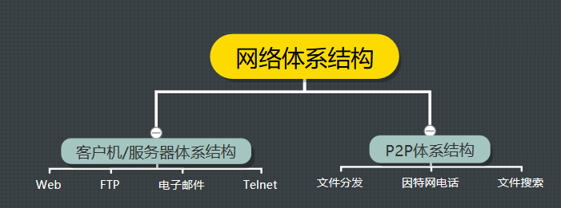
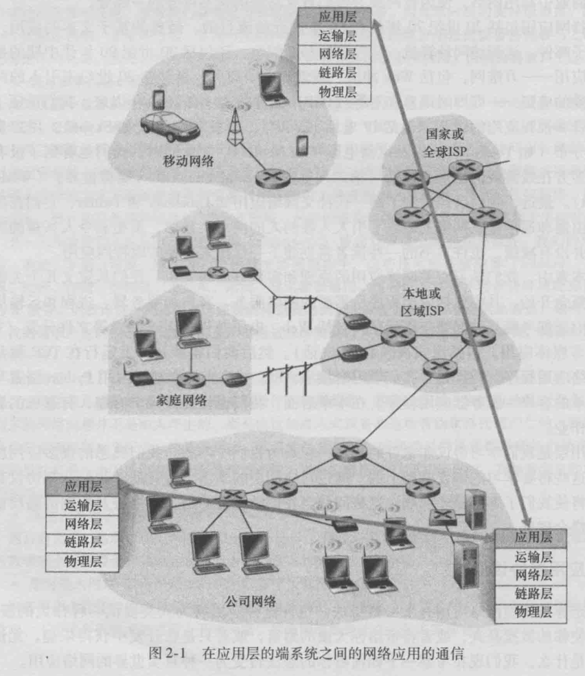
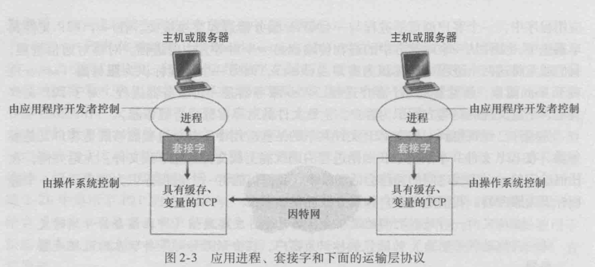

#### 网络应用程序体系结构



​		在进行软件编码之前，应当对应用程序有一个宽泛的体系结构计划。记住**应用程序的体系结构(application architecture)**明显不同于**网络的体系结构**。从开发者角度看，网络体系结构是固定的，为应用程序提供了特定的服务集合。

​		在**客户-服务器体系结构(client-server architecture)**中，有一个总是打开的主机称为服务器，它服务来自许多其他称为**客户**的主机的请求。

​		特点：1、客户互相之间不直接通信(例如两个浏览器不互相通信，总是和服务器通信)

​					2、该服务器具有固定的、周知的地址，该地址称为**IP地址**

​		下图显示了这种**客户端-服务器体系结构**：


​		和客户-服务器体系结构截然不同的是**P2P体系结构（P2P architecture）**， 在P2P中，进行通信的的并不是客户机-服务器，而是两台客户机。

​		进行通信的可能是两台用户的电脑，两个手机，或者一台电脑和一个手机，总之，进行通信的任意一对都被称为“对等方”

​		1.客户机间的直接通信使得P2P有了强大的**自扩展性（self-calability）**，什么意思呢？ 假设上面这幅图是一个发送文件（上载/下载）文件的过程，我们可以看到，从上至下，接收文件的主机的数量是指数递增的，系统的服务能力在逐渐增强，而且越来越强。

​		2.P2P体系结构对基础设施服务器有最小的依赖， 这是和基础设施密集的客户机/服务器体系结构是截然相反的。

​		我们假设在上图的P2P结构中增加一个服务器，并且要求在客户机/服务器结构和P2P结构间做一个发送文件的能力的对比： 要求是每个客户机都成功下载一个文件，那么

- 在客户机/服务器结构上，一个服务器要向7台客户机上载这个文件，共上载7次，而P2P结构下，服务器最少只要上载文件一次就够了。 相比之下， 前者服务器不堪重负，后者服务器则毫无压力
- 事实上，完成这个任务。P2P会比客户机/服务器结构的应用快的多

​		对服务器依赖小就意味着投入建设的成本会大大减小，正因此许多互联网公司尤其喜欢P2P。 但话虽如此，但实际上具体的还是要看应用的具体业务，上面的表述仍然只是很单方面的对比。

#### 进程通信

​		本章不关注同一台主机上的进程间通信，而关注运行在不同端系统(可能是具有不同的操作系统)上的进程间的通信。

​		在两个不同的端系统上的进程，同跨越计算机网络交换的**报文(message)**而互相通信。发生进程生成并向网络中发送报文；接收进程接收这些报文并可能通过将报文发送回去进行响应。下图图示了进程是如何通过使用5层协议栈的应用层互相通信的：




##### 1、客户和服务器进程

​		网络应用程序由成对的进程组成，这些进程通过网络相互发送报文。例如：在web应用中，一个客户浏览器与一个web服务器交换报文；在P2P应用中，文件从从一个对等方进程传输到另一个对等方进程中。

​		对每对通信进程，我们通常将一端进程标识为**客户(client)**，而另一端进程标识为**服务器(server)**。对于P2P而言，下载方为客户，上传方为服务器。so，P2P应用中，一个进程既能是客户又能是服务器。

​		我们定义客户和服务器进程如下：	

```
	在给定的一队进程之间的通信会话场景中，发起通信(即在该会话开始时发起与其他进程的联系)的进程被标识为客户，
	在会话开始时等待联系的进程是服务器。
```


##### 2、进程与计算机网络之间的接口

​		如上所述，多数应用程序是由**通信进程对**组成，每对中的两个进程互相发送报文。进程通过一个称为**套接字(socket)**的软件接口向网络发送报文和从网络接收报文。

​		下图显示了两个经过因特网通信的进程之间的套接字通信。如图所示，套接字是同一台主机内**应用层**与**传输层**之间的接口。由于该套接字是简历网络应用程序的可编程接口，因此套接字也称为应用程序和网络之间的**应用程序编程接口(application Programming Interface，API)**。应用程序开发者可以控制套接字在应用程序端的一切，但是对该套接字的运输层端几乎没有控制权。

​		应用程序开发者对于运输层的控制仅限于：

​				1、选择运输层协议；

​				2、也许能设定几个运输层参数，如最大缓存和最大报文段长度等。



##### 3、进程寻址

​		为了向特定目的地发送邮政邮件，目的地需要有一个地址。类似的，接收进程需要偶一个地址。

​		为了标识该接收进程，需要定义两种信息：

​				1、主机的地址；

​				2、定义在目的主机中的接收进程的标识符。	

​		在因特网中，主机由其**IP地址(IP address)**标识。我们会在后面提到，此时，我们只要知道IP地址是一个32比特的量且它能够唯一地标识该主机就够了。除了知道报文送往目的地的主机地址外，发送进程还必须制定运行在接收主机上的接收进程(更具体地说，接收套接字)。

​		因为一般而言一台主机能够运行许多网络应用，这些信息是需要的。目的地**端口号(port number)**用于这个目的。已经给流行的应用分配了特点的端口号。例如，web服务器用端口号80来标识。邮件服务器进程(使用SMTP协议)用端口号25来标识。用于所有因特网标准协议的周知端口号的列表能够在http://www.iana.org处找到。


#### 可供应用程序使用的运输服务