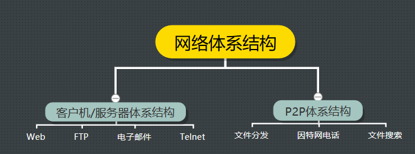

#### 网络应用程序体系结构



​		在进行软件编码之前，应当对应用程序有一个宽泛的体系结构计划。记住**应用程序的体系结构(application architecture)**明显不同于**网络的体系结构**。从开发者角度看，网络体系结构是固定的，为应用程序提供了特定的服务集合。

​		在**客户-服务器体系结构(client-server architecture)**中，有一个总是打开的主机称为服务器，它服务来自许多其他称为**客户**的主机的请求。

​		特点：1、客户互相之间不直接通信(例如两个浏览器不互相通信，总是和服务器通信)

​					2、该服务器具有固定的、周知的地址，该地址称为**IP地址**

​		下图显示了这种**客户端-服务器体系结构**：


​		和客户-服务器体系结构截然不同的是**P2P体系结构（P2P architecture）**， 在P2P中，进行通信的的并不是客户机-服务器，而是两台客户机。

​		进行通信的可能是两台用户的电脑，两个手机，或者一台电脑和一个手机，总之，进行通信的任意一对都被称为“对等方”

​		1.客户机间的直接通信使得P2P有了强大的**自扩展性（self-calability）**，什么意思呢？ 假设上面这幅图是一个发送文件（上载/下载）文件的过程，我们可以看到，从上至下，接收文件的主机的数量是指数递增的，系统的服务能力在逐渐增强，而且越来越强。

​		2.P2P体系结构对基础设施服务器有最小的依赖， 这是和基础设施密集的客户机/服务器体系结构是截然相反的。

​		我们假设在上图的P2P结构中增加一个服务器，并且要求在客户机/服务器结构和P2P结构间做一个发送文件的能力的对比： 要求是每个客户机都成功下载一个文件，那么

- 在客户机/服务器结构上，一个服务器要向7台客户机上载这个文件，共上载7次，而P2P结构下，服务器最少只要上载文件一次就够了。 相比之下， 前者服务器不堪重负，后者服务器则毫无压力
- 事实上，完成这个任务。P2P会比客户机/服务器结构的应用快的多

​		对服务器依赖小就意味着投入建设的成本会大大减小，正因此许多互联网公司尤其喜欢P2P。 但话虽如此，但实际上具体的还是要看应用的具体业务，上面的表述仍然只是很单方面的对比。

#### 进程通信

​		本章不关注同一台主机上的进程间通信，而关注运行在不同端系统(可能是具有不同的操作系统)上的进程间的通信。

​		在两个不同的端系统上的进程，同跨越计算机网络交换的**报文(message)**而互相通信。发生进程生成并向网络中发送报文；接收进程接收这些报文并可能通过将报文发送回去进行响应。下图图示了进程是如何通过使用5层协议栈的应用层互相通信的：


##### 1、客户和服务器进程

​		网络应用程序由成对的进程组成，这些进程通过网络相互发送报文。例如：在web应用中，一个客户浏览器与一个web服务器交换报文；在P2P应用中，文件从从一个对等方进程传输到另一个对等方进程中。

​		对每对通信进程，我们通常将一端进程标识为**客户(client)**，而另一端进程标识为**服务器(server)**。对于P2P而言，下载方为客户，上传方为服务器。so，P2P应用中，一个进程既能是客户又能是服务器。

​		我们定义客户和服务器进程如下：	

```
	在给定的一队进程之间的通信会话场景中，发起通信(即在该会话开始时发起与其他进程的联系)的进程被标识为客户，
	在会话开始时等待联系的进程是服务器。
```


##### 2、进程与计算机网络之间的接口

​		如上所述，多数应用程序是由**通信进程对**组成，每对中的两个进程互相发送报文。进程通过一个称为**套接字(socket)**的软件接口向网络发送报文和从网络接收报文。

​		下图显示了两个经过因特网通信的进程之间的套接字通信。如图所示，套接字是同一台主机内**应用层**与**传输层**之间的接口。由于该套接字是简历网络应用程序的可编程接口，因此套接字也称为应用程序和网络之间的**应用程序编程接口(application Programming Interface，API)**。应用程序开发者可以控制套接字在应用程序端的一切，但是对该套接字的运输层端几乎没有控制权。

​		应用程序开发者对于运输层的控制仅限于：

​				1、选择运输层协议；

​				2、也许能设定几个运输层参数，如最大缓存和最大报文段长度等。


##### 3、进程寻址

​		为了向特定目的地发送邮政邮件，目的地需要有一个地址。类似的，接收进程需要偶一个地址。

​		为了标识该接收进程，需要定义两种信息：

​				1、主机的地址；

​				2、定义在目的主机中的接收进程的标识符。	

​		在因特网中，主机由其**IP地址(IP address)**标识。我们会在后面提到，此时，我们只要知道IP地址是一个32比特的量且它能够唯一地标识该主机就够了。除了知道报文送往目的地的主机地址外，发送进程还必须制定运行在接收主机上的接收进程(更具体地说，接收套接字)。

​		因为一般而言一台主机能够运行许多网络应用，这些信息是需要的。目的地**端口号(port number)**用于这个目的。已经给流行的应用分配了特点的端口号。例如，web服务器用端口号80来标识。邮件服务器进程(使用SMTP协议)用端口号25来标识。用于所有因特网标准协议的周知端口号的列表能够在http://www.iana.org处找到。


#### 可供应用程序使用的运输服务

​		包括因特网在内的很多网络提供了不止一种运输层协议。挡开发一个应用时，必须选择一种可用的运输层协议。就像两个城市间旅行时选择飞机还是火车作为交通工具。你必须选择一种或另一种，而且每种运输模式为你提供不同的服务（例如，火车可用直到市区上客和下客，而飞机提供了更短的旅行时间）。

​		一个运输层协议能够为调用它的应用程序提供什么样的服务呢？我们大体能从四个方面对应用程序服务要求进行分类：**可靠数据传输**、**吞吐量**、**定时**和**安全性**。

##### 1、可靠的数据传输

​		分组在计算机网络中可能丢失。因此，为了支持这些应用，必须做一些工作确保由应用程序的一端发送的数据正确、完全地交付给该应用程序的另一端。如果一个协议提供了这样的确保数据交付服务，就认为提供了**可靠数据传输(reliable datatransfer)**。

​		运输层协议能够潜在地向应用程序提供一个重要服务是进程到进程的可靠数据传输。当一个运输协议提供这种服务时，发送进程只要将其数据传递进套接字，就可以完全相信该数据将能够无差错地到达接收进程。

​		当一个运输层协议不提供可靠数据传输时，由发送进程发送的某些数据可能不能够到达接收进程。这可能能被**容忍丢失的应用(loss-tolerant application)**所接受。

##### 2、吞吐量

​		具有吞吐量要求的应用程序被称为**带宽敏感的应用(bandwidth-sensitive application)**。

##### 3、定时

​		运输层协议也能提供定时保证。例如保证从发送方套接字到接收方套接字不迟于100ms。这种对即时应用需求很大。

##### 4、安全性

​		最后，运输协议能够为应用程序提供一种或多种安全性服务。例如，在发送前运输协议可以对数据进行加密，在接收数据前，运输协议可以对数据进行接解密。当然还有其他安全性服务，包括数据完整性和端点鉴别，我们将在后面讨论这些。


#### 因特网提供的运输服务

​		因特网(更一般的是TCP/IP网络)为应用程序提供两个运输层协议，即UDP和TCP。当你（开发者）为因特网创建一个新应用时，首先要做出的决定是，选择UDP还是TCP。下图显示了某些所选的应用程序的服务要求：


##### 1、TCP服务

​		TCP服务模型包括面向连接服务和可靠数据传输服务。当某个应用程序调用TCP作为其运输协议时，该应用就能获得来自TCP的这两种服务。

- **面向连接的服务:**在应用层数据报文开始流动之前，TCP让客户和服务器互相交换运输层控制信息。在这个所谓的握手过程提示客户和服务器，使它们为大量分组的到来做好准备。在握手阶段后，一个**TCP链接(TCP connection)**就在两个进程的套接字之间建立了。当应用程序结束报文发送时，必须拆除该链接。
- **可靠的数据传送服务：**通信进程能够依靠TCO，无差错、按适当顺序交付所有发送的数据。当应用程序的一端将字节流传进套接字时，它能够依靠TCP将相同的字节流交付给接收方的套接字，而没有字节的丢失和冗余。

​    TCP协议还具有拥塞控制机制，这种服务不一定能为通信进程带来直接好处，但能为因特网带来整体好处。当发送方和接收方之间的网络出现拥塞时，TCP的拥塞控制机制会抑制发送进程(客户或服务器)。TCP拥塞控制也试图限制每个TCP链接，使它们达到公平共享网络带宽的目的。

##### 2、UDP服务

​		UDP是一种不提供不必要服务的轻量级运输协议，它仅提供最小服务。UDP是无连接的，因此在两个进程通信前没有握手过程。UDP协议提供一种不可靠数据传送服务，也就是说，当进程将一个保温发送进UDP套接字时，UDP协议并不保证该报文将到达接收进程。不仅如此，到达接收进程的报文也可能是乱序到达的。

​		UDP没有包括拥塞控制机制，所以UDP的发送端可以用它选的的任何速率向其下层(网络层)注入数据。

##### 3、关于TCP的安全性

> - 无论是TCP还是UDP**都没有提供任何加密机制**，就是说发送进程传进套接字的数据，经过网络传送之后，与目的进程接收的数据相同。看似达到了数据一致，但是许多隐私数据很有可能会被坏人知道，所以没有安全机制是很可怕的。
> - 为此，一种在TCP的基础上进行加强的**安全套接字层（Secure Sockets Layers ，SSL）**应运而生，它能做传统TCP可以做到的一切，在这个基础上，还提供了关键的进程到进程的安全性服务（包括前边提到的加密、数据完整性和端点鉴别）。
>
> **注意：**SSL不是与TCP和UDP在相同层次的第三种因特网运输协议，只不过是对TCP在应用层上的加强，想要享受SSL的服务，需要在应用程序的客户端和服务器端都包括SSL的代码。

**基本流程如下图：**


​		发送进程将明文数据传给SSL套接字，发送主机中的SSL加密该数据并传递给TCP套接字，经过网络，传给接收进程的TCP套接字，它将加密数据传给SSL，由SSL进行解密，最后SSL通过SSL套接字将明文数据传递给接收进程。

##### 4、因特网运输协议所不提供的服务

​		我们已经从四个方面组织了运输协议服务：可靠数据传输、吞吐量、定时和安全性。但是我们对TCP和UDP的简要描述中，明显缺失了对吞吐量或定时保证的讨论，即这些服务目前的因特网运输协议并没有提供。今天的因特网**通常能够为时间敏感应用提供满意的服务，但它不能提供任何定时或带宽保证**。

​		下图指出了一些流行的因特网所使用的运输协议。


#### 应用层协议

​		我们刚刚学习了通过把报文发送进套接字使用网络进程间实现相互通信。但是如何构造这些报文？在这些报文中的各个字段的含义是什么？进程何时发送这些报文？这些问题都将我们带进应用层协议的范围。**应用层协议(application-layer protocol)**定义了运行在不同端系统上的应用程序进程如何互相传递报文，特别是应用层协议定义了：

- 交换的报文类型，例如请求报文和响应报文。

- 各种报文类型的语法，如报文中的各个字段及这些字段是如何描述的。

- 字段的语义，即这些字段中包含的信息的含义。

- 一个进程何时以及如何发送报文。对报文进行响应的规则。

  

​		有些应用层协议是由RFC文档定义的，因此它们位于公共域中，例如，web的应用层协议HTTP，就作为一个RFC可供使用。如果浏览器开发者尊从HTTP RFC规则，所开发的浏览器就能访问任何尊从该文档标准的web服务器并获取相应web页面。还有很多别的应用层协议是专用的，有意不为公共域使用，例如Skype使用了专用的应用层协议。

​		区分网络应用和应用层协议是很重要的，应用层协议只是网络应用的一部分。我们来看一些例子，Web是一种客户--服务器应用，它允许客户按照需求从web服务器获得文档，该web应用有很多组成部分。包括文档格式的标准（即HTML）、Web浏览器、web服务器，以及一个应用层协议。web的应用层协议是HTTP，它定义了在浏览器和web服务器之间传输的报文格式和序列。因此，HTTP只是web应用的一个部分。举另外一个例子，因特网电子邮件应用也有很多组成部分，包括能容纳用户邮箱的邮件服务器，允许用户读取和生产邮件的邮件客户程序、定义邮件报文结构的标准、定义报文如何在服务区之间以及如何在服务器与邮件客户程序之间的传递的应用层协议，定义如何对报文收不的内容进行解释的应用层协议，用于电子邮件的主要应用层协议就是SMTP。因此，电子邮件的首要应用层协议SMTP也只是电子邮件应用的一个部分。