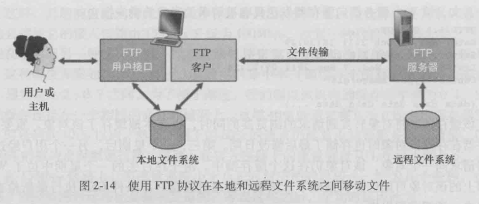
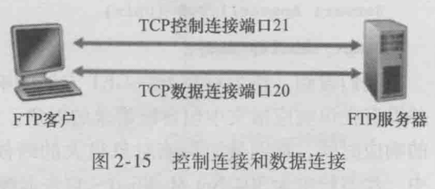

### 文件传输协议：FTP

​		在一个典型的FTP会话中，用户坐在一台主机(本地主机)前面，向一台远程主机传输（或接收来自远程主机的）文件。为使用户能访问它的远程账户，用户必须提供一个**用户标识**和**口令**。

​		在提供了这种授权信息后，用户就能从本地文件系统向远程主机文件系统传输文件，反之亦然。

​		如下图所示，用户通过一个FTP用户代理与FTP交互。该用户首先提供远程主机的主机名，使本地主机的FTP客户进程建立一个到远程主机FTP服务器进程的TCP连接。该用户接着提供用户标识和口令，作为FTP命令的一部分在该TCP连接上传送。一旦该服务器向该用户授权，用户可以将存放在本地文件系统中的一个或者多个文件复制到远程文件系统（反之亦然）。

​		HTTP和FTP都是文件传输协议，并且有很多共同的特点，例如，它们都运行在TCP上。然而，这两个应用层协议也有一些重要的区别。

​		其中最显著的就是FTP使用了两个并行的TCP连接来传输文件，一个是**控制连接（control connection）**，一个是**数据连接（data connection）**。

- **控制连接（control connection）**：控制连接用于在两主机之间传输控制信息，如用户标识、口令、改变远程目录的命令以及“**存放（put）**”和“**获取（get）**”文件的命令。
- **数据连接（data connection）**：数据连接用于实际发送一个文件。因为FTP协议使用一个独立的控制连接，所以我们也称FTP的控制信息是**带外（out-of-band）**传送的。如你所知，HTTP协议是在传输文件的同一个TCP连接中发送请求和响应首部行的。因此，HTTP也可以说是**带内（in-band）**发送控制信息的。

FTP协议的控制连接和数据连接如下图所示。

​		当用户主机与远程主机开始一个FTP会话时，FTP的客户（用户）端首先在**服务器21号端口**（21号端口为FTP端口）与服务器（远程主机）端发起一个用于控制的TCP连接。FTP的客户端也通过该控制连接发送用户的标识和口令，发送改变远程目录的命令。

​		当FTP的服务器端从该连接上收到一个文件传输的命令后（无论是<u>向</u>还是<u>来</u>自远程主机），就发起一个到客户端的TCP数据连接。FTP在该数据连接上准确地传送一个文件，然后关闭该连接。在同一个会话期间，如果用户还需要传输另一个文件，FTP则打开另一个数据连接。因而对FTP传输而言，控制连接贯穿了整个用户会话期间，但是对会话中的**每一次文件传输都需要建立一个新的数据连接（即数据连接是非持续的）**。

​		FTP服务器必须在整个会话期间保留用户的**状态（state）**。特别是，服务器必须把特定的用户账户与控制连接联系起来，随着用户在远程目录树上徘徊，服务器必须追踪用户在远程目录树上的当前位置。对每个进行中的用户会话的状态信息进行追踪，大大限制了FTP同时维持的会话总数。而另一方面，前面讲过HTTP是无状态的，即它不必对任何用户状态进行追踪。

#### FTP命令和回答

​		我们通过简要地讨论几个常见的FTP命令和回答来结束本节。从客户到服务器的命令和从服务器到客户的回答，都是以7比特ASCII格式在控制连接上传送的。因此，与HTTP协议的命令类似，FTP协议的命令也是人可读的。为了区分连续的命令，每个命令后跟回车换行符。每个命令由4个大写字母ASCII字符组成，有些还具有可选参数。一些较为常见的命令如下：

- USER username:用于向服务器传送用户标识。

- PASS password:用于向服务器发送用户口令。

- LIST:用于请求服务器回送当前远程目录中的所有文件列表。该文件列表是经一个（新建且非持续连接）数据连接传送的，而不是在控制TCP连接上传送。

- RETR filename:用于从远程主机当前目录检索（即get）文件。该命令引起远程主机发起一个数据连接，并经该数据连接发送所请求的文件。

- STOR filename:用于在远程主机的当前目录上存放（即put）文件。

​		贯穿控制连接，在用户发出的命令和FTP发送的命令之间通常有一一对应关系。每个命令都对应着一个从服务器发向客户的回答。回答是一个3位的数字，后跟一个可选信息。这与HTTP响应报文状态行的状态码和状态信息的结构相同。一些典型的回答连同它们可能的报文如下所示：

- 331 Username OK，Password required（用户名OK，需要口令）。

- 125 Data connection already open;transfer starting（数据连接已经打开，开始传送）。

- 425 Can’t open data connection（无法打开数据连接）。

- 452 Error writing file（写文件差错）。

有兴趣学习其他FTP命令和回答的读者请阅读RFC 959。