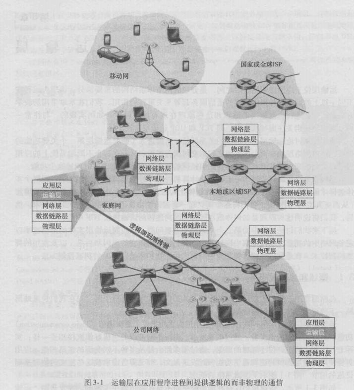

### 概述和运输层服务

​		在前两章中，我们已对运输层的作用及其所提供的服务有所了解。现在我们快速地回顾一下前面学过的有关运输层的知识。

​		运输层协议为运行在不同主机上的应用进程之间提供了**逻辑通信（ logic communication)**功能。从应用程序的角度看，通过逻辑通信，运行不同进程的主机好像直接相连一样；实际上，这些主机也许位于地球的两侧，通过很多路由器及多种不同类型的链路相连。应用进程使用运输层提供的逻辑通信功能彼此发送报文，而无需考虑承载这些报文的物理基础设施的细节。图3-1图示了逻辑通信的概念。

​		如图3-1所示，运输层协议是在端系统中而不是在路由器中实现的。在发送端，运输层将从发送应用程序进程接收到的报文转换成运输层分组，用因特网术语来讲该分组称为**运输层报文段（segment)**。实现的方法（可能）是将应用报文划分为较小的块，并为每块加上一个运输层首部以生成运输层报文段。

​		然后，在发送端系统中，运输层将这些报文段传递给网络层，网路层将其封装成网络层分组（即数据报）并向目的地发送。注意到下列事实是重要的：网络路由器仅作用于该数据报的网络层字段；即它们不检查封装在该数据报的运输层报文段的字段。在接收端，网络层从数据报中提取运输层报文段，并将该报文段向上交给运输层。运输层则处理接收到的报文段，使该报文段中的数据为接收应用进程使用。

​		网络应用程序可以使用多种的运输层协议。例如，因特网有两种协议，即TCP和UDP。每种协议都能为调用的应用程序提供一组不同的运输层服务。




#### 运输层和网络层的关系

​		前面讲过，在协议栈中，运输层刚好位于网络层之上。网络层提供了主机之间的逻辑通信，而运输层为运行在不同主机上的进程之间提供了逻辑通信。这种差别虽然细微但很重要。我们用一个家庭类比来帮助分析这种差别。

​		考虑有两个家庭，一家位于美国东海岸， 一 家位于美国西海岸，每家有12个孩子。东海岸家庭的孩子们是西海岸家庭孩子们的堂兄弟姐妹。这两个家庭的孩子们喜欢彼此通信，每个人每星期要互相写一封信，每封信都用单独的信封通过传统的邮政服务传送。因此，每个家庭每星期向另一家发送144封信。（如果他们有电子邮件的话，这些孩子可以省不少钱！）每一个家庭有个孩子负责收发邮件，西海岸家庭是Ann而东海岸家庭是Bill。每星期Ann去她的所有兄弟姐妹那里收集信件，并将这些信件交到每天到家门口来的邮政 服务的邮车上。当信件到达西海岸家庭时，Ann也负责将信件分发到她的兄弟姐妹手上。 在东海岸家庭中的Bill也负责类似的工作。

​		在这个例子中，邮政服务为两个家庭间提供逻辑通信，邮政服务将信件从一家送往另一 家，而不是从一个人送往另一个人。在另一方面，Arm和Bill为堂兄弟姐妹之间提供了逻辑通信，Ann和Bill从兄弟姐妹那里收取信件或到兄弟姐妹那里交付信件。注意到从堂兄弟姐 妹们的角度来看，Ann和Bill就是邮件服务，尽管他们只是端到端交付过程的一部分（即端 系统部分)。

在解释运输层和网络层之间的关系时，这个家庭的例子是一个非常好的类比。

```
							应用层报文=信封上的字符 
							进程=堂兄弟姐妹 
							主机（又称为端系统）=家庭 
							运输层协议=Ann和Bill
							网络层协议=邮政服务（包括邮车）
```

​		我们继续观察这个类比。值得注意的是，Ann和Bill都是在各自家里进行工作的；例 如，他们并没有参与任何一个中间邮件中心对邮件进行分拣，或者将邮件从一个邮件中心 送到另一个邮件中心之类的工作。类似地，运输层协议只工作在端系统中。在端系统中， 运输层协议将来自应用进程的报文移动到网络边缘（即网络层），反过来也是一样，但对 有关这些报文在网络核心如何移动并不作任何规定。事实上，如图3-1所示，中间路由器 既不处理也不识别运输层加在应用层报文的任何信息。

​		我们还是继续讨论这两家的情况。现在假定Arm和Bill外出度假，另外一对堂兄妹 (如Susan和Harvey)接替他们的工作，在家庭内部进行信件的收集和交付工作。不幸的 是，Susan和Harvey的收集和交付工作与Ann和Bill所做的并不完全一样。由于年龄更 小，Susan和Harvey收发邮件的次数更少，而且偶尔还会丟失邮件（有时是被家里的狗咬 坏了）。因此，Susan和Harvey这对堂兄妹并没有提供与Ann和Bill —样的服务集合（即 相同的服务模型）。与此类似，计算机网络中可以安排多种运输层协议，每种协议为应用 程序提供不同的服务模型。

​		Ann和Bill所能提供的服务明显受制于邮政服务所能提供的服务。例如，如果邮政服 务不能提供在两家之间传递邮件所需时间的最长期限（例如3天），那么Ann和BiU就不 可能保证邮件在堂兄弟姐妹之间传递信件的最长期限。与此类似，运输协议能够提供的服 务常常受制于底层网络层协议的服务模型。如果网络层协议无法为主机之间发送的运输层 报文段提供时延或带宽保证的话，运输层协议也就无法为进程之间发送的应用程序报文提 供时延或带宽保证。

​		然而，即使底层网络协议不能在网络层提供相应的服务，运输层协议也能提供某些服 务。例如，如我们将在本章所见，即使底层网络协议是不可靠的，也就是说网络层协议会 使分组丢失、墓改和冗余，运输协议也能为应用程序提供可靠的数据传输服务。另一个例 子是（我们在第8章讨论网络安全时将会研究到），即使网络层不能保证运输层报文段的 机密性，运输协议也能使用加密来确保应用程序报文不被人侵者读取。

#### 因特网运输层概述

​		前面讲过因特网（更一般地讲是一个TCP/IP网络）为应用层提供了两种截然不同的可用运输层协议。这些协议一种是**UDP (用户数据报协议）**，它为调用它的应用程序提供 了一种不可靠、无连接的服务。另一种是**TCP (传输控制协议）**，它为调用它的应用程序 提供了一种可靠的、面向连接的服务。当设计一个网络应用程序时，该应用程序的开发人 员必须指定使用这两种运输协议中的哪一种。如我们在2. 7节看到的那样，应用程序开发 人员在生成套接字时必须指定是选择UDP还是选择TCP。

​		为了简化术语，在与因特网有关的环境中，我们将运输层分组称为**报文段（segment)**。 然而， 需要指出的是，因特网文献 （如 RFC 文档） 也将 TCP 的运输层分组称为报文段，而常将UDP的分组称为数据报。而这类因特网文献也将网络层分组称为数据报! 本书作为一本计算机网络的人门书籍，我们认为将TCP和UDP的分组统称为报文段，而将数据报名称保留给网络层分组不容易混清。

​		在对UDP和TCP进行简要介绍之前，简单介绍一下因特网的网络层（我们将在第4章 中详细地学习网络层）是有用的。因特网网络层协议有一个名字叫**IP,即网际协议**。IP为 主机之间提供了逻辑通信。IP的服务模型是尽力而为**交付服务（best-effort delivery service)**。 这意味着IP尽它“最大的努力”在通信的主机之间交付报文段，但它并不做任何确保。 特别是，它不确保报文段的交付，不保证报文段的按序交付，不保证报文段中数据的完整 性。由于这些原因，IP被称为**不可靠服务（unreliable service)**。在此还要指出的是，每台主机至少有一个网络层地址，即所谓的IP地址。我们在第4章将详细讨论IP地址；在这 一章中，我们只需要记住每台主机有一个IP地址。

​		在对IP服务模型有了初步了解后，我们总结一下UDP和TCP所提供的服务模型。 UDP和TCP最基本的责任是，将两个端系统间IP的交付服务扩展为运行在端系统上的两个进程之间的交付服务。将主机间交付扩展到进程间交付被称为运输层的**多路复用 (transport-layer multiplexing)**与**多路分解（demultiplexing)**。我们将在下一节讨论运输层的多路复用与多路分解。UDP和TCP还可以通过在其报文段首部中包括差错检査字段而提供完整性检查。进程到进程的数据交付和差错检查是两种最低限度的运输层服务，也是 UDP所能提供的仅有的两种服务。特别是，与IP—样，UDP也是一种不可靠的服务，即 不能保证一个进程所发送的数据能够完整无缺地（或全部!）到达目的进程。在3. 3节中 将更详细地讨论UDP。

​		另一方面，TCP为应用程序提供了几种附加服务。首先，它提供可靠**数据传输（reliable data transfer)**。通过使用流量控制、序号、确认和定时器（本章将详细介绍这些技术），TCP 确保正确地、按序地将数据从发送进程交付给接收进程。这样，TCP就将两个端系统间的 不可靠IP服务转换成了一种进程间的可靠数据传输服务。TCP还提供**拥塞控制（congestion control)**。 拥塞控制与其说是一种提供给调用它的应用程序的服务 ，不如说是一种提供给整个因特网的服务，这是一种带来通用好处的服务。不太严格地说，<u>TCP拥塞控制防止任何一条TCP连接用过多流量来淹没通信主机之间的链路和交换设备</u>。TCP力求为每个通 过一条拥塞网络链路的连接平等地共享网络链路带宽。这可以通过调节TCP连接的发送端 发送进网络的流量速率来做到。在另一方面，UDP流量是不可调节的。使用UDP传输的 应用程序可以根据其需要以其愿意的任何速率发送数据。

​		一个能提供可靠数据传输和拥塞控制的协议必定是复杂的。我们将用几节的篇幅来介 绍可靠数据传输和拥塞控制的原理，用另外几节介绍TCP协议本身。3.4 ~3. 8节将研究 这些主题。本章采取基本原理和TCP协议交替介绍的方法。例如，我们首先在一般环境下讨论可靠数据传输，然后讨论TCP是怎样具体提供可靠数据传输的。类似地，先在一般环 境下讨论拥塞控制，然后讨论TCP是怎样实现拥塞控制的。但在全面介绍这些内容之前， 我们先学习运输层的多路复用与多路分解。