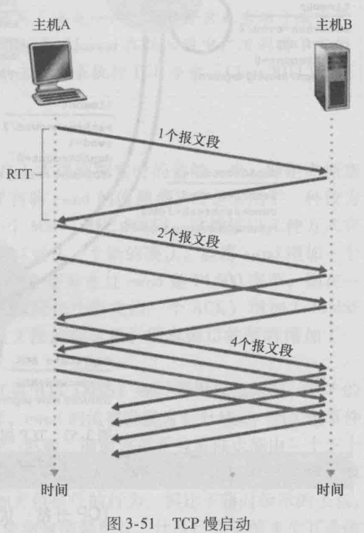
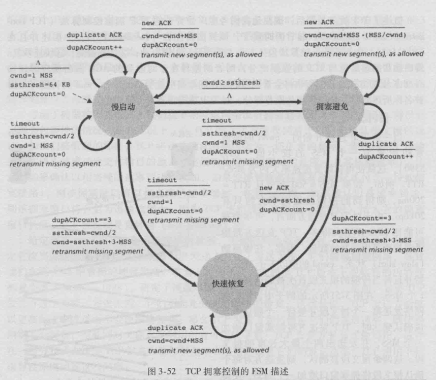
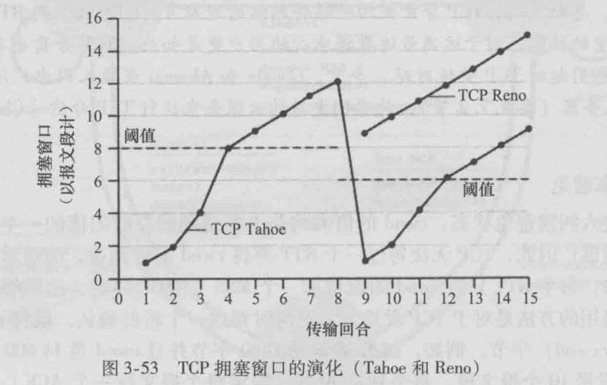
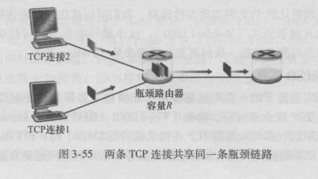
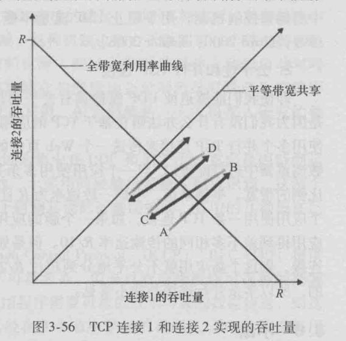

### TCP拥塞控制

​		在本节中，我们再次来学习TCP。如我们在3. 5节所见，TCP为运行在不同主机上的 两个进程之间提供了可靠传输服务。TCP的另一个关键部分就是其拥塞控制机制。如在前 一节所指出，TCP必须使用端到端拥塞控制而不是使网络辅助的拥塞控制，因为IP层不 向端系统提供显式的网络拥塞反馈。

​		TCP所采用的方法是让每一个发送方根据所感知到的网络拥塞程度来限制其能向连接 发送流量的速率。如果一个TCP发送方感知从它到目的地之间的路径上没什么拥塞，则 TCP发送方增加其发送速率；如果发送方感知沿着该路径有拥塞，则发送方就会降低其发 送速率。但是这种方法提出了三个问题。第一，一个TCP发送方如何限制它向其连接发送 流量的速率呢？第二，一个TCP发送方如何感知从它到目的地之间的路径上存在拥塞呢? 第三，当发送方感知到端到端的拥塞时，采用何种算法来改变其发送速率呢？

​		我们首先分析一下TCP发送方是如何限制向其连接发送流量的。在3. 5节中我们看 到，TCP连接的每一端都是由一个接收缓存、一个发送缓存和几个变量（LastByteRead、 nvrnl等）组成。运行在发送方的TCP拥塞控制机制跟踪一个额外的变量，即拥塞窗口 (congestion window)。拥塞窗口表示为cwnd,它对一个TCP发送方能向网络中发送流量的 速率进行了限制。特別是，在一个发送方中未被确认的数据量不会超过cwml与rwnd中的 最小值，即
​											LastByteSent - LastByteAcked <= min { cwnd, rwnd }

​		为了关注拥塞控制（与流量控制形成对比），我们后面假设TCP接收缓存足够大，以 至可以忽略接收窗口的限制；因此在发送方中未被确认的数据量仅受限于cwnd。我们还 假设发送方总是有数据要发送，即在拥塞窗口中的所有报文段要被发送。

​		上面的约朿限制了发送方中未被确认的数据量，因此间接地限制了发送方的发送速率。 为了理解这一点，我们来考虑一个丢包和发送时延均可以忽略不计的连接。因此粗略地讲, 在每个往返时间（RTT)的起始点，上面的限制条件允许发送方向该连接发送cwnd个字节 的数据，在该RTT结束时发送方接收对数据的确认报文。因<u>此，该发送方的发送速率大概是 cwnd/RTT字节/秒。通过调节cwml的值，发送方因此能调整它向连接发送数据的速率。</u>

​		我们接下来考虑TCP发送方是如何感知在它与目的地之间的路径上出现了拥塞的。我们将一个TCP发送方的“丢包事件”定义为：要么出现超时，要么收到来自接收方的3 个冗余ACK。（回想我们在3. 5. 4节有关图3-33中的超时事件的讨论和收到3个冗余ACK 后包括快速重传的后继修改d当出现过度的拥塞时，在沿着这条路径上的一台（或多 台）路由器的缓存会溢出，引起一个数据报（包含一个TCP报文段）被丢弃。丢弃的数 据报接着会引起发送方的丢包事件（要么超时或收到3个冗余ACK)，发送方就认为在发 送方到接收方的路径上出现了拥塞的指示。

​		考虑了拥塞检测问题后，我们接下来考虑网络没有拥塞这种更为乐观的情况，即没有 出现丢包事件的情况。在此情况下，在TCP的发送方将收到对于以前未确认报文段的确 认。如我们将看到的那样，TCP将这些确认的到达作为一切正常的指示，即在网络上传输 的报文段正被成功地交付给目的地，并使用确认来增加窗口的长度（及其传输速率）。注 意到如果确认以相当慢的速率到达（例如，如果该端到端路径具有高时延或包含一段低带 宽链路），则该拥塞窗口将以相当慢的速率增加。在另一方面，如果确认以高速率到达, 则该拥塞窗口将会更为迅速地增大。因为TCP使用确认来触发（或计时）增大它的拥塞 窗口长度，TCP被说成是**自计时（self-clocking)**的。

​		给定调节cwnd值以控制发送速率的机制，关键的问题依然存在：TCP发送方怎样确 定它应当发送的速率呢？如果众多TCP发送方总体上发送太快，它们能够拥塞网络，导致 我们在图3-48中看到的拥塞崩溃。事实上，为了应对在较早TCP版本下观察到的因特网 拥塞崩溃[Jacobson 1988]，研发了该版本的TCP (我们马上将学习它）。然而，如果TCP 发送方过于谨慎，发送太慢，它们不能充分利用网络的带宽；这就是说，TCP发送方能够 以更高的速率发送而不会使网络拥塞。那么TCP发送方如何确定它们的发送速率，既使得 网络不会拥塞，与此同时又能充分利用所有可用的带宽？ TCP发送方是显式地协作，或存 在一种分布式方法使TCP发送方能够仅基于本地信息设置它们的发送速率？ TCP使用下列 指导性原则回答这些问题：

- 一个丢失的报文段表意味着拥塞，因此当丢失报文段时应当降低TCP发送方的速 率。回想在3. 5. 4节中的讨论，对于给定报文段，一个超时事件或四个确认（一 个初始ACK和其后的三个冗余ACK)被解释为跟随该四个ACK的报文段的“丢 包事件”的一种隐含的指示。从拥塞控制的观点看，该问题是TCP发送方应当如 何减小它的拥塞窗口长度，即减小其发送速率，以应对这种推测的丢包事件。
-  一个确认报文段指示该网络正在向接收方交付发送方的报文段，因此，当对先前 未确认报文段的确认到达时，能够增加发送方的速率。确认的到达被认为是一切 顺利的隐含指示，即报文段正从发送方成功地交付给接收方，因此该网络不拥塞。 拥塞窗口长度因此能够增加。
- 带宽探测。给定ACK指示源到目的地路径无拥塞，而丢包事件指示路径拥塞， TCP调节其传输速率的策略是增加其速率以响应到达的ACK,除非出现丢包事件， 此时才减小传输速率。因此，为探测拥塞开始出现的速率，TCP发送方增加它的 传输速率，从该速率后退，进而再次开始探测，看看拥塞开始速率是否发生了变 化。TCP发送方的行为也许类似于要求（并得到）越来越多糖果的孩子，直到最 后告知他/她“不行!”，孩子后退一点，然后过一会儿再次开始提出请求。注意到 网络中没有明确的拥塞状态信令，即ACK和丢包事件充当了隐式信号，并且每个 TCP发送方根据异步于其他TCP发送方的本地信息而行动。

​        概述了 TCP拥塞控制后，现在是我们考虑广受赞誉的TCP拥塞控制算法（TCP congestion contro 丨 algorithm) 细节的时候了，该算法首先在 [Jacobson 1988] 中描述并且在 [RFC 5681]中标准化。该算法包括3个主要部分：①慢启动；②拥塞避免；③快速恢复。 慢启动和拥塞避免是TCP的强制部分，两者的差异在于对收到的ACK做出反应时增加 cwnd长度的方式。我们很快将会看到慢启动比拥塞避免能更快地增加cwnd的长度（不要 被名称所迷惑！）。快速恢复是推荐部分，对TCP发送方并非是必需的。

##### 1.慢启动

​		当一条TCP连接开始时，cwnd的值通 常初始置为一个MSS的较小值[RFC 3390]，这就使得初始发送速率大约为MSS/RTT。例如，如果MSS =500字节且RTT =200mS，则得到的初始发送速率大约只有 20kbps。由于对TCP发送方而言，可用带宽 可能比MSS/RTT大得多，TCP发送方希望 迅速找到可用带宽的数量。因此，在慢启动 (slow-start)状态，cwnd的值以1个MSS开 始并且每当传输的报文段首次被确认就增加 1个MSS。在图3-51所示的例子中，TCP向 网络发送第一个报文段并等待一个确认。当 该确认到达时，TCP发送方将拥塞窗口增加 一个MSS,并发送出两个最大长度的报文 段。这两个报文段被确认，则发送方对每个 确认报文段将拥塞窗口增加一个MSS,使得 拥塞窗口变为4个MSS,并这样下去。这一 过程每过一个RIT,发送速率就翻番。因 此，TCP发送速率起始慢，但在慢启动阶段 以指数增长。

​		但是，何时结束这种指数增长呢？慢启动对这个问题提供了几种答案。首先，如果存 在一个由超时指示的丢包事件（即拥塞），TCP发送方将cwnd设置为1并重新开始慢启动 过程。它还将第二个状态变量的值ssthresh ( “慢启动阈值”的速记）设置为cwnd/2, 即当检测到拥塞时将ssthresh置为拥塞窗口值的一半。慢启动结束的第二种方式是直接 与ssthresh的值相关联。因为当检测到拥塞时ssthresh设为cwnd的值一半，当到达或超过 ssthresh的值时，继续使cwnd翻番可能有些鲁莽。因此，当cwnd的值等于ssthresh时， 结束慢启动并且TCP转移到拥塞避免模式。我们将会看到，当进入拥塞避免模式时， TCP更为谨慎地增加cwnd。最后一种结束慢启动的方式是，如果检测到3个冗余ACK， 这时TCP执行一种快速重传（参见3. 5. 4节）并进入快速恢复状态，后面将讨论相关 内容。慢启动中的TCP行为总结在图3-52中的TCP拥塞控制的FSM描述中。慢启动算 法最早源于[Jacobson 1988 ];在[Jain 1986]中独立地提出了一种类似于慢启动的 方法。

##### 2.拥塞避免

​		一旦进人拥塞避免状态，cwnd的值大约是上次遇到拥塞时的值的一半，即距离拥塞 可能并不遥远！因此，TCP无法每过一个RTT再将cwnd的值翻番，而是采用了一种较为 保守的方法，每个RTT只将cwnd的值增加一个MSS [RFC 5681 ]。这能够以几种方式完 成。一种通用的方法是对于TCP发送方无论何时到达一个新的确认，就将cwnd增加一个 MSS(MSS/cwnd)字节。例如，如果MSS是1460字节并且Cwnd是14 600 字节，则在一 个RTT内发送10个报文段。每个到达ACK (假定每个报文段一个ACK)增加1/10MSS 的拥塞窗口长度，因此在收到对所有10个报文段的确认后，拥塞窗口的值将增加了一 个 MSS。

​		但是何时应当结束拥塞避免的线性增长（每RTT1MSS)呢？当出现超时时，TCP的 拥塞避免算法行为相同。与慢启动的情况一样，cwnd的值被设置为1个MSS，当丢包事件 出现时，ssthresh的值被更新为cwnd值的一半。然而，前面讲过丢包事件也能由一个三个 冗余ACK事件触发。在这种情况下，网络继续从发送方向接收方交付报文段（就像由收 到冗余ACK所指示的那样h因此TCP对这种丢包事件的行为，相比于超时指示的丢包， 应当不那么剧烈：TCP将cwtul的值减半（为使测量结果更好，汁及已收到的3个冗余的 ACK要加上3个MSS)，并且当收到3个冗余的ACK,将ssihresh的值记录为cwncl的值的 一半。接下来进人快速恢复状态。

##### 3.快速恢复

​		在快速恢复中，对于引起TCP进人快速恢复状态的缺失报文段，对收到的每个冗余的 ACK，cwm丨的值增加一个MSS。最终，当对丢失报文段的一个ACK到达时，TCP在降低 cwnd后进人拥塞避免状态。如果出现超时事件，快速恢复在执行如同在慢启动和拥塞避 免中相同的动作后，迁移到慢启动状态：当丢包事件出现时，cwrnl的值被设置为1个 MSS，并且sslhresh的值设置为cwnd值的一半。

​		快速恢复是TCP推荐的而非必需的构件[RFC 5681 ] ^有趣的是，一种称为TCP Tahoe的TCP早期版本，不管是发生超时指示的丢包事件，还是发生3个冗余ACK指示 的丢包事件，都无条件地将其拥塞窗口减至1个MSS,并进入慢启动阶段。TCP的较新版 本TCP Reno,则综合了快速恢复。

​		图3-53图示了 Reno版TCP与Tahoe版TCP的拥塞控制窗口的演化情况。在该图中，阈值初始等于8个MSS。在前8个传输回合，Tahoe和Reno采取了相同的动作。拥塞窗口 在慢启动阶段以指数速度快速爬升，在第4轮传输时到达了阈值。然后拥塞窗口以线性速 度爬升，直到在第8轮传输后出现3个冗余ACK。注意到当该丢包事件发生时，扼塞窗口 值为12 X MSS。于是ssthresh的值被设置为0. 5 x cwnd = 6 x MSS。在TCP Reno下，拥塞窗 口被设置为cwnd =9MSS，然后线性地增长。在TCP Tahoe下，拥塞窗口被设置为1个 MSS,然后呈指数增长，直至到达ssthresh值为止，在这个点它开始线性增长。

​		图3-52表示了 TCP拥塞控制算法（即慢启动、拥塞避免和快速恢复）的完整FSM描 述。该图也指示了新报文段的传输或重传的报文段可能出现的位置。尽管区分TCP差错控 制/重传与TCP拥塞控制非常重要，但是注意到TCP这两个方面交织链接的方式也很重要。
##### 4.TCP拥塞控制：回顾

​		在深人了解慢启动、拥塞避免和快速恢复的细节后，现在有必要退回来回顾一下全 局。忽略一条连接开始时初始的慢启动阶段，假定丢包由3个冗余的ACK而不是超时指 示，TCP的拥塞控制是：每个RTT内cwnd线性（加性）增加1MSS,然后出现3个冗余 ACK事件时cwncl减半（乘性减）。因此，TCP拥塞控制常常被称为加性增、乘性减 (Additive-Increase, Multiplicative-Decrease, AIMD)拥塞控制方式。AIMD 拥塞控制引发了 在图3-54中所示的“锯齿”行为，这也很好地图示了我们前面TCP检测带宽时的直觉, 即TCP线性地增加它的拥塞窗口长度（因此增加其传输速率），直到出现3个冗余ACK事 件。然后以2个因子来减少它的拥塞窗口长度，然后又开始了线性增长，探测是否还有另 外的可用带宽。

​		如前所述，许多TCP实现采用了 Reno算法[Padhye 2001 ]。Reno算法的许多变种已 被提出[RFC 3782; RFC 2018]。TCP Vegas 算法[Brakmo 1995; Ahn 1995]试图在维持 较好的吞吐量的N时避免拥塞。Vegas的基本思想是：①在分组丢失发生之前，在源与目 的地之间检测路由器中的拥塞；②当检测出快要发生的分组丢失时，线性地降低发送速 率。快要发生的分组丢失是通过观察RTT来预测的。分组的RTT越长，路由器中的拥塞越 严重。Linux支持若干拥塞控制算法（包括TCP Reno和TCP Vegas),并且允许系统管理员配 置使用哪个版本的TCP。在Linux版本2. 6. 18中，TCP默认版本设置为CUBIC [ Ha 2008 ], 这是为高带宽应用开发的一个TCP版本。对于许多特色TCP的综述参见[Afanasyev 2010]。

​		TCP AIMD算法基于大量的工程见解和在运行网络中的拥塞控制经验而开发。在TCP 研发后的十年，理论分析显示TCP的拥塞控制算法用做一种分布式异步优化算法，使得用 户和网络性能的几个重要方面被同时优化[Kelly 1998]。拥塞控制的丰富理论已经得到发 展[Srikant 2004 ]。
##### 5.对TCP吞吐量的宏观描述

​		给出TCP的锯齿状行为后，自然要考虑一个长存活期的TCP连接的平均吞吐量（即 平均速率）可能是多少。在这个分析中，我们将忽略在超时事件后出现的慢启动阶段。 (这些阶段通常非常短，因为发送方很快就以指数增长离开该阶段。）在一个特定的往返间 隔内，TCP发送数据的速率是拥塞窗口与当前RTT的函数。当窗口长度是w字节，且当 前往返时间是RTT秒时，则TCP的发送速率大约是m/RTT。于是，TCP通过每经过1个 增加1个MSS探测出额外的带宽，直到一个丢包事件发生为止。当一个丢包事 件发生时，用取表示w的值。假设在连接持续期间RTT和识几乎不变，那么TCP的传输 速率在JF/(2 x RTT)到W7RTT之间变化。

​		这些假设导出了 TCP稳态行为的一个高度简化的宏观模型。当速率增长至W7RTT时， 网络丢弃来自连接的分组；然后发送速率就会减半，进而每过一个RTT就发送速率增加 MSS/RTT，直到再次达到W7RTT为止。这一过程不断地自我重复。因为TCP吞吐量（即 速率）在两个极值之间线性增长，所以我们有

​										一条连接的平均吞吐量 = (0.75*W)/RTT

​		通过这个高度理想化的TCP稳态动态性模型，我们可以推出一个将连接的丢包率与可 用带宽联系起来的有趣表达式[Mahdavi 1997]。这个推导将在课后习题中概要给出。一 个根据经验建立的并与测量数据一致的更复杂模型参见[Padhye 2000]。

##### 6.经高带宽路径的TCP

​		认识到下列事实是重要的：TCP拥塞控制已经演化了多年并仍在继续演化。对当前 TCP变量的总结和TCP演化的讨论，参见[Floyd 2001, RFC 5681，Afanasyev 2010]。以 往对因特网有益的东西（那时大量的TCP连接承载的是SMTP、FTP和Telnet流量），不一 定对当今HTTP主宰的因特网或具有难以想象的服务的未来因特网还是有益的。

​	TCP继续演化的需求能够通过考虑网格和云计算应用所需要的高速TCP连接加以阐 述。例如，考虑一条具有1500字节报文段和100ms RTT的TCP连接，假定我们要通过这 条连接以l〇Gbps速率发送数据。根据[RFC 3649]，我们注意到使用上述TCP吞吐量公 式，为了取得lOGbps吞吐量，平均拥塞窗口长度将需要是83 333个报文段。对如此大量 的报文段，使我们相当关注这83 333个传输中的报文段也许会丢失。在丢失的情况下，将 会出现什么情况呢？或者以另一种方式说，这些传输的报文段能以何种比例丢失，使得在 图3-52中列出的TCP拥塞控制算法仍能取得所希望的lOGbps速率？在本章的课后习题 中，要求读者推导出一条TCP连接的吞吐量公式，该公式作为丢包率（L)、往返时间 (RTT)和最大报文段长度（MSS)的函数：

​													一条连接的平均吞吐量= (1.22xMSS)/(RTTx√L)

​		使用该公式，我们能够看到，为了取得l〇Ghps的吞吐量，今天的TCP拥塞控制算法 仅能容忍2 xl0_in的报文段丢失概率（或等价地说，对每5 000 _ 000个报文段有一个丢 包），这是一个非常低的值。这种观察导致许多研究人员为这种高速环境特别设计新版 TCP,对这些努力的讨论参见[Jin 2004, RFC 3649，Kelly 2003，Ha 2008]。

##### 公平性

​		考虑K条TCP连接，每条都有不同的端到端路径，但是都经过一段传输速率为bps的 瓶颈链路。（所谓瓶颈链路，是指对于每条连接，沿着该连接路径上的所有其他段链路都不 拥塞，而且与该瓶颈链路的传输容量相比，它们都有充足的传输容童。）假设每条连接都在 传输一个大文件，而且无UDP流量通过该段瓶颈链路。如果每条连接的平均传输速率接近 «/欠，即每条连接都得到相同份额的链路带宽，则认为该拥塞控制机制是公平的。

​		TCP的AIMD算法公平吗？尤其是假定可在不同时间启动并因此在某个给定的时间点 可能具有不同的窗U1长度情况下，对这些不同的TCP连接还是公平的吗？ TCP趋于在竞争 的多条TCP连接之间提供对一段瓶颈链路带宽的平等分享，其理由[Chiu 1989]给出了 一个极好的、直观的解释。

​		我们考虑有两条TCP连接共享一段传输速率为/?的链路的简单例子，如图3-55中所示。 我们将假设这两条连接有相同的MSS和RTT (这样如果它们有相同的拥塞窗口长度，就会有 相同的吞吐量），它们有大量的数据要发送，且没有其他TCP连接或UDP数据报穿越该段共 享链路。我们还将忽略TCP的慢启动阶段，并假设TCP连接一直按CA模式（AIMD)运行。

​		图3-56描绘了两条TCP连接实现的吞吐量情况。如果TCP要在这两条TCP连接之间 平等地共享链路带宽，那么实现的吞吐量曲线应当是从原点沿45°方向的箭头向外辐射 (平等带宽共享）。理想情况是，两个吞吐 量的和应等于（当然，每条连接得到相 同但容量为〇的共享链路容量并非我们所 期望的情况！）所以我们的目标应该是使取 得的吞吐量落在图3-56中平等带宽共享曲 线与全带宽利用曲线的交叉点附近的某处。

​		假定TCP窗口长度是这样的，即在某 给定时刻，连接1和连接2实现了由图3-56 中A点所指明的吞吐量。因为这两条连接 共同消耗的链路带宽量小于/?，所以无丢包 事件发生，根据TCP的拥塞避免算法的结 果，这两条连接每过一个RTT都要将其窗 口增加1个MSS。因此，这两条连接的总吞 吐量就会从A点开始沿45°线前行（两条连 接都有相同的增长）。最终，这两条连接共同消耗的带宽将超过A最终将发生分组丢失。 假设连接1和连接2实现B点指明的吞吐量时，它们都经历了分组丢失。连接1和连接2 于是就按二分之一减小其窗口。所产生的结果实现了C点指明的吞吐量，它正好位于始于 B点止于原点的一个向量的中间。因为在C点，共同消耗的带宽小于/?，所以这两条连接 再次沿着始于C点的45°线增加其吞吐量。最终，再次发生丢包事件，如在D点，这两条 连接再次将其窗口长度减半，如此等等。你应当搞清楚这两条连接实现的带宽最终将沿着 平等带宽共享曲线在波动。还应该搞清楚无论这两条连接位于二维空间的何处，它们最终 都会收敛到该状态！虽然此时我们做了许多理想化的假设，但是它仍然能对解释为什么 TCP会导致在多条连接之间的平等共享带宽这个问题提供一个直观的感觉。

​		在理想化情形中，我们假设仅有TCP连接穿过瓶颈链路，所有的连接具有相同的RTT 值，且对于一个主机-目的地对而言只有一条TCP连接与之相关联。实践中，这些条件通 常是得不到满足的，客户-服务器应用因此能获得非常不平等的链路带宽份额。特別是， 已经表明当多条连接共享一个共同的瓶颈链路时，那些具有较小RTT的连接能够在链路空 闲时更快地抢到可用带宽（即较快地打开其拥塞窗口），因而将比那些具有较大RTT的连 接享用更高的吞吐量[Laksman 1997]。

##### 1.公平性和UDP

​		我们刚才已经看到，TCP拥塞控制是如何通过拥塞窗口机制来调节一个应用程序的传 输速率的。许多多媒体应用如因特网电话和视频会议，经常就因为这种特定原因而不在 TCP上运行，因为它们不想其传输速率被扼制，即使在网络非常拥塞的情况下。相反，这 些应用宁可在UDP上运行，UDP是没有内置的拥塞控制的。当运行在UDP上时，这些应 用能够以恒定的速率将其音频和视频数据注入网络之中并且偶尔会丢失分组，而不愿在拥 塞时将其发送速率降至“公平”级别并且不丢失任何分组。从TCP的观点来看，运行在 UDP上的多媒体应用是不公平的，因为它们不与其他连接合作，也不适时地调整其传输速率。因为TCP拥塞控制在面临拥塞增加(丢包)时,将降低其传输速率,而UDP源则不必这样做,UDP源有可能压制TCP流量。当今的一个主要研究领域就是开发一种因特网中的拥塞控制机制,用于阻止UDP流量不断压制直至中断因特网吞吐量的情况[ Floyd1999: Floyd 2000; Kohler 2006]

##### 2.公平性和并行TCP连接

​		即使我们能够迫使UDP流量具有公平的行为,但公平性问题仍然没有完全解决。这是因为我们没有什么办法阻止基于TCP的应用使用多个并行连接。例如,Web浏览器通常使用多个并行TCP连接来传送一个Web页中的多个对象。(多条连接的确切数目可以在多数浏览器中进行配置。)当一个应用使用多条并行连接时,它占用了一条拥塞链路中较大比例的带宽。举例来说,考虑一段速率为R且支持9个在线客户一服务器应用的链路,每个应用使用一条TCP连接。如果一个新的应用加入进来,也使用一条TCP连接,则每个应用得到差不多相同的传输速率R/10。但是如果这个新的应用这次使用了1个并行TCP连接,则这个新应用就不公平地分到超过R/2的带宽。Web流量在因特网中是非常普遍的,所以多条并行连接并非不常见。