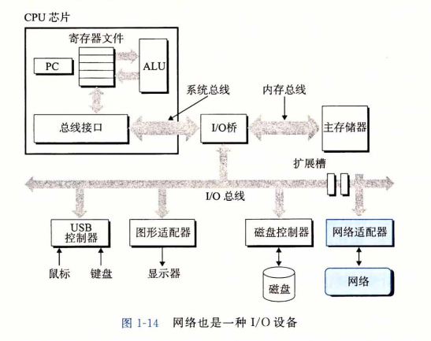
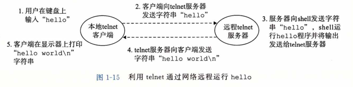

### 系统之间的网络通信

​		系统漫游至此，我们一直是把系统视为一个孤立的硬件和软件的集合体。实际上，现代系统通常通过网络和其他系统连接到一起。从一个单独的系统来看，网络可视为一个 I/O设备，如图1-14所示。当系统从主存复制一串字节到网络适配器时，数据流经过网络到达另一台机器，而不是比如说到达本地磁盘驱动器。相似地，系统可以读取从其他机器 发送来的数据，并把数据复制到自己的主存。

​		随着Internet这样的全球网络的出现，从一台主机复制信息到另外一台主机已经成为 计算机系统最重要的用途之一。比如，像电子邮件、即时通信、万维网、FTP和telnet这 样的应用都是基于网络复制信息的功能。

​		回到hello示例，我们可以使用熟悉的telnet应用在一个远程主机上运行hello程序。假设用本地主机上的telnet客户端连接远程主机上的telnet服务器。在我们登录到远程主机并运行shell后，远端的shell就在等待接收输人命令。此后在远端运行hello程序 包括如图1-15所示的五个基本步骤。

​		当我们在telnet客户端键人“hello”字符串并敲下回车键后，客户端软件就会将这 个字符串发送到telnet的服务器。telnet服务器从网络上接收到这个字符串后，会把它传递给远端shell程序。接下来，远端shell运行hello程序，并将输出行返回给telnet服务器。最后，telnet服务器通过网络把输出串转发给telnet客户端，客户端就将输出串输出到我们的本地终端上。

​		这种客户端和服务器之间交互的类型在所有的网络应用中是非常典型的。在第11章 中，你将学会如何构造网络应用程序，并利用这些知识创建一个简单的Web服务器。