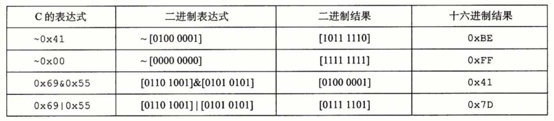
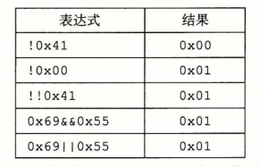
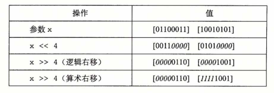

### C语言中的位级运算

​		C语言的一个很有用的特性就是它支持按位布尔运算。事实上，我们在布尔运算中使用的那些符号就是C语言所使用的：|就是OR(或），&就是AND(与），~就是NOT(取 反），而 ^ 就是EXCLUSIVE-OR(异或）。这些运算能运用到任何“整型”的数据类型上， 包括图2-3所示内容。以下是一些对char数据类型表达式求值的例子：

​		位级运算的一个常见用法就是实现掩码运算，这里掩码是一个位模式，表示从一个字中选出的位的集合。让我们来看一个例子，掩码0xFF(最低的8位为1)表示一个字的低位字节。位级运算x&0xFF生成一个由x的最低有效字节组成的值，而其他的字节就被置为 0。比如，对于x=0x89ABCDEF，其表达式将得到0x000000EF。表达式〜0将生成一个全1的掩码，不管机器的字大小是多少。尽管对于一个32位机器来说，同样的掩码可以写成 0xFFFFFFFF，但是这样的代码不是可移植的。

### C语言中的逻辑运算

​		C语言还提供了一组逻辑运算符||、&&和！，分别对应于命题逻辑中的OR、AND 和NOT运算。逻辑运算很容易和位级运算相混淆，但是它们的功能是完全不同的。逻辑运算认为所有非零的参数都表示TRUE，而参数0表示FALSE。它们返回1或者0,分别 表示结果为TRUE或者为FALSE。以下是一些表达式求值的示例。

​		可以观察到，按位运算只有在特殊情况下，也就是参数被限制为0或者1时，才和与其对应的逻辑运算有相同的行为。

​		逻辑运算符 && 和 || 与它们对应的位级运算 & 和 | 之间第二个重要的区别是，如果对 第一个参数求值就能确定表达式的结果，那么逻辑运算符就不会对第二个参数求值。因此， 例如，表达式a&&5/a将不会造成被零除，而表达式p&&*p++*不会导致间接引用空指针。

### C语言中的移位运算

​		C语言还提供了一组移位运算，向左或者向右移动位模式。对于一个位表示为 [X(w-1)，x(w-2),…，x(0)]的操作数x，C表达式 x<<k 会生成一个值，其位表示为[x(w-k-1)，x(w-k-2)，…， x(0)，…，0]。也就是说，x向左移动k位，丢弃最高的 k 位，并在右端补 k 个0。移位 量应该是一个 0〜w-1 之间的值。移位运算是从左至右可结合的，所以 x<<j<<c 等价于 (x<<j)<<k。

​		有一个相应的右移运算 x>>k ,但是它的行为有点微妙。一般而言，机器支持两种形式的右移：逻辑右移和算术右移。逻辑右移在左端补k个0,得到的结果是[0，…，0, x(w-1)，x(w-2)，…，x(k)]。算术右移是在左端补 k 个最高有效位的值，得到的结果是[x(w-1) , …， x(w-1) , x(w-1) , x(w-2)，…，x(k)]。这种做法看上去可能有点奇特，但是我们会发现它对有符号整数数据的运算非常有用。

​		让我们来看一个例子，下面的表给出了对一个8位参数x的两个不同的值做不同的移位操作得到的结果：

​		斜体的数字表示的是最右端（左移）或最左端（右移）填充的值。可以看到除了一个条目之外，其他的都包含填充0。唯一的例外是算术右移[10010101]的情况。因为操作数的最高位是1，填充的值就是1。

​		C语言标准并没有明确定义对于有符号数应该使用哪种类型的右移——算术右移或者逻辑右移都可以。不幸地，这就意味着任何假设一种或者另一种右移形式的代码都可能会遇到可移植性问题。然而，实际上，几乎所有的编译器/机器组合都对有符号数使用算术右移，且许多程序员也都假设机器会使用这种右移。另一方面，对于无符号数，右移必须是逻辑的。

​		与C相比，java对于如何进行右移有明确的定义。表达式 x>>k 会将 x 算数右移 k 个位置，而 x>>>k 会对 x 做逻辑右移。