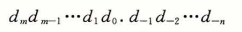
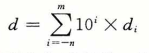
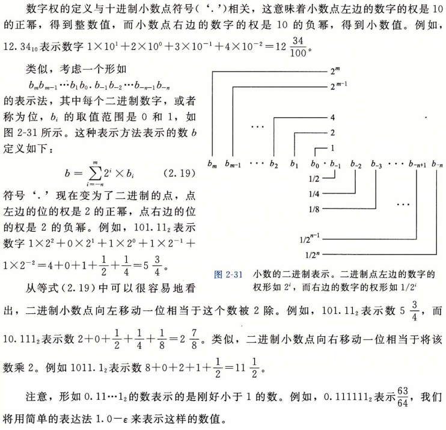
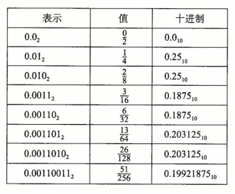
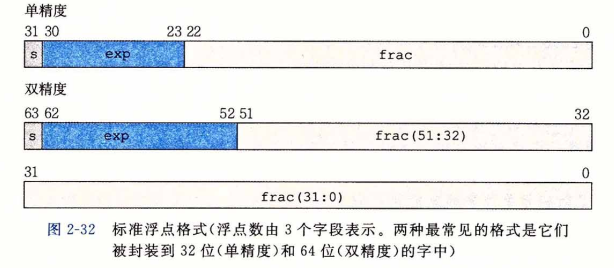
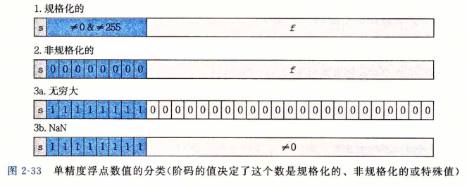
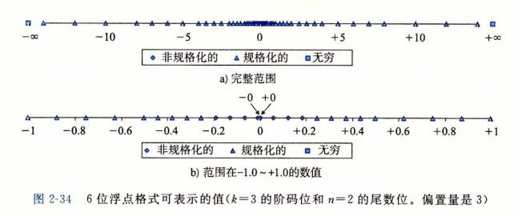
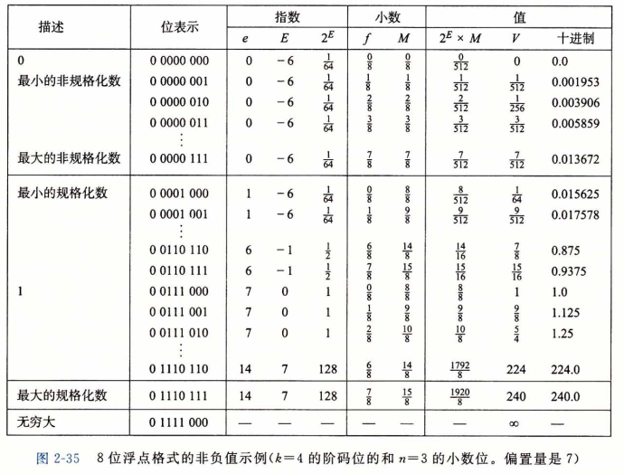

### 浮点数

​		浮点表示对形如  V = x * 2^y 的有理数进行编码。它对执行涉及非常大的数字( |V| >> 0 )、非常接近于0 (|V|<< 1 )的数字，以及更普遍地作力实数运算的近似值的计算，是很有用的。

​		直到20世纪80年代，每个计算机制造商都设计了自己的表示浮点数的规则，以及对浮点数执行运算的细节。另外，它们常常不会太多地关注运算的精确性，而把实现的速度和简便性看得比数字精确性更重要。

​		大约在1985年，这些情况随着 IEEE 标准 754 的推出而改变了，这是一个仔细制订的表示浮点数及其运算的标准。这项工作是从1976年开始由 Intel 赞助的，与 8087 的设计同时进行，8087 是一种为 8086 处理器提供浮点支持的芯片。他们请 William Kahan (加州大学伯克利分校的一位教授）作为顾问，帮助设计未来处理器浮点标准。他们支持Kahan 加入一个 IEEE 资助的制订工业标准的委员会。这个委员会最终采纳的标准非常接近于  Kahan 为 Intel 设计的标准。目前，实际上所有的计算机都支持这个后来被称为 IEEE浮点 的标准。这大大提高了科学应用程序在不同机器上的可移植性。

​		在本节中，我们将看到 IEEE 浮点格式中数字是如何表示的。我们还将探讨**舍入 (rmmding）**的问题，即当一个数字不能被准确地表示为这种格式时，就必须向上调整或者向下调整。然后，我们将探讨加法、乘法和关系运算符的数学属性。许多程序员认为浮点数没意思，往坏了说，深奥难懂。我们将看到，因为IEEE格式是定义在一组小而一致的原则上的，所以它实际上是相当优雅和容易理解的。

#### 二进制小数

​		理解浮点数的第一步是考虑含有小数值的二进制数字。首先，让我们来看看更熟悉的 十进制表示法。十进制表示法使用如下形式的表示：

其中每个十进制数乂的取值范围是 0〜9。这个表达描述的数值J定义如下：

​		假定我们仅考虑有限长度的编码，那么十进制表示法不能准确地表达像 1/3 和 5/7 这样的数。类似，小数的二进制表示法只能表示那些能够被写成 x * 2^y 的数。其他的值只能够被近似地表示。例如，数字 1/5 可以用十进制小数 0.20 精确表示。不过，我们并不能把它准确地表示为一个二进制小数，我们只能近似地表示它，增加二进制表示的长度可以提高表示的精度：

#### IEEE浮点表示

​		前一节中谈到的定点表示法不能很有效地表示非常大的数字。例如，表达式 5 * 2^100 是用 101 后面跟随100 个零的位模式来表示。相反，我们希望通过给定 x 和 y 的值，来表示形如 x * 2^y 的数。

​		IEEE浮点标准用 **V = (-1)^s * M * 2^E** 的形式来表示一个数：

- **符号（sign)**    s 决定这数是负数（ s = 1 ）还是正数（ s = 0 ），而对于数值 0 的符号位解释作为特殊情况处理。

- **尾数（significand）** M 是一个二进制小数，它的范围是 1〜2—e，或者是 0〜l—e。 

- **阶码（exponent）**    E 的作用是对浮点数加权，这个权重是 2 的 E 次幂(可能是负数）。

  将浮点数的位表示划分为三个字段，分别对这些值进行编码：

- 一个单独的符号位 s 直接编码符号 s 。

- k 位的阶码字段 exp = e(k-1)...e(1)e(0) 编码阶码 E 。

- n 位小数字段 frac = f(n-1)...f(1)f(0)编码尾数 M ，但是编码出来的值也依赖于阶码字 段的值是否等于 0 。

​		图 2-32 给出了将这三个字段装进字中两种最常见的格式。在单精度浮点格式（C语言中的 float )中，s、exp和 frac 字段分别为 1 位、k = 8 位和 n = 23 位，得到一个32位的表示。在双精度浮点格式（C语言中的double)中，s、exp和frac字段分别为 1 位、 k = 11位和 n = 52 位，得到一个64位的表示。

​		给定位表示，根据exp的值，被编码的值可以分成三种不同的情况（最后一种情况有两个变种）。图2-33说明了对单精度格式的情况。

##### 情况1:规格化的值

​		这是最普遍的情况。当 exp 的位模式既不全为 0 (数值 0 )，也不全为 1 (单精度数值为 255 ,双精度数值为2047 ) 时，都属于这类情况。在这种情况中，阶码字段被解释为以**偏置 (biased）**形式表示的有符号整数。也就是说，阶码的值是	E = e— Bias ,其中 e 是无符号数， 其位表示为 e(k-1)...e(1)e(0) ，而 Bias 是一个等于2^(k-1) —1 ( 单精度是 127 ,双精度是 1023 ) 的偏置值。由此产生指数的取值范围，对于单精度是 -126 〜+ 127,而对于双精度是  -1022〜 + 1023。

​		小数字段 frac 被解释为描述小数值 f ，其中 0 <= f < 1，其二进制表示为 0, f(n-1)… f(1)f(0) ，也就是二进制小数点在最高有效位的左边。尾数定义为 M = 1 + f 。有时，这种方式也叫做**隐含的以 1 开头的（implied leading 1)**表示，因为我们可以把 M 看成一个二进制表达式为 1.f(n-1)f(n-2)...f(0) 的数字。既然我们总是能够调整阶码 E ，使得尾数 M 在范围 1 <= M < 2 之中（假设没有溢出），那么这种表示方法是一种轻松获得一个额外精度位的技巧。 既然第一位总是等于 1 ，那么我们就不需要显式地表示它。

##### 情况2:非规格化的值

​		当阶码域为全 0 时，所表示的数是<u>非规格化形式</u>。在这种情况下，阶码值是 E = 1— Bias ，而尾数的值是M = f，也就是小数字段的值，不包含隐含的开头的 1 。

​		非规格化数有两个用途。首先，它们提供了一种表示数值 0 的方法，因为使用规格化数，我们必须总是使M > = 1，因此我们就不能表示 0。实际上，+0.0 的浮点表示的位模式为全0：符号位是 0 , 阶码字段全为 0 (表明是一个非规格化值），而小数域也全为 0 ,这就得到 M = f = 0。令人奇怪的是，当符号位为 1 ，而其他域全为 0 时，我们得到值 一 0 . 0 。根据 IEEEE 的浮点格式，值 +0.0 和 一 0.0 在某些方面被认为是不同的，而在其他方面是相同的。
​		非规格化数的另外一个功能是表示那些非常接近于 0.0 的数。它们提供了一种属性， 称为**逐渐溢出（gradual underflow)**,其中，可能的数值分布均匀地接近于 0. 0 。

##### 情况3:特殊值

​		最后一类数值是当指阶码全为 1 的时候出现的。当小数域全为 0 时，得到的值表示无穷，当 s = 0 时是正 无穷或者当 s = 0时是 负无穷。当我们把两个非常大的数相乘，或者除以零时，无穷能够表示**溢出**的结果。当小数域为非零时，结果值被称为“NaN”，即“不是一个数(Not a Number)”的缩写。一些运算的结果不能是实数或无穷，就会返回这样的 NaN 值， 比如当计算 根号-1  或 无穷减无穷 时。在某些应用中，表示未初始化的数据时，它们也很有用处。

### 数字示例

​		图2-34展示了一组数值，它们可以用假定的 6 位格式来表示，有 k = 3 的阶码位和 n = 2 的尾数位。偏置量是2^(3-1) - 1 = 3。图中的a部分显示了所有可表示的值（除了 NaN)。两个无穷值在两个末端。最大数量值的规格化数是 ±14 。非规格化数聚集在 0 的附近。图的 b 部分中，我们只展示了介于 -1.0 和 + 1.0 之间的数值，这样就能够看得更加清楚了。 两个零是特殊的非规格化数。可以观察到，那些可表示的数并不是均匀分布的——越靠近原点处它们越稠密。

​		图2-35展示了假定的 8 位浮点格式的示例，其中有 k = 4 的阶码位和 n = 3 的小数位。 偏置量是 2^(4-1)-1 = 7 。图被分成了三个区域，来描述三类数字。不同的列给出了阶码字段是如何编码阶码 E 的，小数字段是如何编码尾数 M 的，以及它们一起是如何形成要表示的值 V = 2^E * M 的。从 0 自身开始，最靠近 0 的是非规格化数。这种格式的非规格化数的 E=1 - 7 = -6 ,得到权 2^E = 1/64。小数 f 的值的范围是 0 ,1/8,...,7/8 ，从而得到数 V 的范围是 0 ~ 1/64 * 7/8 = 7/512。

​		这种形式的最小规格化数同样有 E = 1 - 7 =  -6 , 并且小数取值范围也为0, 1/8，… ,7/8。然而，尾数在范围 1 + 0 = 1 和 1 + 7/8 = 15/8 之间，得出数 V 在范围 8/512 = 1/64 和 15/512 之间。

​		可以观察到最大非规格化数&和最小规格化数^之间的平滑转变。这种平滑性归功于我们对非规格化数的E的定义。通过将E定义为1 一伤as,而不是一我们可以补 偿非规格化数的尾数没有隐含的开头的1。

​		当增大阶码时，我们成功地得到更大的规格化值，通过1.0后得到最大的规格化数。 这个数具有阶码£：=7,得到一个权2E = 128。小数等于|■得到尾数因此，数值 是7=240。超出这个值就会溢出到+ 〇〇。

​		这种表示具有一个有趣的属性，假如我们将图2-35中的值的位表达式解释为无符号 整数，它们就是按升序排列的，就像它们表示的浮点数一样。这不是偶然的——IEEE格 式如此设计就是为了浮点数能够使用整数排序函数来进行排序。当处理负数时，有一个小 的难点，因为它们有开头的1，并且它们是按照降序出现的，但是不需要浮点运算来进行 比较也能解决这个问题(参见家庭作业2. 84)。