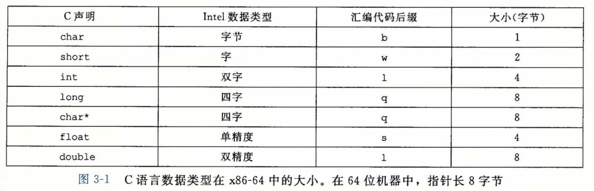

## 数据格式

​		由于是从16位体系结构扩展成32位的，Intel 用术语 " **字(word)** ” 表示16位数据类型。因此，称 32 位数为“**双字（double words)** ’’，称64位数为“**四字（quad words)**”。 图3-1给出了 C 语言基本数据类型对应的 x86-64 表示。标准 int 值存储为双字（32位）。 指针(在此用char*表示）存储为8字节的四字，64位机器本来就预期如此。x86-64中， 数据类型long实现为64位，允许表示的值范围较大。本章代码示例中的大部分都使用了指针和 long 数据类型，所以都是四字操作。X86-64 指令集同样包括完整的针对 字节、字 和 双字 的指令。

​		浮点数主要有两种形式：单精度(4字节）值，对应于C语言数据类型 float ; 双精度 (8字节)值，对应于C语言数据类型double。x86家族的微处理器历史上实现过对一种特殊的 80 位（10字节）浮点格式进行全套的浮点运算。可以在 C 程序中用声明 long double 来指定这种格式。不过我们不建议使用这种格式。它不能移植到其他类型的机器上，而且实现的硬件也不如单精度和双精度算术运算的高效。

​		如图所示，大多数 GCC 生成的汇编代码指令都有一个字符的后缀，表明操作数的大小。例如，数据传送指令有四个变种：movb( 传送字节）、movw( 传送字）、movl( 传送双字)和movq ( 传送四字）。后缀 ‘ l ' 用来表示双字，因为32位数被看成是“ 长字（long word) ”。注意，汇编代码也使用后缀 ' l ’来表示 4 字节整数和 8 字节双精度浮点数。这不会产生歧义，因为浮点数使用的是一组完全不同的指令和寄存器。