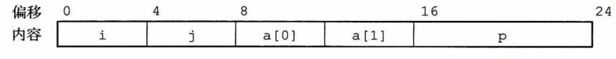
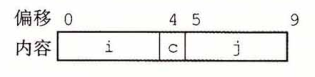
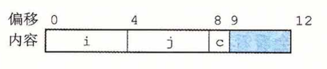

## 异质的数据结构

​		C 语言提供了两种将不同类型的对象组合到一起创建数据类型的机制：**结构（structure)**， 用关键字 struct 来声明 ，将多个对象集合到一个单位中； **联合 （union)**  ,用关键字union来声明，允许用几种不同的类型来引用一个对象。


### 结构

​		C 语言的 struct 声明创建一个数据类型，将可能不同类型的对象聚合到一个对象中。 用名字来引用结构的各个组成部分。类似于数组的实现，结构的所有组成部分都存放在内 存中一段连续的区域内，而指向结构的指针就是结构第一个字节的地址。编译器维护关于每个结构类型的信息，指示每个字段（field)的字节偏移。它以这些偏移作为内存引用指令中的位移，从而产生对结构元素的引用。

​		让我们来看看这样一个例子，考虑下面这样的结构声明：

```c
struct rec{
    int i;
    int j;
    int a[2];
    int *p;
}
```

这个结构包括 4 个字段：两个 4 字节 int 、一个由两个类型为 int 的元素组成的数组和一个 8 字节整型指针，总共是 24 个字节：



​		可以观察到，数组 a 是嵌入到这个结构中的。上图中顶部的数字给出的是各个字段相对于结构开始处的字节偏移。

​		为了访问结构的字段，编译器产生的代码要将结构的地址加上适当的偏移。例如，假设 struct  rec* 类型的变量 r 放在寄存器 ％rdi 中。那么下面的代码将元素 r -> i 复制到元素 r -> j  :

```assembly
;Registers: r in %rdi
1	movl	(%rdi) , %eax	;Get r->i
2	movl	%eax, 4(%rdi)	;Store in r->j
```

因为字段 i 的偏移量为 0 ,所以这个字段的地址就是 r 的值。为了存储到字段 j ，代码要 将 r 的地址加上偏移量 4 。

​		要产生一个指向结构内部对象的指针，我们只需将结构的地址加上该字段的偏移量。 例如，只用加上偏移量 8 + 4X1 = 12，就可以得到指针 &(r->a[1])。对于在寄存器 ％rdi 中的指针 r 和在寄存器 ％rsi 中的长整数变量 i ，我们可以用一条指令产生指针 & (r->a [i]) 的值：

```assembly
;Registers: r in %rdi, i %rsi
1 leaq 	8(%rdi, %rsi, 4) , %rax 		;Set %rax to &r->a[i]
```

最后举一个例子，下面的代码实现的是语句：
`r->p = &r->a[r->i + r->j];`
开始时 r 在寄存器 %rdi 中：

```assembly
;Registers	r in %rdi	
1	movl	4(%rdi), %eax				;Get r->j
2	addl	(%rdi), %eax				;Add r->i
3	cltq								;Extend to 8 bytes
4	leaq	8(%rdi,%rax，4), %rax		;Compute &r->a[r->:
5	movq	%rax, 16(%rdi)				;Store in r->p
```


综上所述，结构的各个字段的选取完全是在编译时处理的。机器代码不包含关于字段声明或字段名字的信息。


### 联合

​		联合提供了一种方式，能够规避 C 语言的类型系统，允许以多种类型来引用一个对象。联合声明的语法与结构的语法一样，只不过语义相差比较大。它们是用不同的字段来引用相同的内存块。
​		考虑下面的声明：

```c
struct S3 {
    char c;
    int i [2];
    double v;
};
union U3 { 
    char c;
    int i [2];
    double v;
};
```

在一台 x86-64 Linux 机器上编译时，字段的偏移量、数据类型 S3 和 U3 的完整大小如下:

| 类型 | c    | i    | v    | 大小 |
| ---- | ---- | ---- | ---- | ---- |
| S3   | 0    | 4    | 16   | 24   |
| U3   | 0    | 0    | 0    | 8    |

(稍后会解释 S3 中 i 的偏移量为什么是 4 而不是 1 ，以及为什么 v 的偏移量是 16 而不是 9 或 12 。）对于类型union U3 * 的指针 p，p-> c、P-> i[0] 和 P-> v 引用的都是数据结构的起始位置。还可以观察到，一个联合的总的大小等于它最大字段的大小。

​		在一些下上文中，联合十分有用。但是，它也能引起一些讨厌的错误，因为它们绕过了 C 语言类型系统提供的安全措施。一种应用情况是，我们事先知道对一个数据结构中的两个不同字段的使用是互斥的，那么将这两个字段声明为联合的一部分，而不是结构的一部分，会减小分配空间的总量。

​		例如，假设我们想实现一个二叉树的数据结构，每个叶子节点都有两个 double 类型的数据值，而每个内部节点都有指向两个孩子节点的指针，但是没有数据。如果声明如下：

```c
struct node_s {
	struct node_s *left; 
    struct node_s *right;
	double data[2];
};
```


那么每个节点需要 32 个字节，每种类型的节点都要浪费一半的字节。相反，如果我们如下声明一个节点：

```c
union node_u {
    struct{
        union node_u *left; 
        union node_u *right;
    }internal;
	double data[2];
};
```

那么，每个节点就只需要 16 个字节。如果 n 是一个指针，指向 union node_u * 类型的节 点，我们用 n-> data [0] 和 n-> data [1] 来引用叶子节点的数据，而用 n-> internal . left和 n-> internal. right 来引用内部节点的孩子。

​		不过，如果这样编码，就没有办法来确定一个给定的节点到底是叶子节点，还是内部节点。通常的方法是引入一个枚举类型，定义这个联合中可能的不同选择，然后再创建一 个结构，包含一个标签字段和这个联合：

```c
typedef enum { N_LEAF, K_INTERNAL } nodetype_t;

struct node_t {
	nodetype_t type; 
    union {
		struct {
			struct node_t *left; 
            struct node_t *right;
		} internal; 
        double data[2];
	} info;
};
```

这个结构总共需要 24 个字节： type 是 4 个字节，info. internal. left 和 info. internal. right 各要 8 个字节，或者是 info. data 要 16 个字节。我们后面很快会谈到，在字段 type 和联合的元素之间需要 4 个字节的填充，所以整个结构大小为 4 + 4 + 16 = 24 。在这种情况中，相对于给代码造成的麻烦，使用联合带来的节省是很小的。对于有较多字段的数据结构，这样的节省会更加吸引人。

​		联合还可以用来访问不同数据类型的位模式。例如，假设我们使用简单的强制类型转换将一个 double 类型的值 d 转换为 unsigned long 类型的值 u : 

**unsigned long u = (unsigned long) d;**

值 u 会是 d 的整数表示。除了 d 的值为 0.0 的情况以外，u 的位表示会与 d 的很不一样。 再看下面这段代码，从一个 double 产生一个 unsigned long 类型的值：

```c
unsigned long double2bits(double d) { 
    union {
		double d; 
        unsigned long u;
    } temp;
	temp.d = d;	
	return temp.u;
};
```

​		在这段代码中，我们以一种数据类型来存储联合中的参数，又以另一种数据类型来访问它。结果会是 u 具有和 d —样的位表示，包括符号位字段、指数和尾数，如3. 11节中 描述的那样。u 的数值与 d 的数值没有任何关系，除了 d 等于 0.0 的情况。

​		当用联合来将各种不同大小的数据类型结合到一起时，字节顺序问题就变得很重要了。例如，假设我们写了一个过程，它以两个 4 字节的 unsigned 的位模式，创建一个 8 字节的 double :

```c
double uu2double(unsigned word0, unsigned word1)
{
	union {
		double d; 
        unsigned u[2];
	} temp;
	temp.u[0] = word0;
    temp.u[1] = word1;
    return temp.d;
}
```

​		在 x86-64 这样的小端法机器上，参数 word0 是 d 的低位 4 个字节，而 word1 是高位 4 个字节。在大端法机器上，这两个参数的角色刚好相反。


### 数据对齐

​		许多计算机系统对基本数据类型的合法地址做出了一些限制，要求某种类型对象的地址必须是某个值 K (通常是 2 、4 或 8 )的倍数。这种对齐限制简化了形成处理器和内存系统之间接口的硬件设计。例如，假设一个处理器总是从内存中取 8 个字节，则地址必须为 8 的倍数。如果我们能保证将所有的 double 类型数据的地址对齐成 8 的倍数，那么就可以用一个内存操作来读或者写值了。否则，我们可能需要执行两次内存访问，因为对象可能被分放在两个8字节内存块中。

​		无论数据是否对齐，x86-64 硬件都能正确工作。不过，Intel 还是建议要对齐数据以提高内存系统的性能。对齐原则是任何 K 字节的基本对象的地址必须是  K 的倍数。可以 看到送条原则会得到如下对齐：

| K    | 类型              |
| ---- | ----------------- |
| 1    | char              |
| 2    | short             |
| 4    | int,float         |
| 8    | long,double,char* |

​		确保每种数据类型都是按照指定方式来组织和分配，即每种类型的对象都满足它的对齐限制，就可保证实施对齐。编译器在汇编代码中放入命令，指明全局数据所需的对齐。 例如，3. 6. 8节开始的跳转表的汇编代码声明在第2行包含下面这样的命令：

​		**.align 8**

​		这就保证了它后面的数据（在此，是跳转表的开始）的起始地址是8的倍数。因为每个表项长8个字节，后面的元素都会遵守 8 字节对齐的限制。

​		对于包含结构的代码，编译器可能需要在字段的分配中插入间隙，以保证每个结构元素都满足它的对齐要求。而结构本身对它的起始地址也有一些对齐要求。

​		比如说，考虑下面的结构声明：

```c
struct S1 {
    int i; 
    char c;
	int j:
};
```

假设编译器用最小的9字节分配，画出图来是这样的：


它是不可能满足字段 i (偏移为 0 )和 j (偏移为 5 )的 4  字节对齐要求的。取而代之地，编译器在字段 c 和 j 之间插人一个 3 字节的间隙（在此用蓝色阴影表示）：


结果，j 的偏移量为 8 ,而整个结构的大小为 12 字节。此外，编译器必须保证任何 struct S1 * 类型的指针 P 都满足 4 字节对齐。用我们前面的符号，设指针 P 的值为 X(P)  那么，X(P) 必须是 4 的倍数。这就保证了  p-> i(地址：X(p)) 和 p-> j (地址：X(p) + 8) 都满足它们的 4 字节对齐要求。

​		另外，编译器结构的末尾可能需要一些填充，这样结构数组中的每个元素都会满足它的对齐要求。例如，考虑下面这个结构声明：

```c
struct S2 { 
    int i;
    int j; 
    char c;
};
```

​		如果我们将这个结构打包成 9 个字节，只要保证结构的起始地址满足 4 字节对齐要求，我们仍然能够保证满足字段 i 和 j 的对齐要求。不过，考虑下面的声明： 

​		`struct S2 d[4];`

分配 9 个字节，不可能满足 d 的每个元素的对齐要求，因为这些元素的地址分别为：x(d)、x(d) + 9、 x(d)+18 和x(d)+27 。相反，编译器会为结构 S2 分配 12 个字节，最后 3 个字节是浪费的空间：


这样一来，d的元素的地址分别为 x(d) 、x(d) + 12、x(d) + 24 和 x(d) + 36。只要 x(d) 是 4 的倍数， 所有的对齐限制就都可以满足了。