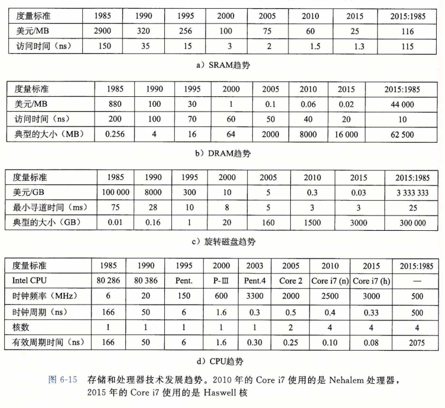
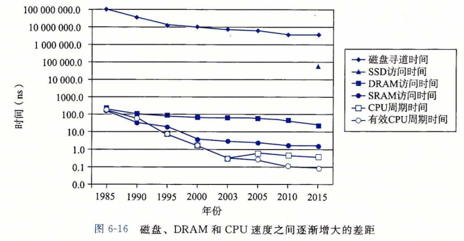

### 存储技术趋势

​		从我们对存储技术的讨论中，可以总结出几个很重要的思想：
​		**不同的存储技术有不同的价格和性能折中。**SRAM 比 DRAM 快一点，而 DRAM 比磁盘要快很多。另一方面，快速存储总是比慢速存储要贵的。SRAM 每字节的造价比 DRAM 高，DRAM 的造价又比磁盘高得多。SSD 位于DRAM 和旋转磁盘之间。
​		**不同存储技术的价格和性能属性以截然不同的速率变化着**。图6-15总结了从1985年以来的存储技术的价格和性能属性，那时第一台 PC 刚刚发明不久。这些数字是从以前的商业杂志中和 Web 上挑选出来的。虽然它们是从非正式的调查中得到的，但是这些数字还是能揭示出一些有趣的趋势。

​		自从1985年以来，SRAM 技术的成本和性能基本上是以相同的速度改善的。访问时间和每兆字节成本下降了大约 100 倍（图6-15a)。不过，DRAM 和磁盘的变化趋势更大， 而且更不一致。DRAM 每兆字节成本下降了 44 000 倍（超过了四个数量级！），而 DRAM 的访问时间只下降了大约 10 倍（图6-15b)。磁盘技术有和 DRAM 相同的趋势，甚至变化更大。从1985 年以来，磁盘存储的每兆字节成本暴跌了 3 000 000 倍（超过了六个数量 级！），但是访问时间提高得很慢，只有 25 倍左右（图6-15c)。这些惊人的长期趋势突出了内存和磁盘技术的一个基本事实：增加密度（从而降低成本）比降低访问时间容易得多。

​		**DRAM 和磁盘的性能滞后于 CPU 的性能。**正如我们在图6-15d中看到的那样，从 1985 年到 2010 年，CPU周期时间提高了 500 倍。如果我们看有效周期时间（effective cycle time) ——我们定义为一个单独的 CPU( 处理器）的周期时间除以它的处理器核数——那么从 1985 年到 2010 年的提高还要大一些，为 2000 倍。CPU 性能曲线在 2003 年附近的突然变化反映的是多核处理器的出现（参见6. 2节的旁注），在这个分割点之后，单个核的周 期时间实际上增加了一点点，然后又开始下降，不过比以前的速度要慢一些。

​		注意，虽然 SRAM 的性能滞后于 CPU 的性能，但还是在保持增长。不过，DRAM 和磁盘性能与 CPU 性能之间的差距实际上是在加大的。直到2003年左右多核处理器的出 现，这个性能差距都是延迟的函数，DRAM 和磁盘的访问时间比单个处理器的周期时间提高得更慢。不过，随着多核的出现，这个性能越来越成为了吞吐量的函数，多个处理器 核并发地向 DRAM 和磁盘发请求。
​		图6-16清楚地表明了各种趋势，以半对数为比例（semi-log scale)，画出了图6-15中 的访问时间和周期时间。

​		正如我们将在6. 4节中看到的那样，现代计算机频繁地使用基于 SRAM 的高速缓存， 试图弥补处理器-内存之间的差距。这种方法行之有效是因为应用程序的一个称为**局部性 (locality)**的基本属性，接下来我们就讨论这个问题。