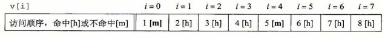
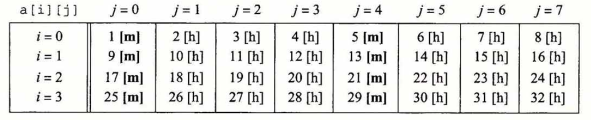
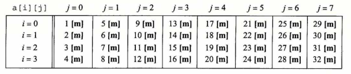

## 编写高速缓存友好的代码

​		在6. 2节中，我们介绍了局部性的思想，而且定性地谈了一下什么会具有良好的局部 性。明白了高速缓存存储器是如何工作的，我们就能更加准确一些了。局部性比较好的程序更容易有较低的不命中率，而不命中率较低的程序往往比不命中率较高的程序运行得更快。因此，从具有良好局部性的意义上来说，好的程序员总是应该试着去编写**高速缓存友好(cache friendly)**的代码。下面就是我们用来确保代码高速缓存友好的基本方法。

​		1)	**让最常见的情况运行得快**。程序通常把大部分时间都花在少量的核心函数上，而这些函数通常把大部分时间都花在了少量循环上。所以要把注意力集中在核心函数里的循环上，而忽略其他部分。

​		2)	**尽量减小每个循钚内部的缓存不命中数量**。在其他条件(例如加载和存储的总次数）相同的情况下，不命中率较低的循环运行得更快。

为了看看实际上这是怎么工作的，考虑6. 2节中的函数 sumvec :

```c
1	int sumvec(int v[N])
2	{
3		int i, sum = 0;
4
5		for (i = 0; i < N; i++)
6			sum += v[i];
7		return sum;
8	}
```

这个函数高速缓存友好吗？首先，注意对于局部变量 i 和 sum ,循环体有良好的时间局部性。实际上，因为它们都是局部变量，任何合理的优化编译器都会把它们缓存在寄存器文件中，也就是存储器层次结构的最高层中。现在考虑一下对向量 v 的步长为 1 的引用。一 般而言，如果一个高速缓存的块大小为 B 字节，那么一个步长为 k 的引用模式（这里 k 是以字为单位的）平均每次循环迭代会有  min( 1 , ( wordsize X k ) ) 次缓存不命中。当 k = 1 时，它取最小值，所以对 v 的步长为 1 的引用确实是高速缓存友好的。例如，假设 v 是块对齐的，字为 4 个字节，高速缓存块为 4 个字，而高速缓存初始为空（冷高速缓存）。然后，无论是什么样的高速缓存结构，对 v 的引用都会得到下面的命中和不命中模式:



​		在这个例子中，对 V[0] 的引用会不命中，而相应的包含 v[0]〜v[3] 的块会被从内存加载到高速缓存中。因此，接下来三个引用都会命中。对 v[4] 的引用会导致不命中，而—个新的块被加载到高速缓存中，接下来的三个引用都命中，依此类推。总的来说，四个引用中，三个会命中，在这种冷缓存的情况下，这是我们所能做到的最好的情况了。

​		总之，简单的sumvec示例说明了两个关于编写高速缓存友好的代码的重要问题：

- 对局部变量的反复引用是好的，因为编译器能够将它们缓存在寄存器文件中（时间局部性）。
- 步长为 1 的引用模式是好的，因为存储器层次结构中所有层次上的缓存都是将数据存储为连续的块(空间局部性）。

​        在对多维数组进行操作的程序中，空间局部性尤其重要。例如，考虑6.2节中的 sumarrayrows 函数，它按照行优先顺序对一个二维数组的元素求和：

```c
1	int sumarrayrows(int a [M][N])
2	{
3		int i, j，sum = 0;
4
5		for (i = 0; i < M; i++)
6			for (j = 0； j < N; j++)
7				sum += a[i] [j];
8		return sum;
9	}
```

​		由于 C 语言以行优先顺序存储数组，所以这个函数中的内循环有与 sumvec —样好的步长为 1 的访问模式。例如，假设我们对这个高速缓存做与对 sumvec —样的假设。那么对数组 a 的引用会得到下面的命中和不命中模式：



但是如果我们做一个看似无伤大雅的改变——交换循环的次序，看看会发生什么:

```c
1	int sumarraycols(int a[M] [N])
2	{
3		int i, j, sum = 0;
4
5		for (j = 0； j < N; j++)
6			for (i = 0; i < M; i++)
7				sum += a[i] [j];
8		return sum;
9	}
```

在这种情况中，我们是一列一列而不是一行一行地扫描数组的。如果我们够幸运，整个数组都在高速缓存中，那么我们也会有相同的不命中率 1/4 。不过，如果数组比高速缓存要大(更可能出现这种情况），那么每次对a[i] [j]的访问都会不命中！



​		较高的不命中率对运行时间可以有显著的影响。例如，在桌面机器上，sumarrayrows 运行速度比sumarraycols 快 25 倍。总之，程序员应该注意他们程序中的局部性, 试着编写利用局部性的程序。