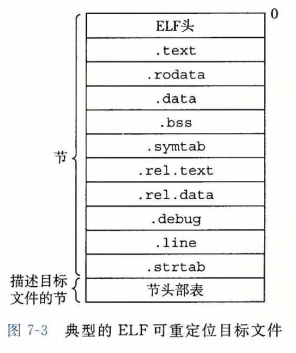

## 可重定位目标文件

​		图7-3展示了一个典型的 ELF 可重定位目标文件的格式。**ELF头（ELF header)**以一 个16字节的序列开始，这个序列描述了生成该文件的系统的字的大小和字节顺序。ELF 头剩下的部分包含帮助链接器语法分析和解释目标文件的信息。其中包括 ELF 头的大小、目标文件的类型（如可重定位、可执行或者共享的）、机器类型（如X86-64)、节**头部表(section header table)**的文件偏移，以及节头 部表中条目的大小和数量。不同节的位置和大小是由节头部表描述的，其中目标文件中每个节都有一个固定大小的**条目(entry)**。

​		夹在ELF头和节头部表之间的都是节。一个典型的ELF可重定位目标文件包含下面几个节：

​		.text:已编译程序的机器代码。
​		.rodata:只读数据，比如 printf 语句中的格式串和开关语句的跳转表。
​		.data:已初始化的全局和静态 C 变量。局部 C 变量在运行时被保存在栈中，既不出现在 .data 节中，也不出现在 .bss 节中。
​		.bss:未初始化的全局和静态 C 变量，以及所有被初始化为 0 的全局或静态变量。在目标文件中这个节不占据实际的空间，它仅仅是一个占位符。目标文件格式区分已初始化和未初始化变量是为了空间效率：在目标文件中，未初始化变量不需要占据任何实际的磁盘空间。运行时，在内存中分配这些变量，初始值为 0 。
​		.symtab: —个符号表，它存放在程序中定义和引用的函数和全局变量的信息。一些程序员错误地认为必须通过 -g 选项来编译一个程序，才能得到符号表信息。实际上，每个可重定位目标文件在 .symtab 中都有一张符号表（除非程序员特意用STRIP命令去掉它）然而，和编译器中的符号表不同，.symtab 符号表不包含局部变量的条目。
​		.rel.text:—个 .text 节中位置的列表，当链接器把这个目标文件和其他文件组合时，需要修改这些位置。一般而言，任何调用外部函数或者引用全局变量的指令都需要修改。另一方面，调用本地函数的指令则不需要修改。注意，可执行目标文件中并不需要重定位信息，因此通常省略，除非用户显式地指示链接器包含这些信息。
​		.rel.data: 被模块引用或定义的所有全局变量的重定位信息。一般而言，任何已初始化的全局变量，如果它的初始值是一个全局变量地址或者外部定义函数的地址，都需要被修改。
​		.debug: —个调试符号表，其条目是程序中定义的局部变量和类型定义，程序中定义和引用的全局变量，以及原始的 C 源文件。只有以 -g 选项调用编译器驱动程序时，才会得到这张表。
​		.line:原始C源程序中的行号和.text节中机器指令之间的映射。只有以-g选项调 用编译器驱动程序时，才会得到这张表。
​		.strtab：—个字符串表，其内容包括 .symtab 和 .debug 节中的符号表，以及节头部中的节名字。字符串表就是以 null 结尾的字符串的序列