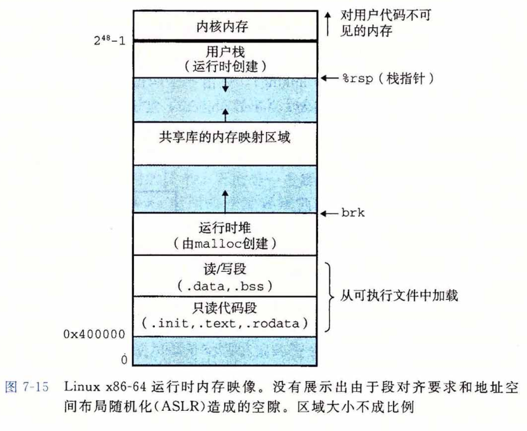

## 加载可执行目标文件

​		要运行可执行目标文件 prog ,我们可以在 Linux shell 的命令行中输入它的名字： 
​			linux> ./prog

​		因为 prog 不是一个内置的 shell 命令，所以 shell 会认为 prog 是一个可执行目标文件，通过调用某个驻留在存储器中称为**加载器（loader）**的操作系统代码来运行它。任何 Linux 程序都可以通过调用 execve 函数来调用加载器，我们将在8.4. 6节中详细描述这个函数。加载器将可执行目标文件中的代码和数据从磁盘复制到内存中，然后通过跳转到程序的第一条指令或入口点来运行该程序。这个将程序复制到内存并运行的过程叫做加载。

​		每个 Linux 程序都有一个运行时内存映像，类似于图7-15中所示。在 Linux X86-64 系统中，代码段总是从地址 0x400000 处开始，后面是数据段。运行时堆在数据段之后， 通过调用 malloc 库往上增长。（我们将在9. 9节中详细描述 malloc 和堆。）堆后面的区域是为共享模块保留的。用户栈总是从最大的合法用户地址（2^48 — 1）开始，向较小内存地址增长。栈上的区域，从地址 2^48 开始，是为**内核（kernel）**中的代码和数据保留的，所谓内核就是操作系统驻留在内存的部分。

​		为了简洁，我们把堆、数据和代码段画得彼此相邻，并且把栈顶放在了最大的合法用户地址处。实际上，由于 .data 段有对齐要求（见7. 8节），所以代码段和数据段之间是有间隙的。同时，在分配栈、共享库和堆段运行时地址的时候，链接器还会使用地址空间布局随机化（ASLR，参见3. 10.4节）。虽然每次程序运行时这些区域的地址都会改变，它们的相对位置是不变的。

​		当加载器运行时，它创建类似于图7-15所示的内存映像。在程序头部表的引导下， 加载器将可执行文件的**片（chunk）**复制到代码段和数据段。接下来，加载器跳转到程序的入口点，也就是 _ start 函数的地址。这个函数是在系统目标文件 ctrl.o 中定义的，对所有的 C 程序都是一样的。 _start 函数调用系统启动函数 __libc_start_main，该函数定义在 libc.so 中。它初始化执行环境，调用用户层的 main 函数，处理 main 函数的返回值，并且在需要的时候把控制返回给内核。

