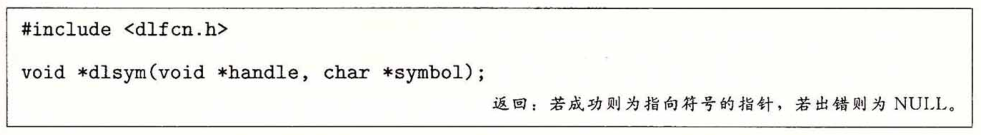
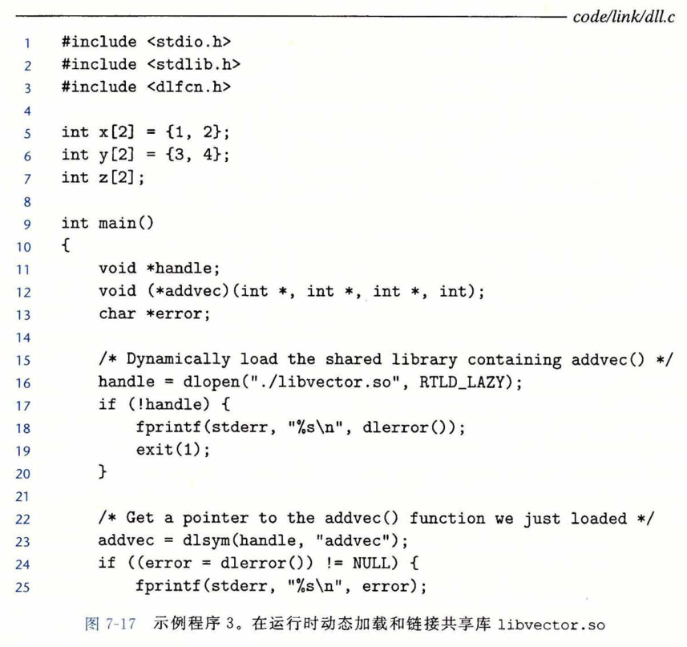

## 从应用程序中加载和链接共享库

​		到目前为止，我们已经讨论了在应用程序被加载后执行前时，动态链接器加载和链接共享库的情景。然而，应用程序还可能在它运行时要求动态链接器加载和链接某个共享库，而无需在编译时将那些库链接到应用中。

​		动态链接是一项强大有用的技术。下面是一些现实世界中的例子：

- **分发软件**。微软 Windows 应用的开发者常常利用共享库来分发软件更新。他们生成一个共享库的新版本，然后用户可以下载，并用它替代当前的版本。下一次他们运行应用程序时，应用将自动链接和加载新的共享库。
- **构建高性能Web服务器**。许多 Web 服务器生成动态内容，比如个性化的 Web 页面、账户余额和广告标语。早期的 Web 服务器通过使用 fork 和 execve 创建一个子进程，并在该子进程的上下文中运行 CGI 程序来生成动态内容。然而，现代高性能的 Web 服务器可以使用基于动态链接的更有效和完善的方法来生成动态内容。

​       其思路是将每个生成动态内容的函数打包在共享库中。当一个来自 Web 浏览器的请求到达时，服务器动态地加载和链接适当的函数，然后直接调用它，而不是使用 fork 和 execve 在子进程的上下文中运行函数。函数会一直缓存在服务器的地址空间中，所以只要一个简单的函数调用的开销就可以处理随后的请求了。这对一个繁忙的网站来说是有很大影响的。更进一步地说，在运行时无需停止服务器，就可以更新已存在的函数，以及添加新的函数。

​		Linux 系统为动态链接器提供了一个简单的接口，允许应用程序在运行时加载和链接共享库。

​		dlopen 函数加载和链接共享库 filename 。用已用带 RTLD_GLOBAL 选项打开了的库解析 filename 中的外部符号。如果当前可执行文件是带 -rdynamic 选项编译的，那么对符号解析而言，它的全局符号也是可用的。flag 参数必须要么包括 RTLD_NOW，该标志告诉链接器立即解析对外部符号的引用，要么包括 RTLD_LAZY 标志，该标志指示链接器推迟符号解析直到执行来自库中的代码。这两个值中的任意一个都可以和 RTLD_GLOBAL 标志取或。

​		dlsym 函数的输入是一个指向前面已经打开了的共享库的句柄和一个 symbol 名字， 如果该符号存在，就返回符号的地址，否则返回NULL。

​		如果没有其他共享库还在使用这个共享库，dlclose 函数就卸载该共享库。

​		dlerror 函数返回一个字符串，它描述的是调用 dlopen 、dlsym 或者 dlclose 函数时发生的最近的错误，如果没有错误发生，就返回 NULL 。

​		图7-17展示了如何利用这个接口动态链接我们的 libvector.so 共享库，然后调用它的 addvec 例程。要编译这个程序，我们将以下面的方式调用 GCC : 

​			linux> grc	 -rdynamic   -o   prog2r    dll.c    -ldl

