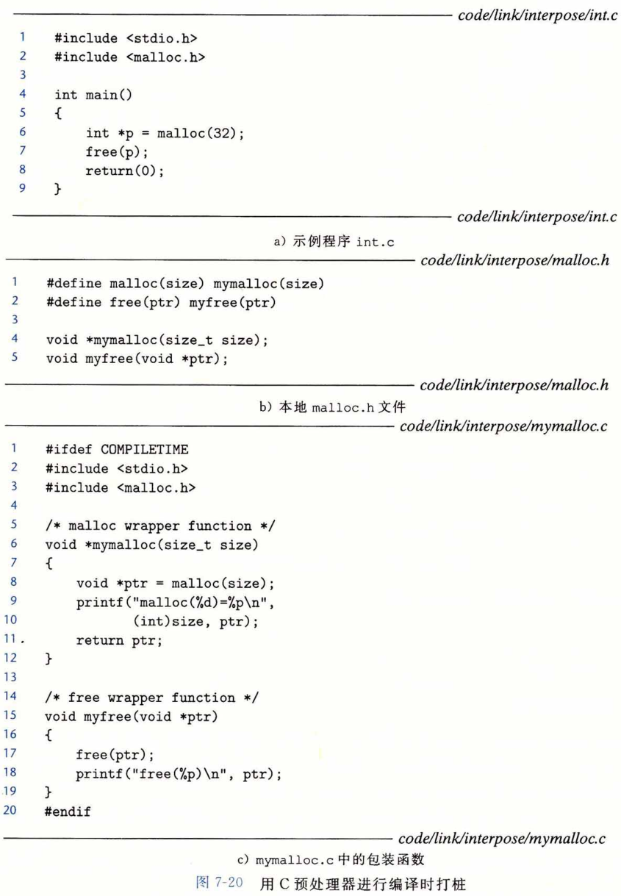

## 库打桩机制

​		Linux链接器支持一个很强大的技术，称为**库打桩（library interpositioning）**，它允许你截获对共享库函数的调用，取而代之执行自己的代码。使用打粧机制，你可以追踪对某个特殊库函数的调用次数，验证和追踪它的输入和输出值，或者甚至把它替换成一个完全不同的实现。

​		下面是它的基本思想：给定一个需要打桩的目标函数，创建一个包装函数，它的原型与目标函数完全一样。使用某种特殊的打桩机制，你就可以欺骗系统调用包装函数而不是目标函数了。包装函数通常会执行它自己的逻辑，然后调用目标函数，再将目标函数的返回值传递给调用者。

​		打桩可以发生在编译时、链接时或当程序被加载和执行的运行时。要研究这些不同的机制，我们以图7-20a中的示例程序作为运行例子。它调用 C 标准库（libc.so）中的 malloc 和 free 函数。对 malloc 的调用从堆中分配一个 32 字节的块，并返回指向该块的指针。对 free 的调用把块还回到堆，供后续的 malloc 调用使用。我们的目标是用打桩来追踪程序运行时对 malloc 和 free 的调用。

### 编译时打桩

​		图7-20展示了如何使用 C 预处理器在编译时打桩。mymalloc.c 中的包装函数(图7-20c) 调用目标函数，打印追踪记录，并返回。本地的 malloc.h 头文件（图7-20b）指示预处理器用对相应包装函数的调用替换掉对目标函数的调用。像下面这样编译和链接这个程序：

​		linux> gcc 	-DCOMPILETIME 	-c 	mymalloc.c 
​		linux> gcc	 -I. 	-o	 intc 	int.c	 mymalloc.o

​		由于有 **-I.** 参数，所以会进行打桩，它告诉 C 预处理器在搜索通常的系统目录之前， 先在当前目录中查找malloc.h 。注意，mymalloc.c 中的包装函数是使用标准 malloc.h 头文件编译的。
​		运行这个程序会得到如下的追踪信息：

​		linux> ./intc
​		malloc(32)=0x9ee010 
​		free(0x9ee010)

### 链接时打桩

​		Linux 静态链接器支持用 --wrap f 标志进行<u>链接时打桩</u>。这个标志告诉链接器，把对符号 f 的引用解析成        _ _wrap_f (前缀是两个下划线），还要把对符号 _ _real_f (前缀是两个下划线）的引用解析为 f 。图7-21给出我们示例程序的包装函数。

​		用下述方法把这些源文件编译成可重定位目标文件：
​			linux> gcc -DLINKTIME -c mymalloc.c 
​			linux> gcc -c int.c

然后把目标文件链接成可执行文件：

​		linux> gcc	 -W1 , --wrap , malloc     -W1 , --wrap , free     -o     int1     int.o     mymalloc.o

​		-Wl,option 标志把 option 传递给链接器。option 中的每个逗号都要替换为一个空格。所以 -W1 , --Wrap ,  malloc 就把 --wrap malloc 传递给链接器，以类似的方式传递 -Wl, --wrap,free 。

​		运行该程序会得到如下追踪信息：
​			linux> ./inti
​			malloc¢32) = 0xl8cf010
​			free(0xl8cf010)

### 运行时打桩

​		编译时打桩需要能够访问程序的源代码，链接时打桩需要能够访问程序的可重定位对象文件。不过，有一种机制能够在运行时打桩 , 它只需要能够访问可执行目标文件。这个很厉害的机制基于动态链接器的 LD_PRELOAD环境变量。

​		如果 LD_PRELOAD 环境变量被设置为一个共享库路径名的列表（以空格或分号分隔）, 那么当你加载和执行一个程序，需要解析未定义的引用时，动态链接器（LD-LOTOX.SO）会先搜索 LD_PRELOAD 库，然后才搜索任何其他的库。有了这个机制，当你加载和执行任意可执行文件时，可以对任何共享库中的任何函数打桩，包括libc.so。

​		图7-22展示了 malloc 和 free 的包装函数。每个包装函数中，对 dlsym 的调用返回指向目标 libc 函数的指针。然后包装函数调用目标函数，打印追踪记录，再返回。

​		下面是如何构建包含这些包装函数的共享库的方法：

​			linux> gcc  -DRUNTIME   -shared   -fpic   -o   mymalloc.so   mymalloc.c   -Idl

​		这是如何编译主程序：

​			linux> gcc   -O   intr   int.c

​		下面是如何冲 bash shell 中运行这个程序:

​			linux> LD_PRELOAD=“./mymalloc.so”    ./intr
​			malloc(32) = 0x1bf7010
​			free(0x1bf7010)

​		下面是如何在 csh 或 tcsh 中运行这个程序：

​			linux> (setenv  LD_PRELOAD  "./mymalloc.so";    ,/intr;   unsetenv   LD_PRELOAD)
​			malloc(32) = 0x2157010
​			free(0x2157010)

​		请注意，你可以用 LD_PRELOAD 对任何可执行程序的库函数调用打桩！

​			linux> LD_PREL0AD="./mymalloc.so"		 /usr/bin/uptime
​			malloc(568)   =   0x21bb010
​			free(0x21bb010)
​			malloc(15)     =   0x21bb010
​			malloc(568)   =   0x21bb030
​			malloc(2255) =   0x21bb270
​			free(0x21bb030)
​			malloc(20)     =   0x21bb030
​			malloc(20)     =   0x21bb050
​			malloc(20)     =   0x21bb070
​			malloc(20)     =   0x21bb090
​			malloc(20)     =   0x21bb0b0
​			malloc(384)   =   0x21bb0d0
​			20:47:36 up 85 days, 6:04,	1 user, load average: 0.10, 0.04, 0.05