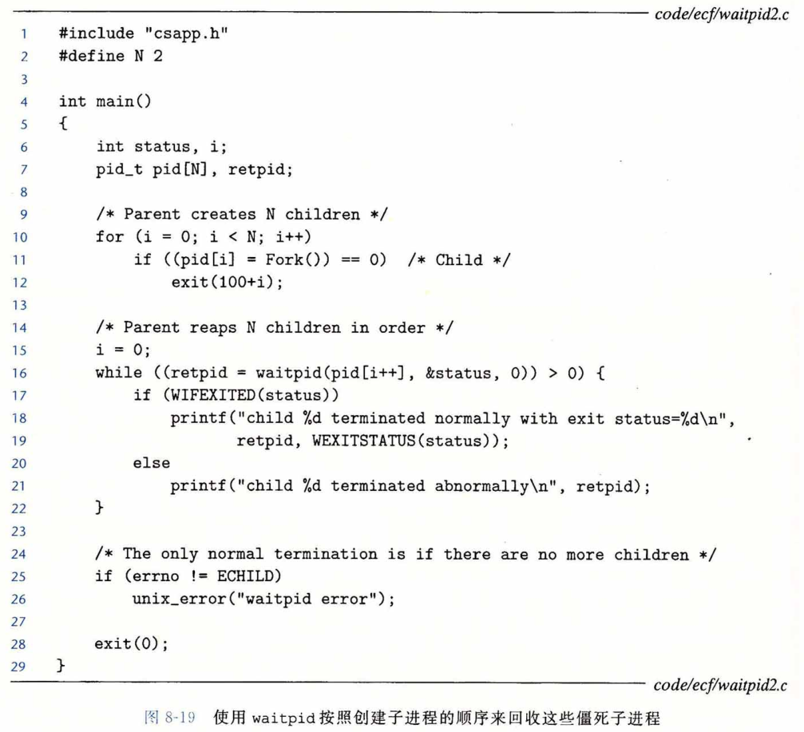

## 进程控制

​		Unix 提供了大量从 C 程序中操作进程的系统调用。这一节将描述这些重要的函数， 并举例说明如何使用它们。

### 获取进程ID

​		每个进程都有一个唯一的正数（非零）进程 ID (PID)。getpid 函数返回调用进程的 PID 。 getppid 函数返回它的父进程的 PID(创建调用进程的进程)。

​		getpid 和 getppid 函数返固一个类型为 pid_t 的整数值，在 Linux 系统上它在 types.h 中被定义为 int 。

### 创建和终止进程

​		从程序员的角度，我们可以认为进程总是处于下面三种状态之一：

- **运行**。进程要么在 CPU 上执行，要么在等待被执行且最终会被内核调度。
- **停止**。进程的执行被**挂起（suspended）**，且不会被调度。当收到 SIGSTOP、SIGTSTP、SIGTTIN 或者 SIGTTOU 信号时，进程就停止，并且保持停止直到它收到—个 SIGCONT 信号，在这个时刻，进程再次开始运行。（信号是一种软件中断的形式，将在8. 5节中详细描述。）
- **终止**。进程永远地停止了。进程会因为三种原因终止：1)收到一个信号，该信号的 默认行为是终止进程，2)从主程序返回，3)调用 exit 函数，

​		exit 函数以 status 退出状态来终止进程（另一种设置退出状态的方法是从主程序中返回一个整数值）。
​		**父进程**通过调用 fork 函数创建一个新的运行的**子进程**。

​		新创建的子进程<u>几乎但不完全</u>与父进程相同。子进程得到与父进程用户级虚拟地址空间相同的(但是独立的)一份副本，包括代码和数据段、堆、共享库以及用户栈。子进程还获得与父进程任何打开文件描述符相同的副本，这就意味着当父进程调用 fork 时，子进程可以读写父进程中打开的任何文件。父进程和新创建的子进程之间最大的区别在于它们有不同的 PID 。

​		fork 函数是有趣的（也常常令人迷惑），因为它只被调用一次，却会返回两次：一次是在调用进程（父进程）中，一次是在新创建的子进程中。在父进程中，fork 返回子进程的 PID 。在子进程中， fork 返回 0 。因为子进程的 PID 总是为非零，返回值就提供一个明确的方法来分辨程序是在父进程还是在子进程中执行。

​		图8-15展示了一个使用 fork 创建子进程的父进程的示例。当 fork 调用在第 6 行返回时，在父进程和子进程中 x 的值都为 1 。子进程在第 8 行加一并输出它的 x 的副本。相似地，父进程在第 13 行减一并输出它的 x 的副本。

当在Unix系统上运行这个程序时，我们得到下面的结果：
			linux> ./fork 
			parent: x=0
			child : x=2
这个简单的例子有一些微妙的方面。

- **调用一次，返回两次**。fork 函数被父进程调用一次，但是却返回两次—— 一次是返回到父进程，一次是返回到新创建的子进程。对于只创建一个子进程的程序来说，这还是相当简单直接的。但是具有多个 fork 实例的程序可能就会令人迷惑， 需要仔细地推敲了。
- **并发执行**。父进程和子进程是并发运行的独立进程。内核能够以任意方式交替执行它们的逻辑控制流中的栺令。在我们的系统上运行这个程序时，父进程先完成它的 printf 语句，然后是子进程。然而，在另一个系统上可能正好相反。一般而言，作为程序员，我们决不能对不同进程中指令的交替执行做任何假设。
- **相同但是独立的地址空间**。如果能够在 fork 函数在父进程和子进程中返回后立即暂停这两个进程，我们会看到两个进程的地址空间都是相同的。每个进程有相同的用户栈、相同的本地变量值、相同的堆、相同的全局变量值，以及相同的代码。因此，在我们的示例程序中，当 fork 函数在第 6 行返回时，本地变量 x 在父进程和 子进程中都为 1 。然而，因为父进程和子进程是独立的进程，它们都有自己的私有地址空间。后面，父进程和子进程对 x 所做的任何改变都是独立的，不会反映在另—个进程的内存中。这就是为什么当父进程和子进程调用它们各自的 printf 语句时，它们中的变量 x 会有不同的值。
- **共享文件**。当运行这个示例程序时，我们注意到父进程和子进程都把它们的输出显示在屏幕上。原因是子进程继承了父进程所有的打开文件。当父进程调用 fork 时， stdout 文件是打开的，并指向屏幕。子进程继承了这个文件，因此它的输出也是指向屏幕的。

​        如果你是第一次学习 fork 函数，画进程图通常会有所帮助，进程图是刻画程序语句的偏序的一种简单的前趋图。每个顶点 a 对应于一条程序语句的执行。有向边  a→b 表示语句 a 发生在语句 b 之前。边上可以标记出一些信息，例如一个变量的当前值。对应于 printf 语句的顶点可以标记上 printf 的输出。每张图从一个顶点开始，对应于调用 main 的父进程。 这个顶点没有入边，并且只有一个出边。每个进程的顶点序列结束于一个对应于 exit 调用的顶点。这个顶点只有一条入边，没有出边。

​		例如，图8-16展示了图8-15中示例程序的进程图。初始时，父进程将变量 x 设置为 1 。父进程调用 fork，创建一个子进程，它 在自己的私有地址空间中与父进程并发执行。 

		对于运行在单处理器上的程序，对应进程图中所有顶点的**拓扑排序（topological sort）**表示程序中语句的一个可行的全序排列。
		下面是一个理解拓扑排序概念的简单方法：给定进程图中顶点的一个排列，把顶点序列从左到右写成一行，然后画出每条有向边。排列是一个拓扑排序，当且仅当画出的每条边的方向都是从左往右的。因此，在图 8-15 的示例程序中，父进程和子进程的 printf 语句可以以任意先后顺序执行，因为每种顺序都对应于图顶点的某种拓扑排序。

​		进程图特别有助于理解带有嵌套 fork 调用的程序。例如，图 8-17 中的程序源码中两次调用了 fork 。对应的进程图可帮助我们看清这个程序运行了四个进程，每个都调用了 一次 printf，这些 printf 可以以任意顺序执行。

### 回收子进程

​		当一个进程由于某种原因终止时，内核并不是立即把它从系统中清除。相反，进程被保持在一种已终止的状态中，直到被它的父进程**回收（reaped）**。当父进程回收已终止的子进程时，内核将子进程的退出状态传递给父进程，然后拋弃已终止的进程，从此时开始， 该进程就不存在了。一个终止了但还未被回收的进程称为**僵死进程（zombie）**。

​		如果一个父进程终止了，内核会安排 init 进程成为它的孤儿进程的养父。init 进程的 PID 为 1，是在系统启动时由内核创建的，它不会终止，是所有进程的祖先。如果父进程没有回收它的僵死子进程就终止了，那么内核会安排 init 进程去回收它们。不过，长时间运行的程序，比如 shell 或者服务器，总是应该回收它们的僵死子进程。即使僵死子进程没有运行，它们仍然消耗系统的内存资源。

​		—个进程可以通过调用 waitpid 函数来等待它的子进程终止或者停止。

​		waitpid 函数有点复杂。默认情况下（当 options = 0 时），waitpid 挂起调用进程的执行，直到它的**等待集合(wait set)**中的一个子进程终止。如果等待集合中的一个进程在刚调用的时刻就已经终止了，那么 waitpid 就立即返回。在这两种情况中，waitpid 返回导致 waitpid 返回的已终止子进程的 PID 。此时，已终止的子进程已经被回收，内核会从系统中删除掉它的所有痕迹。

##### 1.判定等待集合的成员

​		等待集合的成员是由参数 pid 来确定的：

- 如果 pid > 0 ,那么等待集合就是一个单独的子进程，它的进程 ID 等于 pid 。
- 如果 pid = -1 ，那么等待集合就是由父进程所有的子进程组成的。

waitpid 函数还支持其他类型的等待集合，包括 Unix 进程组，对此我们将不做讨论。

##### 2.修改默认行为

​		可以通过将 options 设置为常量 WNOHANG、WUNTRACED 和 WCONTINUED 的各种组合来修改默认行为：

* **WNOHANG**：如果等待集合中的任何子进程都还没有终止，那么就立即返回（返回值为0)。默认的行为是挂起调用进程，直到有子进程终止。在等待子进程终止的同时，如果还想做些有用的工作，这个选项会有用。
* **WUNTRACED**：挂起调用进程的执行，直到等待集合中的一个进程变成已终止或者被停止。返回的 PID 为导致返回的已终止或被停止子进程的 PID 。默认的行为是只返回已终止的子进程。当你想要检查已终止和被停止的子进程时，这个选项会有用。
* **WCONTINUED**：挂起调用进程的执行，直到等待集合中一个正在运行的进程终止或等待集合中一个被停止的进程收到 SIGCONT 信号重新开始执行。（8. 5节会解释 这些信号。）

可以用或运算把这些选项组合起来。例如：

* **WNOHANG | WUNTRACED**:立即返回，如果等待集合中的子进程都没有被停止或终止，则返回值为 0 ;如果有一个停止或终止，则返回值为该子进程的 PID 。

##### 3.检查已回收子进程的退出状态

​		如果 statusp 参数是非空的，那么 waitpid 就会在 status 中放上关于导致返回的子进程的状态信息，status是 statusp 指向的值。wait.h 头文件定义了解释 status 参数的几个宏：

- **WIFEXITED**(status):如果子进程通过调用exit或者一个返回（return)正常终 止，就返回真。
- **WEXITSTATUS**(status):返回一个正常终止的子进程的退出状态。只有在 WIFEXITEDO返回为真时，才会定义这个状态。
- **WIFSIGNALED**(status):如果子进程是因为一个未被捕获的信号终止的，那么 就返回真。
- **WTERMSIG**(status):返回导致子进程终止的信号的编号。只有在WIFSIG-NALEDO返回为真时，才定义这个状态。
- **WIFSTOPPED**(status):如果引起返回的子进程当前是停止的，那么就返回真。
- **WSTOPSIG**(status):返回引起子进程停止的信号的编号。只有在 WIFSTOPPEDO 返回为真时，才定义这个状态。
- **WlFCONTINUED**(status):如果子进程收到 SIGCONT 信号重新启动，则返回真。

##### 4.错误条件

​		如果调用进程没有子进程，那么 waitpid 返回 -1，并且设置 errno 为 ECHILD。如 果 waitpid 函数被一个信号中断，那么它返回 -1，并设置 errno 为 EINT R。

##### 5.wait函数

​		wait 函数是 waitpid 函数的简单版本：

调用 wait (&status) 等价于调用 waitpid (- 1, &status, 0)。

##### 6.使用waitpid的示例

​		因为 waitpid 函数有些复杂，看几个例子会有所帮助。图8-18展示了一个程序，它使用 waitpid，不按照特定的顺序等待它的所有 N 个子进程终止。在第 11 行，父进程创建 N个子进程，在第 12 行，每个子进程以一个唯一的退出状态退出。在我们继续讲解之前，请确认你已经理解为什么每个子进程会执行第 12 行，而父进程不会。

​		在第 15 行，父进程用 waitpid 作为 while 循环的测试条件，等待它所有的子进程终止。因为第一个参数是    -1，所以对 waitpid 的调用会阻塞，直到任意一个子进程终止。 在每个子进程终止时，对 waitpid 的调用会返回，返回值为该子进程的非零的 pia 第 16 行检查子进程的退出状态。如果子进程是正常终止的——在此是以调用exit 函数终止 的——那么父进程就提取出退出状态，把它输出到 stdout 上。

​		当回收了所有的子进程之后，再调用 waitpid 就返回  -1 ，并且设置 errno 为 ECHILD 。第 24 行检查 waitpid 函数是正常终止的，否则就输出一个错误消息。在我们的 Linux 系统上运行这个程序时，它产生如下输出：

​		linux> ./waitpidl
​		child  22966  terminated  normally  with  exit  status = 100 
​		child  22967  terminated  normally  with  exit  status = 101

​		注意，程序不会按照特定的顺序回收子进程。子进程回收的顺序是这台特定的计算机系统的属性。在另一个系统上，甚至在同一个系统上再执行一次，两个子进程都可能以相反的顺序被回收。这是非确定性行为的一个示例，这种非确定性行为使得对并发进行推理非常困难。两种可能的结果都同样是正确的，作为一个程序员，你绝不可以假设总是会出现某一个结果，无论多么不可能出现另一个结果。唯一正确的假设是每一个可能的结果都同样可能出现。

​		图8-19展示了一个简单的改变，它消除了这种不确定性，按照父进程创建子进程的相同顺序来回收这些子进程。在第 11 行中，父进程按照顺序存储了它的子进程的 PID，然后通过用适当的 PID 作为第一个参数来调用 waitpid ，按照同样的顺序来等待每个子进程。

### 让进程休眠

​		sleep 函数将一个进程挂起一段指定的时间。

​		如果请求的时间量已经到了，sleep 返回 0，否则返回还剩下的要休眠的秒数。后一种情况是可能的，如果因为 sleep 函数被一个信号中断而过早地返回。我们将在8. 5节中详细讨论信号。

​		我们会发现另一个很有用的函数是 pause 函数，该函数让调用函数休眠，直到该进程收到一个信号。

### 加载并运行程序

​		execve 函数在当前进程的上下文中加载并运行一个新程序。

​		execve 函数加载并运行可执行目标文件 filename ,且带参数列表 argv 和环境变量列表 envp 。只有当出现错误时，例如找不到 filename ,  execve 才会返回到调用程序。 所以，与 fork —次调用返回两次不同，execve 调用一次并从不返回。

​		参数列表是用图8-20中的数据结构表示的。argv 变量指向一个以 null 结尾的指针数组，其中每个指针都指向一个参数字符串。按照惯例，argv[0] 是<u>可执行目标文件的名字</u>。环境变量的列表是由一个类似的数据结构表示的，如图8-21所示。envp 变量指向一个以 null 结尾的指针数组，其中每个指针指向一个<u>环境变量字符串</u>，每个串都是形如 “ name = value ” 的名字-值对。

​		在 execve 加载了 filename 之后，它调用7. 9节中描述的启动代码。启动代码设置栈，并将控制传递给新程序的主函数，该主函数有如下形式的原型

​			int main(int argc, char ** argv, char ** envp);

或者等价的

​			int main(int argc, char *argv[], char *envp[]);

当 main 开始执行时，用户栈的组织结构如图8-22所示。让我们从栈底（高地址）往栈顶 (低地址）依次看一看。首先是参数和环境字符串。栈往上紧随其后的是以 null 结尾的指针数组，其中每个指针都指向找中的一个环境变量字符串。全局变量 environ 指向这些指针中的第一个 envp[0] 。紧随环境变量数组之后的是以 null 结尾的 argv[ ] 数组，其中每个元素都指向栈中的一个参数字符串。在栈的顶部是系统启动函数 libc_start_main (见 7. 9节）的栈帧。

​		main 函数有 3 个参数：
​				1）argc，它给出 argv[ ] 数组中非空指针的数量，
​				2）argv， 指向 argv[ ] 数组中的第一个条目，
​				3）envp，指向 envp[ ] 数组中的第一个条目。

​		Linux 提供了几个函数来操作环境数组：

​		getenv 函数在环境数组中搜索字符串 “ name = value ” 。如果找到了，它就返回一个指向 value 的指针，否则它就返回 NULL 。

​		如果环境数组包含一个形如 “ name = oldvalue ” 的字符串，那么 unsetenv 会删除它，而 setenv 会用newvalue 代替 oldvalue ，但是只有在 overwirte 非零时才会这样。 如果 name 不存在，那么 setenv 就把 “ name = newvalue ” 添加到数组中。

### 利用 fork 和 execve 运行程序

​		像 Unix shell 和 Web 服务器这样的程序大量使用了 fork 和  execve 函数。shell 是一个交互型的应用级程序，它代表用户运行其他程序。最早的 shell 是 sh 程序，后面出现了一些变种，比如 csh 、tcsh 、ksh 和 bash 。shell 执行一系列的**读/求值（read/evaluate）**步骤，然后终止。读步骤读取来自用户的一个命令行。求值步骤解析命令行，并代表用户运行程序。

​		图8-23展示了一个简单 shell 的 main 例程。shell 打印一个命令行提示符，等待用户在 stdin 上输入命令行，然后对这个命令行求值。

​		图8-24展示了对命令行求值的代码。它的首要任务是调用 parseline 函数(见图8-25)， 这个函数解析了以空格分隔的命令行参数，并构造最终会传递给 execve 的 argv 向量。 第一个参数被假设为要么是一个内置的 shell 命令名，马上就会解释这个命令，要么是一个可执行目标文件，会在一个新的子进程的上下文中加载并运行这个文件。

​		如果最后一个参数是一个 “ & ” 字符，那么 parseline 返回 1 ,表示应该在后台执行该程序（shell 不会等待它完成）。否则，它返回 0 ,表示应该在前台执行这个程序（shell 会等待它完成）。

​		在解析了命令行之后， eval 函数调用 builtin_command 函数，该函数检查第一个命令行参数是否是一个内置的 shell 命令。如果是，它就立即解释这个命令，并返回值 1 。否则返回 0 。简单的 shell 只有一个内置命令—— quit 命令，该命令会终止 shell 。实际使用的 shell 有大量的命令，比如 pwd 、jobs 和 fg 。

​		如果 builtin_command 返回 0 ，那么 shell 创建一个子进程，并在子进程中执行所请求的程序。如果用户要求在后台运行该程序，那么 shell 返回到循环的顶部，等待下一个命令行。否则，shell 使用 waitpid 函数等待作业终止。当作业终止时，shell 就开始下一轮迭代。

​		注意，这个简单的 shell 是有缺陷的，因为它并不回收它的后台子进程。修改这个缺陷就要求使用信号，我们将在下一节中讲述信号。