## 地址翻译

​		这一节讲述的是地址翻译的基础知识。我们的目标是让你了解硬件在支持虚拟内存中的角色，并给出足够多的细节使得你可以亲手演示一些具体的示例。不过，要记住我们省略了大量的细节，尤其是和时序相关的细节，虽然这些细节对硬件设计者来说是非常重要的，但是超出了我们讨论的范围。图9-11概括了我们在这节里将要使用的所有符号，供读者参考。

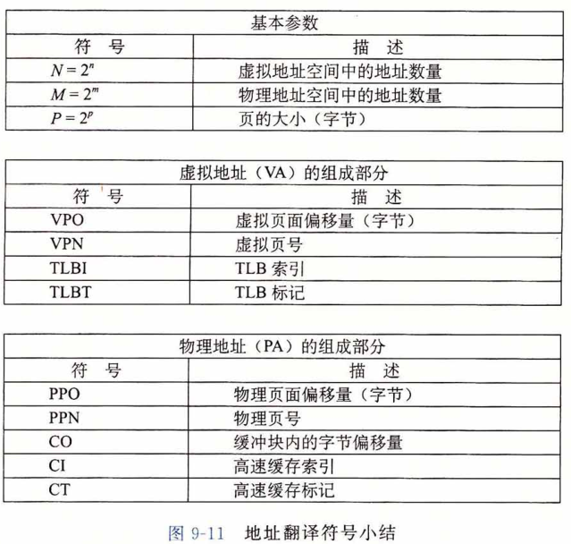

​		形式上来说，地址翻译是一个 N 元素的虚拟地址空间（VAS）中的元素和一个 M 元素的物理地址空间（PAS）中元素之间的映射，

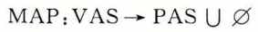

这里

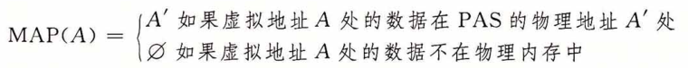

​		图9-12展示了 MMU 如何利用页表来实现这种映射。CPU 中的一个控制寄存器，**页表基址寄存器（Page Table Base Register, PTBR）**指向当前页表。
​		n 位的虚拟地址包含两个部分: —个 p 位的**虚拟页面偏移（Virtual Page Offset，VPO）**和一个（n — p）位的**虚拟页号（Virtual Page Number，VPN）**。MMU 利用 VPN 来选择适当的 PTE 。例如，VPN 0 选择 PTE 0 , VPN 1 选择 PTE 1，以此类推。将页表条目中 **物理页号（Physical Page Number, PPN）** 和虚拟地址中的 VPO 串联起来，就得到相应的物理地址。注意，因为物理和虚拟页面都是 p 字节的，所以**物理页面偏移（Physical Page Offset, PPO）**和 VPO 是相同的。

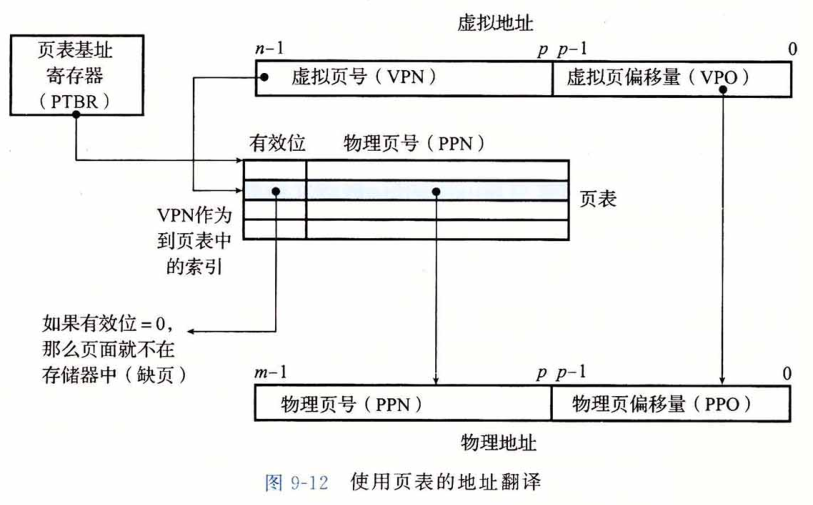

**总结：**

​		现有：			虚拟地址 = 虚拟页号 + 虚拟页偏移；
​								物理地址 = 物理页号 + 物理页偏移  ；

​			又：			物理页号  =  虚拟页号 （有对应关系）；
​								物理页偏移 = 虚拟页偏移（可直接等于）；
​			故：			
​								物理地址 = 虚拟页号(对应) + 虚拟页偏移；

图 9-13a 展示了当页面命中时，CPU 硬件执行的步骤。

* 第1步：处理器生成一个虚拟地址，并把它传送给 MMU 。

* 第2步：MMU 生成 PTE 地址，并从高速缓存/主存请求得到它。

* 第3步：高速缓存/主存向 MMU 返回 PTE 。

* 第4步：MMU 构造物理地址，并把它传送给高速缓存/主存。

* 第5步：高速缓存/主存返回所请求的数据字给处理器。

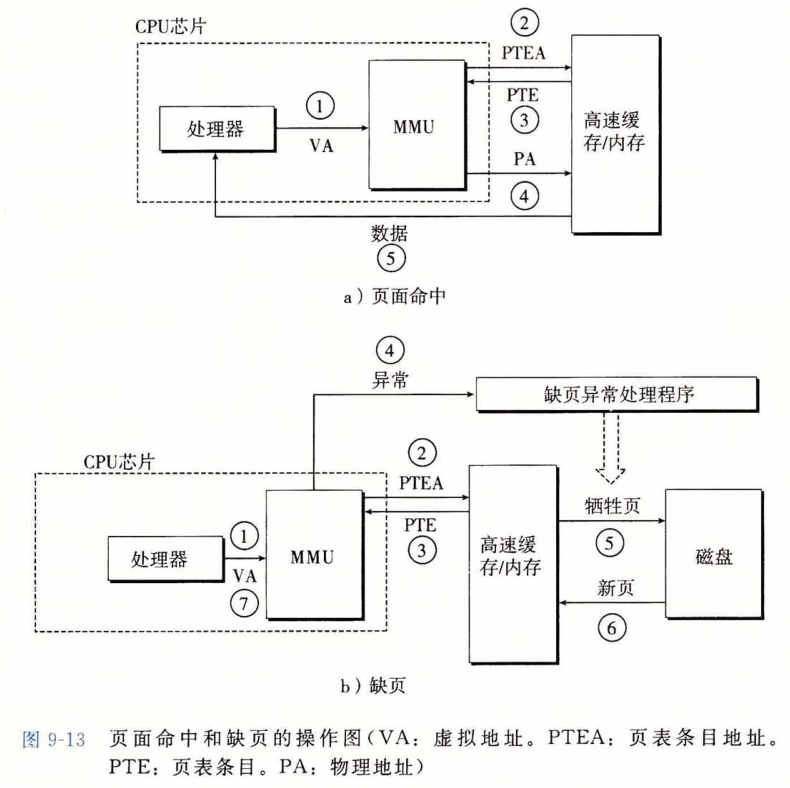

​		页面命中完全是由硬件来处理的，与之不同的是，处理缺页要求硬件和操作系统内核 协作完成，如图9-13 b所示。

* 第 1 步到第 3 步：和图9-13a中的第 1 步到第 3 步相同。

* 第 4 步：PTE 中的有效位是零，所以 MMU 触发了一次异常，传递 CPU 中的控制到操作系统内核中的缺页异常处理程序。

* 第5步：缺页处理程序确定出物理内存中的牺牲页，如果这个页面已经被修改了， 则把它换出到磁盘。

* 第6步：缺页处理程序页面调入新的页面，并更新内存中的 PTE 。

* 第7步：缺页处理程序返回到原来的进程，再次执行导致缺页的指令。CPU 将引起缺页的虚拟地址重新发送给MMU 。因为虚拟页面现在缓存在物理内存中，所以就会命中，在 MMU 执行了图9-13b中的步骤之后，主存就会将所请求字返回给处理器。

### 结合高速缓存和虚拟内存

​		在任何既使用虚拟内存又使用 SRAM 高速缓存的系统中，都有应该使用虚拟地址还是使用物理地址来访问 SRAM 高速缓存的问题。尽管关于这个折中的详细讨论已经超出了我们的讨论范围，但是**大多数系统是选择物理寻址的**。使用物理寻址，多个进程同时在高速缓存中有存储块和共享来自相同虚拟页面的块成为很简单的事情。而且，高速缓存无需处理保护问题，因为访问权限的检查是地址翻译过程的一部分。

​		图 9-14 展示了一个物理寻址的高速缓存如何和虚拟内存结合起来。主要的思路是地址翻译发生在高速缓存查找之前。注意，页表条目可以缓存，就像其他的数据字一样。

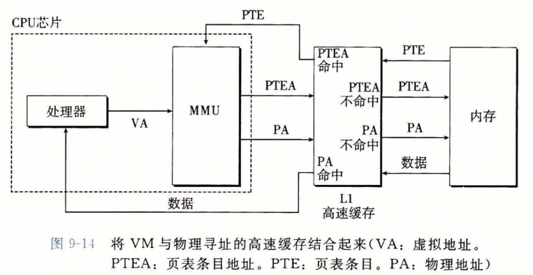

### 利用 TLB 加速地址翻译

​		正如我们看到的，每次 CPU 产生一个虚拟地址，MMU 就必须查阅一个 PTE ,以便将虚拟地址翻译为物理地址。在最糟糕的情况下，这会要求从内存多取一次数据，代价是几十到几百个周期。如果 PTE 碰巧缓存在 L1 中，那么开销就下降到 1 个或 2 个周期。然 而，许多系统都试图消除即使是这样的开销，它们在 MMU 中包括了一个关于 PTE 的小的缓存，称为翻译**后备缓冲器（Translation Lookaside Buffer，TLB）**。

​		TLB 是一个小的、虚拟寻址的缓存，其中每一行都保存着一个由单个 PTE 组成的块。TLB 通常有高度的相联度。如图9-15所示，用于组选择和行匹配的索引和标记字段是从虚拟地址中的虚拟页号中提取出来的。如果 TLB 有了 T = 2^t 个组，那么 **TLB 索引(TLBI)**是由 VPN 的 t 个最低位组成的，而 **TLB标记(TLBT)** 是由 VPN 中剩余的位组成的。

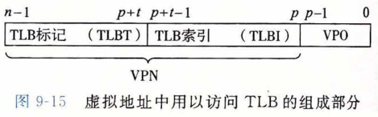

​		图9-16a展示了当 TLB 命中时（通常情况）所包括的步骤。这里的关键点是，所有的地址翻译步骤都是在芯片上的 MMU 中执行的，因此非常快。

* 第 1 步：CPU 产生一个虚拟地址。

* 第 2 步和第 3 步：MMU 从 TLB 中取出相应的 PTE 。

* 第 4 步：MMU 将这个虚拟地址翻译成一个物理地址，并且将它发送到高速缓存/主存。 
* 第 5 步：高速缓存/主存将所请求的数据字返回给 CPU 。

​        当 TLB 不命中时，MMU 必须从 L1 缓存中取出相应的 PTE ，如图9-16b所示。新取出的 PTE 存放在 TLB 中，可能会覆盖一个已经存在的条目。

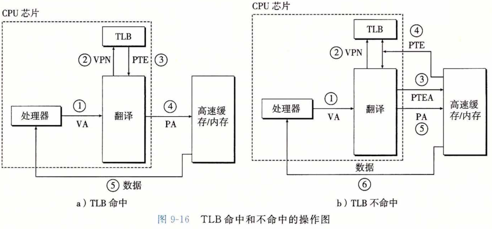

### 多级页表

​		到目前为止，我们一直假设系统只用一个单独的页表来进行地址翻译。但是如果我们有一个 32 位的地址空间、4KB 的页面和一个 4 字节的 PTE，那么即使应用所引用的只是虚拟地址空间中很小的一部分，也总是需要一个 4MB 的页表驻留在内存中。对于地址空间为 64 位的系统来说，问题将变得更复杂。

​		用来压缩页表的常用方法是使用层次结构的页表。用一个具体的示例是最容易理解这个思想的。假设 32 位虚拟地址空间被分为 4KB 的页，而每个页表条目都是 4 字节。还假设在这一时刻，虚拟地址空间有如下形式：内存的前 2K 个页面分配给了代码和数据，接下来的 6K 个页面还未分配，再接下来的 1023 个页面也未分配，接下来的 1 个页面分配给了用户栈。图9-17展示了我们如何为这个虚拟地址空间构造一个两级的页表层次结构。

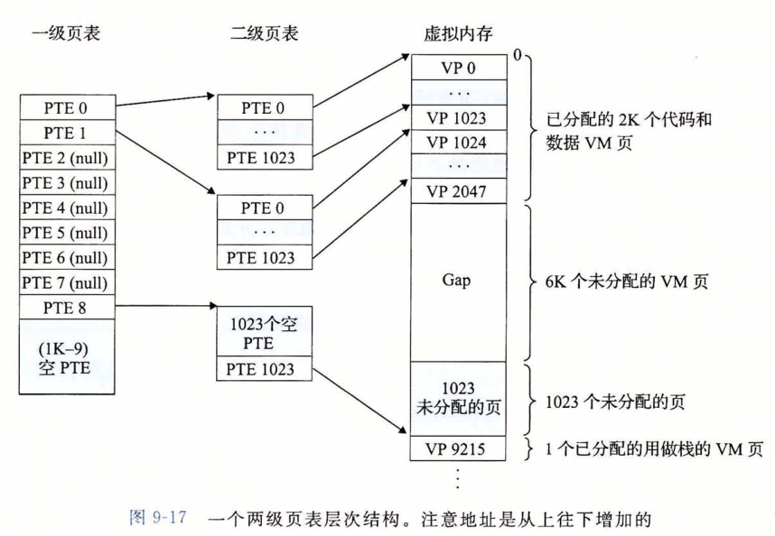

​		—级页表中的每个 PTE 负责映射虚拟地址空间中一个 4MB 的**片（chunk）**，这里每一片都是由 1024 个连续的页面组成的。比如，PTE 0 映射第一片，PTE 1 映射接下来的一片，以此类推。假设地址空间是 4 GB，1024个PTE 已经足够覆盖整个空间了。

​		如果片 i 中的每个页面都未被分配，那么一级 PTE i 就为空。例如，图9-17中，片 2〜7 是未被分配的。然而，如果在片 i 中至少有一个页是分配了的，那么一级 PTE i 就指向一个二级页表的基址。例如，在图9-17中，片 0 、1 和 8 的所有或者部分已被分配，所以它们的一级 PTE 就指向二级页表。

​		二级页表中的每个 PTE 都负责映射一个 4KB 的虚拟内存页面，就像我们查看只有一级的页表一样。注意，使用 4 字节的 PTE ，每个一级和二级页表都是 4KB 字节，这刚好和一个页面的大小是一样的。

​		这种方法从两个方面减少了内存要求。第一，如果一级页表中的一个 PTE 是空的， 那么相应的二级页表就根本不会存在。这代表着一种巨大的潜在节约，因为对于一个典型的程序，4GB 的虚拟地址空间的大部分都会是未分配的。第二，只有一级页表才需要总是在主存中；虚拟内存系统可以在需要时创建、页面调入或调出二级页表，这就减少了主存的压力；只有最经常使用的二级页表才需要缓存在主存中。

​		图9-18描述了使用 k 级页表层次结构的地址翻译。虚拟地址被划分成为 k 个 VPN 和 1 个 VPO 。每个 VPN  i 都是一个到第 i 级页表的索引，其中  1 ≤ i ≤ k 。 第 j 级页表中的每个 PTE，1 ≤ j ≤ k -1，都指向第 j + 1 级的某个页表的基址。第 k 级页表中的每个 PTE 包含某个物理页面的 PPN ，或者一个磁盘块的地址。为了构造物理地址，在能够确定 PPN 之前，MMU 必须访问 k 个 PTE 。对于只有一级的页表结构，PPO 和 VPO 是相同的。

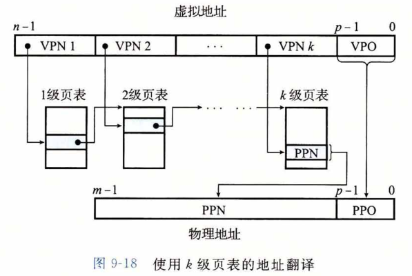

​		访问 k 个 PTE，第一眼看上去昂贵而不切实际。然而，这里 TLB 能够起作用，正是通过将不同层次上页表的PTE 缓存起来。实际上，带多级页表的地址翻译并不比单级页表慢很多。

### 综合：端到端的地址翻译

​		在这一节里，我们通过一个具体的端到端的地址翻译示例，来综合一下我们刚学过的这些内容，这个示例运行在有一个 TLB 和 L1 d-cache 的小系统上。为了保证可管理性， 我们做出如下假设：

* 内存是按字节寻址的。

* 内存访问是针对 1 字节的字的（不是 4 字节的字）。

* 虚拟地址是 14 位长的（n = 14)。

* 物理地址是 12 位长的（m = 12)。

* 页面大小是 64 字节（P = 64)。

* TLB 是四路组相联的，总共有 16 个条目。

* L1  d-cache是物理寻址、直接映射的，行大小为 4 字节，而总共有 16 个组。

​        图9-19展示了虚拟地址和物理地址的格式。因为每个页面是 2^6 = 64 字节，所以虚拟地址和物理地址的低 6 位分别作为 VPO 和 PPO 。虚拟地址的高 8 位作为 VPN 。物理地址的高 6 位作为 PPN 。

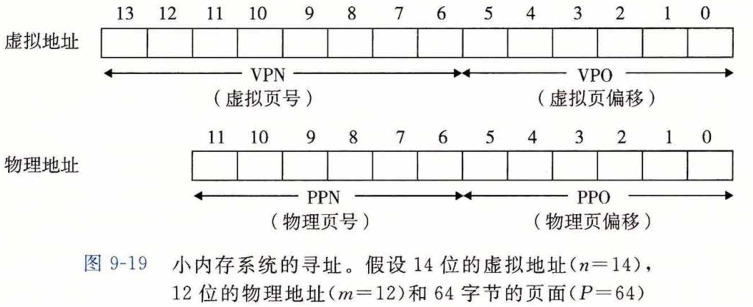

​		图9-20展示了小内存系统的一个快照，包括 TLB (图9-20a)、页表的一部分（图9-20b)和 L1 高速缓存（图9-20c)。在 TLB 和高速缓存的图上面，我们还展示了访问这些设备时硬件是如何划分虚拟地址和物理地址的位的。

* **TLB**。TLB 是利用 VPN 的位进行虚拟寻址的。因为 TLB 有 4 个组，所以 VPN 的低 2 位就作为组索引（TLBI）。VPN 中剩下的高 6 位作为标记（TLBT)，用来区别可能映射到同一个 TLB 组的不同的 VPN 。

* **页表**。这个页表是一个单级设计，一共有 2^8 = 256 个页表条目（PTE)。然而，我们只对这些条目中的开头 16 个感兴趣。为了方便，我们用索引它的 VPN 来标识每个 PTE ;但是要记住这些 VPN 并不是页表的一部分，也不储存在内存中。另外，注意每个无效 PTE 的 PPN 都用一个破折号来表示，以加强一个概念：无论刚好这里存储的是什么位值，都是没有任何意义的。

* **高速缓存**。直接映射的缓存是通过物理地址中的字段来寻址的。因为每个块都是 4 字节，所以物理地址的低 2 位作为块偏移（CO）。因为有 16 组，所以接下来的 4 位就用来表示组索引（CI）。剩下的 6 位作为标记（CT）。

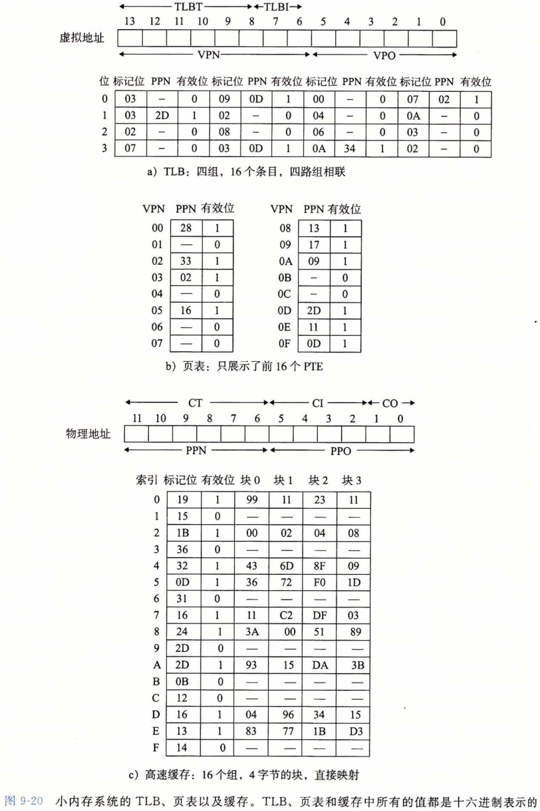

​		

================================================================================

​		给定了这种初始化设定，让我们来看看当 CPU 执行一条读地址 <u>0x03d4</u> 处字节的加载指令时会发生什么。（回想一下我们假定 CPU 读取 1 字节的字，而不是 4 字节的字。）为了开始这种手工的模拟，我们发现写下虚拟地址的各个位，标识出我们会需要的各种字段， 并确定它们的十六进制值，是非常有帮助的。当硬件解码地址时，它也执行相似的任务。

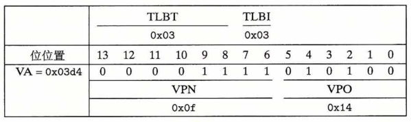

​		开始时，MMU 从虚拟地址中抽取出 VPN (0x0F)，并且检查TLB，看它是否因为前 面的某个内存引用缓存了 PTE OxOF的一个副本。丁LB从VPN中抽取出TLB索引（0x03) 和TLB标记（0x3)，组0x3的第二个条目中有效匹配，所以命中，然后将缓存的PPN (OxOD)返回给 MMU。

​		如果TLB不命中，那么MMU就需要从主存中取出相应的PTE。然而，在这种情况 中，我们很幸运，TLB会命中。现在，MMU有了形成物理地址所需要的所有东西。它通 过将来自PTE的PPN(OxOD)和来自虚拟地址的VPO(0xl4)连接起来，这就形成了物理地 址（0x354)。

​		接下来，MMU发送物理地址给缓存，缓存从物理地址中抽取出缓存偏移CO(OxO)、 缓存组索引CI(0X5)以及缓存标记CT(0x0D)。