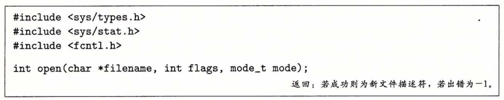
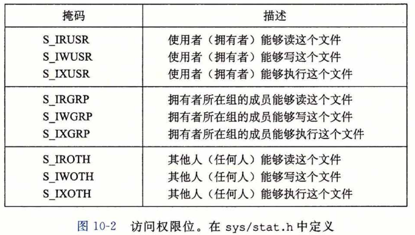
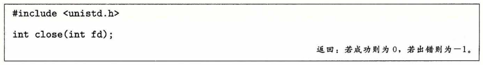

## 打开和关闭文件

​		进程是通过调用 open 函数来打开一个已存在的文件或者创建一个新文件的：

​		open函数将filename转换为一个文件描述符，并且返回描述符数字。返回的描述符总 是在进程中当前没有打开的最小描述符。flags参数指明了进程打算如何访问这个文件：

* O_RDONLY：只读。

* O_WRONLY：只写。

* O_RDWR：可读可写。

​        例如，下面的代码说明如何以读的方式打开一个已存在的文件：

​							`fd = Open("foo.txt", O_RDONLY, 0);`

​        flags 参数也可以是一个或者更多位掩码的或，为写提供给一些额外的指示：

* O_CREAT：如果文件不存在，就创建它的一个**截断的（truncated）**（空）文件。

* O_TRUNC：如果文件已经存在，就截断它。

* O_APPEND：在每次写操作前，设置文件位置到文件的结尾处。

​        例如，下面的代码说明的是如何打开一个已存在文件，并在后面添加一些数据：

​						`fd = Open("foo.txt", O.WRONLY|O.APPEND, 0);`

​		mode 参数指定了新文件的访问权限位。这些位的符号名字如图10-2所示。

​		作为上下文的一部分，每个进程都有一个 umask ，它是通过调用 umask 函数来设置 的。当进程通过带某个 mode 参数的 open 函数调用来创建一个新文件时，文件的访问权限位被设置为 mode &〜umask 。例如，假设我们给定下面的 mode 和 umask 默认值：

\#define DEF.MQDE 		S_IRUSR | S_IWUSR | S_IRGRP | S_IWGRP | S_IROTH | S_IWOTH 
#define DEF.UMASK 	  S.IWGRP | S_IW0TH

​		接下来，下面的代码片段创建一个新文件，文件的拥有者有读写权限，而所有其他的用户都有读权限：

​			umask(DEF_UMASK);
​			fd = Open("foo.txt", O_CREAT|O_TRUNC|O_WR0NLY, DEF_MODE);

​		最后，进程通过调用 close 函数关闭一个打开的文件。

​		关闭一个已关闭的描述符会出错。

​		