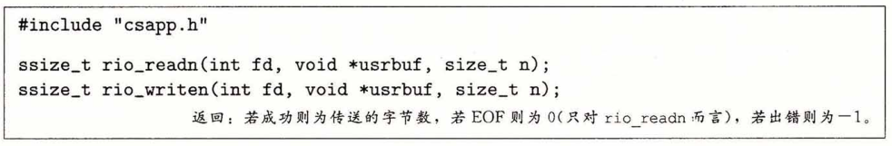
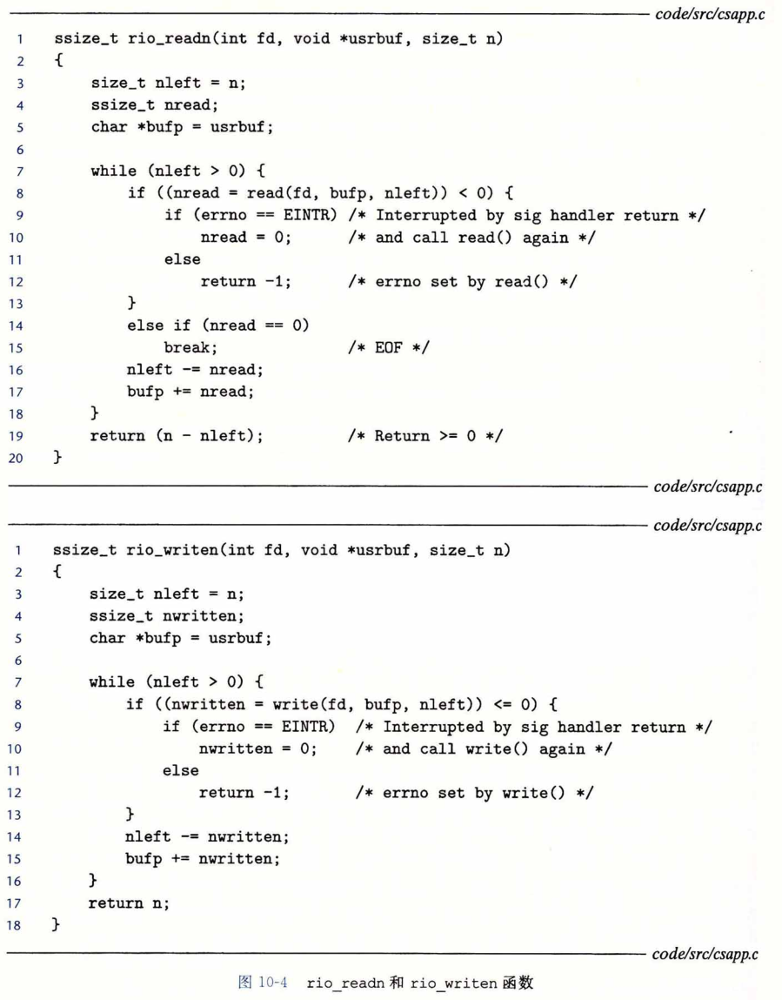
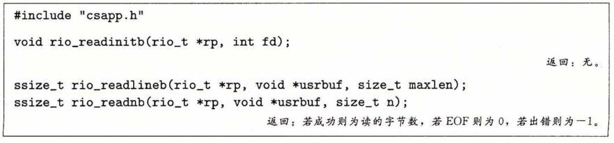

### 用RIO包健壮地读写

​		在这一小节里，我们会讲述一个 I/O 包，称为 **RIO ( Robust I/O,健壮的 I/O )** 包，它会自动为你处理上文中所述的不足值。在像网络程序这样容易出现不足值的应用中，RIO 包提供了方便、健壮和高效的 I/O。RIO 提供了两类不同的函数：

* **无缓冲的输入输出函数**。这些函数直接在内存和文件之间传送数据，没有应用级缓冲。它们对将二进制数据读写到网络和从网络读写二进制数据尤其有用。

* **带缓冲的输入函数**。这些函数允许你高效地从文件中读取文本行和二进制数据，这些文件的内容缓存在应用级缓冲区内，类似于为 printf 这样的标准 I/O 函数提供的缓冲区。与 [110] 中讲述的带缓冲的 I/O 例程不同，带缓冲的 RIO 输入函数是线程安全的（12. 7.1节），它在同一个描述符上可以被交错地调用。例如，你可以从一个描述符中读一些文本行，然后读取一些二进制数据，接着再多读取一些文本行。

​        我们讲述 RIO 例程有两个原因。第一，在接下来的两章中，我们开发的网络应用中使用了它们；第二，通过学习这些例程的代码，你将从总体上对 Unix I/O 有更深入的了解。 

#### RIO 的无缓冲的输入输出函数

​		通过调用 rio_readn 和 rio_writen 函数，应用程序可以在内存和文件之间直接传送数据。

​		rio_readn 函数从描述符 fd 的当前文件位置最多传送 n 个字节到内存位置 usrbuf 。 类似地，rio_writen 函数从位置 usrbuf 传送 n 个字节到描述符 fd 。rio_read 函数在遇到 EOF 时只能返回一个不足值。rio_writen 函数决不会返回不足值。对同一个描述符， 可以任意交错地调用 rio_readn 和 rio_writen 。

​		图 10-4 显示了 rio_readn 和 rio_writen 的代码。注意，如果 rio_readn 和 rio_writen 函数被一个从应用信号处理程序的返回中断，那么每个函数都会手动地重启 read 和 write 。为了尽可能有较好的可移植性，我们允许被中断的系统调用，且在必要时重启它们。

### RIO的带缓冲的输入函数

​		假设我们要编写一个程序来计算文本文件中文本行的数量，该如何来实现呢？ 一种方法就是用 read 函数来一次一个字节地从文件传送到用户内存，检查每个字节来查找换行符。这个方法的缺点是效率不是很高，每读取文件中的一个字节都要求陷入内核。

​		—种更好的方法是调用一个包装函数（rio_readlineb）,它从一个内部读 **缓冲区** 复制一个文本行，当缓冲区变空时，会自动地调用read重新填满缓冲区。对于既包含文本行也包含二 进制数据的文件(例如11. 5. 3节中描述的HTTP响应），我们也提供了一个ri〇_readn带缓冲 区的版本，叫做rio readnb，它从和rio_readlineb—样的读缓冲区中传送原始字节。

​		每打开一个描述符，都会调用一次rio_readinitb函数。它将描述符fd和地址rp 处的一个类型为rio_t的读缓冲区联系起来。

​		rio_readlineb函数从文件rp读出下一个文本行（包括结尾的换行符），将它复制到 内存位置usrbuf，并且用NULL(零）字符来结束这个文本行。rio_readlineb函数最多 读maxlen-1个字节，余下的一个字符留给结尾的NUI丄字符。超过maxlen-1字节的文