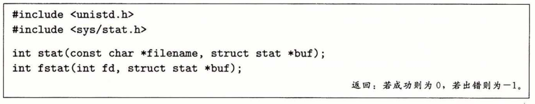
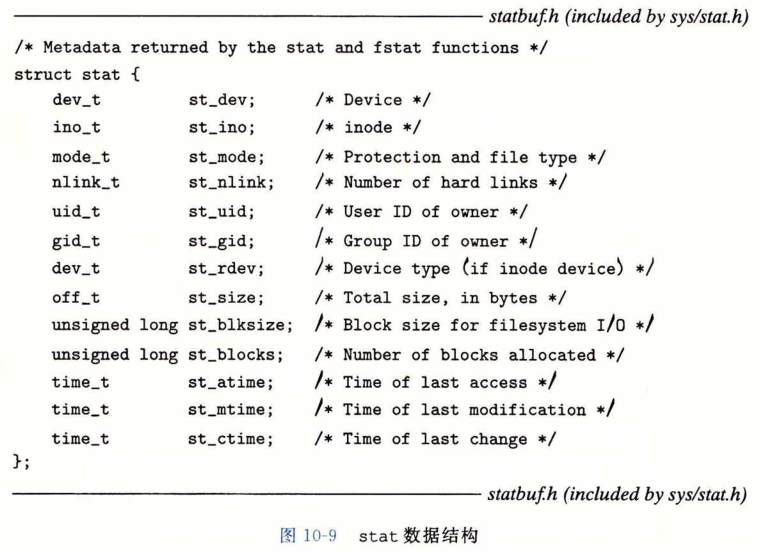
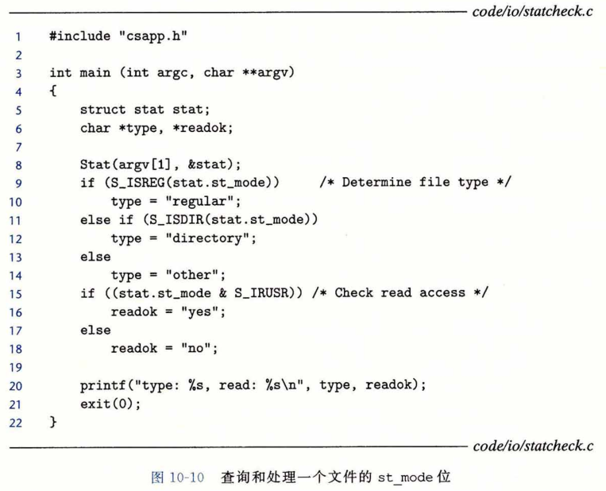

### 读取文件元数据

​		应用程序能够通过调用 stat 和 fstat 函数，检索到关于文件的信息（有时也称为文件的**元数据（metadata）**）。

​		stat 函数以一个文件名作为输入，并填写如图10~9所示的一个 stat 数据结构中的各个成员。fstat 函数是相似的，只不过是以文件描述符而不是文件名作为输入。当我们在11.5节中讨论 Web 服务器时，会需要 stat 数据结构中的 st_mode 和 st_size 成员， 其他成员则不在我们的讨论之列。

​		st_size 成员包含了文件的字节数大小。
​		st_mode 成员则编码了文件访问许可位（图10-2）和文件类型（10.2节）。
​		Linux 在 sys/stat.h 中定义了宏谓词来确定 st_mode 成员的文件类型：

​		S_ISREG(m)。这是一个普通文件吗？

​		S_ISDIR(m)。这是一个目录文件吗？

​		S_lSSOCK(m)。这是一个网络套接字吗？

​		图10-10展示了我们会如何使用这些宏和 stat 函数来读取和解释一个文件的 st_mode 位。

​		