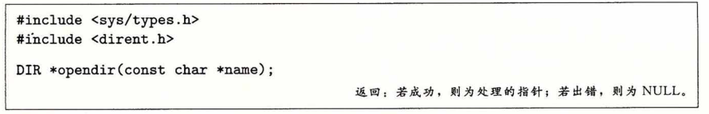
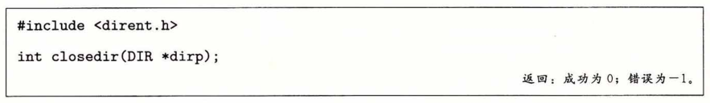
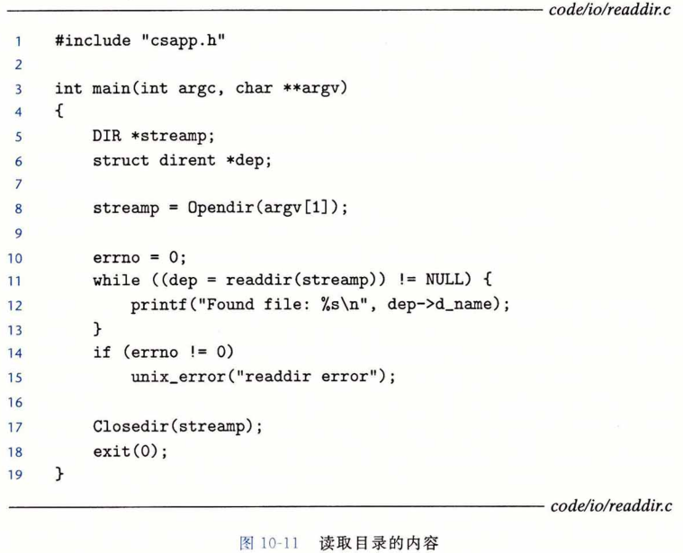

## 读取目录内容

​		应用程序可以用 readdir 系列函数来读取目录的内容。



​		函数 opendir 以路径名为参数，返回指向**目录流（directory stream）**的指针。流是对条目有序列表的抽象，在这里是指目录项的列表。


​		每次对 readdir 的调用返回的都是指向流 dirp 中下一个目录项的指针，或者，如果没有更多目录项则返回 NULL 。每个目录项都是一个结构，其形式如下：

```c
struct dirent {

	ino_t d_ino;  /* inode number */

	char d_name[256]; /* Filename */

}；
```


​		虽然有些 Linux 版本包含了其他的结构成员，但是只有这两个对所有系统来说都是标准的。成员 d_name 是文件名，d_ino 是文件位置。

​		如果出错，则 readdir 返回 NULL ，并设置 errno 。可惜的是，唯一能区分错误和流结束情况的方法是检查自调用 readdir 以来 errno 是否被修改过。



​		函数 closedir 关闭流并释放其所有的资源。图10-11展示了怎样用 readdir 来读取目录的内容。

