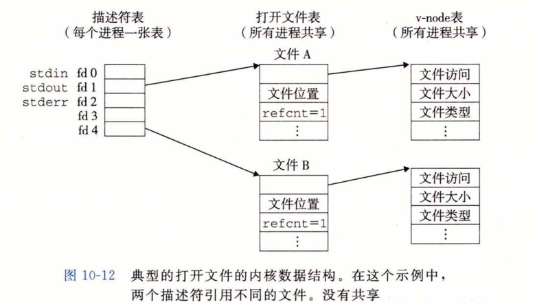

## 共享文件

​		可以用许多不同的方式来共享 Linux 文件。除非你很清楚内核是如何表示打开的文件，否则文件共享的概念相当难懂。内核用三个相关的数据结构来表示打开的文件：

* **描述符表（descriptor table）**。**每个进程都有它独立的描述符表**，它的表项是由进程打开的文件描述符来索引的。每个打开的描述符表项指向文件表中的一个表项。

* **文件表(file table)**。打开文件的集合是由一张文件表来表示的，**所有的进程共享这张表**。每个文件表的表项组成（针对我们的目的）包括当前的文件位置、**引用计数 (reference count)**(即当前指向该表项的描述符表项数），以及一个指向 v-node 表中对应表项的指针。关闭一个描述符会减少相应的文件表表项中的引用计数。内核不会删除这个文件表表项，直到它的引用计数为零。

* **v-node表(v-node table)**。同文件表一样，**所有的进程共享这张 v-node 表**。每个表项包含 stat 结构中的大多数信息，包括 st_mode 和 st_size 成员。

​        图10-12展示了一个示例，其中描述符 1 和 4 通过不同的打开文件表表项来引用两个 不同的文件。这是一种典型的情况，没有共享文件，并且每个描述符对应一个不同的文件。

​		如图10-13所示，多个描述符也可以通过不同的文件表表项来引用同一个文件。例如，如果以同一个 filename 调用 open 函数两次，就会发生这种情况。关键思想是每个描述符都有它自己的文件位置，所以对不同描述符的读操作可以从文件的不同位置获取数据。

​		我们也能理解父子进程是如何共享文件的。假设在调用 fork 之前，父进程有如图10-12 所示的打开文件。然后，图10-14展示了调用 fork 后的情况。子进程有一个父进程描述符表的副本。父子进程共享相同的打开文件表集合，因此共享相同的文件位置。一个很重要的结果就是，<u>在内核删除相应文件表表项之前，父子进程必须都关闭了它们的描述符。</u>

</u>