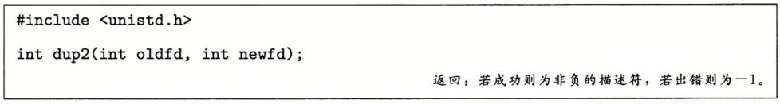
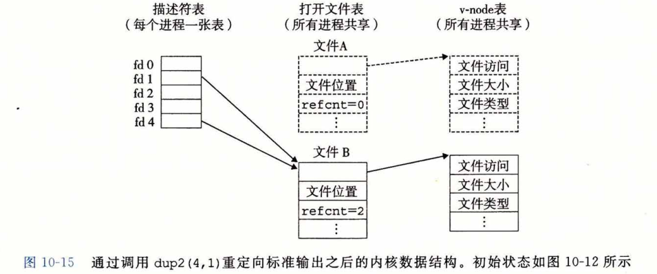

## I/O重定向

​		Lmux shell 提供了 **I/O 重定向**操作符，允许用户将磁盘文件和标准输入输出联系起 来。例如，键入

​					`linux>  ls > foo.txt`

使得 shell 加载和执行 Is 程序，将标准输出重定向到磁盘文件 foo.txt 。就如我们将在 11.5 节中看到的那样，当一个 Web 服务器代表客户端运行 CGI 程序时，它就执行一种相似类型的重定向。那么 I/O 重定向是如何工作的呢？ 一种方式是使用 dup2 函数。

​		dup2 函数复制描述符表表项 oldfd 到描述符表表项 newfd ，覆盖描述符表表项 newfd 以前的内容。如果 newfd 已经打开了，dup2 会在复制 oldfd 之前关闭 newfd 。

​		假设在调用 dup2(4,1) 之前，我们的状态如图10-12所示，其中描述符 1（标准输出） 对应于文件 A （比如一个终端），描述符 4 对应于文件 B （比如一个磁盘文件）。 A 和 B 的引用计数都等于 1 。图10-15显示了调用dup2（4,1）之后的情况。两个描述符现在都指向文件 B；文件 A 已经被关闭了，并且它的文件表和 v-node 表表项也已经被删除了；文件 B 的引用计数已经增加了。从此以后，任何写到标准输出的数据都被重定向到文件 B 。

