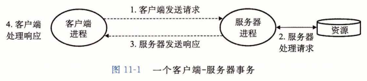

## 客户端-服务器编程模型 

​		每个网络应用都是基于**客户端-服务器模型**的。采用这个模型，一个应用是由一个服务器进程和一个或者多个客户端进程组成。服务器管理某种资源，并且通过操作这种资源来为它的客户端提供某种服务。例如，一个 Web 服务器管理着一组磁盘文件，它会代表客户端进行检索和执行。一个 FTP 服务器管理着一组磁盘文件，它会为客户端进行存储和检索。相似地，一个电子邮件服务器管理着一些文件，它为客户端进行读和更新。

​		客户端-服务器模型中的基本操作是**事务（transaction）**(见图11-1)。一个客户端-服务器事务由以下四步组成。

1. 当一个客户端需要服务时，它向服务器发送一个请求，发起一个事务。例如，当 Web 浏览器需要一个文件时，它就发送一个请求给 Web 服务器。

2. 服务器收到请求后，解释它，并以适当的方式操作它的资源。例如，当 Web 服务器收到浏览器发出的请求后，它就读一个磁盘文件。

3. 服务器给客户端发送一个响应，并等待下一个请求。例如，Web 服务器将文件发送回客户端。

4. 客户端收到响应并处理它。例如，当 Web 浏览器收到来自服务器的一页后，就在屏幕上显示此页。

​		认识到客户端和服务器是进程，而不是常提到的机器或者主机，这是很重要的。一台主机可以同时运行许多不同的客户端和服务器，而且一个客户端和服务器的事务可以在同一台或是不同的主机上。无论客户端和服务器是怎样映射到主机上的，客户端-服务器模型都是相同的。

