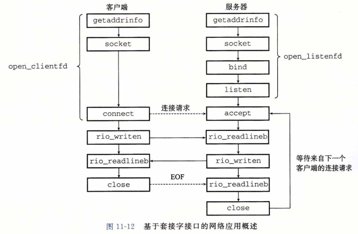
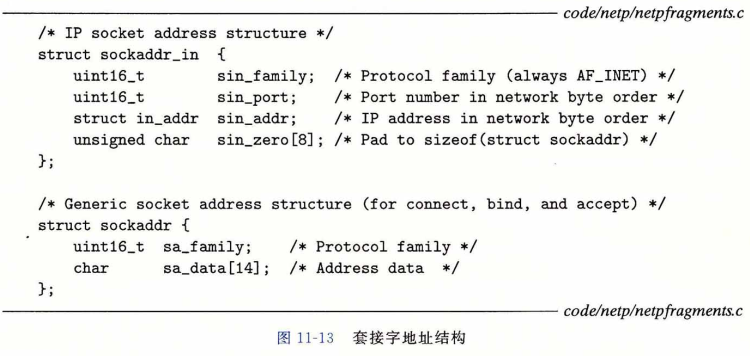
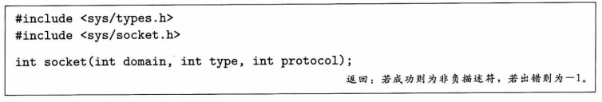
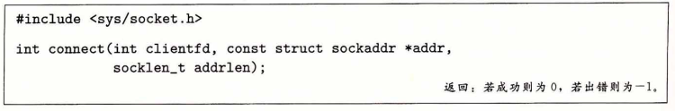
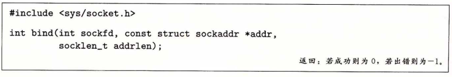
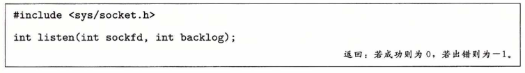
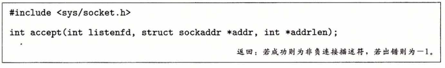
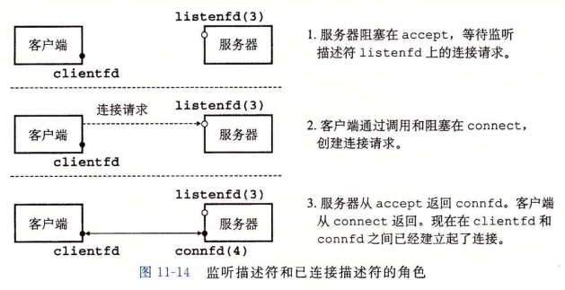
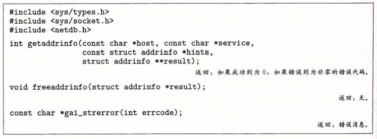

## 套接字接口

​		**套接字接口（socket interface）**是一组函数，它们和 Unix  I/O 函数结合起来，用以创建网络应用。大多数现代系统上都实现套接字接口，包括所有的 Unix 变种、Windows 和 Macintosh 系统。图11-12给出了一个典型的客户端-服务器事务的上下文中的套接字接口概述。当讨论各个函数时，你可以使用这张图来作为向导图。

### 套接字地址结构

​		从 Linux 内核的角度来看，一个套接字就是通信的一个端点。从 Linux 程序的角度来看，套接字就是一个有相应描述符的打开文件。

​		因特网的套接字地址存放在如图11-13所示的类型为 sockaddr_in 的 16 字节结构中。 对于因特网应用，sin_family 成员是 AF_INET ，sin_port 成员是一个 16 位的端口号， 而 sin_addr 成员就是一个 32 位的：IP 地址。 IP 地址和端口号总是以网络字节顺序（大端法）存放的。

​		connect 、bind 和 accept 函数要求一个指向与协议相关的套接字地址结构的指针。 套接字接口的设计者面临的问题是，如何定义这些函数，使之能接受各种类型的套接字地址结构。今天我们可以使用通用的 void* 指针，但是那时在 C 中并不存在这种类型的指针。解决办法是定义套接字函数要求一个指向通用 sockaddr 结构（图11-13)的指针，然后要求应用程序将与协议特定的结构的指针强制转换成这个通用结构。为了简化代码示 例，我们跟随 Steven 的指导，定义下面的类型： 

​			`typedef struct sockaddr SA;`

​		然后无论何时需要将 sockaddr_in 结构强制转换成通用 sockaddr 结构时，我们都使用这个类型。

### socket 函数

​		客户端和服务器使用 socket 函数来创建一个**套接字描述符（socket descriptor)**。

​		如果想要使套接字成为连接的一个端点，就用如下硬编码的参数来调用socket函数：

​			`clientfd = Socket(AF_INET, SOCK_STREAM, 0);`

​		其中，<u>AF_INET 表明我们正在使用 32 位 IP 地址</u>，
​					<u>SOCK_STREAM表示这个套接字是连接的一个端点</u>。

​		不过最好的方法是用 getaddrinfo 函数（11. 4. 7节）来自动生成这些参数，这样代码就与协议无关了。我们会在 11.4. 8 节中向你展示如何配合 socket 函数来使用 getaddrinfo。

​		socket 返回的 clientfd 描述符仅是部分打开的，还不能用于读写。如何完成打开套接字的工作，取决于我们是客户端还是服务器。下一节描述当我们是客户端时如何完成打开套接字的工作。

### connect 函数

​		客户端通过调用 connect 函数来建立和服务器的连接。

​		connect 函数试图与套接字<u>地址为 addr 的服务器</u>建立一个因特网连接，其中 <u>addrlen 是 sizeof (sockaddr_in)</u>。

​		connect 函数会阻塞，一直到连接成功建立或是发生错误。如果成功，clientfd 描述符现在就准备好可以读写了，并且得到的连接是由套接字对 

​			( x : y ,  addr . sin_addr  :  addr . sin_port)

​		刻画的，其中 x 表示客户端的 IP 地址，而 y 表示临时端口，它唯一地确定了客户端主机上的客户端进程。对于 socket ，最好的方法是用 getaddrinfo 来为 connect 提供参数 (见 11.4.8 节）。

### bind 函数

​		剩下的套接字函数—— bind 、listen 和 accept ，服务器用它们来和客户端建立连接。

​		bind 函数告诉内核将 addr 中的服务器套接字地址和套接字描述符 sockfd 联系起来。参数 addrlen 就是 sizeof(sockaddr_in)。

​		对于 socket 和 connect，最好的方法 是用getaddrinfo来为bind提供参数（见11. 4. 8节）。

### listen 函数

​		客户端是发起连接请求的主动实体。服务器是等待来自客户端的连接请求的被动实体。默认情况下，内核会认为 socket 函数创建的描述符对应于**主动套接字（active socket)**， 它存在于一个连接的客户端。服务器调用 listen 函数告诉内核，描述符是被服务器而不是客户端使用的。

​		<u>listen 函数将 sockfd 从一个主动套接字转化为一个**监听套接字（listening socket）**</u>， 该套接字可以接受来自客户端的连接请求。
​		backlog 参数暗示了内核在开始拒绝连接请求之前，队列中要排队的未完成的连接请求的数量。backlog 参数的确切含义要求对 TCP/ IP 协议的理解，这超出了我们讨论的范围。通常我们会把它设置为一个较大的值，比如 1024。

### accept 函数

​		服务器通过调用 accept 函数来等待来自客户端的连接请求。

​		accept 函数等待来自客户端的连接请求到达侦听描述符 listenfd ，然后在 addr 中填写客户端的套接字地址，并返回一个**已连接描述符（connected descriptor)**，这个描述符可被用来利用 Unix I/O 函数与客户端通信。

​		监听描述符和已连接描述符之间的区别使很多人感到迷惑。监听描述符是作为客户端连接请求的一个端点。它通常被创建一次，并存在于服务器的整个生命周期。已连接描述符是客户端和服务器之间已经建立起来了的连接的一个端点。服务器每次接受连接请求时都会创建一次，它只存在于服务器为一个客户端服务的过程中。

​		图11-14描绘了监听描述符和已连接描述符的角色。在第一步中，服务器调用 accept，等待连接请求到达监听描述符，具体地我们设定为描述符 3 。回忆一下，描述符 0〜2 是预留给了标准文件的。

​		在第二步中，客户端调用 connect 函数，发送一个连接请求到 listenfd 。
​		第三步， accept 函数打开了一个新的已连接描述符 connfd (我们假设是描述符 4 )，在 clientfd 和 connfd 之间建立连接，并且随后返回 connfd 给应用程序。客户端也从 connect 返回， 在这一点以后，客户端和服务器就可以分别通过读和写 clientfd 和 connfd 来回传送数据了。

### 主机和服务的转换

​		Linux 提供了一些强大的函数(称为 getaddrinfo 和 getnameinfo )实现二进制套接字地址结构和主机名、主机地址、服务名和端口号的字符串表示之间的相互转化。当和套接字接口一起使用时，这些函数能使我们编写独立于任何特定版本的 IP 协议的网络程序。

##### 1.getaddrinfo 函数

​		getaddrinfo 函数将主机名、主机地址、服务名和端口号的字符串表示转化成套接字地址结构。它是已弃用的 gethostbyname 和 getservbyname 函数的新的替代品。和以前的那些函数不同，这个函数是可重入的（见12. 7.2节），适用于任何协议。

​		给定 host 和 service (套接字地址的两个组成部分），getaddrinfo 返回 result ， result —个指向 addrinfo 结构的链表，其中每个结构指向一个对应于 host 和 service 的套接字地址结构（图11-15)。