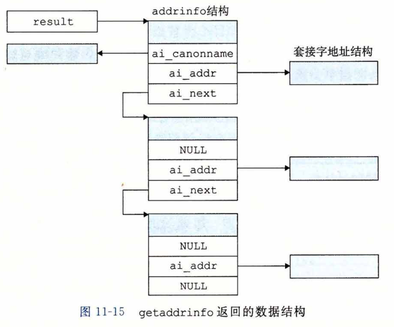
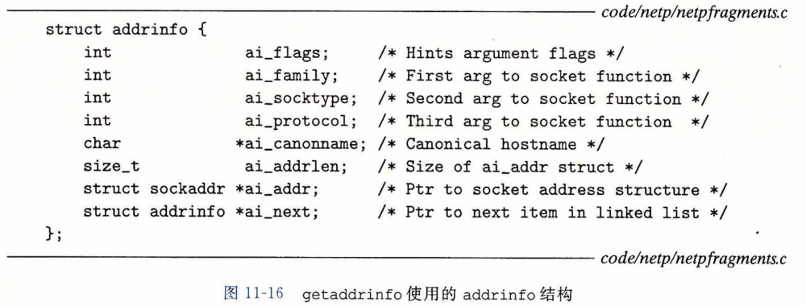
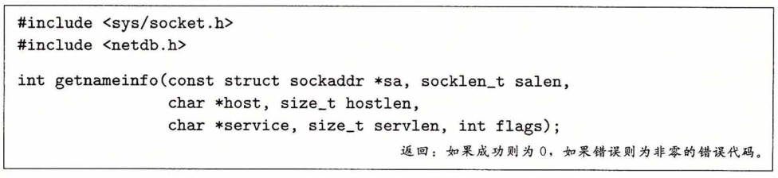
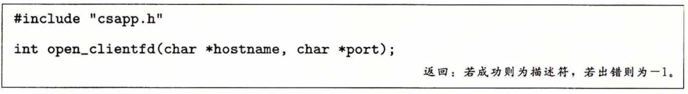

## 套接字接口

​		**套接字接口（socket interface）**是一组函数，它们和 Unix  I/O 函数结合起来，用以创建网络应用。大多数现代系统上都实现套接字接口，包括所有的 Unix 变种、Windows 和 Macintosh 系统。图11-12给出了一个典型的客户端-服务器事务的上下文中的套接字接口概述。当讨论各个函数时，你可以使用这张图来作为向导图。

### 套接字地址结构

​		从 Linux 内核的角度来看，一个套接字就是通信的一个端点。从 Linux 程序的角度来看，套接字就是一个有相应描述符的打开文件。

​		因特网的套接字地址存放在如图11-13所示的类型为 sockaddr_in 的 16 字节结构中。 对于因特网应用，sin_family 成员是 AF_INET ，sin_port 成员是一个 16 位的端口号， 而 sin_addr 成员就是一个 32 位的：IP 地址。 IP 地址和端口号总是以网络字节顺序（大端法）存放的。

​		connect 、bind 和 accept 函数要求一个指向与协议相关的套接字地址结构的指针。 套接字接口的设计者面临的问题是，如何定义这些函数，使之能接受各种类型的套接字地址结构。今天我们可以使用通用的 void* 指针，但是那时在 C 中并不存在这种类型的指针。解决办法是定义套接字函数要求一个指向通用 sockaddr 结构（图11-13)的指针，然后要求应用程序将与协议特定的结构的指针强制转换成这个通用结构。为了简化代码示 例，我们跟随 Steven 的指导，定义下面的类型： 

​			`typedef struct sockaddr SA;`

​		然后无论何时需要将 sockaddr_in 结构强制转换成通用 sockaddr 结构时，我们都使用这个类型。

### socket 函数

​		客户端和服务器使用 socket 函数来创建一个**套接字描述符（socket descriptor)**。

​		如果想要使套接字成为连接的一个端点，就用如下硬编码的参数来调用socket函数：

​			`clientfd = Socket(AF_INET, SOCK_STREAM, 0);`

​		其中，<u>AF_INET 表明我们正在使用 32 位 IP 地址</u>，
​					<u>SOCK_STREAM表示这个套接字是连接的一个端点</u>。

​		不过最好的方法是用 getaddrinfo 函数（11. 4. 7节）来自动生成这些参数，这样代码就与协议无关了。我们会在 11.4. 8 节中向你展示如何配合 socket 函数来使用 getaddrinfo。

​		socket 返回的 clientfd 描述符仅是部分打开的，还不能用于读写。如何完成打开套接字的工作，取决于我们是客户端还是服务器。下一节描述当我们是客户端时如何完成打开套接字的工作。

### connect 函数

​		客户端通过调用 connect 函数来建立和服务器的连接。

​		connect 函数试图与套接字<u>地址为 addr 的服务器</u>建立一个因特网连接，其中 <u>addrlen 是 sizeof (sockaddr_in)</u>。

​		connect 函数会阻塞，一直到连接成功建立或是发生错误。如果成功，clientfd 描述符现在就准备好可以读写了，并且得到的连接是由套接字对 

​			( x : y ,  addr . sin_addr  :  addr . sin_port)

​		刻画的，其中 x 表示客户端的 IP 地址，而 y 表示临时端口，它唯一地确定了客户端主机上的客户端进程。对于 socket ，最好的方法是用 getaddrinfo 来为 connect 提供参数 (见 11.4.8 节）。

### bind 函数

​		剩下的套接字函数—— bind 、listen 和 accept ，服务器用它们来和客户端建立连接。

​		bind 函数告诉内核将 addr 中的服务器套接字地址和套接字描述符 sockfd 联系起来。参数 addrlen 就是 sizeof(sockaddr_in)。

​		对于 socket 和 connect，最好的方法 是用getaddrinfo来为bind提供参数（见11. 4. 8节）。

### listen 函数

​		客户端是发起连接请求的主动实体。服务器是等待来自客户端的连接请求的被动实体。默认情况下，内核会认为 socket 函数创建的描述符对应于**主动套接字（active socket)**， 它存在于一个连接的客户端。服务器调用 listen 函数告诉内核，描述符是被服务器而不是客户端使用的。

​		<u>listen 函数将 sockfd 从一个主动套接字转化为一个**监听套接字（listening socket）**</u>， 该套接字可以接受来自客户端的连接请求。
​		backlog 参数暗示了内核在开始拒绝连接请求之前，队列中要排队的未完成的连接请求的数量。backlog 参数的确切含义要求对 TCP/ IP 协议的理解，这超出了我们讨论的范围。通常我们会把它设置为一个较大的值，比如 1024。

### accept 函数

​		服务器通过调用 accept 函数来等待来自客户端的连接请求。

​		accept 函数等待来自客户端的连接请求到达侦听描述符 listenfd ，然后在 addr 中填写客户端的套接字地址，并返回一个**已连接描述符（connected descriptor)**，这个描述符可被用来利用 Unix I/O 函数与客户端通信。

​		监听描述符和已连接描述符之间的区别使很多人感到迷惑。监听描述符是作为客户端连接请求的一个端点。它通常被创建一次，并存在于服务器的整个生命周期。已连接描述符是客户端和服务器之间已经建立起来了的连接的一个端点。服务器每次接受连接请求时都会创建一次，它只存在于服务器为一个客户端服务的过程中。

​		图11-14描绘了监听描述符和已连接描述符的角色。在第一步中，服务器调用 accept，等待连接请求到达监听描述符，具体地我们设定为描述符 3 。回忆一下，描述符 0〜2 是预留给了标准文件的。

​		在第二步中，客户端调用 connect 函数，发送一个连接请求到 listenfd 。
​		第三步， accept 函数打开了一个新的已连接描述符 connfd (我们假设是描述符 4 )，在 clientfd 和 connfd 之间建立连接，并且随后返回 connfd 给应用程序。客户端也从 connect 返回， 在这一点以后，客户端和服务器就可以分别通过读和写 clientfd 和 connfd 来回传送数据了。

### 主机和服务的转换

​		Linux 提供了一些强大的函数(称为 getaddrinfo 和 getnameinfo )实现二进制套接字地址结构和主机名、主机地址、服务名和端口号的字符串表示之间的相互转化。当和套接字接口一起使用时，这些函数能使我们编写独立于任何特定版本的 IP 协议的网络程序。

##### 1.getaddrinfo 函数

​		getaddrinfo 函数将主机名、主机地址、服务名和端口号的字符串表示转化成套接字地址结构。它是已弃用的 gethostbyname 和 getservbyname 函数的新的替代品。和以前的那些函数不同，这个函数是可重入的（见12. 7.2节），适用于任何协议。

​		给定 host 和 service (套接字地址的两个组成部分），getaddrinfo 返回 result ， result —个指向 addrinfo 结构的链表，其中每个结构指向一个对应于 host 和 service 的套接字地址结构（图11-15)。

​		在客户端调用了 getaddrinfo 之后，会遍历这个列表，依次尝试每个套接字地址，直到调用 socket 和 connect 成功，建立起连接。
​		类似地，服务器会尝试遍历列表中的每个套接字地址，直到调用 socket 和 bind 成功，描述符会被绑定到一个合法的套接字地址。为了避免内存泄漏，应用程序必须在最后调用 freeaddrinfo , 释放该链表。如果 getaddrinfo 返回非零的错误代码，应用程序可以调用 gai_streeror，将该代码转换成消息字符串。

​		getaddrinfo 的 
host 参数可以是域名，也可以是数字地址（如点分十进制 IP 地址）。 
service 参数可以是服务名（如http),也可以是十进制端口号。如果不想把主机名转换成地址，可以把 host 设置为NULL。对 service 来说也是一样。但是必须指定两者中至少一个。
可选的参数 hints 是一个 addrinfo 结构（见图11-16)，它提供对 getaddrinfo 返回的套接字地址列表的更好的控制。如果要传递hints参数，只能设置下列字段： ai_family、ai_socktype 、ai_protocol 和 ai_flags 字段。其他字段必须设置为 0 ( 或 NULL ) ; 实际中，我们用 memset 将整个结构清零，然后有选择地设置一些字段：

* getaddrinfo 默认可以返回 IPv4 和 IPv6 套接字地址。ai_family 设置为 AF_INET 会将列表限制为 IPv4 地址；设置为 AF _ INET6 则限制为 IPv6 地址。

* 对于 host 关联的每个地址，getaddrinfo 函数默认最多返回三个 addrinfo 结构， 每个的 ai_socktype 字段不同：一个是连接，一个是数据报（本书未讲述），一个是原始套字（本书未讲述）。ai_socktype 设置为 SOCK_STREAM 将列表限制为对每个地址最多一个 addrinfo 结构，该结构的套接字地址可以作为连接的一个端点。这是所有示例程序所期望的行为。

* ai_flags 字段是一个位掩码，可以进一步修改默认行为。可以把各种值用 OR 组合起来得到该掩码。下面是一些我们认为有用的值：

  ​        AI_ADDRCONFIG。如果在使用连接，就推荐使用这个标志[34]。它要求只有当本地主机被配置为 IPv4 时， getaddrinfo 返回 IPv4 地址。对 IPv6 也是类似。

  ​        AI_CANONNAME。ai_canonname 字段默认为 NULL 。如果设置了该标志， 就是告诉 getaddrinfo 将列表中第一个 addrinfo 结构的 ai_canonname 字段指向 host 的权威（官方）名字（见图11-15)。

  ​        AI_NUMERICSERV。参数 servic e默认可以是服务名或端口号。这个标志强制参数 service 为端口号。

  ​        AI_PASSIVE。getaddrinfo 默认返回套接字地址，客户端可以在调用 connect 时用作主动套接字。这个标志告诉该函数，返回的套接字地址可能被服务器用作监听套接字。在这种情况中，参数 host 应该为 NULL 。得到的套接字地址结构中的地址字段会是**通配符地址（wildcard address）**，告诉内核这个服务器会接受发送到该主机所有 IP 地址的请求。这是所有示例服务器所期望的行为。

​		当 getaddrinfo 创建输出列表中的 addrinfo 结构时，会填写每个字段，除了 ai_ flags 。ai_addr 字段指向一个套接字地址结构，ai_addrlen 字段给出这个套接字地址结构的大小，而 ai_next 字段指向列表中下一个 addrinfo 结构。其他字段描述这个套接字地址的各种属性。

​		getaddrinfo —个很好的方面是 addrinfo 结构中的字段是不透明的，即它们可以直接传递给套接字接口中的函数，应用程序代码无需再做任何处理。例如，ai_family 、ai_ socktype 和 ai_protocol 可以直接传递给  socket 。类似地，ai_addr 和 ai_addrlen 可以直接传递给 connect 和 bind 。这个强大的属性使得我们编写的客户端和服务器能够独立于某个特殊版本的 IP 协议。

##### 2.getnameinfo 函数

​		getnameinfo 函数和 getaddrinfo 是相反的，将一个套接字地址结构转换成相应的主机和服务名字符串。它是已弃用的 gethostbyaddr 和 getservbyport 函数的新的替代品，和以前的那些函数不同，它是可重入和与协议无关的。

​		参数 sa 指向大小为 salen 字节的套接字地址结构，host 指向大小为 hostlen 字节的缓冲区，service 指向大小为 servlen 字节的缓冲区。 getnameinfo 函数将套接字地址结构 sa 转换成对应的主机和服务名字符串，并将它们复制到 host 和 servcice 缓冲区。如果 getnameinfo 返回非零的错误代码，应用程序可以调用 gai_strerror 把它转化成字符串。

​		如果不想要主机名，可以把 host 设置为 NULL，hostlen 设置为 0 。对服务字段来说也是一样。不过，两者必须设置其中之一。

​		参数 flags 是一个位掩码，能够修改默认的行为。可以把各种值用 OR 组合起来得到该掩码。下面是两个有用的值：

* NI_NUMERICHOST。getnameinfo 默认试图返回 host 中的域名。设置该标志会 使该函数返回一个数字地址字符串。

* NI—NUMERICSERV。getnameinfo 默认会检查 /etc/services，如果可能，会返回服务名而不是端口号。设置该标志会使该函数跳过查找，简单地返回端口号。

​        图11-17给出了一个简单的程序，称为 HOSTINFO，它使用 getaddrinfo 和 getnameinfo 展示出域名到和它相关联的 IP 地址之间的映射。该程序类似于11.3.2节中的 NSLOOKUP 程序。

​		首先，初始化 hints 结构，使 getaddrinfo 返回我们想要的地址。在这里，我们想查找 32 位的 IP 地址 ( 第 16 行），用作连接的端点（第 17 行）。因为只想 getaddrinfo 转换域名，所以用 service 参数为 NULL 来调用它。

​		调用 getaddrinfo 之后，会遍历 addrinfo 结构，用 getnameinfo 将每个套接字地址转换成点分十进制地址字符串。遍历完列表之后，我们调用 freeaddrinfo 小心地释放这个列表（虽然对于这个简单的程序来说，并不是严格需要这样做的）。

​		运行 HOSTINFO 时，我们看到 twitter.com 映射到了四个 IP 地址，和 11. 3.2 节用 NSLOOKUP 的结果一样。

`linux> ./hostinfo twitter.com
199.16.156.102
199.16.156.230
199.16.156.6
199.16.156.70`

### 套接字接口的辅助函数

​		初学时，getnameinfo 函数和套接字接口看上去有些可怕。用高级的辅助函数包装一下会方便很多，称为  open_clientfd 和 open_listenfd ，客户端和服务器互相通信时可以使用这些函数。

##### 	1.open_clientfd 函数

​	客户端调用 Open_clientfd 建立与服务器的连接。

​		Open_Clientfd函数建立与服务器的连接，该服务器运行在主机hostname上，并在 端口号port上监听连接请求。它返回一个打开的套接字描述符，该描述符准备好了，可 以用1111丨乂1/0函数做输人和输出。图11-18给出了〇9611_<:1161^£(1的代码。

​		我们调用getaddrinfo，它返回addrinfo结构的列表，每个结构指向一个套接字地 址结构，可用于建立与服务器的连接，该服务器运行在hostname上并监听port端口。 然后遍历该列表，依次尝试列表中的每个条目，直到调用socket和connect成功。如果 connect失败，在尝试下一个条目之前，要小心地关闭套接字描述符。如果connect成 功，我们会释放列表内存，并把套接字描述符返回给客户端，客户端可以立即开始用 Unix I/O与服务器通信了。

​		注意，所有的代码都与任何版本的IP无关。socket和connect的参数都是用 getaddrinfo自动产生的，这使得我们的代码干净可移植。