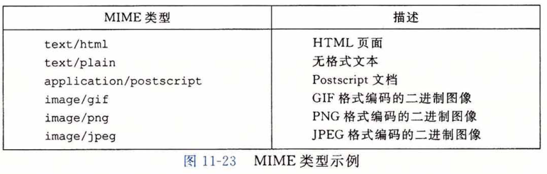
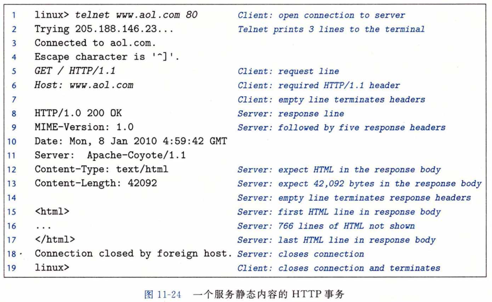

## Web服务器

迄今为止，我们已经在一个简单的echo服务器的上下文中讨论了网络编程。在这一 节里，我们将向你展示如何利用网络编程的基本概念，来创建你自己的虽小但功能齐全的 Web服务器。

### Web 基础

Web客户端和服务器之间的交互用的是一个基于文本的应用级协议，叫做HTTP (Hypertext Transfer Protocol，超文本传输协议）。HTTP是一个简单的协议。一个Web 客户端（即浏览器）打开一个到服务器的因特网连接，并且请求某些内容。服务器响应所请 求的内容，然后关闭连接。浏览器读取这些内容，并把它显示在屏幕上。

Web服务和常规的文件检索服务（例如FTP)有什么区别呢？主要的区别是Web内容 可以用一种叫做HTML（Hypertext Markup Language,超文本标记语言）的语言来编写。 一个HTML程序（页)包含指令(标记），它们告诉浏览器如何显示这页中的各种文本和图 形对象。例如，代码

< b >  Make me bold!  < /b >

告诉浏览器用粗体字类型输出 < b > 和 </ b > 标记之间的文本。然而，HTML 真正的强大之处在于一个页面可以包含指针（超链接），这些指针可以指向存放在任何因特网主机上的 内容。例如，一个格式如下的 HTML 行

< a href="http://www. emu.edu/index.html" >Carnegie Mellon< /a > 

告诉浏览器高亮显示文本对象 “ Carnegie Mellon ” ，并且创建一个超链接，它指向存放在 CMU Web 服务器上叫做 index.html 的 HTML 文件。如果用户单击了这个高亮文本对象，浏览器就会从 CMU 服务器中请求相应的HTML 文件并显示它。

### Web 内容

​		对于 We b客户端和服务器而言，内容是与一个 MIME ( Multipurpose Internet Mail Extensions,多用途的网际邮件扩充协议）类型相关的字节序列。图11-23展示了一些常用的 MIME 类型。

Web服务器以两种不同的方式向客户端提供内容：

* 取一个磁盘文件，并将它的内容返回给客户端。磁盘文件称为**静态内容（static content)**， 而返回文件给客户端的过程称为**服务静态内容 （serving static content)**。，

* 运行一个可执行文件，并将它的输出返回给客户端。运行时可执行文件产生的输出称为**动态内容（dynamic content)**，而运行程序并返回它的输出到客户端的过程称为**服务动态内容（serving dynamic content)**。

​    每条由 Web 服务器返回的内容都是和它管理的某个文件相关联的。这些文件中的每一个都有一个唯一的名字，叫做**URL(Universal Resource Locator，通用资源定位符)**。例如，URL 

​				http: //www. google. com: 80/index. html

表示因特网主机 www.google .com 上一个称为 /index.html 的 HTML 文件，它是由一个监听端口 80 的 Web 服务器管理的。端口号是可选的，默认为知名的 HTTP 端口 80 。可执行文件的 URL 可以在文件名后包括程序参数。“？” 字符分隔文件名和参数，而且每个参数都用 “ & ” 字符分隔开。例如，URL

​			http://bluefish.ics.cs. emu.edu:8000/cgi-bin/adder?15000&213

标识了一个叫做 /cgi- bin/adder 的可执行文件，会带两个参数字符串 15000 和 213 来调用它。在事务过程中，客户端和服务器使用的是 URL 的不同部分。例如，客户端使用前缀

​			http://www. google. com:80

来决定与哪类服务器联系，服务器在哪里，以及它监听的端口号是多少。服务器使用后缀 

​			/index.html

来发现在它文件系统中的文件，并确定请求的是静态内容述是动态内容。

关于服务器如何解释一个 URL 的后缀，有几点需要理解：

* 确定一个 URL 指向的是静态内容还是动态内容没有标准的规则。每个服务器对它 所管理的文件都有自己的规则。一种经典的（老式的）方法是，确定一组目录，例如 cgi-bin，所有的可执行性文件都必须存放这些目录中。

* 后缀中的最开始的那个 “ / ” 不表示 Linux 的根目录。相反，它表示的是被请求内容类型的主目录。例如，可以将一个服务器配置成这样：所有的静态内容存放在目录 /usr/httpd/html 下，而所有的动态内容都存放在目录 /usr/httpd/cgi-bin 下。

* 最小的 URL 后缀是 “ / ” 字符，所有服务器将其扩展为某个默认的主页，例如 /index.html 。这解释了为什么简单地在浏览器中键入一个域名就可以取出一个网站的主页。浏览器在 URL 后添加缺失的 “ / ”，并将之传递给服务器，服务器又把 “ / ” 扩展到某个默认的文件名。

### HTTP 事务

​		因为 HTTP 是基于在因特网连接上传送的文本行的，我们可以使用 Linux 的 TELNET 程序来和因特网上的任何 Web 服务器执行事务。 对于调试在连接上通过文本行来与 客户端对话的服务器来说，TELNET 程序是非常便利的。例如，图11-24使用 TELNET 向 AOL Web 服务器请求主页。

​		在第 1 行，我们从 Linux shell 运行 TELNET，要求它打开一个到 AOL Web 服务器的连接。TELNET 向终端打印三行输出，打开连接，然后等待我们输入文本 ( 第 5 行）。每次输入一个文本行，并键入回车键，TELNET 会读取该行，在后面加上回车和换行符号（在 C 的表示中为 “ \r\n ”），并且将这一行发送到服务器。这是和 HTTP 标准相符的，HTTP 标准要求每个文本行都由一对回车和换行符来结束。为了发起事务，我们输入一个 HTTP 请求（第 5 〜 7 行）。服务器返回 HTTP 响应 ( 第 8 〜 17 行），然后关闭连接 ( 第 18 行）。

##### 		1.HTTP请求

​		—个 HTTP 请求的组成是这样的：一个**请求行（request line）**( 第 5 行），后面跟随零个或更多个**请求报头（request header）**(第 6 行），再跟随一个空的文本行来终止报头列表 (第 7 行）。一个请求行的形式是 

​				method URI version

HTTP 支持许多不同的方法，包括 GET 、POS T、OPTIONS 、HEAD 、PUT 、DELETE  和 TRACE 。我们将只讨论广为应用的 GET 方法，大多数 HTTP 请求都是这种类型的。GET 方法指导服务器生成和返回 URI（Uniform Resource Identifier,统一资源标识符）标识的内容。URI 是相应的 URL 的后缀，包括文件名和可选的参数。

​		请求行中的 version 字段表明了该请求遵循的 HTTP 版本。最新的 HTTP 版本是 HTTP/1. 1[37]。HTTP/1.0 是从 1996 年沿用至今的老版本[6]。HTTP/1. 1 定义了一些附加的报头，为诸如缓冲和安全等高级特性提供支持，它还支持一种机制，允许客户端和服务器在同一条**持久连接（persistent connection）**上执行多个事务。在实际中，两个版本是互相兼容的，因为 HTTP/1. 0 的客户端和服务器会简单地忽略 HTTP/1. 1 的报头。

​		总的来说，第 5 行的请求行要求服务器取出并返回 HTML 文件 /index.html 。它也告知服务器请求剩下的部分是 HTTP/1. 1 格式的。