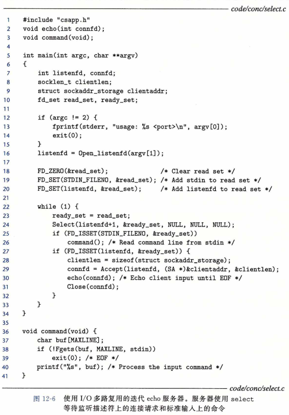
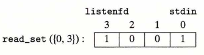
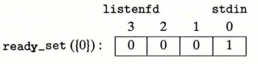

## 基于 I/O 多路复用的并发编程

​		假设要求你编写一个 echo 服务器，它也能对用户从标准输入键入的交互命令做出响应。在这种情况下，服务器必须响应两个互相独立的 I/O 事件：
​			1 ) 网络客户端发起连接请求，
​			2 ) 用户在键盘上键入命令行。
我们先等待哪个事件呢？没有哪个选择是理想的。如果在 accept 中等待一个连接请求，我们就不能响应输入的命令。类似地，如果在 read 中等待一个输入命令，我们就不能响应任何连接请求。

​		针对这种困境的一个解决办法就是 **I/O 多路复用（I/O multiplexing）**技术。基本的思路就是使用 select 函数，要求内核挂起进程，只有在一个或多个 I/O 事件发生后，才将控制返回给应用程序，就像在下面的示例中一样：

- 当集合 { 0 ,  4 } 中任意描述符准备好读时返回。

- 当集合 { 1，2，7 } 中任意描述符准备好写时返回。

- 如果在等待一个 I/O 事件发生时过了 152. 13 秒，就超时。

select 是一个复杂的函数，有许多不同的使用场景。我们将只讨论第一种场景：等待一组描述符准备好读。全面的讨论请参考[62，110]。

​		select 函数处理类型为 fd_set 的集合，也叫做描述符集合。逻辑上，我们将描述符集合看成一个大小为 n 的位向量（在2. 1节中介绍过）：

​																b(n-1) , ... , b(1) , b(0)

每个位 b ( k ) 对应于描述符 k 。当且仅当 b ( k )  = 1，描述符 k 才表明是描述符集合的一个元素。只允许你对描述符集合做三件事：1 ) 分配它们，2 ) 将一个此种类型的变量赋值给另一个变量，3 ) 用 FD_ZERO 、 FD_SET 、 FD_CLR 和 FDJSSET 宏来修改和检查它们。

​		针对我们的目的，select 函数有两个输人：一个称为**读集合**的描述符集合（fdset）和该读集合的基数（n)(实际上是任何描述符集合的最大基数）。select 函数会一直阻塞， 直到读集合中至少有一个描述符准备好可以读。当且仅当一个从该描述符读取一个字节的请求不会阻塞时，描述符 k 就表示准备好可以读了。select 有一个副作用，它修改参数 fdset 指向的 fd_set，指明读集合的一个子集，称为**准备好集合（ready set）**，这个集合是由读集合中准备好可以读了的描述符组成的。该函数返回的值指明了准备好集合的基数。注意，由于这个副作用，我们必须在每次调用 select 时都更新读集合。

​		理解 select 的最好办法是研究一个具体例子。图12-6展示了可以如何利用 select 来实现一个迭代 echo 服务器，它也可以接受标准输入上的用户命令。一开始，我们用 图11-19中的 Open_listenfd 函数打开一个监听描述符（ 第 16 行 ），然后使用 FD_ZERO 创建一个空的读集合 ( 第 18 行 ）：

​		接下来，在第 19 和 20 行中，我们定义由描述符 0 ( 标准输入 ）和描述符 3 ( 监听描述符 ) 组成的读集合：

​		在这里，我们开始典型的服务器循环。但是我们不调用 accept 函数来等待一个连接请求，而是调用 select 函数，这个函数会一直阻塞，直到监听描述符或者标准输入准备好可以读 ( 第 24 行 ）。例如，下面是当用户按回车键，因此使得标准输入描述符变为可读时，select 会返回的 ready_set 的值：

​		一旦 select 返回，我们就用 FD_ISSET 宏指令来确定哪个描述符准备好可以读了。 
​				如果是标准输入准备好了（第25行），我们就调用command函数，该函数在返回到主程序前，会读、解析和响应命令。
​				如果是监听描述符准备好了（第27行），我们就调用 accept 来得到一个已连接描述符，然后调用图11-22中的 echo 函数，它会将来自客户端的每一行又回送回去，直到客户端关闭这个连接中它的那一端。

​		虽然这个程序是使用 select 的一个很好示例，但是它仍然留下了一些问题待解决。问题是一旦它连接到某个客户端，就会连续回送输入行，直到客户端关闭这个连接中它的那一端。因此，如果键入一个命令到标准输入，你将不会得到响应，直到服务器和客户端之间结束。

​		一个更好的方法是更细粒度的多路复用，服务器每次循环（至多）回送一个文本行。

