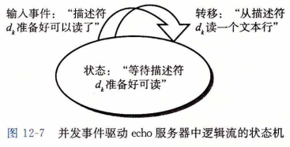
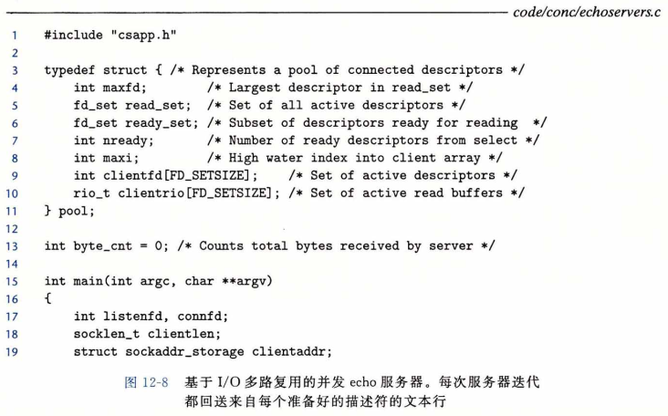
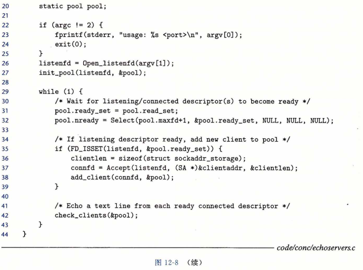
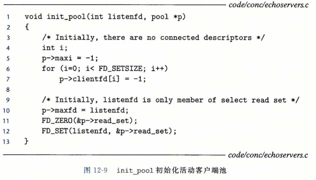
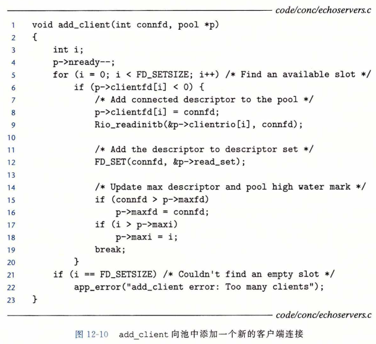
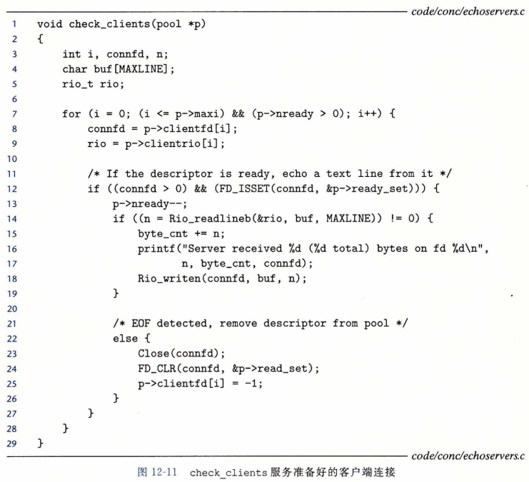

## 基于 I/O 多路复用的并发编程

​		假设要求你编写一个 echo 服务器，它也能对用户从标准输入键入的交互命令做出响应。在这种情况下，服务器必须响应两个互相独立的 I/O 事件：
​			1 ) 网络客户端发起连接请求，
​			2 ) 用户在键盘上键入命令行。
我们先等待哪个事件呢？没有哪个选择是理想的。如果在 accept 中等待一个连接请求，我们就不能响应输入的命令。类似地，如果在 read 中等待一个输入命令，我们就不能响应任何连接请求。

​		针对这种困境的一个解决办法就是 **I/O 多路复用（I/O multiplexing）**技术。基本的思路就是使用 select 函数，要求内核挂起进程，只有在一个或多个 I/O 事件发生后，才将控制返回给应用程序，就像在下面的示例中一样：

- 当集合 { 0 ,  4 } 中任意描述符准备好读时返回。

- 当集合 { 1，2，7 } 中任意描述符准备好写时返回。

- 如果在等待一个 I/O 事件发生时过了 152. 13 秒，就超时。

select 是一个复杂的函数，有许多不同的使用场景。我们将只讨论第一种场景：等待一组描述符准备好读。全面的讨论请参考[62，110]。

​		select 函数处理类型为 fd_set 的集合，也叫做描述符集合。逻辑上，我们将描述符集合看成一个大小为 n 的位向量（在2. 1节中介绍过）：

​																b(n-1) , ... , b(1) , b(0)

每个位 b ( k ) 对应于描述符 k 。当且仅当 b ( k )  = 1，描述符 k 才表明是描述符集合的一个元素。只允许你对描述符集合做三件事：1 ) 分配它们，2 ) 将一个此种类型的变量赋值给另一个变量，3 ) 用 FD_ZERO 、 FD_SET 、 FD_CLR 和 FDJSSET 宏来修改和检查它们。

​		针对我们的目的，select 函数有两个输入：一个称为**读集合**的描述符集合（fdset）和该读集合的基数（n)(实际上是任何描述符集合的最大基数）。select 函数会一直阻塞， 直到读集合中至少有一个描述符准备好可以读。当且仅当一个从该描述符读取一个字节的请求不会阻塞时，描述符 k 就表示准备好可以读了。select 有一个副作用，它修改参数 fdset 指向的 fd_set，指明读集合的一个子集，称为**准备好集合（ready set）**，这个集合是由读集合中准备好可以读了的描述符组成的。该函数返回的值指明了准备好集合的基数。注意，由于这个副作用，我们必须在每次调用 select 时都更新读集合。

​		理解 select 的最好办法是研究一个具体例子。图12-6展示了可以如何利用 select 来实现一个迭代 echo 服务器，它也可以接受标准输入上的用户命令。一开始，我们用图11-19中的 Open_listenfd 函数打开一个监听描述符（ 第 16 行 ），然后使用 FD_ZERO 创建一个空的读集合 ( 第 18 行 ）：

​		接下来，在第 19 和 20 行中，我们定义由描述符 0 ( 标准输入 ）和描述符 3 ( 监听描述符 ) 组成的读集合：

​		在这里，我们开始典型的服务器循环。但是我们不调用 accept 函数来等待一个连接请求，而是调用 select 函数，这个函数会一直阻塞，直到监听描述符或者标准输入准备好可以读 ( 第 24 行 ）。例如，下面是当用户按回车键，因此使得标准输入描述符变为可读时，select 会返回的 ready_set 的值：

​		一旦 select 返回，我们就用 FD_ISSET 宏指令来确定哪个描述符准备好可以读了。 
​				如果是标准输入准备好了（第25行），我们就调用command函数，该函数在返回到主程序前，会读、解析和响应命令。
​				如果是监听描述符准备好了（第27行），我们就调用 accept 来得到一个已连接描述符，然后调用图11-22中的 echo 函数，它会将来自客户端的每一行又回送回去，直到客户端关闭这个连接中它的那一端。

​		虽然这个程序是使用 select 的一个很好示例，但是它仍然留下了一些问题待解决。问题是一旦它连接到某个客户端，就会连续回送输入行，直到客户端关闭这个连接中它的那一端。因此，如果键入一个命令到标准输入，你将不会得到响应，直到服务器和客户端之间结束。

​		一个更好的方法是更细粒度的多路复用，服务器每次循环（至多）回送一个文本行。

### 基于 I/O 多路复用的并发事件驱动服务器

​		I/O 多路复用可以用做并发**事件驱动（event-driven）**程序的基础，在事件驱动程序中， 某些事件会导致流向前推进。一般的思路是将逻辑流模型化为状态机。不严格地说，一个**状态机（state machine）**就是一组**状态（state）**、**输入事件（input event）**和**转移（transition）**， 其中转移是将状态和输入事件映射到状态。每个转移是将一个（输入状态，输入事件）对映射到一个输出状态。**自循环（self-loop）**是同一输入和输出状态之间的转移。

​		通常把状态机画成有向图，其中节点表示状态，有向弧表示转移，而弧上的标号表示输入事件。一个状态机从某种初始状态开始执行。每个输入事件都会引发一个从当前状态到下一状态的转移。

​		对于每个新的客户端 k ，基于 I/O 多路复用的并发服务器会创建一个新的状态机 s(k)，并将它和已连接描述符 d(k) 联系起来。如图12-7所示，每个状态机 s(k) 都有一个状态 ( “ 等待描述符 d(k) 准备好可读 ” ）、一个输入事件( “ 描述符 d(k) 准备好可以读了 ” ）和一个转移  ( “ 从描述符 d(k) 读一个文本行 ” ）。

​		服务器使用 I/O 多路复用，借助 select 函数检测输入事件的发生。当每个已连接描述符准备好可读时，服务器就为相应的状态机执行转移，在这里就是从描述符读和写回一个文本行。

​		图 12-8 展示了一个基于 I/O 多路复用的并发事件驱动服务器的完整示例代码。一个 pool 结构里维护着活动客户端的集合（ 第 3 〜 11 行）。在调用 init_pool 初始化池（第 27 行 ) 之后，服务器进入一个无限循环。在循环的每次迭代中，服务器调用 select 函数来检测两种不同类型的输入事件：
​			a) 来自一个新客户端的连接请求到达，
​			b) —个已存在的客 户端的已连接描述符准备好可以读了。
当一个连接请求到达时（ 第 35 行 ），服务器打开连接 ( 第 37 行 ），并调用 add_client 函数，将该客户端添加到池里（ 第 38 行）。最后，服务器调用 check_clients 函数，把来自每个准备好的已连接描述符的一个文本行回送回去 ( 第 42 行 ）。

​		init_pool 函数（图12-9）初始化客户端池。clientfd 数组表示已连接描述符的集合，其中整数 -1 表示一个可用的槽位。初始时，已连接描述符集合是空的（ 第 5 〜 7 行 ）， 而且监听描述符是 select 读集合中唯一的描述符（第10~12行）。

​		add_client 函数（图12-10 ) 添加一个新的客户端到活动客户端池中。在 clientfd 数组中找到一个空槽位后，服务器将这个已连接描述符添加到数组中，并初始化相应的 RIO 读缓冲区，这样一来我们就能够对这个描述符调用 rio_readlineb ( 第 8 〜 9 行 ）。然后，我们将这个已连接描述符添加到 select 读集合 ( 第 12 行 ），并更新该池的一些全局属性。maxfd 变量 ( 第15〜16 行 ) 记录了 select 的最大文件描述符。maxi 变量（ 第 17 〜 18 行）记录的是到 clientfd 数组的最大索引，这样 check_clients 函数就无需搜索整个数组了。

​		图12-11中的 check_clients 函数回送来自每个准备好的已连接描述符的一个文本行。 如果成功地从描述符读取了一个文本行，那么就将该文本行回送到客户端（第 15 〜 18 行）。 注意，在第 15 行我们维护着一个从所有客户端接收到的全部字节的累计值。如果因为客户端关闭这个连接中它的那一端，检测到 EOF , 那么将关闭这边的连接端（ 第 23 行 ），并从池中清除掉这个描述符（ 第 24 ~ 25 行 ）。

​		根据图12-7中的有限状态模型，select 函数检测到输人事件，而 add_client 函数创建一个新的逻辑流（状态机）。check_clients 函数回送输入行，从而执行状态转移， 而且当客户端完成文本行发送时，它还要删除这个状态机。

### I/O多路复用技术的优劣

​		图 12-8 中的服务器提供了一个很好的基于 I/O 多路复用的事件驱动编程的优缺点示例。事件驱动设计的一个优点是，它比基于进程的设计给了程序员更多的对程序行为的控制。例如，我们可以设想编写一个事件驱动的并发服务器，为某些客户端提供它们需要的服务，而这对于基于进程的并发服务器来说，是很困难的。

​		另一个优点是，一个基于 I/O 多路复用的事件驱动服务器是运行在单一进程上下文中的，因此每个逻辑流都能访问该进程的全部地址空间。这使得在流之间共享数据变得很容易。一个与作为单个进程运行相关的优点是，你可以利用熟悉的调试工具，例如 GDB , 来调试你的并发服务器，就像对顺序程序那样。最后，事件驱动设计常常比基于进程的设计要高效得多，因为它们不需要进程上下文切换来调度新的流。

​		事件驱动设计一个明显的缺点就是编码复杂。我们的事件驱动的并发 echo 服务器需要的代码比基于进程的服务器多三倍，并且很不幸，随着并发粒度的减小，复杂性还会上升。这里的粒度是指每个逻辑流每个时间片执行的指令数量。

​		例如，在示例并发服务器中，并发粒度就是读一个完整的文本行所需要的指令数量。只要某个逻辑流正忙于读一个文本行，其他逻辑流就不可能有进展。对我们的例子来说这没有问题，但是它使得在 “ 故意只发送部分文本行然后就停止 ” 的恶意客户端的攻击面前，我们的事件驱动服务器显得很脆弱。修改事件驱动服务器来处理部分文本行不是一个简单的任务，但是基于进程的设计却能处理得很好， 而且是自动处理的。基于事件的设计另一个重要的缺点是它们不能充分利用多核处理器。

