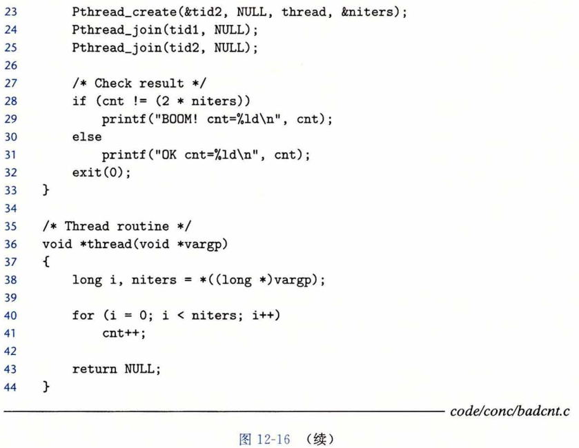

### 用信号量同步线程

​		共享变量是十分方便，但是它们也引入了**同步错误（synchronization error）**的可能性。考虑图 12-16 中的程序 badcnt.c ，它创建了两个线程，每个线程都对共享计数变量 cnt 加 1 。

因为每个线程都对计数器增加了 niters次，我们预计它的最终值是2Xniters。这 看上去简单而直接。然而，当在Linux系统上运行badcnt.c时，我们不仅得到错误的答 案，而且每次得到的答案都还不相同！

linux> ./badcnt 1000000

BOOM! cnt=1445085

-linux> ./badcnt 1000000

BOOM! cnt=1915220

linux> ./badcnt 1000000

BOOH! cnt=1404746

那么哪里出错了呢？为了清晰地理解这个问题，我们需要研究计数器循环（第40〜41 行）的汇编代码，如图12-17所示。我们发现，将线程i的循环代码分解成五个部分是很有 帮助的：