用信号量同步线程

​		共享变量是十分方便，但是它们也引入了**同步错误（synchronization error）**的可能性。考虑图 12-16 中的程序 badcnt.c ，它创建了两个线程，每个线程都对共享计数变量 cnt 加 1 。

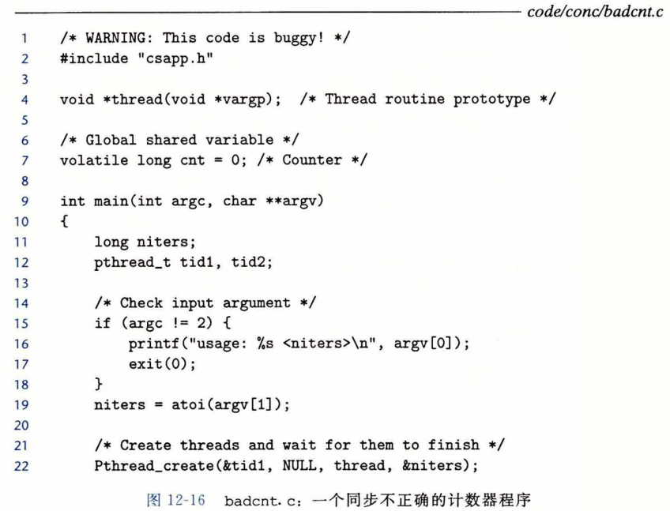

​		因为每个线程都对计数器增加了 niters 次，我们预计它的最终值是 2 X niters。这 看上去简单而直接。然而，当在 Linux 系统上运行 badcnt.c 时，我们不仅得到错误的答案，而且每次得到的答案都还不相同！

linux> ./badcnt 1000000
BOOM! cnt=1445085

linux> ./badcnt 1000000
BOOM! cnt=1915220

linux> ./badcnt 1000000
BOOM! cnt=1404746

​		那么哪里出错了呢？为了清晰地理解这个问题，我们需要研究计数器循环（第 40 〜 41 行）的汇编代码，如图12-17所示。我们发现，将线程 i 的循环代码分解成五个部分是很有帮助的：

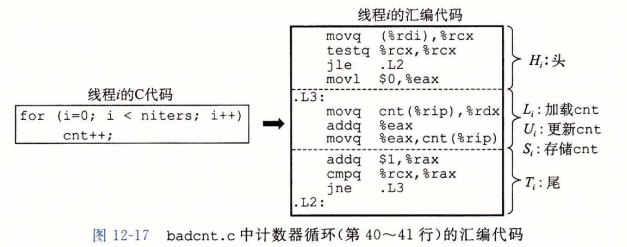

* H(i)：在循环头部的指令块。

* L(i)：加载共享变量 cnt 到累加寄存器 ％rdx(i) 的指令，这里 ％rdx(i) 表示线程 i 中的寄存器 &rdx 的值。

* U(i)：更新(增加) ％rdx(i) 的指令。

* S(i)：的更新值存回到共享变量 cnt 的指令。

* T(i)：循环尾部的指令块。

​        注意头和尾只操作本地栈变量，而 L(i)、U(i) 和 S(i) 操作共享计数器变量的内容。

​		当 badcnt.c 中的两个对等线程在一个单处理器上并发运行时，机器指令以某种顺序一个接一个地完成。因此，每个并发执行定义了两个线程中的指令的某种全序（或者交叉）。不幸的是，这些顺序中的一些将会产生正确结果，但是其他的则不会。

​		这里有个关键点：**一般而言，你没有办法预测操作系统是否将为你的线程选择一个正确的顺序。**例如，图12-18a 展示了一个正确的指令顺序的分步操作。在每个线程更新了共享变量 cnt 之后，它在内存中的值就是 2 , 这正是期望的值。

​		另一方面，图12-18b的顺序产生一个不正确的 cnt 的值。会发生这样的问题是因为， 线程 2 在第 5 步加载 cnt ，是在第 2 步线程 1 加载 cut 之后，而在第 6 步线程 1 存储它的更新值之前。因此，每个线程最终都会存储一个值为 1 的更新后的计数器值。我们能够借助于一种叫做**进度图（progress graph)**的方法来阐明这些正确的和不正确的指令顺序的概念，这个图我们将在下一节中介绍。

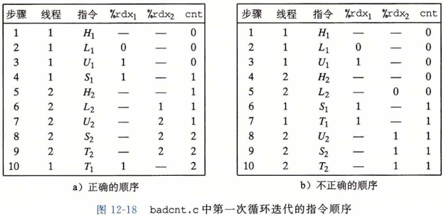

### 进度图

​		**进度图（progress graph）**将 n 个并发线程的执行模型化为一条 n 维笛卡儿空间中的轨迹线。每条轴 k 对应于线程 k 的进度。每个点（ I(1)，I(2)，…，I(n)）代表线程 k（ k = 1，…，n ）已经完成了指令 I(k) 这一状态。图的原点对应于没有任何线程完成一条指令的初始状态。

​		图12-19展示了 badcnt.c 程序第一次循环迭代的二维进度图。水平轴对应于线程 1 ， 垂直轴对应于线程 2 。点（L(1)，S(2) ）对应于线程 1 完成了  L(1) 而线程 2 完成了 S(2) 的状态。

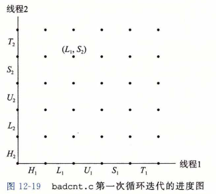

​		进度图将指令执行模型化为从一种状态到另一种状态的**转换（transition）**。转换被表示为一条从一点到相邻点的有向边。合法的转换是向右（线程 1 中的一条指令完成）或者向上 ( 线程 2 中的一条指令完成 ）的。两条指令不能在同一时刻完成——对角线转换是不允许的。程序决不会反向运行，所以向下或者向左移动的转换也是不合法的。

​		一个程序的执行历史被模型化为状态空间中的一条轨迹线。图 12-20 展示了下面指令顺序对应的轨迹线：

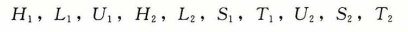

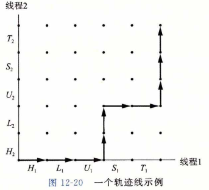

​		对于线程操作共享变量 cnt 内容的指令（L(i)、U(i) 、S(i)）构成了一个（关于共享变量 cnt 的）**临界区（critical section）**, 这个临界区不应该和其他进程的临界区交替执行。换句话说，我们想要确保每个线程在执行它的临界区中的指令时，拥有对共享变量的**互斥的访问（mutually exclusive access）**。通常这种现象称为**互斥（mutual exclusion）**。

​		在进度图中，两个临界区的交集形成的状态空间区域称为**不安全区（unsafe region）**。 图 12-21 展示了变量 cnt 的不安全区。注意，不安全区和与它交界的状态相毗邻，但并不包括这些状态。例如，状态（H1，H2）和（S1，U2）毗邻不安全区，但是它们并不是不安全区的一部分。绕开不安全区的轨迹线叫**做安全轨迹线（safe trajectory）**。相反，接触到任何不安全区的轨迹线就叫做**不安全轨迹线（unsafe trajectory）**。图 12-21 给出了示例程序 badcnt.c 的状态空间中的安全和不安全轨迹线。上面的轨迹线绕开了不安全区域的左边和上边，所以是安全的。下面的轨迹线穿越不安全区，因此是不安全的。

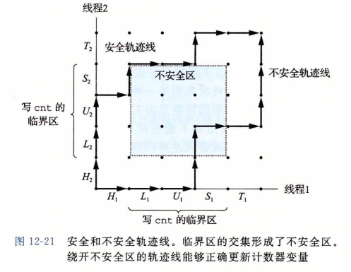

​		任何安全轨迹线都将正确地更新共享计数器。为了保证线程化程序示例的正确执行（实际上任何共享全局数据结构的并发程序的正确执行)我们必须以某种方式同步线程，使它们总是有一条安全轨迹线。一个经典的方法是基于信号量的思想，接下来我们就介绍它。

### 信号量

​		Edsger Dijkstra，并发编程领域的先锋人物，提出了一种经典的解决同步不同执行线程问题的方法，这种方法是基于一种叫做**信号量（semaphore）**的特殊类型变量的。信号量 s 是具有非负整数值的全局变量，只能由两种特殊的操作来处理，这两种操作称为 P 和 V :

* P(s)：如果 s 是非零的，那么 P 将 s 减1，并且立即返回。如果 s 为零，那么就挂起这个线程，直到 s 变为非零，而一个 V 操作会重启这个线程。在重启之后，P 操作将 s 减 1 ，并将控制返回给调用者。

* V(s)：V 操作将 s 加 1 。如果有任何线程阻塞在 P 操作等待 s 变成非零，那么 V 操作会重启这些线程中的一个，然后该线程将 s 减 1，完成它的 P 操作。

​        P 中的测试和减 1 操作是不可分割的，也就是说，一旦预测信号量 s 变为非零，就会将 s 减 1 ，不能有中断。V 中的加 1 操作也是不可分割的，也就是加载、加 1 和存储信号量的过程中没有中断。注意，V 的定义中没有定义等待线程被重启动的顺序。唯一的要求是 V 必须只能重启一个正在等待的线程。因此，当有多个线程在等待同一个信号量时，你不能预测 V 操作要重启哪一个线程。

​        P 和 V 的定义确保了一个正在运行的程序绝不可能进入这样一种状态，也就是一个正确初始化了的信号量有一个负值。这个属性称为**信号量不变性（semaphore invariant）**，为控制并发程序的轨迹线提供了强有力的工具，在下一节中我们将看到。

​		Posix 标准定义了许多操作信号量的函数。

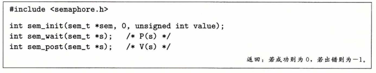

​		sem_init 函数将信号量 sem 初始化为 value 。每个信号量在使用前必须初始化。针对我们的目的，中间的参数总是零。程序分别通过调用 sem_wait 和 sem_post 函数来执行 P 和 V 操作。为了简明，我们更喜欢使用下面这些等价的 P 和 V 的包装函数：

### 使用信号量来实现互斥

​		信号量提供了一种很方便的方法来确保对共享变量的互斥访问。基本思想是将每个共享变量(或者一组相关的共享变量）与一个信号量 s ( 以初始为 1 ) 联系起来，然后用 P(s) 和 V(s) 操作将相应的临界区包围起来。

​		以这种方式来保护共享变量的信号量叫做**二元信号量（binary semaphore）**，因为它的值总是 0 或者 1 。以提供互斥为目的的二元信号量常常也称为**互斥锁（mutex）**。在一个互斥锁上执行 P 操作称为对互斥锁**加锁**。类似地，执行 V 操作称为对互斥锁**解锁**。对一个互斥锁加了锁但是还没有解锁的线程称为占用这个互斥锁。一个被用作一组可用资源的计数器的信号量被称为计数信号量。

​		图12-22中的进度图展示了我们如何利用二元信号量来正确地同步计数器程序示例。 每个状态都标出了该状态中信号量 s 的值。关键思想是这种 P 和 V 操作的结合创建了一组状态，叫做**禁止区（forbidden region）**，其中 s < 0 。因为信号量的不变性，没有实际可行的轨迹线能够包含禁止区中的状态。而且，因为禁止区完全包括了不安全区，所以没有实际可行的轨迹线能够接触不安全区的任何部分。因此，每条实际可行的轨迹线都是安全的， 而且不管运行时指令顺序是怎样的，程序都会正确地增加计数器值。

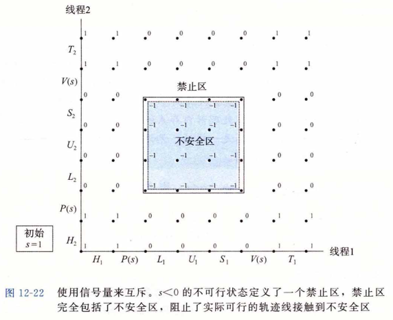

​		从可操作的意义上来说，由 P 和 V 操作创建的禁止区使得在任何时间点上，在被包围的临界区中，不可能有多个线程在执行指令。换句话说，信号量操作确保了对临界区的互斥访问。

​		总的来说，为了用信号量正确同步图 12-16 中的计数器程序示例，我们首先声明一个 信号量 mutex :

​				`volatile   long   cnt  =  0; /* Counter */
​		sem_t    mutex;    /* Semaphore that protects counter */`

然后在主例程中将 mutex 初始化为 1 :

​				`Sem_init(ferautex, 0， 1);   /* mutex = 1 */`

最后，我们通过把在线程例程中对共享变量 cnt 的更新包围 P 和 V 操作，从而保护它们：   .

​		`for (i = 0; i < niters; i++) {
​				P(&mutex); `
​								`cnt++;
​				V(&nmtex);
​		}`

当我们运行这个正确同步的程序时，现在它每次都能产生正确的结果了。

linux> ./goodcnt 1000000   OK   cnt=2000000

linux> ./goodcnt 1000000   OK   cnt=2000000

### 利用信号量来调度共享资源

​		除了提供互斥之外，信号量的另一个重要作用是调度对共享资源的访问。在这种场景中，一个线程用信号量操作来通知另一个线程，程序状态中的某个条件已经为真了。两个经典而有用的例子是**生产者-消费者**和**读者-写者**问题。

##### 		1.生产者-消费者问题

​		图 12-23 给出了生产者-消费者问题。生产者和消费者线程共享一个有 n 个槽的**有限缓冲区**。生产者线程反复地生成新的**项目（item）**,并把它们插入到缓冲区中。消费者线程不断地从缓冲区中取出这些项目，然后消费(使用)它们。也可能有多个生产者和消费者的变种。

​		因为插入和取出项目都涉及更新共享变量，所以我们必须保证对缓冲区的访问是互斥的。但是只保证互斥访问是不够的，我们还需要调度对缓冲区的访问。如果缓冲区是满的（没有空的槽位），那么生产者必须等待直到有一个槽位变为可用。与之相似，如果缓冲区是空的（没有可取用的项目），那么消费者必须等待直到有一个项目变为可用。

​		生产者-消费者的相互作用在现实系统中是很普遍的。例如，在一个多媒体系统中， 生产者编码视频帧，而消费者解码并在屏幕上呈现出来。缓冲区的目的是为了减少视频流的抖动，而这种抖动是由各个帧的编码和解码时与数据相关的差异引起的。缓冲区为生产者提供了一个槽位池，而为消费者提供一个已编码的帧池。另一个常见的示例是图形用户接口设计。生产者检测到鼠标和键盘事件，并将它们插入到缓冲区中。消费者以某种基于优先级的方式从缓冲区取出这些事件，并显示在屏幕上。

​		在本节中，我们将开发一个简单的包，叫做 SBUF ，用来构造生产者-消费者程序。 在下一节里，我们会看到如何用它来构造一个基于预**线程化（prethreading）**的有趣的并发服务器。SBUF 操作类型为 sbuf_t 的有限缓冲区（图12-24)。项目存放在一个动态分配的 n 项整数数组（buf）中。front 和 rear 索引值记录该数组中的第一项和最后一项。三个信号量同步对缓冲区的访问。mutex 信号量提供互斥的缓冲区访问。slots 和 items 信号量分别记录空槽位和可用项目的数量。

​		图12-25给出了 SBUF 函数的实现。
​		sbuf_init 函数为缓冲区分配堆内存，设置 front 和 rear 表示一个空的缓冲区，并为三个信号量赋初始值。这个函数在调用其他三个函数中的任何一个之前调用一次。
​		sbuf_deinit 函数是当应用程序使用完缓冲区时，释放缓冲区存储的。
​		sbuf_insert 函数等待一个可用的槽位，对互斥锁加锁，添加项目，对互斥锁解锁，然后宣布有一个新项目可用。
​		sbuf_remove 函数是与 sbuf_insert 函数对称的。在等待一个可用的缓冲区项目之后，对互斥锁加锁，从缓冲区的前面取出该项目， 对互斥锁解锁，然后发信号通知一个新的槽位可供使用。

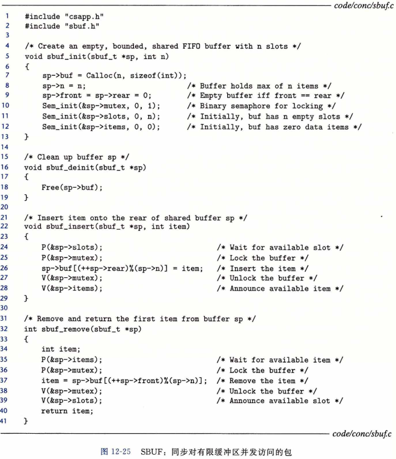

##### 		2.读者-写者问题

​		读者-写者问题是互斥问题的一个概括。一组并发的线程要访问一个共享对象，例如—个主存中的数据结构，或者一个磁盘上的数据库。有些线程只读对象，而其他的线程只修改对象。修改对象的线程叫做写者。只读对象的线程叫做读者。写者必须拥有对对象的独占的访问，而读者可以和无限多个其他的读者共享对象。一般来说，有无限多个并发的读者和写者。

​		读者-写者交互在现实系统中很常见。例如，一个在线航空预定系统中，允许有无限多个客户同时查看座位分配，但是正在预订座位的客户必须拥有对数据库的独占的访问。再来看另一个例子，在一个多线程缓存 Web 代理中，无限多个线程可以从共享页面缓存中取出已有的页面，但是任何向缓存中写入一个新页面的线程必须拥有独占的访问。

​		读者-写者问题有几个变种，分别基于读者和写者的优先级。
​				第一类读者-写者问题，读者优先，要求不要让读者等待，除非已经把使用对象的权限赋予了一个写者。换句话说，读者不会因为有一个写者在等待而等待。
​				第二类读者-写者问题，写者优先，要求一旦一个写者准备好可以写，它就会尽可能快地完成它的写操作。同第一类问题不同，在一个写者后到达的读者必须等待，即使这个写者也是在等待。

​		图 12-26 给出了一个对第一类读者-写者问题的解答。同许多同步问题的解答一样，这个解答很微妙，极具欺骗性地简单。信号量 w 控制对访问共享对象的临界区的访问。信号量 mutex 保护对共享变量 readcnt 的访问， readcnt 统计当前在临界区中的读者数量。每当一个写者进入临界区时，它对互斥锁 w 加锁，每当它离开临界区时，对 w 解锁。这就保证了任意时刻临界区中最多只有一个写者。另一方面，只有第一个进入临界区的读者对 w 加锁，而只有最后一个离开临界区的读者对 w 解锁。当一个读者进入和离开临界区时，如果述有其他读者在临界区中，那么这个读者会忽略互斥锁 w 。这就意味着只要还有一个读者占用互斥锁 w ，无限多数量的读者可以没有障碍地进入临界区。

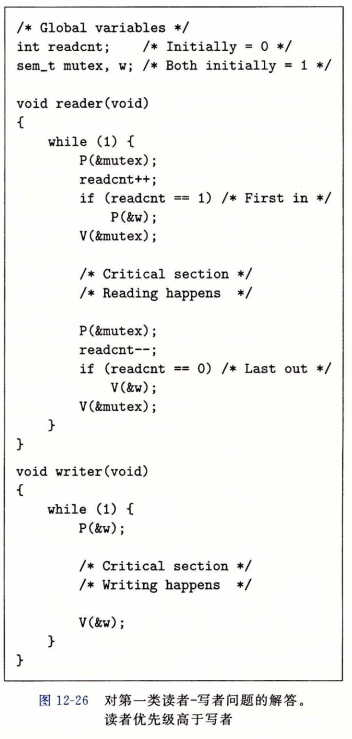

​		对这两种读者-写者问题的正确解答可能导致**饥饿（starvation）**,饥饿就是一个线程无限期地阻塞，无法进展。例如，图 12-26 所示的解答中，如果有读者不断地到达，写者就可能无限期地等待。

### 综合：基于预线程化的并发服务器

​		我们已经知道了如何使用信号量来访问共享变量和调度对共享资源的访问。为了帮助你更清晰地理解这些思想，让我们把它们应用到一个基于称为**预线程化（prethreading）**技术的并发服务器上。

​		在图 12-14 所示的并发服务器中，我们为每一个新客户端创建了一个新线程。这种方法的缺点是我们为每一个新客户端创建一个新线程，导致不小的代价。一个基于预线程化的服务器试图通过使用如图 12-27 所示的生产者-消费者模型来降低这种开销。服务器是由一个主线程和一组工作者线程构成的。主线程不断地接受来自客户端的连接请求，并将得到的连接描述符放在一个有限缓冲区中。每一个工作者线程反复地从共享缓冲区中取出描述符，为客户端服务，然后等待下一个描述符。

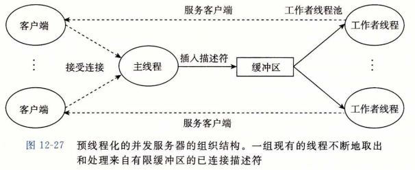

​		图 12-28 显示了我们怎样用 SBUF 包来实现一个预线程化的并发 echo 服务器。在初始化了缓冲区 sbuf (第 24 行）后，主线程创建了一组工作者线程（第 25 〜 26 行）。然后它进入了无限的服务器循环，接受连接请求，并将得到的已连接描述符插入到缓冲区 sbuf 中。 每个工作者线程的行为都非常简单。它等待直到它能从缓冲区中取出一个已连接描述符 ( 第 39 行 ），然后调用 echo_cnt 函数回送客户端的输入。

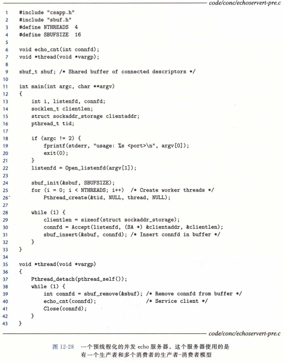

​		图 12-29 所示的函数 echo_cnt 是图 11-22 中的 echo 函数的一个版本，它在全局变量 byte_cnt 中记录了从所有客户端接收到的累计字节数。这是一段值得研究的有趣代码， 因为它向你展示了一个从线程例程调用的初始化程序包的一般技术。在这种情况中，我们需要初始化 byte_cn t计数器和 mutex 信号量。一个方法是我们为SBUF 和 RIO 程序包使用过的，它要求主线程显式地调用一个初始化函数。另外一个方法，在此显示的，是当第一次有某个线程调用 echo_ cnt 函数时，使用 Pthread_once 函数（第 19 行）去调用初始化函数。这个方法的优点是它使程序包的使用更加容易。这种方法的缺点是每一次调用 echo_ cnt 都会导致调用 pthread_once 函数，而在大多数时候它没有做什么有用的事。

 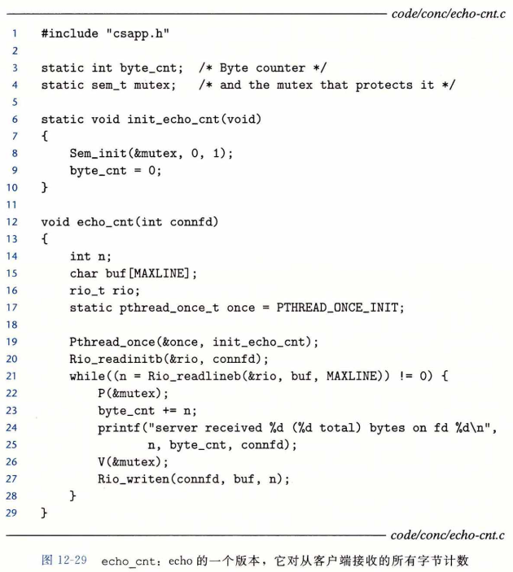

​		—旦程序包被初始化，echo_cnt 函数会初始化 RIO 带缓冲区的 I/O 包（第 20 行）， 然后回送从客户端接收到的每一个文本行。注意，在第 23〜25 行中对共享变量 byte_cnt 的访问是被 P 和 V 操作保护的。