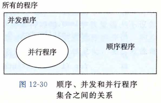
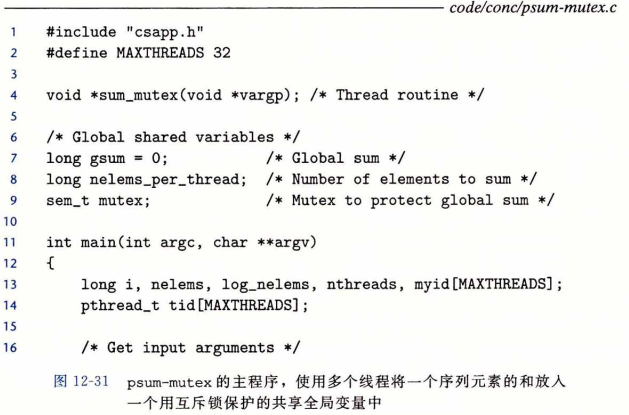
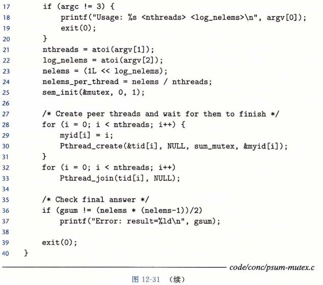

## 使用线程提高并行性

​		到目前为止，在对并发的研究中，我们都假设并发线程是在单处理器系统上执行的。然而，大多数现代机器具有多核处理器。并发程序通常在这样的机器上运行得更快，因为操作系统内核在多个核上并行地调度这些并发线程，而不是在单个核上顺序地调度。在像繁忙的 Web 服务器、数据库服务器和大型科学计算代码这样的应用中利用这样的并行性是至关重要的，而且在像 Web 浏览器、电子表格处理程序和文档处理程序这样的主流应用中，并行性也变得越来越有用。

​		图 12-30 给出了顺序、并发和并行程序之间的集合关系。所有程序的集合能够被划分成不相交的顺序程序集合和并发程序的集合。写顺序程序只有一条逻辑流。写并发程序有多条并发流。并行程序是一个运行在多个处理器上的并发程序。

​		并行程序的详细处理超出了本节讲述的范围，但是研究一个非常简单的示例程序能够帮助你理解并行编程的一些重要的方面。例如，考虑我们如何并行地对一列整数 0 , …，n-1 求和。当然，对于这个特殊的问题，有闭合形式表达式的解答（译者注：即有现成的公式来计算它，即和等于n(n-1)/2)，但是尽管如此，它是一个简洁和易于理解的示例，能让我们对并行程序做一些有趣的说明。

​		将任务分配到不同线程的最直接方法是将序列划分成 **t** 个不相交的区域，然后给 **t** 个不同的线程每个分配一个区域。为了简单，假设 **n** 是 **t** 的倍数，这样每个区域有 **n/t** 个元素。让我们来看看多个线程并行处理分配给它们的区域的不同方法。

​		最简单也最直接的选择是将线程的和放入一个共享全局变量中，用互斥锁保护这个变量。图 12-31 给出了我们会如何实现这种方法。在第 28 〜 33 行，主线程创建对等线程，然后等待它们结束。注意，主线程传递给每个对等线程一个小整数，作为唯一的线程 ID。每个对等线程会用它的线程 ID 来决定它应该计算序列的哪一部分。这个向对等线程传递一个小的唯一的线程 ID 的思想是一项通用技术，许多并行应用中都用到了它。在对等线程终止后， 全局变量 gsum 包含着最终的和。然后主线程用闭合形式解答来验证结果 ( 第 36〜37 行）。

