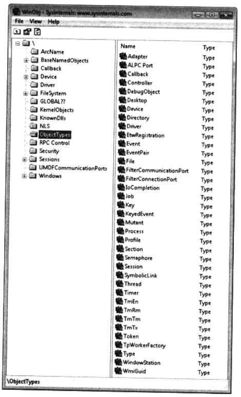

## 何为内核对象

​		作为 Windows 软件开发人员，我们经常都要创建、打开和处理内核对象。系统会创建和处 理几种类型的内核对象，比如**访问令牌 ( access token ) **对象、**事件**对象、**文件**对象、**文件映射**对象、**I/O完成端口**对象、**作业**对象、**邮件槽 ( mailslot )**对象、**互斥量 ( mutex ) **对象、**管道 (pipe)** 对象、**进程**对象、**信号量（semaphore）**对象、**线程**对象、**可等待的计时器(waitable timer)** 对象 以及**线程池工厂 ( thread pool worker factory )** 对象等。利用 Sysintemals 的免费工具  WinObj ( http://www.microsoft,com/technet/sysintemals/utilities/winobj.mspx )，可以查看一个包含所有内核对象类型的列表。为了看到下页图所示的这个列表，必须在 Windows 资源管理器中，以管现员身份运行此工具。

​		这些对象是通过小同名称的函数来创建的，函数的名称并非肯定与操作系统内核级别上使用的对象类型对应。例如，调用 **CreateFileMapping** 函数，系统将创建对应于一个 **Section** 对象的文件映射 ( 如我们在 WinObj 中所见的那样 ) 。每个内核对象都只是一个内存块，它由操作系统内核分配，并只能由操作系统内核访问。这个内存块是一个数据结构，其成员维护着与对象相关的信息。少数成员 ( 安全描述符和使用计数等 ) 是所有对象都有的，但其他大多数成员都是不同类型的对象特有的。例如，进程对象有一个进程 ID 、一个基本的优先级和一个退出代码；而文件对象有一个**字节偏移量 ( byte offset ) **、一个共享模式和一个打开模式。



​		由于内核对象的数据结构只能由操作系统内核访问，所以应用程序不能在内存中定位这些数据结构并直接更改其内容。Microsoft 有意强化了这个限制，确保内核对象结构保持一致性状态。正是因为有这个限制，所以 Microsoft 能自由地添加、删除或修改这些结构中的成员，同时不会干扰任何应用程序的正常运行。

​		既然不能直接更改这些结构，应用程序应该如何操纵这些内核对象呢？答案是利用 Windows 提供的一组函数，这组函数会以最恰当的方式来操纵这些结构。我们始终可以使用这些函数来访问这些内核对象。调用一个会创建内核对象的函数后，函数会返回一个**句柄 ( handle )** ,它标识了所创建的对象。可以将这个句柄想象为一个**不透明 ( opaque )** 的值，它可由进程中的任何线程使用。在 32 位 Windows 进程中，句柄是一个 32 位值；在 64 位 Windows 进程中，则是一个 64 位值。为了让操作系统知道我们要对哪个内核对象进行操作， 我们需要将这个句柄传给各种 Windows 函数。本章后面将进一步论及这些句柄。

​		为了增强操作系统的可靠性，这些句柄值是与进程相关的。所以，如果将句柄值传给另一个进程中的线程(通过某种进程间通信方式)，那么另一个进程用我们的进程的句柄值来发出调用时，就可能失败；甚至更糟糕的是，它们会根据该句柄在我们的进程句柄表的索来引用，另一个进程中的完全不同的内核对象。3.3 节 “ 跨进程边界共享内核对象 ” 将介绍 3 种机制，我们可利用它们实现多个进程成功共享同一个内核对象。


### 1.使用计数

​		内核对象的所有者是操作系统内核，而非进程。换言之，如果我们的进程调用一个函数来创建了一个内核对象，然后进程终止运行，则内核对象并不一定会销毁。大多数情况下， 这个内核对象是会销毁的，但假如另一个进程正在使用我们的进程创建的内核对象，那么在其他进程停止使用它之前，它是不会销毁的。总之，内核对象的生命期可能长于创建它的那个进程。

​		操作系统内核知道当前有多少个进程正在使用一个特定的内核对象，因为每个对象都包含—个**使用计数 ( usage count )**。使用计数是所有内核对象类型都有的一个数据成员。初次创建一个对象的时候，其使用计数被设为 1 。另一个进程获得对现有内核对象的访问后，使用计数就会递增。进程终止运行后，操作系统内核将自动递减此进程仍然打幵的所有内核对象的使用计数。如果一旦对象的使用计数变成 0 , 操作系统内核就会销毁该对象。这样一来，可以保证系统中不存在没有被任何进程引用的内核对象。


### 2.内核对象的安全性

​		内核对象叫以用一个**安全描述符 ( security descriptor, SD ) **来保护。安全描述符描述了谁 ( 通常是对象的创建者 ) 拥有对象：哪些用户和用户被允许访问或使用此对象；哪些组和用户被拒绝访问此对象。安全描述符通常在编写服务器应用程序的时候使用。但是，在 Microsoft Windows Vista 中，对于具有专用 ( private ) 命名空间的客户端应用程序，这个特性变得更加明显，详见本章以及 4.5 节 “ 管理员以标准用户权限运行时 ” 。

​		用于创建内核对象的所有函数几乎都有指向一个 SECURITY_ATTRIBUTES 结构的指针作为参数，如下面的CreateFileMapping 函数所示：

```c++
HANDLE CreateFileMapping{
    HANDLE 				  hFile,
    PSECURITY_ATTRIBUTES  psa,
    DWORD 				  flProtect,
    DWORD 				  dwMaximumSizeHigh,
    DWORD 				  dwMaximumSizeLow,
	PCTSTR   			  pszName
};
```

​		大多数应用程序只是为这个参数传入 NULL ,这样创建的内核对象具有默认的安全性—— 具体包括哪些默认的安全性，要取决于当前进程的**安全令牌 ( security token )** 。 但是，也可以分配一个 **SECURITY_ATTRIBUTES** 结构，并对它进行初始化，再将它的地址传给这个参数。**SECURITY_ATTRIBUTES** 结构如下所示：

```c++
typedef struct _SECURITY_ATTRIBUTES {
	DWORD   nLength;
	LPVOID  IpSecurityDescriptor；
	BOOL    blnheritHandle；
} SECURITY_ATTRIBUTES;
```

​		虽然这个结构称为 **SECURITY_ATTRIBUTES**，但它实际只包含一个和安全性有关的成员，即**IpSecurityDescriptor** 。如果想对我们创建的内核对象加以访问限制，就必须创建一个安全描述符，然后像下面这样初始化 **SECURITY_ATTRIBUTES** 结构：

```c++
SECURITY_ATTRIBUTES sa;

sa.nLength = sizeof(sa); 		  // Used for versioning
sa.IpSecurityDescriptor = pSD;    // Address of an initialized SD
sa.blnheritHandle = FALSE; 		  // Discussed later

HANDLE hFileMapping = CreateFileMapping(INVALID_HANDLE_VALUE, &sa,
	PAGE_READWRITE, 0, 1024, TEXT{"MyFileMapping"));
```

​		由于这个成员与安全性没有任何关系，所以我将把 **blnheritHandle** 成员推迟到 3.3.1 节“使用对象句柄继承”讨论。

​		如果想访问现有的内核对象 ( 而不是新建一个 ) ，必须指定打算对此对象执行哪些操作。例如，如果想访问一个现有的文件映射内核对象，以便从中读取数据，那么可以像下面这样 调用 **OpenFileMapping** :

```c++
HANDLE hFileMapping = OpenFileMapping(FILE_MAP_READ, FALSE,
	TEXT("MyFileMapping"));
```

​		将 **FILE_MAP_READ** 作为第一个参数传给 **OpenFileMapping** , 表明要在获得对这个文件映射对象的访问权之后，从中读取数据。**OpenFileMapping** 函数在返回一个有效的句柄值之前，会先执行一次安全检查。如果我 ( 当前登录的用户 ) 被允许访问现有的文件映射内核对象，**OpenFileMapping** 会返回一个有效的句柄值。但是，如果访问被拒绝， **OpenFileMapping** 就会返回 NULL ；如果调用 **GetLastError** ,将返回值 **5( ERROR_ACCESS_DENIED )**。记住，如果利用返回的句柄来调用一个 API , 但这个 API 需要的权限不是 **FILE_MAP_READ** , 那么同样会发生 “ 拒绝访问 ” 错误。由于大多数应用程序都不使用安全性，所以这里不打算进一步讨论这个主题了。

​		虽然许多应用程序都不需要关心安全性，但许多 Windows 函数都要求传入必要的安全访问信息。为老版本 Windows 设计的一些应用程序之所以在 Windows Vista 上不能正常工作， 就是因为在实现这些程序时，没有充分考虑安全性。

​		例如，<u>假定一个应用程序在启动时要从一个注册表子项中读取一些数据。正确的做法是调用 **RegOpenKeyEx** , 向其传入 **KEY-QUERY-VALUE** , 从而指定査询子项数据的权限</u> 。

​		然而，许多应用程序都是为 Windows 2000 之前的操作系统开发的，对安全性没有任何考虑。有的软件开发人员还是按照老习惯，在调用 **RegOpenKeyEx** 函数的时候，传入 **KEY_ALL_ACCESS** 作为期望的访问权限。之所以喜欢这样做，是由于它更简卓，不需要动脑筋想需要什么权限。但是，这样做的问题在于，对于一个不是管理员的标准用户，注册表项 ( 比如 HKLM ) 也许是只读的。所以，当这样的应用程序在 Windows Vista 上面运行时， 调用 **RegOpenKeyEx** 函数并传递 **KEY_ALL_ACCESS** 就会失败。另外，如果没有正确的错误检查，运行这样的应用程序会得到完全不可预料的结果。

​		其实，开发人员只需稍微注意一下安全性，将 **KEY_ALL_ACCESS** 改为 **KEY_QUERY_VALUE** ( 在本例中只需如此 )，应用程序就能在所有操作系统平台上正常运行了。

​		忽视正确的安全访问标志是很多开发人员最大的失误之一。只要使用了正确的安全访问标志，我们的程序就很容易在不同版本的 Windows 之间移植。不过，还需注意到，每个新版本的 Windows 会带来老版本中没有的一套新的限制。例如在 Windows Vista 中，我们需要关注 “ 用户帐户控制 ”（User Account Control，UAC）特性。默认情况下，为安全起见，UAC 会强制应用程序在一个受限的上下文中运行，即使当前用户是 Administrators 组的成员。我 们将在第 4 章 “ 进程 ” 详细讨论 UAC 。

​		除了使用内核对象，应用程序可能还要使用其他类型的对象，比如菜单、窗口、鼠标光标、 画刷和字体。这些属于用户对象或 **GDI ( Graphical Device Interface )** 对象，而非内核对象。首次进行 Windows 编程时，往往很难区分用户 / GDI 对象和内核对象。例如，图标是用户对象还是内核对象？要想判断一个对象是不是内核对象，最简单的方式是査看创建这个对象的函数。几乎所有创建内核对象的函数都有一个允许我们指定安全属性信息的参数，就像前面展示的 **CreateFileMapping** 函数一样。

​		相反，用于创建用户对象或 GDI 对象的函数都没有 **PSECURITY_ATTRIBUTES** 参数例如下面的 **Createlcon** 函数：

```c++
HICON CreateIcon{
	HINSTANCE hinst,
    int nWidth, 
    int nHeight,
	BYTE cPlanes,
	BYTE cBitsPixel,
	CONST BYTE *pbANDbits,
	CONST BYTE *pbXORbits
};
```

​		MSDN 上有一篇文章 ( 网址为 http://msdn.microsoft.com/msdnmag/issues/03/01/GDILeaks ) 详细讨论了 GDI 和用户对象，以及如何跟踪这些对象。