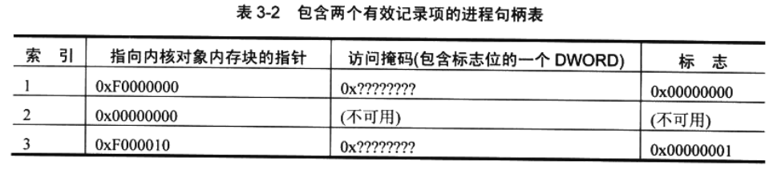
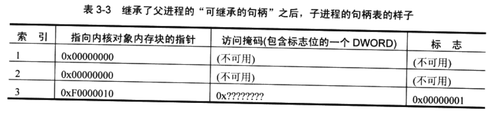

## 跨进程边界共享内核对象


在很多时候，不同进程中运行的线程需要共享内核对象。下面罗列了一些理由。

* 利用文件映射对象，可以在同一台机器上运行的两个不冋进程之间共享数据块。

* 借助邮件槽和命名管道，在网络中的不同计算机上运行的进程可以相互发送数 据块。

* 互斥量、信号量和事件允许不同进程中的线程同步执行。例如，一个应用程序吋能 需要在完成某个任务之后，向另一个应用程序发出通知。

​        由于内核对象的句柄是与每一个进程相关的，所以执行这些任务并不轻松。不过，Microsoft 也有充分的理由需要将句柄设计成“与进程相关的”（process-relative)的。其中最電要的原 因是健壮性(可靠性)。如果把内核对象句柄设计成相对于整个系统，或者说把它们设计成 “系统级”的句柄，一个进程就可以很容易获得到“另一个进程止在使用的一个对象”的 句柄，从而对该进程造成严重破坏。之所以将句柄设计成“与进程相关的”，或者说把它 们设计成“进程级”句柄的，另一个原因是安全性。内核对象是受安全性保护的，进程在 试图操纵一个对象之前，必须先申请操纵它的权限。对象的创建者为了阻止一个未经许可 的用户“碰”自己的对象，只需拒绝该用户访问它。

​		在下一节，我们要讨论如何利用三种不同的机制来允许进程共享内核对象：使用对象句柄继承；为对象命名；复制对象句柄。


### 1.使用对象句柄继承

​		只有在进程之间有一个父 - 子关系的时候，才可以使用对象句柄继承。在这种情况下，父进程有一个或多个内核对象句柄可以使用，而且父进程决定生成一个子进程，并允许子进程访问父进程的内核对象。为了使这种继承生效，父进程必须执行几个步骤。

​		首先，当父进程创建一个内核对象时，<u>父进程必须向系统指出它希望这个对象的句柄是可以继承的</u>。有时听到别人说起 “ 对象继承 ” 这个词。但是，世界上根本没有 “ 对象继承 ” 这样的事情。Windows 支持的是 “ 对象句柄的继承 ” ；换言之，只有句柄才是可以继承的， 对象本身是不能继承的。

​		为了创建一个可继承的句柄，父进程必须分配并初始化一个 **SECURITY_ATTRIBUTES** 结构，并将这个结构的地址传给具体的 **Create** 函数。以下代码创建了一个互斥量对象，并返回其可继承的句柄：

```c++
SECURITY_ATTRIBUTES sa;
sa.nLength = sizeof(sa);
sa.IpSecurityDescriptor = NULL;
sa.blnhericHandle = TRUE; // Make the returned handle inheritable.

HANDLE hMutex * CreateMutex(&sa, FALSE, NULL);
```

​		以上代码初始化了一个 **SECURITY_ATTRIBUTES** 结构，表明对象要用默认安全性来创建，而且返回的句柄应该是可继承的。

​		接下来谈谈在进程的句柄表记录项中保存的标志。句柄表中的每个记录项都有一个指明句柄足否吋以继承的标志位。如果在创建内核对象的时候将 NULL 作为 **PSECUR1TY_ATTRIBUTES** 参数传入，则返回的句柄是不可继承的，这个标志位为 0 。 将 **blnheritHandle** 成员设为 **TRUE**，则导致这个标志位被设为 1 。

​		以表3-2的进程句柄表为例。在这个例子中，进程有权访问两个内核对象(句柄1和3)。句柄 1 足不可继承的，但句柄 3 是可以继承的。



​		为了使用对象句柄继承，下一步是由父进程生成子进程。这是通过 **CreateProcess** 函数来完成的，如下所示：

```c++
BOOL CreateProcess(
	PCTSTR pszApplicationName,
	PTSTR pszCommandLine,
	PSECURITY_ATTRIBUTES psaProcess,
	PSECURITY_ATTRIBUTES psaThread,
	BOOL blnheritHandles,
	DWORD dwCreationFlags,
	PVOID pvEnvironment,
	PCTSTR pszCurrentDirectory,
	LPSTARTUPINFO pStartupInfo,
	PPROCESS_INFORMATION pProcessInformation
);
```

​		我们将在第4章洋细讨论这个函数，现在请注意 **blnheritHandles** 参数。通常情况下，在生成一个进程时，我们要将该参数设为 FALSE 。这个值向系统表明：我们不希望子进程继承父进程句柄表中的 “ 可继承的句柄 ” 。

​		相反，如果向这个参数传递 TRUE , 子进程就会继承父进程的 “ 可继承的句柄 ” 的值。传递 TRUE 时，操作系统会创建新的子进程，但不允许子进程立即执行它的代码。当然，系统会为子进程创建一个新的、空白的进程句柄表——就像它为任何一个新进程所做的那样。 但是，由于我们传给 **CreateProcess** 函数的 **blnheritHandles** 参数的值是 **TRUE**，所以系统还会多做一件事情：它会遍历父进程的句柄表，对它的每一个记录项进行检査。凡是包含一个有效的 “ 可继承的句柄 ” 的项，都会被完整地复制到子进程的句柄表。在子进程的句柄表中，复制项的位置与它在父进程句柄表中的位置是完全一样的。这是非常重要的一个设计，因为它意味着：在父进程和子进程中，对一个内核对象进行标识的句柄值是完全一样的。

​		除了复制句柄表的记录项，系统还会递增内核对象的使用计数，因为两个进程现在都在使用这个对象。为了销毁内核对象，父进程和子进程要么都对这个对象调用 **CloseHandle**， 要么都终止运行。子进程不—定先终止——但父进程也不一定。事实上，父进程可以在 **CreateProcess** 函数返回之后立即关闭它的内核对象句柄，子进程照样可以操纵这个对象。

​		表 3-3 显示了子进程在被允许开始执行之前的句柄表。可以看出，第一项和第二项没有初始化，所以对子进程来说无效的句柄，不可以使用。但是，索引 3 标识了一个内核对象。 事实上 , 它标识的是地址 0xF0000010 处的内核对象，与父进程句柄表中的对象一样。



​		第 13 章将讲到，内核对象的内容被保存在内核地址空间中——系统上运行的所有进程都共享这个空间。对于32 位系统，这是 0x80000000 到 0xFFFFFFFF 之间的内存空间。对于 64 位系统，则是0x00000400’ 00000000到0xFFFFFFF’ FFFFFFFF 之间的内存空间。访问掩码与父进程中的一样，标志也是一样的。这意味着假如子进程用 **CreateProcess** 来生成它自己的子进程 ( 其父进程的孙进程 ) 并将 **blnheritHandles** 参数设为 **TRUE** 的前提下，孙进程也会继承这个内核对象句柄。在孙进程的句枘表中，继承的对象句柄将具有相同的句柄值、 相同的访问掩码以及相同的标志。内核对象的使用计数将再次递增。

​		记住，对象句柄的继承只会在生成子进程的时候发生。假如父进程后来又创建了新的内核对象，并同样将它们的句柄设为可继承的句柄。那么正在运行的子进程是不会继承这些新句柄的。

​		对象句柄继承还有一个非常奇怪的特征：子进程并不知道自己继承了任何句柄。在子进程的文档中，应指出当它从另一个进程生成时，希望获得对一个内核对象的访问权——只有在这种情况下 , 内核对象的句柄继承才是有用的。通常，父应用程序和子应用程序是由同一家公司编写的：但是，假如一家公司能在文档中说明子应用程序希望继承哪些对象句枘， 那么另一家公司就可以据此来编写一个子应用程序。

​		到目前为止，为了使子进程得到它想要的一个内核对象的句柄值，最常见的方式是将句柄值作为命令行参数传给子进程。子进程的初始化代码将解祈命令行 ( 通常是调用 _stscanf_s )， 并提取句柄值。子进程获得句柄值之后，就会拥有和父进程一样的内核对象访问权限。注意，<u>句柄继承之所以能够实现，唯一的原因就是 “ 共享的内核对象 ” 的句柄值在父进程和子进程中是完全一样的</u>。这正是父进程能将句柄值作为命令行参数来传递的原因。


​		当然，也可以使用其他进程间通信技术将继承的内核对象句柄值从父进程传入子进程:

- 一个技术是让父进程等待子进程完成初始化 ( 利用第9章讨论的 **WaitForlnputldle** 函数)；然后，父进程可以将一条消息发送或发布到由子进程中的一个线程创建的一个窗口。

* 另一种方式是让父进程向其环境块添加一个环境变量。变量的名称应该是子进程知道的一个名称，而变量的值应该是准备被子进程继承的那个内核对象的句柄值。然后，当父进程生成子进程的时候，这个子进程会继承父进程的环境变量，所以能轻松调用 **GetEnvironmentVariable** 来获得这个继承到的内核对象的句柄值。如果子进程还要生成另一个子进程，这种方式就非常不错，因为环境变量是可以反复继承的。Microsoft 知识库的一篇文章 ( 网址为 http://support.microsoft.eom/kb/l90351 ) 描述了子进程继承父控制台的特例。