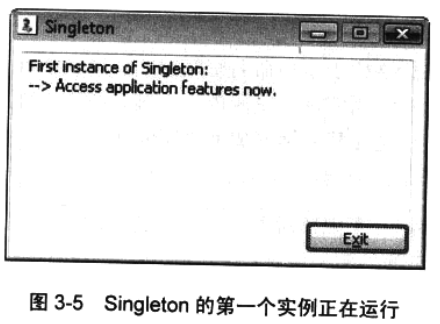
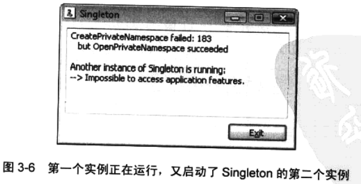

## 跨进程边界共享内核对象


在很多时候，不同进程中运行的线程需要共享内核对象。下面罗列了一些理由。

* 利用文件映射对象，可以在同一台机器上运行的两个不冋进程之间共享数据块。

* 借助邮件槽和命名管道，在网络中的不同计算机上运行的进程可以相互发送数 据块。

* 互斥量、信号量和事件允许不同进程中的线程同步执行。例如，一个应用程序吋能 需要在完成某个任务之后，向另一个应用程序发出通知。

​        由于内核对象的句柄是与每一个进程相关的，所以执行这些任务并不轻松。不过，Microsoft 也有充分的理由需要将句柄设计成“与进程相关的”（process-relative)的。其中最電要的原 因是健壮性(可靠性)。如果把内核对象句柄设计成相对于整个系统，或者说把它们设计成 “系统级”的句柄，一个进程就可以很容易获得到“另一个进程止在使用的一个对象”的 句柄，从而对该进程造成严重破坏。之所以将句柄设计成“与进程相关的”，或者说把它 们设计成“进程级”句柄的，另一个原因是安全性。内核对象是受安全性保护的，进程在 试图操纵一个对象之前，必须先申请操纵它的权限。对象的创建者为了阻止一个未经许可 的用户“碰”自己的对象，只需拒绝该用户访问它。

​		在下一节，我们要讨论如何利用三种不同的机制来允许进程共享内核对象：使用对象句柄继承；为对象命名；复制对象句柄。


### 1.使用对象句柄继承

​		只有在进程之间有一个父 - 子关系的时候，才可以使用对象句柄继承。在这种情况下，父进程有一个或多个内核对象句柄可以使用，而且父进程决定生成一个子进程，并允许子进程访问父进程的内核对象。为了使这种继承生效，父进程必须执行几个步骤。

​		首先，当父进程创建一个内核对象时，<u>父进程必须向系统指出它希望这个对象的句柄是可以继承的</u>。有时听到别人说起 “ 对象继承 ” 这个词。但是，世界上根本没有 “ 对象继承 ” 这样的事情。Windows 支持的是 “ 对象句柄的继承 ” ；换言之，只有句柄才是可以继承的， 对象本身是不能继承的。

​		为了创建一个可继承的句柄，父进程必须分配并初始化一个 **SECURITY_ATTRIBUTES** 结构，并将这个结构的地址传给具体的 **Create** 函数。以下代码创建了一个互斥量对象，并返回其可继承的句柄：

```c++
SECURITY_ATTRIBUTES sa;
sa.nLength = sizeof(sa);
sa.IpSecurityDescriptor = NULL;
sa.blnhericHandle = TRUE; // Make the returned handle inheritable.

HANDLE hMutex * CreateMutex(&sa, FALSE, NULL);
```

​		以上代码初始化了一个 **SECURITY_ATTRIBUTES** 结构，表明对象要用默认安全性来创建，而且返回的句柄应该是可继承的。

​		接下来谈谈在进程的句柄表记录项中保存的标志。句柄表中的每个记录项都有一个指明句柄足否吋以继承的标志位。如果在创建内核对象的时候将 NULL 作为 **PSECUR1TY_ATTRIBUTES** 参数传入，则返回的句柄是不可继承的，这个标志位为 0 。 将 **blnheritHandle** 成员设为 **TRUE**，则导致这个标志位被设为 1 。

​		以表3-2的进程句柄表为例。在这个例子中，进程有权访问两个内核对象(句柄1和3)。句柄 1 足不可继承的，但句柄 3 是可以继承的。


​		为了使用对象句柄继承，下一步是由父进程生成子进程。这是通过 **CreateProcess** 函数来完成的，如下所示：

```c++
BOOL CreateProcess(
	PCTSTR pszApplicationName,
	PTSTR pszCommandLine,
	PSECURITY_ATTRIBUTES psaProcess,
	PSECURITY_ATTRIBUTES psaThread,
	BOOL blnheritHandles,
	DWORD dwCreationFlags,
	PVOID pvEnvironment,
	PCTSTR pszCurrentDirectory,
	LPSTARTUPINFO pStartupInfo,
	PPROCESS_INFORMATION pProcessInformation
);
```

​		我们将在第4章洋细讨论这个函数，现在请注意 **blnheritHandles** 参数。通常情况下，在生成一个进程时，我们要将该参数设为 FALSE 。这个值向系统表明：我们不希望子进程继承父进程句柄表中的 “ 可继承的句柄 ” 。

​		相反，如果向这个参数传递 TRUE , 子进程就会继承父进程的 “ 可继承的句柄 ” 的值。传递 TRUE 时，操作系统会创建新的子进程，但不允许子进程立即执行它的代码。当然，系统会为子进程创建一个新的、空白的进程句柄表——就像它为任何一个新进程所做的那样。 但是，由于我们传给 **CreateProcess** 函数的 **blnheritHandles** 参数的值是 **TRUE**，所以系统还会多做一件事情：它会遍历父进程的句柄表，对它的每一个记录项进行检査。凡是包含一个有效的 “ 可继承的句柄 ” 的项，都会被完整地复制到子进程的句柄表。在子进程的句柄表中，复制项的位置与它在父进程句柄表中的位置是完全一样的。这是非常重要的一个设计，因为它意味着：在父进程和子进程中，对一个内核对象进行标识的句柄值是完全一样的。

​		除了复制句柄表的记录项，系统还会递增内核对象的使用计数，因为两个进程现在都在使用这个对象。为了销毁内核对象，父进程和子进程要么都对这个对象调用 **CloseHandle**， 要么都终止运行。子进程不—定先终止——但父进程也不一定。事实上，父进程可以在 **CreateProcess** 函数返回之后立即关闭它的内核对象句柄，子进程照样可以操纵这个对象。

​		表 3-3 显示了子进程在被允许开始执行之前的句柄表。可以看出，第一项和第二项没有初始化，所以对子进程来说无效的句柄，不可以使用。但是，索引 3 标识了一个内核对象。 事实上 , 它标识的是地址 0xF0000010 处的内核对象，与父进程句柄表中的对象一样。


​		第 13 章将讲到，内核对象的内容被保存在内核地址空间中——系统上运行的所有进程都共享这个空间。对于32 位系统，这是 0x80000000 到 0xFFFFFFFF 之间的内存空间。对于 64 位系统，则是0x00000400’ 00000000到0xFFFFFFF’ FFFFFFFF 之间的内存空间。访问掩码与父进程中的一样，标志也是一样的。这意味着假如子进程用 **CreateProcess** 来生成它自己的子进程 ( 其父进程的孙进程 ) 并将 **blnheritHandles** 参数设为 **TRUE** 的前提下，孙进程也会继承这个内核对象句柄。在孙进程的句枘表中，继承的对象句柄将具有相同的句柄值、 相同的访问掩码以及相同的标志。内核对象的使用计数将再次递增。

​		记住，对象句柄的继承只会在生成子进程的时候发生。假如父进程后来又创建了新的内核对象，并同样将它们的句柄设为可继承的句柄。那么正在运行的子进程是不会继承这些新句柄的。

​		对象句柄继承还有一个非常奇怪的特征：子进程并不知道自己继承了任何句柄。在子进程的文档中，应指出当它从另一个进程生成时，希望获得对一个内核对象的访问权——只有在这种情况下 , 内核对象的句柄继承才是有用的。通常，父应用程序和子应用程序是由同一家公司编写的：但是，假如一家公司能在文档中说明子应用程序希望继承哪些对象句枘， 那么另一家公司就可以据此来编写一个子应用程序。

​		到目前为止，为了使子进程得到它想要的一个内核对象的句柄值，最常见的方式是将句柄值作为命令行参数传给子进程。子进程的初始化代码将解祈命令行 ( 通常是调用 _stscanf_s )， 并提取句柄值。子进程获得句柄值之后，就会拥有和父进程一样的内核对象访问权限。注意，<u>句柄继承之所以能够实现，唯一的原因就是 “ 共享的内核对象 ” 的句柄值在父进程和子进程中是完全一样的</u>。这正是父进程能将句柄值作为命令行参数来传递的原因。


​		当然，也可以使用其他进程间通信技术将继承的内核对象句柄值从父进程传入子进程:

- 一个技术是让父进程等待子进程完成初始化 ( 利用第9章讨论的 **WaitForlnputldle** 函数)；然后，父进程可以将一条消息发送或发布到由子进程中的一个线程创建的一个窗口。

* 另一种方式是让父进程向其环境块添加一个环境变量。变量的名称应该是子进程知道的一个名称，而变量的值应该是准备被子进程继承的那个内核对象的句柄值。然后，当父进程生成子进程的时候，这个子进程会继承父进程的环境变量，所以能轻松调用 **GetEnvironmentVariable** 来获得这个继承到的内核对象的句柄值。如果子进程还要生成另一个子进程，这种方式就非常不错，因为环境变量是可以反复继承的。Microsoft 知识库的一篇文章 ( 网址为 http://support.microsoft.eom/kb/l90351 ) 描述了子进程继承父控制台的特例。


### 2.改变句柄的标志

​		有时可能遇到这样一种情况：父进程创建了一个内核对象，得到了一个可继承的句柄，然后生成了两个子进程。但是，父进程只希望其中的一个子进程继承内核对象句柄。换言之, 我们冇时可能想控制哪些子进程能继承内核对象句柄。可以调用 **SetHandlelnformation** 函数来改变内核对象句枘的继承标志。如下所示： 

```C
B00L SetHandlelnformation(
	HANDLE hObject,
	DWORD dwMask,
	DWORD dwFlags
);
```

​		可以看出，这个函数有三个参数。第一个参数 **hObject** 标识了一个有效的句柄。第二个参数**dwMask**告诉函数我们想更改哪个或者哪些标志。目前，每个句柄都关联了两个标志：

```c
#define HANDLE_FLAG_INHERIT 0x00000001

#define HANDLE_FLAG_PROTECT_FR0M_CLOSE 0x00000002
```

​		如果想把每个对象的标志一次性史改完毕，可以对这两个标志执行一次按位或运算。**SetHandlelnformation** 函数的第二个参数 **dwFlags** 指出希望把标志设为什么。例如，要打开一个内核对象句柄的继承标志，可以像下面这样写：

```c
SetHandlelnformation(hObj, HANDLE_FLAG_INHERIT, HANDLE_FLAG_INHERIT);
```

要关闭这个标志，吋以像下面这样写：

```c
SetHandleInformation(hObj, HANDLE_FLAG_INHERIT, 0);
```

**HANDLE_FLAG_PROTECT_FROM_CLOSE**标志告诉系统不允许关闭句柄：

```c
SetHandlelnformation(hObj, HANDLE_FLAG_PROTECT_FROM_CLOSE,
		HANDLE_FLAG_PROTECT_FROM_CLOSE);

CloseHandle(hObj); // 会引发异常
```

​		如果在调试器下运行，一旦线程试图关闭一个受保护的句柄，**CloseHandle**就会引发一个异常。如果在调试器的控制之外，**CloseHandle**只是返回**FALSE**。几乎没有多大必要阻止句柄被关闭。但是，如果我们的一个进程会生成一个子进程，后者再生成一个孙进程，那么这个标志还是有用的。父进程可能希望孙进程依然能够从子进程那里继承对象句柄。但是，子进程可能在生成孙进程之前就关闭了那个句柄。如果发生这种情况，父进程就不能 和孙进程通信了，因为可怜的孙进程根本没有继承到内核对象(句柄)。相反，如果将句柄标记为“PROTECT FROM CLOSE”（禁止关闭)，孙进程就有更大的机会继承到指向一个有效的、活动的内核对象的句柄。

​		不过，正如前面所说的，孙进程现在只是“机会”更大一些。这种方式的不足之处在于，处于中间位置的那个子进程可以调用以下代码来关闭 **HANDLE_FLAG_PROTECT_FROM_CLOSE** 标志，然后关闭句柄：

```c
SetHandleInformation(hobj, HANDLE_FLAG_PROTECT_FROM_CLOSE, 0);
CloseHandle(hObj)；
```

​		也就是说，父进程其实是在賭自己的子进程不会执行上述代码。但即使没有这个问题，子进程真的就会生成孙进程吗？这同样是在赌。反正都是赌，第一个赌看起来也就没有那么危险了。

​		考虑到内容的完整性，下面再来讨论一下**GetHandlelnformation**函数：

```c
BOOL GetHandlelnformation(
	HANDLE hObject,
	PDWORD pdwFlags
);
```

​		这个函数会在**pdwFlags**指向的**DWORD**中，返回指定句柄的当前标志。要检查一个句柄是否可以继承，请执行以下代码：

```c
	DWORD dwFlags;
	GetHandlelnformation(hObj, &dwFlags);
	BOOL fHandlelsInheritable = (0 != (dwFlags & HANDLE_FLAG_INHERIT));
```


### 3.为对象命名

​		跨进程边界共亨内核对象的第二个办法是为对象命名。许多(但不是全部 > 内核对象都可以进行命名。例如，以下所有函数都可以创建命名的内核对象：

```c
HANDLE CreateMutex(
	PSECURITY_ATTRIBUTES psa,
	BOOL blnitialOwner,
	PCTSTR pszName
);

HANDLE CreateEvent(
	PSECURITY_ATTRIBUTES psa,
	BOOL bManualReset,
	BOOL blnitialState,
	PCTSTR pszName
);

HANDLE CreateSemaphore(
	PSECURITY_ATTRIBUTES psa,
	LONG lInitialCount,
	LONG IMaximumCount,
	PCTSTR pszName
);

HANDLE CreateWaitableTimer( 
    PSECURITY_ATTRIBUTES psa, 
    BOOL bManualReset,
	PCTSTR pszName
);

HANDLE CreateFileMapping(
    HANDLE hFile, 
    PSECURITY_ATTRIBUTES psa, 
    DWORD flProtect,
	DWORD dwMaximumSizeHigh, 
    DWORD dwMaximumSizeLow, 
    PCTSTR pszName
);

HANDLE CreateJobObject(
	PSECURITY_ATTRIBUTES psa,
    PCTSTR pszName
);
```

​		所有这些函数的最后一个参数都是**pszName**。向此参数传入**NULL**，相当于向系统表明我们要创建一个未命名的(即匿名)内核对象。如果创建的是一个未命名对象，可以利用上一节讨论过的继承技术，或者利用下一节即将讨论的**DuplicateHandle**函数来实现进程间的对象共享。如果要根据对象名称来共享一个对象，我们必须为此对象指定一个名称。

​		如果不为**pszName**参数传递**NULL**,则应该传入一个 “ 以 0 为终止符的名称字符串 ” 的地址。这个名称可以长达**MAX_PATH**个字符(定义为260)。遗憾的是，Microsoft没有提供 任何专门的机制来保证为内核对象指定的名称是唯一的。例如，假如我们试图创建一个名为 “ JeffObj ” 的对象，那么没有任何一种机制来保证当前不存在一个名为 “ JeffObj ” 的对象。更糟的是，所有这些对象都共享同一个命名空间，即使它们的类型并不相同。例如， 以下**CreateSemaphore**函数调用肓定会返回**NULL**,因为已经有一个同名的互斥量对象了：

```c
HANDLE hMutex = CreateMutex(NULL, FALSE, TEXT("JeffObj")); 
HANDLE hSem = CreateSemaphore(NULL, 1, 1, TEXT("JeffObj"));
DWORD dwErrorCode = GetLastError();
```

​		执行上述代码之后，如果检査**dwErrorCode**的值，会发现返回的代码为6 (**ERROR_INVALID_HANDLE**)。这个错误代码当然说明不了什么问题，不过我们目前对 此无能为力。

​		知道如何命名对象之后，接着来看看如何以这种方式共享对象。假设进程 A 启动并调用以下函数：

```c
HANDLE hMutexProcessA = CreateMutex(NULL, FALSE, TEXT("JeffMutex"));
```

​		这个函数调用创建一个新的互斥暈内核对象，并将其命名为 “ JeffMutex ”。注意，在进程 A 的句柄(表)中，**hMutexProcessA**并不是一个可继承的句柄——但是，通过为对象命名来实现共亨时，是否可以继承并非一个必要条件。

​		如果后来某个进程生成了进程 B，那么进程 B 不一定要是进程 A 的子进程：它可能是从 Windows 资源管理器，也可能是其他某个应用程序生成的。**相较于使用句柄继承，利用对象的名称来共享内核对象，最大的一个优势是 “ 进程B不一定是进程A的子进程 ”** 。进程 B 开始执行时，它执行以下代码：

```c
HANDLE hMutexProcessB = CreateMutex(NULL, FALSE, TEXT("JeffMutex"));
```

​		当进程 B 调用**CreateMutex**时，系统首先会查看是否存在一个名为 “ JeffMutex ” 的内核对 象。由于确实存在这样的一个对象，所以内核接着检查对象的类型。由于试图创建一个互斥量对象，而名为 “ JeffMutex ” 的对象也是一个互斥量对象，所以系统接着执行一次安全检查，验证调用者是否拥有对该对象的完全访问权限。如果答案是肯定的，系统就会在进程 B 的句柄表中查找一个空白 id 录项，并将其初始化为指向现有的内核对象。如果对象的类型不匹配，或调用者被拒绝访问，**CreateMutex**就会失败 ( 返回 NULL ) 。

——————————————————————————————————————————————————**说明**	用于创建内核对象的函数 ( 比如 **CreateSemaphore** ) 总是返回具有完全访问权限的句柄.如果想限制一个句柄的访问权限，可以使用这些函数的扩展版本(有一个 ex 后级)，它们接受一个额外的DWORD **dwDesiredAccess**参数。例如，可以在调用 **CreateSemaphoreEx** 时使用或不使用 **SEMAPHORE_MODIFY_STATE**，从而允许或禁止对一个信号量句柄调用 **ReleaseSemaphor**。请阅读Windows SDK文档，了 解与每种内核对象的权限细节，网址是http://msdn2.microsoft.com/en-us/library/ms686670.aspx。——————————————————————————————————————————————————

​		

​		进程 B 调用成功之后，不会实际地创建一个互斥量对象。相反，会为进程 B 分配一个新的句柄值(当然，和所有句柄值一样，这是一个相对于该进程的句柄值)，它标识了内核中的一个现有的互斥量对象。当然，由于在进程 B 的句柄表中，用一个新的记录项来引用了这个对象，所以这个互斥量对象的使用计数会被递增。在进程 A 和进程 B 都关闭这个对象的句柄之前，该对象是不会销毁的。注意，两个进程中的句柄值极有可能是不同的值。这没有什么关系。进程A用它自己的句柄值来引用那个互斥量对象，进程 B 也用它自己的句柄值来引用同一个互斥量对象。


——————————————————————————————————————————————————**说明**	通过名称来实现内核对象共享时，务必关注一点：进程 B 调用 **CreateMutex** 时，它会向函数传递安全属性信息和第二个参数。如果已经存在一个指定名称的对象，这些参数就会被忽略。

​		事实上，完全可以在调用了 Create*之后，马上调用一个 GetLastError，判断自己刚才是真的创建了一个新的内核对象，还是仅仅是打开了一个现有的：

```c
    HANDLE hMutex = CreateMutex(&sa, FALSE, TEXT ("JeffObj"); 
    if(GetLastError()) == ERROR_ALREADY_EXISTS) {
        // Opened a handle to an existing object.
        // sa.lpSecurityDescriptor and the second parameter 
        // (FALSE) are ignored.
    } else {
        // Created a brand new object.
        // sa.IpSecurityDescriptor and the second parameter 
        // (FALSE) are used to construct the object.
    }
```

——————————————————————————————————————————————————


​		为了实现这些内核对象的共享，还可以考虑另一个办法。我们可以不调用 **Create*** 函数：相反，可以调用如下所示的一个 **Open*** 函数：

```c
HANDLE OpenMutex(
	DWORD dwDesiredAccess, 
    BOOL blnheritHandle, 
    PCTSTR pszNcune);

HANDLE OpenEvent(
	DWORD dwDesiredAccess, 
    BOOL blnheritHandle, 
    PCTSTR pszName);

HANDLE OpenSemaphore(
	DWORD dwDesiredAccess, 
    BOOL blnheritHandle, 
    PCTSTR pszName)；

HANDLE OpenWaitableTimer( 
    DWORD dwDesiredAccess, 
    BOOL blnheritHandle, 
    PCTSTR pszName);

HANDLE OpenFileMapping( 
    DWORD dwDesiredAccess, 
    BOOL blnheritHandle, 
    PCTSTR pszName);

HANDLE OpenJobObject(
	DWORD dwDesiredAccess, 
    BOOL blnheritHandle, 
    PCTSTR pszName);
```

​		注意，所有这些函数的原型都是一样的。最后一个参数 **pszName** 指出内核对象的名称。不能为这个参数传入 **NULL**，必须传入一个以 0 为终止符的字符串作为地址。这些函数将在同一个内核对象命名空间搜索，以査找一个匹配的对象。
​				如果没有找到这个名称的一个内核对象，函数将返回 **NULL**，**GetLastError** 将返回 **2(ERROR_FILE_NOT_FOUND)** 。
​				如果找到了这个名称的一个内核对象，但类型不同，函数将返回 **NULL**，**GetLastError** 将返回 **6(ERROR_INVALID_HANDLE)**。
​				如果名称同，类型也同，系统会检査请求的访问 ( 通过**dwDesiredAccess**来指定 ) 是否允许。如果允许，就会更新主调进程的句柄表，并使对象的使用计数递增。如果为**blnheritHandle**参数传入了 **TRUE** , 那么返回的句柄就是 “ 可继承的 ” 。

​		调用 **Create*** 函数和调用 **Open*** 函数的主要区别在于，如果对象不存在，**Create*** 函数会创建它；**Open***函数则不同，如果对象不存在，它只是简单地以调用失败而告终。

​		如前所述，Microsoft 没有提供任何专门的机制来保证我们创建独一无二的对象名。换言之, 如果用户试图运行来自不同公司的两个程序，而且每个程序都试图创建一个名为 “ MyObject ” 的对象，那么就会出问题。为了确保名称的唯一性，我的建议是创建一个 GUID，并将这个 GUID 的字符串形式作为自己的对象名称使用。稍后的3.3.5节 “ 专有命名空间 ” 中将介绍另一种保证名称唯一性的方式。

​		我们经常利用命名对象来防止运行一个应用程序的多个实例。为此，只需在 **_tmain** 或 **_tWinMain** 函数中调用一个 **Create*** 函数来创建一个命名对象 ( 具体创建什么类型无关紧要）。**Create*** 函数返回后，再调用一下**GetLastError**。如果 **GetLastError** 返回 **ERROR_ALREADY_EXlSTS** , 表明应用程序的另一个实例正在运行，新的实例就以退出了。以下代码对此进行了说明：

```c
int WINAPI _tWinMain(HINSTANCE hlnstExe, HINSTANCE, PTSTR pszCmdLine, int nCmdShow) {
    
	HANDLE h = CreateMutex(NULL, FALSE,
		TEXT("{FA531CCl-0497-lld3-A180-00105A276C3E}"));
    
    if (GetLastError() == ERROR_ALREADY_EXISTS) {
		// There is already an instance of this application running.
		// Close the object and immediately return.
		CloseHandle(h); 
        return(0);
	}
	// This is the first instance of this application running.
    ...
	// Before exiting, close the object.
	CloseHandle(h);
    return(0);
}
```


### 4.终端服务命名空间

​		注意，**终端服务(Terminal Service)**的情况和前面描述的稍微有所区别。在正在运行终端服务的计算机中，有多个用于内核对象的命名空间。其中一个是全局命名空间，所有客户端都能访问的内核对象要放在这个命名空间中。这个命名空间主要由服务使用。此外，每个**客户端会话(client session)**都有一个自己的命名空间。对于两个或多个会话正在运行同一个应用程序的情况，这样的安排可以避免会话之间彼此干扰——一个会话不会访问另一个会话的对象，即使对象的名称相冋。

​		并非只有服务器才会遇到这种情况，因为 Remote Desktop(远程桌面) 和 快速用户切换(Fast User Switching)特性也足利用终端服务会话来实现的。

—————————————————————————————————————————————————————**说明**	在没有任何用户登录的时候，服务会在第一个会话 ( 称为Session 0 ) 中启动，这个会话不是交互式的。和以前版本的 Windows 不同，在 Windows Vista 中，只要用户登录，应用程序就会在一个新的会话 ( 与服务专用的Session 0 不同的一个会话 ) 中启动。 采用这个设计之后，系统核心组件 ( 通常具有较高的权限 ) 就可以更好地与用户不慎启动的**恶意软件(malware)**隔离。
		对于服务开发人员，由于必须在与客户端应用程序不同的一个会话中运行，所以会影响到共享内核对象的命名约定。任何对象要想和用户应用程序共享，都必须在全局命名空间中创建它。快速用户切换也会带来类似的问题。我们知道，利用快速用户切换功能，不同的用户可以登录不同的会话，并分别启动自己的用户应用程序， 如果我们写的一个服务要与这些应用程序通信，就不能假定它和用户应用程序在同 一个会话中运行。要想进一步了解 Session 0 隔离问题，及其对服务开发人员的影响， 请阅读 “Impact of Session 0 Isolation on Services and Drivers in Windows Vista” 一文， 网址是 http://www.microsoft.com/whdc/system/vista/services.mspx*—————————————————————————————————————————————————————

​		如果必须知道我们的进程在哪个 Terminal Services 会话中运行，可以借助于 ProcessIdToSessionld 函数 ( 由 kemel32.dll 导出，在 WinBase.h 中声明 )，如下例所示：

```c
DWORD processID = GetCurrentProcessId();
DWORD sessionID;

if (ProcessIdToSessionld(processID, &sessionID)) { 
    tprintf(TEXT("Process '%u' runs in Terminal Services session '%u' "), 
            processID, sessionID);
} else {
	// ProcessIdToSessionld might fail if you don11 have enough rights 
    // to access the process for which you pass the ID as parameter.
	// Notice that it is not the case here because we're using our own process ID.
    tprintf(TEXT("Unable to get Terminal Services session ID for process '%u' "), 
            processID);
)
```

​		一个服务的命名内核对象始终位于全局命名空间内的。默认情况下，在终端服务中，应用程序自己的命名内核对象在会话的命名空间内。不过，我们也可以强制把一个命名对象放入全局命名空间，具体做法是在其名称前加上 “ **Global**\ ” 前缀，如下面的例子所示：

```c
HANDLE h = CreateEvent (NULL, FALSE, FALSE, TEXT{ "Global\\MyName"));
```

​		也可以显式指出我们希望把一个内核对象放入当前会话的命名空间，具体做法式在名称前加上 :  “ **Local**\ ” 前缀，如下面的例子所示：

```c
HANDLE h = CreateEvent(NULL, FALSE, FALSE, TEXT("Local\\MyName"));
```

​		Microsoft 认为 Global 和 Local 是保留关键字，所以除非为了强制一个特定的命名空间，否则不应在对象名称中使用它们。Microsoft 还认为 Session 是保留关键字。所以(举一个例子)， 我们可以使用 Session \ <当前会话 ID > \ 。不过，我们不能使用另一个会话中的名称和 Session 前缀来新建一个对象，这样会导致函数调用失败，**GetLastError**会返回 **ERROR_ACCESS_DENIED**。

—————————————————————————————————————————————————————**说明**		所有保留关键字都是区分大小写的。—————————————————————————————————————————————————————


### 5.专有命名空间

​		创建内核对象时，可以传递指向一个**SECURITY_ATTRIBUTES**结构的指针，从而保护对该对象的访问。不过，在 Windows Vista 发布之前，我们不可能防止一个共享对象的名称被 “ 劫持 ” 。任何进程——即使是最低权限的进程——都能用任何指定的名称来创建一个对象。以前面的例子为例 ( 应用程序用一个命名的互斥量对象来检测该程序的一个实例是否正在运行 )，很容易另外写一个应用程序来创建一个同名的内核对象。如果它先于单实例应用程序启动，“ 单实例 ” 的应用程序就变成了一个 “ 无实例 ” 的应用程序——始终都是一启动就退出，错误地认为它自己的另一个实例已在运行。这是大家熟悉的几种拒绝服务 ( DoS )  攻击的基本机制。注意，未命名的内核对象不会遭受 DoS 攻击。另外，应用程序使用未命名对象是相当普遍的，即使这些对象不能在进程之间共享。

​		如果想确保我们的应用程序创建的内核对象名称永远不会和其他应用程序的名称冲突，或者想确保它们免遭劫持，可以定义一个自定义的前缀，并把它作为自己的专有命名空间使用，这和使用 Global 和 Local 前缀是相似的。负责创建内核对象的服务器进程将定义一个 **边界描述符(boundary descriptor)** , 以对命名空间的名称自身进行保护。

​		Singleton 应用程序 ( 即 03-Singleton.exe，对应的 Singleton.cpp 源代码将在稍后列出 ) 展示了如何利用专有命名空间，以一种更安全的方式来实现前面描述的单实例应用程序。 ( Singleton 是单一的意思，即同时只允许该程序的一个实例 ) 。启动程序后，会出现如图 3-5 所示的窗口。



​		保持程序的运行状态，然后启动同一个程序，就会出现如图3-6所示的窗口，它指出已经检测到了程序另一个实例。



​		研究一下 Singleton.cpp 源代码中的 **Checklnstances** 函数，我们便可以理解三个 “ 如何 ’’： 
​			① 如何创建一个**边界(bondary)**;
​			② 如何将对应于**本地管理员组(Local Administrators)**的一个**安全描述符(security identifier，SID)**和它关联起来;
​			③ 如何创建或打幵其名称被用作互斥量内核对象前缀的一个专有命名空间。

​		边界描述符将获得一个名称，但更重要的是，它会获得与它关联的一个特权用户组的 SID 。这样一来，Windows 就可以确保只有在该用户隶属于这个特权组时，以其身份运行的应用程序才能在相同的边界中创建相同的命名空间，从而访问在这个边界中创建的、以专有命名空间的名称作为前缀的内核对象。

​		如果由于名称和 SID 泄密，导致一个低特权的恶意程序创建了相同的边界描述符，那么 ( 举个例子来说 ) 当它试图创建或打开使用一个高特权帐户保护的专有命名空间时，调用就会失败，**GetLastError**会返回**ERROR_ACCESS_DENIED**。如果恶意程序有足够的权限来创建或打开命名空间，再担心这个就多余了——因为恶意程序有足够的权限来造成更大的破坏，而非仅仅是劫持一个内核对象名称那么简单。

```c
Singleton.cpp
/****************************************************************************************************
Module： Singleton.cpp
Notices： Copyright (c) 2008 Jeffrey Richter & Christophe Nasarre
****************************************************************************************************/
//
 
#include "stdafx.h"
#include "resource.h"
#include "..\CommonFiles\CnuiHdr.h"	/* See Appendix A. */
#include <windowsx.h>
#include <Sddl.h>	// for SID management
#include <tchar.h>
#include <strsafe.h>
    
    
///////////////////////////////////////////////////////////////////////////////
// Main dialog 
HWND g_hDlg;

// Mutex, boundary and namespace used to detect previous running instance
HANDLE	 g_hSingleton = NULL;
HANDLE   g_hBoundary = NULL;
HANDLE	 g_hNeunespace = NULL;

// Keep track whether or not the namespace was created or open for clean-up 
BOOL g_bNamespaceOpened = FALSE;

// Names of boundary and private namespace 
PCTSTR g_szBoundary = TEXT("3-Boundary"); 
PCTSTR g_szNamespace = TEXT("3-Namespace");


#define DETAILS_CTRL GetDlgItem(g_hDlg, IDC_EDIT_DETAILS)
///////////////////////////////////////////////////////////////////////////////

// Adds a string to the "Details" edit control 
void AddText(PCTSTR pszFormat, ...) {
	va_list argList;
	va_start(argList, pszFormat);
    
	TCHAR 32[20 * 1024];
	Edit_GetText(DETAILS_CTRL, sz, _countof(sz)); 
    _vstprintf_s(
	    _tcschr(sz, TEXT('\0')), _countof(sz) - _tcslen(sz),
        pszFormat, argList);
 
	Edit_SetText(DETAILS.CTRL, sz); 
    va_end(argList);
///////////////////////////////////////////////////////////////////////////////

void Dlg_OnCommand(HWND hwnd, int id, HWND hvmdCtl, UINT codeNotify) { 
    switch (id) {
        case IDOK:
	    case IDCANCEL:
            //user has clicked on the exit button
            //or dismissed the dialog with ESCAPE
            EndDialog(hwnd, id);
            break;
    }
}
///////////////////////////////////////////////////////////////////////////////
void Checklnstances() {
	// Create the boundary descriptor
	g_hBouindary = CreateBoundaryDescriptor(g_s2Boundary, 0);
    
	// Create a SID corresponding to the Local Administrator group 
    BYTE localAdminSID[SECURXTY-MAX_SID_SIZE];
	PSID pLocalAdminSID = &localAdminSID;
	DWORD cbSID = sizeof(localAdminSID);
    if (! CreateWellKnownSid(
			WinBuiltinAdministratorsSid, NULL, pLocalAdminSID, &cbSID)
		){
		AddText(TEXT("AddSIDToBoundaryDescriptor failed: %u\r\n"),
                GetLastError());
        return;
    	}
		// Associate the Local Admin SID to the boundary descriptor 
        // --> only applications running under an administrator user 
        // will be able to access the kernel objects in the same namespace 
        if (! AddSIDToBoundaryDescriptor (Ag.JtiBoundary, pLocalAdminSID)) { 
             AddText (TEXT("AddSlDToBoundaryDescriptor failed: %u\r\n"), 
                      GetLastError());
			return;
		}
    
		// Create the namespace for XiOcal Adminietrators only 
    	SECURITY_ATTRIBUTES sa;
    	sa.nLength = sizeof(sa);
    	sa.bInheritHandle = FALSE;
    
		if (!ConvertStringSecurityDescriptorToSecurityDescriptor(
			TEXT("D:(A;;GA;;LBA)"),
			SDDL_REVISION_1, &sa.lpSecurityDescriptbr, NULL)) {
				AddText(TEXT("Security Descriptor creation failed: %u\r\n"), GetLastError());
                  return;
        }
    
		g_hNamespace = CreatePrivateNamespace(&sa, g_hBoundary, g_szNamespace);
    
		// Don't forget to release memory for the security descriptor
    	LocalFree(sa.IpSecurityDescriptor);
    
		// Check the private namespace creation result 
    	DWORD dwLastError = GetLastError(); 
    	if (g_hNamespace == NULL) {
		// Nothing to do if access is denied
		// --> this code must run under a Local Administrator account 
            if (dwLastError == ERROR„ACCESS_DENIED) {
			    AddText(TEXT("Access denied when creating the namespace.\r\n"));
                 AddText(TEXT(" You must be running as Administrator.\r\n\r\n")); 
                 return;
			} else {
				if (dwLastError == ERROR_ALREADY_EXISTS) {
						// If another instance has already created the namespace,
					    // we need to open it instead.
						AddText(TEXT("CreatePrivateNamespace failed: %u\r\n"), dwLastError); 							g_hNamespace = OpenPrivateNamespace(g_hBoundary, g_szNamespace); 
                    	  if (g_hNamespace == NULL) {
							AddText(TEXT(" and OpenPrivateNamespace failed: %u\r\n"),dwLastError);
							return;
                          }	else {
							g_bNamespaceOpened = TRUE;
							AddText(TEXT (" but OpenPrivateNamespace succeeded\r\n\r\n"));
                          }
				} else {
						AddText(TEXT("Unexpected error occured： %u\r\n\r\n"), dwLastError);
                    	  return;
                 }
            }
        }
    
	// Try to create Che mutex object with a name 
    // based on the private namespace 
    TCHAR szMutexName[64];
	StringCchPrintf(szMutexName, _countof(szMutexName), TEXT("_%s\\%s"), g_szNamespace, 	
                    TEXT("Singleton"));
    
	g_hSingleton = CveateMutexfNULL, FALSE, szMutexName);
    if {GetLastError() == ERROR一 ALREADY_EXISTS> {
		// There is already an instance of this Singleton object 
        AddText(TEXT("Another instance of Singleton is running：\r\n"));
        AddText(TEXT("Impossible+.to access application features.\r\n")); 
    } else {
		// First time the Singleton object is created 
         AddText(TEXT("First instance of Singleton:\r\n"));
		AddText(TEXT("-—> Access application features now.\r\n"));
    }
}
    
//////////////////////////////////////////////////////////////////////////////
    
    
BOOL Dlg_OnInitDialog(HWND hwnd, HWND hwndFocus, LPARAM lParam) {
    chSETDLGICONS(hwnd, IDI—SINGLETON);
	// Keep track of the main dialog window handle
    g_hDlg = hwnd；
	// Check whether another instance is already running Checkinstances()；
	return(TRUE);
}
    
///////////////////////////////////////////////////////////////////////////////
    
INT_PTR WINAPI Dlg_Proc(HWND hwnd, UINT uMsg, WPARAM wParam, LPARAH iParam) {
	switch (uMsg) { 
        chHANDL_DLGMSG(hwnd, WM_COMMAND, Dlg_OnConanand);
        chHANDL_DLGMSG(hwnd, WM_INITDIALOG, Dig_OnlnitDialog);
    }
	return(FALSE);
}
    
////////////////////////////////////////////////////////////////；//////////////
int APIENTRY _tWinMain(HINSTANCE hlnstance,
		HINSTANCE hPrevInstance, 
         LPTSTR IpCmdLine, 
         int	nCmdShow)
{
    UNREFERENCED_PARAMETER(hPrevInstance);
	UNREFERENCED_PARAMETERUpCmdLine);
    
	//Show main window
    DialogBox(hlnstance, MAKEINTRESOURCE(IDD_SINGLBTON), NULL, Dlg_Proc);
    
	// Don't forget to clean up and release kernel resources 
    if (g_hSingleton != NULL) {
		CloseHandle(g_hSingleton)}
	}
    
    if (g_hNamespace != NULL) {
        if (g_bNamespaceOpened) {	// Open namespace
        	CIosePrivateNamespace(g_hNamespace, 0);
        } else { // Created namespace
        	CIosePrivateNamespace(g_hNamespace, PRIVATE_NAMESPACE_FLAG_DESTROY);
        }
    }
    
    if (gjiBoundary ! = NULL) {
        DeleteBoundaryDescriptor(g_hBoundary);
    }
    
    return(0);
   
}


//////////////////////////////// End of File //////////////////////////////////
```


​		下而来分析一下**CheckInstances**函数的几个不同的步骤。第一步是创建边界描述符。为此， 需要用一个字符串标识符来命名一个范围，专有命名空间将在这个范围中定义。这个名称作为以下函数的第一个参数进行传递：

```c
HANDLE CreateBoundaryDescriptor{
	PCTSTR pszName,
	DWORD dwFlags
);
```

​		在当前版本的Windows中，第二个参数还没有什么用，因此应该为它传入 0。注意，函数的签名暗示返回值是一个内核对象句柄，但实情并非如此。返回值是一个指针，它指向一个用户模式的结构，结构中包含了边界的定义。由于这个原因，永远都不要把返回的句柄值传给 **CloseHandle** ; 相反，应该把它传给 **DeleteBoundaryDescriptor**。

​		第二步，通过调用以下函数，将一个特权用户组的 SID  (客户端应用程序将在这些用户的上下文中运行)与边界描述符关联起来：

```c
BOOL AddSIDToBoundaryDescriptor(
	HANDLE* phBoundaryDescriptor,
	PSID pRequiredSid
);
```

​		在Singleton示例程序中，为了创建Local Administrator组的SID,我的办法是调用 **AHocateAndlnitializeSid** 函数，并将用于描述这个组的 **SECURITY_BUILTIN_ DOMAIN_RID** 和 **DOMAIN_ALIAS_RID_ADMlNS** 作为参数传入。在 WinNT.h 头文件中， 定义了所有已知的组的一个列表。

​		调用以下函数来创建专有命名空间时，边界描述符(伪)句柄作为第二个参数传给该函数：

```c
HANDLE CreatePrivateNamespace(
	PSECURITY_ATTRIBUTES psa,
	PVOID pvBoundaryDescriptor,
	PCTSTR pszAliasPrefix
);
```

​		作为第一个参数传给该函数的**SECURITY_ATTR1BUTES**是供Windows使用的，用于允许或禁止一个应用程序通过调用**OpenPrivateNamespace**来访问命名空间并在其中打开/创建对象。具体可以使用的选项和 “ 在一个文件系统的目录中可以使用的选项 ” 是完全一样的。这是为 “ 打开命名空间 ” 设置的一个筛选层。为边界描述符添加的 SID 决定 了谁能进入边界并创建命名空间。在Singleton例子中，**SECURITY_ATTRIBUTE**是通过调用 **ConvertStringSecurityDescriptorToSecurityDescriptor** 函数来构造的。该函数获取一个具有复杂语法结构的字符串作为第一个参数。要具体了解安全描述符字符串的语法，请访问以下两个网址：http://msdn2.microsoft.com/en-us/library/aa374928.aspx 和 http://msdn2.microsoft.com/en-us/library/aa379602.aspxo

​		虽然**CreateBoundaryDescriptor**返回的是一个**HANDLE** ( 虽然在Microsoft,这不是一个 内核对象句柄，而是一个伪句柄)，但这里**pvBoundaryDescriptor**的类型是**VOID**。用于创建内核对象的字符串前缀被指定为第三个参数。如果试图创建一个已经存在的专有 命名空间，**CreatePrivateNamespace** 将返回 **NULL**，**GetLastError** 将返回 **ERROR_ALREADY_EXISTS**。在这种情况下，需要使用以下函数来打幵现有的专有命名 空间：

```c
HANDLE OpenPrivateNamespace( PVOID pvBoundaryDescriptor, PCTSTR pszAliasPrefix);
```

​		注意，**CreatePrivateNamespace** 和 **OpenPrivateNamespace** 返回的 **HANDLE** 并不是内核对象句柄；可以调用**ClosePrivateNamespace**来关闭它们返回的这种伪句柄：

```c
BOOLEAN ClosePrivateNamespace(
	HANDLE hNamespace,
	DWORD dwFlags
);
```

​		如果我们已经创建了命名空间，而且不希望它在关闭后仍然町见，应该将 **PRIVATE_NAMESPACE_FLAG_DESTROY**作为第二个参数传给上述函数，反之则传入 0 。边界将在以下两种情况下关闭：进程终止运行或者调用**DeleteBoundaryDescriptor**，并将边界伪句枘作为其唯一的参数传给它。如果还有内核对象正在使用，命名空间一定不能关闭。如果在内部还有内核对象时关闭一个命名空间，其他人就可以在同一个边界中，在重新创建的一个相同的命名空间中，并在其中创建一个同名的内核对象， 使 DoS 攻击再次成为可能。

​		总之，专有命名空间相当于可供我们在其中创建内核对象的一个目录。和其他目录一样， 专有命名空间也有一个和它关联的安全描述符，这个描述符是在调用 **CreatePrivateNamespace**的时候设罝的。但是，和文件系统的目录不同的是，这个命名空间是没有父目录的，也没存名称——我们将 “ 边界描述符 ” 作为对这个边界进行引用的一个名称来使用。正是由于这个原因，所以在 Sysintemals 的 Process Explorer 中，对于  “ 前缀以一个专有命名空间为基础 ” 的内核对象，它们显示的是 “ …\ ” 前缀，而不是我们预期的 “ namespace\ ” 前缀。“ ...\ " 前缀隐藏要保密的信息，能更好地防范潜在的黑 客。我们为专有命名空间指定的名称是一个别名，只在进程内可见。其他进程 ( 甚至是同一个进程 ) 可以打开同一个专有命名空间，并为它指定一个不同的别名。

​		创建普通目录时，需要对父目录执执行一次访问检查，确定是否能在其中创建一个子目录。 类似地，为了创建命名空间，要执行一次边界测试——在当前线程的令牌 ( token ) 中，必须 包含作为边界一部分的所有 SID 。