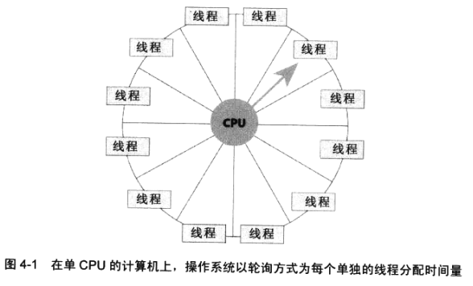

# 进程

​		本章将讨论系统如何管理正在运行的所有应用程序。首先解释什么是进程，系统如何创建 一个进程内核对象来管理每个进程。然后解释如何利用与一个进程关联的内核对象来操纵 该进程。接下来，要讨论进程的各种不同的特性(或属性)，以及用于查洵和更改这些属性 的几个函数。另外，还要讨论如何利用一些函数在系统中创建或生成额外的进程。当然， 最后还要讨论如何终止线程，这是讨论进程时必不可少的主题之一。

​		一般将进程定义成一个正在运行的程序的一个实例，它由以下两部分构成。

* **一个内核对象，操作系统用它来管理进程。**内核对象也是系统保存进程统计信息的地方。

* **—个地址空间，其中包含所有可执行文件(executable)或DLL模块的代码和数据。** 此外，它还包含动态内存分配，比如线程堆栈和堆的分配。

​        进程是有 “ 惰性 ” 的。进程要做任何事情，都必须让一个线程在它的上下文中运行。该线程负责执行进程地址空间包含的代码。事实上，一个进程可以有多个线程，所有线程都在进程的地址空间中 “ 同时 ” 执行代码，为此，每个线程都有它自己的一组 CPU 寄存器和它自己的堆栈。每个进程至少要有一个线程来执行进程地址空间包含的代码。当系统创建一个进程的时候，会自动为进程创建第一个线程，这称为**主线程(primary thread)**。然后，这个线程再创建更多的线程，后者再创建更多的线程……。如果没有线程要执行进程地址空间包含的代码，进程就失去了继续存在的理由。这时，系统会自动销毁进程及其地址空间。

​		对于所有要运行的线程，操作系统会轮流为每个线程调度一些 CPU 时间。它会采取**循环 (roimd-robim轮询或轮流)**方式，为每个线程都分配时间片(称为 “ 量 ” 或者 “ ft 程 ” ，即 quantum ) ,从而营造所有线程都在 “ 并发 ” 运行的假象。图冬1展示了一台单 CPU 的机器的工作方式。

​		如果计算机配备了多个 CPU , 操作系统会采用更复杂的算法为线程分配 CPU 时间。

​		Microsoft Windows 可以同时让不同的 CPU 执行不同的线程，使多个线程能真正并发运行。 在这种类型的计算机系统中，Windows 内核将负责线程的所有管理和调度任务.我们不必在自己的代码中做任何特别的事情，即可享受到多处理器系统带来的好处。不过，为了更好地利用这些CPU,需要我们在应用程序的算法中多做一些文章。