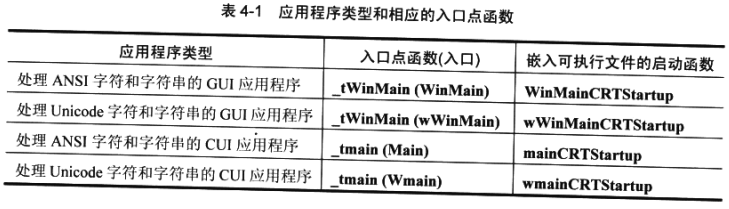
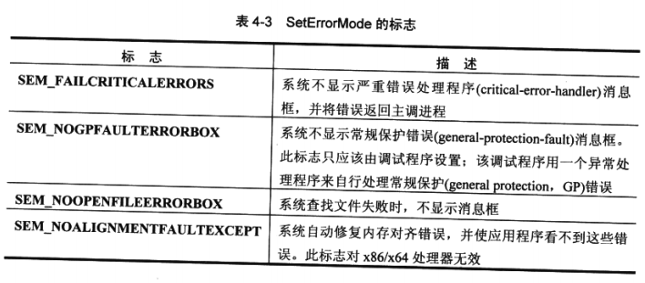

​		Windows 支持两种类型的应用程序 : GUI 程序和 CUI 程序。前者是 “ 图形用户界面” ( Graphical User Interface ) 的简称，后者是 “ 控制台用户界面 ”（Console User Interface ) 的简称。GUI 程序一个图形化的前端。它可以创建窗口，可以拥有菜单，能通过对话框与用户交互，还能使用所有标准的 “ 视窗化 ” 的东西。Windows附带的几乎所有应用程序 ( 比如记事本、计算器和写字板等 ) 都是 GUI 程序。控制台程序则是基于文本的。它们一般不会创建窗口或进程消息，而且不需要 GUI。虽然 CUI 程序是在屏幕上的一个窗口中运行的，但这个窗口中只 有文本。 “ 命令提示符 ” ( 在 Windows Vista下为 CMD.EXE ) 是 CUI 程序的一个典型的例子。

​		其实，这两种应用程序的界线是非常模糊的。我们完全可以创建出能显示对话框的 CUI 应用程序。例如，在执行 CMD.EXE 并打开 “ 命令提示符 ” 后，便可以执行一个特殊的命令来显示一个图形化对话框。在其中选择想要执行的命令，不必强行记住命令行解释器所支持的各种命令。另外，还可以创建一个要向控制台窗口输出文本字符串的 GUI 应用程序。 例如，GUI程序经常都要创建一个控制台窗口，便于我査看应用程序执行期间的调试信息。不过，当然要鼓励大家尽可能在程序中使用一个 GUI , 而不要使用老式的 字符界面，后者对用户来说不太友好！

​		用 Microsoft Visual Studio 来创建一个应用程序项目时，集成开发环境会设置各种链接器开关，使链接器将子系统的正确类型嵌入最终生成的可执行文件(executable)中。对于 CUI 程序，这个链接器开关是/SUBSYSTEM:CONSOLE,对于 GUI 程序，则是/SUBSYSTEM:WINDOWS。

​		用户运行应用程序时，操作系统的加载程序 ( loader ) 会检査可执行文件映像的文件头，并获取这个子系统值。如果此值表明是一个 CUI 程序，加载程序会自动确保有一个可用的文本控制台窗口 ( 比如从命令提示符启动这个程序的时候 ) 。另外, 如有必要，会创建一个新窗口 ( 比如从 Windows 资源管理器启动这个 CUI 程序的时候 ) 。如果此值表明是一个 GUI 程序，加载器就不会创建控制台窗口；相反，它只是加载这个程序。 一旦应用程序开始运行，操作系统就不再关心应用程序的界面是什么类型的。

​		Windows 应用程序必须有一个入口点函数，应用程序开始运行时，这个函数会被调用。 C/C++开发人员可以使用以下两种入口点函数：

```c
Int WINAPI _tWinMain(
	HINSTANCE hlnstanceExe,
	HINSTANCE,
	PTSTR pszCmdLine, 
    int nCmdShow
);

int _tmain(
    int argc,
	TCHAR *argv[],
	TCHAR *envp[]
);
```

​		注意，具体的符号取决于我们是否要使用 Unicode 字符串。操作系统实际并不调用我们所写的入口点函数。相反，它会调用由 C/C++ 运行库实现并在链接时使用 - entry: 命令行选项来设置的一个 C/C++ 运行时启动函数。该函数将初始化 C/C++ 运行库,使我们能调用 malloc 和 free 之类的函数。它还确保了在我们的代码开始执行之前，我们声明的任何全局和静态 C++ 对象都被正确地构造。表 4-1总结了源代码要实现什么入口点函数，以及每个入口点函数应该在什么时候使用。



​		在链接可执行文件时，链接器将选择正确的 C/C++ 运行库启动函数。如果指定了 /SUBSYSTEM : WINDOWS 链接器开关，链接器就会寻找 WinMain 或 wWinMain 函数。如果没有找到这两个函数，链接器将返回一个 “ unresolved external symbol ”（无法解析的外部符号 ) 错误；否则，它将根据具体情况分别选择**WinMainCRTStartup** 或 **wWinMainCRTStartup** 函数。

​		类似地，如果指定了 /**SUBSYSTEM:CONSOLE**链接器开关，链接器就会寻找 main 或 wmaiu 函数，并根据情况分别选择 mainCRTStartup 或 wmainCRTStartup 函数。同样地，如果 main 和 wmain 函数都没存找到，链接器会返回一个 “ unresolved external symbol ”（无法解析的外部符号 ) 错误。

​		不过，一个鲜为人知的事实是，我们完全吋以从己的项目中移除**/SUBSYSTEM**链接器开关。一旦这样做，链接器就会自动判断应该将应用程序设为哪一个子系统。链接时，链接器会检査代码中包括4个函数中的哪一个(WinMain，wWinMain，main或wmain)，并据此推算可执行文件应该是哪个子系统，以及应该在可执行文件中嵌入哪个C/C++启动函数。


### 1.进程实例句柄

​		加载到进程地址空间的每一个可执行文件或者 DLL 文件都被赋予了一个独一无二的实例句柄。可执行文件的实例被当作**(w)WinMain**函数的第一个参数**hlnstanceExe**传入。在需要加载资源的函数调用中，一般都要提供此句柄的值。例如，为了从可执行文件的映像中加载一个图标资源，就需要调用下面这个函数：

```c
HICON LoadIcon(
	HINSTANCE hlnstance,
	PCTSTR pszlcon
);
```

​		**LoadIcon**函数的第一个参数指出哪个文件 ( 可执行文件或 DLL 文件 ) 包含了想要加载的资源。许多应用程序都会将**(w)WinMain**的**hlnstanceExe**参数保存在一个全局变量中，使其很容易被可执行文件的所有代码访问。

​		Platform SDK文档指出，有的函数需要一个**HMODULE**类型的参数。下面的 **GetModuleFileName**函数便是一个例子：

```c
DWORD GetModuleFileName(
	HMODULE hInstModule,
	PTSTR pszPath,
	DWORD cchPath
);
```

——————————————————————————————————————————————————**说明**		事实上，**HMODULE**和**HINSTANCE**完全是一回事。如果某个函数的文档指出需要一个**HMODULE**参数，我们可以传入一个**HINSTANCE**，反之亦然。之所以有两种数据类型，是由于在 16 位 Windows 中，HMODULE 和 HINSTANCE 表示不同类型的数据。——————————————————————————————————————————————————

​		**(w)WinMain**的**hlnstanceExe**参数的实际值是一个内存基地址；系统将可执行文件的映像加载到进程地址空间中的这个位置。例如，假如系统打开可执行文件，并将它的内容加载到地址 0x00400000，则**(w)WinMain** 的 **hlnstanceExe** 参数值为 0x00400000。

​		可执行文件的映像具体加载到哪一个基地址，是由链接器决定的。不同的链接器使用不同的默认基地址。由于历史原因，Visual Studio链接器使用的默认基地址是 0x00400000,这是在运行Windows 98时，可执行文件的映像能加载到的最低的一个地址。使用Microsoft 链接器的**/BASE:addresS**链接器开关，可以更改要将应用程序加载到哪个基地址。

​		为了知道一个可执行文件或 DLL 文件被加载到进程地址空间的什么位置，可以使用如下所示的**GetModuleHandle**函数来返回一个句柄/基地址：

```c
HMODULE GetModuleHandle(PCTSTR pszModule);
```

​		调用这个函数时，要传递一个以 0 为终止符的字符串，它指定了已在主调进程的地址空间中加载的一个可执行文件或 DLL 文件的名称。如果系统找到了指定的可执行文件或 DLL 文件名称，**GetModuleHandle** 就会返回可执行文件/DLL 文件映像加载到的基地址。如果没有找到文件，系统将返回 NULL。**GetModuleHandle** 的另一个用法是为**pszModule**参数传入**NULL**,这样可以返回主调进程的可执行文件的基地址。如果我们的代码在一个 DLL  中，那么可利用两种方法来了解代码正在什么模块中运行。第一个办法是利用链接器提供的伪变，它指向当前正在运行的模块的基地址。如前所述，这是 C 运行库启动代码在调用我们的**(w)WinMain**函数时所做的事情。

​		第二种方法是调用 **GetModuleHandleEx**，将 **GET_MODULE_HANDLE_EX_FLAG_FROM_ADDRESS**作为它的第一个参数，将当前函数的地址作为第二个参数。最后一个参数是一个指向**HMODULE**的指针，**GetModuleHandleEx**会用传入函数(即第二个参数)所在 DLL 的基地址来填写该指针。以下代码对这两种方法都进行了演示：

```c
extern "C" const IMAGE_DOS_HEADER _ImageBase;

void DumpModule () {
	//Get the base address of the running application.
	//Can be different from the running module if this code is in a DLL.
	HMODULE hModule = GetModuleHandle(NULL);
	_tprintf(TEXT("with GetModuleHandle(NULL) = Ox%x\r\n"), hModule);

	// Use the pseudo-variable __ImageBase to get
	// the address of the current module hModule/hlnstance.
	_tprintf(TEXT("with—ImageBase = Ox%x\r\n"), (HXNSTANCE)&__ImageBase);
    
	// Pass the address of the current method Dus^Module 
    // as parameter to GetModuleHandleEx to get the address 
    // of the current module hModule/hlnstance. 
    hModule = NULL;
	GetModuleHandleEx(
		GET_MODULE_HANDLE_EX_FLAG_FROM_ADDRESS,
		(PCTSTR)DumpModule,
		&hModule);
	_tprintf(TEXT("with GetModuleHandleEx = Ox%x\r\n"), hModule);
}
    
int _tmain(int argc, TCHAR* argv[]) {
	DumpModule();
    return(0);
)
```

​		记住**GetModuleHande**函数的两大重要特征。首先，它只检査主调进程的地址空间。如果主调进程没有使用任何通用对话框函数，那么一旦调用**GetModuleHandle**,并向其传递 ComDlg32 , 就会导致返回NULL——即使ComDlg32.dll 也许己经加载到其他进程的地址空间。其次，调用**GetModuleHandle**并向其传递 NULL 值，会返回进程的地址空间中的可执行文件的基地址。所以，即使调用 **GetModuleHandle**(**NULL**)代码是在一个 DLL 文件 中，返回值仍是可执行文件的基地址，而非 DLL 文件的基地址。


### 2.进程前一个实例的句柄

​		如前所述，C/C++运行库启动代码总是向**(w)WinMain**的**hPrevInstance**参数传递**NULL**。 该参数用于16位Windows系统，因而仍然将其保留为**(w)WinMain**的一个参数，目的只是方便我们移植 16 位 Windows 应用程序。绝对不要在自己的代码中引用这个参数。因此, 我始终会像下面这样写自己的**(w)WinMain**函数：

```c
int WINAPI _tWinMain(
	HINSTANCE hlnstanceExe, 
    HINSTANCE,
	PSTR pszCmdLine, 
    int nCmdShow
);
```

​		由于没有为第二个参数指定参数名，所以编译器不会报告一个 “ 参数没有被引用到 ”  (parameter not referenced ) 警告。Visual Studio 选择了一个不同的解决方案：在向导生成的 C++ GUI 项目中，利用了 **UNREFERENCED_PARAMETER** 宏来消除这种警告。下面这段代码对此进行了演示：

```c
int APIENTRY _tWinMain(
	HINSTANCE hlnstance,
	HINSTANCE hPrevInstance,
	LPTSTH lpCmdLine, 
	int nCmdShow){
    
	UNREFERENCED_PARAMETER(hPrevInstance);
	UNREFERENCED-PARAMETER(IpCmdLine);
}
```


### 3.进程的命令行

​		系统在创建一个新进程时，会传一个命令行给它。这个命令行几乎总是非空的；至少，用于创建新进程的可执行文件的名称是命令行上的第一个标记(token)。不过，在后而讨论 CreateProcess 函数的时候，我们会知道进程能接收只由一个字符构成的命令行，即用于终止字符串的 0 。C 运行库的启动代码开始执行一个 GUI 应用程序时，会调用 Windows 函数 **GetCommandLine** 来获取进程的完整命令行，忽略可执行文件的名称，然后将指向命令行剩余部分的一个指针传给**WinMain**的**pszCmdLine**参数。

​		应用程序可以通过自己选择的任何一种方式来分析和解释命令行字符串。我们实际上可以写数据到**pszCmdLine**参数所指向的内存缓冲区，但在任何情况下，写入缓冲区的时候都不应该越界。就我个人而言，我始终把它当作一个只读的缓冲区来对待。如果想对命令行进行改动，我首先会将命令行缓冲区复制到我的应用程序的一个本地缓冲区，再对自己的本地缓冲区进行修改。

​		我们也可以效仿 C 运行库的例子，通过调用**GetCommandLine**函数来获得一个指向进程完整命令行的指针，如下所示：

```c
PTSTR GetCommandLine();
```

​		该函数返回一个缓冲区指针，缓冲区中包含完整的命令行 ( 包括已执行的文件的完整路径名 ) 。注意 ，**GetCommandLine**返回的总是同一个缓冲区的地址。这是不应该向 **pszCmdLine** 写入数据的另一个理由：它指向同一个缓冲区，修改它之后，就没办法知道原来的命令行是什么。

​		许多应用程序都倾向于将命令行解析成一组单独的标记。虽然 Microsoft 反对继续使用全局变最 **_argc** 和 **_argv** ( 或  **_wargv** ) ，但应用程序仍然可以使用它们来访问对命令行的每个标记。利用在 ShellAPI.h 文件中声明并由 Shell32.dll 导出的函数 **CommandLineToArgvW** ， 即可将任何Unicode字符串分解成单独的标记：

```c
PWSTR* CommandLineToArgvW(
	PWSTR pszCmdLine, 
	int* pNumArgs
);
```

​		正如函数名最后的 W 所暗示的一样，这个函数只有 Unicode 版本 ( W 代表 wide ) 。第一个参数**pszCmdLine**指向一个命令行字符串。这通常是前面的**GetCommandLineW**函数调用的返回值。**pNumArgs**参数是一个整数的地址，该整数被设为命令行中的实参的数目。 **CommandLineToArgvW**返回的是一个Unicode字符串指针数组的地址。

​		**CommandLineToArgvW**在内部分配内存。许多应用程序不会释放这块内存——它们依靠操作系统在进程终止时释放这块内存。这是完全可以接受的。不过，如果想自己释放内存, 正确的做法就是调用**HeapFree**,如下所示：

```c
	int nNumArgs;
	PWSTR *ppArgv = CommandLineToArgvW(GetCommandLineW(), &nNumArgs);

	// Use the arguments... 
    if (*ppArgv[l] == L'x') {
		• • •
    }
	// Free the memory block
	HeapFree(GetProcessHeap(), 0, ppArgv)；
```


### 4.进程的环境变量

​		每个进程都有一个与它关联的环境块(environmentblock)，这是在进程地址空间内分配的一块内存，其中包含字符串和下面相似：

```c
	=::=::\ ...
	VarNamel=VarValuel\0 
    VarName2=VarValue2\0 
    VarName3=VarValue3\0 ...
	VarNameX=VarValueX\0 
    \0
```

​		每个字符串的第一部分是一个环境变量的名称，后跟一个等号，等号之后是希望赋给此变最的值。注意，除了第一个字符串，块中可能还有其他字符串是以等号 ( = ) 开头的。 这种字符串不作为环境变量使用，详情参见4.1.8节 “ 进程的当前目录 ’ ’。

​		前面已介绍了访问环境块的两种方式，它们分别使用了不同形式的输出，需要采用不同的方法来解析。第一种方式是调用**GetEnvironmentStrings**函数来获取完整的环境块。得到的环境块的格式与前一段描述的完全一致。

​		以=开头的无效字符串会被跳过。其他每个有效的字符串会被逐一解析。=字符被用作名称与值之间的分隔符。如果不再需要**GetEnvironmentStrings**函数返回的内存块，应调用 **FreeEnvironmentStrings** 函数来释放它：

```C
BOOL FreeEnvironmentStrings(PTSTR pszEnvironmentBlock);
```

​		注意，在上述代码段中，使用了 C 运行库的安全字符串函数。目的是利用 StringCbCopyN 算出字符串的长度（以字节为单位），如果长度太长以至于目标缓冲区装不下，就用 StringCchCopyN 函数来截断。

​		访问环境变最的第二种方式是 CUI 程序专用的，它通过应用程序 main 入口点函数所接收的 TCHAR* env []参数来实现。不同于**GetEnvironmentStrings**返回的值，env是一个字符串指针数组，每个指针都指向一个不同的环境变量(其定义采用常规的 “ 名称 = 值 ” 的格式)。 在数组中，指向最后一个环境变量字符串的指针的后面，会有一个 NULL 指针，表明这是数组的末尾，如下所示：

```c
void DumpEnvVarieibles(PTSTR pEnvBlock[]) { 
    int current * 0;
	PTSTR* pElement = (PTSTR*)pEnvBlock;
	PTSTR pCurrent = NOLL; 
    while (pElement != NULL) {
		pCurrent = (PTSTR)(*pElement); 
        if (pCurrent == NULL) {
			//没有更多的环境变量了
			pElement = NULL;
		} else {
			_tprintf (TEXT("{%u} %s\r\n"), current, pCurrent);
			current++；
			pElement++;
        }
    }
}
```

​		注意，以等号开头的那些无效字符串在我们接收到 env 之前就已经被移除了，所以不必进行处理。

​		由于等号用于分隔名称和值，所以它并不是名称的一部分。另外，空格是有意义的。例如， 如果声明了以下两个变量，然后再比较 XYZ 和 ABC 的值，系统就会报告两个变量不相同, 因为等号之前和之后的任何空格都会被考虑在内：

```c
	XYZ= Windows (注意等号后的空格)
	ABC=Windows
```

​		例如，如果想添加以下两个字符串到环境块，那么名字后带有空格的环境变量 XYZ 就会包含 Home , 而名字后不带空格的环境变童 XYZ 就会包含 Work , 如下所示：

```c
XYZ =Home (注意等号前的空格）
XYZ=Work
```

​		用户登录 Windows 时，系统会创建**外壳(shell)**进程，并将一组环境字符串与其关联。系统通过检査注册表中的两个注册表项来获得初始的环境字符串。

​		第一个注册表项包含应用于系统的所有环境变量的列表：

​		`HKEY_LOCAL_MACHINE\SYSTEM\CurrentControlSet\Control\Session Manager\Environment`

第二个注册表项包含应用于当前登录用户的所有环境变量的列表：

​		`HKEY_CURRENT_USER\Environment`

​		用户可以添加、删除或更改所有这些变量，具体做法是从Control Panel(控制面板)中选择 System(系统)，然后单击Advanced System Settins(高级系统设置)链接，然后单击Enviroment Variable(环境变量)按钮。

​		应用程序还可以使用各种注册表函数来修改这些注册表项。不过，为了使改动对所有应用程序生效，用户必须注销并重新登录。有的应用程序 ( 比如资源管理器、任务管理器和控制面板 ) 可以在其主窗口接收到**WM_SETTINGCHANGE**消息时，用新的注册表项来更新它们的环境块。例如，假如更新了注册表项，并希望应用程序立即更新它们的环境块，可以进行如下调用：

`SendMessage(HWND_BROADCAST, WM_SETTINGCHANGE, 0, (LPARAM) TEXT("Environment"));`

​		通常，子进程会继承一组环境变量，这些环境变量和父进程的环境变量相同。不过，父进程可以控制哪些环境变量允许子进程继承，详情参见后文对CreateProcess函数的讨论。这 里所说的 “ 继承 ” 是指子进程获得父进程的环境块的一个副本，这个副本是子进程专用的。

​		换言之，子进程和父进程并不共享同一个环境块。这意味着子进程可以在自己的环境块中添加、删除或修改变最，但这些改动不会影响到父进程的环境块.

​		应用程序经常利用环境变量让用户精细地调整其行为。用户创建一个环境变量并进行初始化。然后，当用户调用应用程序时，应用程序在环境块中査找变量。如果找到变量，就会解析变量的值，并调整其自己的行为。

​		环境块的问题是，用户不容易设置或理解它们。用户需要正确拼写变量名称，而且还必须知道变量值的确切格式。另一方面，绝大多数图形应用程序都允许用户使用对话框来调整应用程序的行为。这个办法对用户来说要友好得多。

​		如果仍然想使用环境变量，有几个函数可供我们的应用程序调用。可以使用 **GetEnvironmentVariable**函数来判断一个环境变量是否存在；如果存在，它的值又是什么。如下所示：

```C
DWORD GetEnvironmentVariable(
	PCTSTR pszName,
	PTSTR pszValue,
	DWORD cchValue
);
```

​		调用**GetEnvironmentVariable**时，**pszName**指向预期的变量名称，**pszValue**指向保存变量值的缓冲区，而**cchValue**指出缓冲区大小 ( 用字符数来表示 ) 。如果在环境中找到变董名， **GetEnvironmentVariable**函数将返回复制到缓冲区的字符数；如果在环境中没有找到变量名，就返回 0。然而，由于我们不知道需要多少个字符来保存一个环境变量的值，所以 **GetEnvironmentVariable**允许我们向**cchValue**参数的值传入0,此时它会返回所需字符的数量，其中包括末尾的NULL字符。以下代码演示了如何安全地使用这个函数：

```c
void PrintBnvironmentVariable(PCTSTR pszVariableNeune) {
	PTSTR pszValue = NULL;
    
	// Get the size of the buffer that is recjuired to store the value 
    DWORD dwResult = GetEnvironmentVariable(pszVariableName, pszValue, 0);
    
	if (dwResult != 0) {
		// Allocate the buffer to store the environment variable value 
        DWORD size = dwResult * sizeof(TCHAR); 
        pszValue = (PTSTR)roalloc(size);
		GetEnvironmentVariable(pszVariableName, pszValue, size);
		_tprintf(TEXT("%s=%s\n"), pszVariableName, pszValue); 
        free(pszValue);
	} else {
		_tprintf(TEXT("'%s'=<unknown value>\n");
    }
}
```

​		在许多字符串的内部，都包含了 “ 可替换字符串 “ 。例如，在注册表的某个地方发现了下面这个字符串：

`%USERPROFILE%\Documents`

​		两个百分号(％)之间的这部分内容就是一个 “ 可替换字符串 ” 。在这种情况下，环境变量 **USERPROFILE** 的值应该放在这里。在我的机器上，**USERPROFILE**环境变量的值如下:

`C:\Users\xinpei`

​		所以，执行字符串替换之后，生成的扩展字符串是：

`C：\Users\xinpei\Documents`

​		由于这种形式的字符串替换非常常见，所以Windows专门提供了**ExpandEnvironmentStrings**函数，如下所示：

```c
DWORD ExpandEnvironmentStrings(
	PTCSTR pszSrc,
	PTSTR pszDst,
	DWORD chSize
);
```

​		调用这个函数时，**pszSrc**参数是包含“可替换环境变量字符串”的一个字符串的地址。**pszDst** 参数是用于接收扩展字符串的一个缓冲区的地址，而**chSize**参数是这个缓冲区的最大大小 (用字符数来表示)。返回值是保存扩展字符串所需的缓冲区的大小(用字符数来表示)。如果 **chSize**参数小于此值，％%变量就不会扩展，而是被替换为空字符串。所以，通常要调用两次 **ExpandEnvironmentStrings** 函数，如下所示：

```C
DWORD chValue = ExpandEnvironmentStrings (TEXT(" PATH=' %PATH%' "), NULL, 0);
PTSTR pszBuffer = new TCHAH[chValue]；
    
chValue * ExpandEnvironmentStrings{TEXT("PATHs'%PATH%'"), pszBuffer, chValue);
_tprintf(TEXT("%s\r\n"), pszBuffer);
delete[] pszBuffer;
```

​		最后，可以使用**SetEnvironmentVariable**函数添加一个变量，删除一个变贵，或者修改一 个变量的值《

```c
BOOL SetEnvironmentVariable(
	PCTSTR pszName,
	PCTSTR pszValue
);
```

​		此函数将**pszName**所标识的一个变量设为**pszValue**参数所标识的值。如果已经有一个具有指定名称的变量，**SetEnvironmentVariable**函数就会修改它的值。如果指定的变量不存在，就添加这个变量。如果**pszVahie**为**NULL**,则从环境块中删除该变量。

应该始终使用这些函数来操纵进程的环境块。


### 5.进程的关联性

​		通常，进程中的线程可以在主机的任何 CPU 上执行。然而，也可以强迫线程在可用 CPU 的一个子集上运行，这称为“处理器关联性”（processor affinity),详情将在第7章讨论。 子进程继承了其父进程的关联性。


### 6.进程的错误模式

​		与每个进程都关联了一组标志，这些标志的作用是让系统知道进程如何响应严重错误，包括磁盘介质错误、未处理的异常、文件査找错误以及数据对齐错误等。进程可以调用 **SetErrorMode** 函数来告诉系统如何处理这些错误：

```c
UINT SetErrorMode(UINT fuErrorMode);
```

fuErrorMode参数是表4-3列出的标志按位或的结果。



​		默认情况下，子进程会继承父进程的错误模式标志。换言之，如果一个进程己经打开了 **SEM_NOGPFAULTERRORBOX**标志，并生成了一个子进程，则子进程也会打开这个标 志。不过，子进程自己并不知道这一点，而且在编写它时，或许根本没有考虑到要处理 GP 错误。如果一个 GP 错误发生在子进程的一个线程中，则子进程可能在不通知用户的情况下终止。父进程可以阻止子进程继承其错误模式，方法是在调用**CreateProcess**时指定 **CREATE_DEFAULT_ERROR_MODE** 标志(我们将在本章稍后讨论 CreateProcess)。


### 7.进程当前所在的驱动器和目录

​		如果不提供完整的路径名，各种Windows函数会在当前驱动器的当前目录査找文件和目录。 例如，如果进程中的一个线程调用**CreateFile**来打开一个文件(未指定完整路径名)，系统 将在当前驱动器和目录査找该文件。

​		系统在内部跟踪记录着一个进程的当前驱动器和目录。由于这种信息是以进程为单位来维护的，所以假如进程中的一个线程更改了当前驱动器或目录，那么对于该进程中的所有线程来说，此信息被更改了。

​		一个线程可以调用以下两个函数来获取和设置其所在进程的当前驱动器和目录：

```c
DWORD GetCurrentDirectory(
	DWORD cchCurDir,
	PTSTR pszCurDir
);

BCX5L SetCurrentDirectory(PCTSTR pS2CurDir);
```

​		如果提供的缓冲区不够大，**GetCurrentDirectory**将返回保存此文件夹所需要的字符数 ( 包括末尾的 ' \0 ’ 字符 )，而且不会向缓冲区复制任何内容。在此情况下，可以将缓冲区设为 NULL。如果调用成功，就会返回字符串的长度(字符数)。在这种情况下返回的长度并不包括末尾的 ' \0 ’ 。

——————————————————————————————————————————————————**说明**	WinDef.h文件中被定义为260的常量**MAX_PATH**是目录名称或文件名称的最大字符数。所以在调用**GetCurrentDirectory**的时候，向该函数传递由**MAX_PATH**个 TCHAR 类型的元素构成的一个缓冲区是非常安全的。——————————————————————————————————————————————————


### 8.进程的当前目录

​		系统跟踪记录着进程的当前驱动器和目录，但它没有记录每个驱动器的当前目录。不过， 利用操作系统提供的支持，可以处理多个驱动器的当前目录。这个支持是通过进程的环境字符串来提供的。例如，一个进程可以有如下所示的两个环境变量：

`=C:=C:\UCility\Bin `

`=D：=D:\Program Files`

​		上述变量指出进程在 C 驱动器的当前目录为 \UCility\Bin 在 D 驱动器的当前目录为 \Program Files。

​		如果调用一个函数，并且传入的路径名限定的是当前驱动器以外的驱动器，系统会在进程的环境块中査找与指定驱动器号 ( 也称盘符 ) 关联的变量。如果找到与指定驱动器号关联的变量，系统就将变量的值作为当前目录使用。如果变量没有找到，系统就假定指定驱动器的当前目录是它的根目录。

​		例如，假定进程的当前目录为 C:\Utility\Bin，而且我们调用**CreateFile**来打开 D:ReadMe.Txt , 那么系统就会査找环境变量 **=D:**。

​		由于 **=D:** 变量是存在的，所以系统将尝试从 D:\Program Files 目录打开 ReadMe.Txt 文件。
​		如果 **=D:** 变量不存在，系统就会试着从 D 盘的根目录打开 ReadMe.Txt文件。

Windows 的文件函数从来不会添加或更改驱动器号环境变量——它们只是读取这种变量。

——————————————————————————————————————————————————**说明**	可以使用 C 运行库函数 _chdir 而不是Windows的**SetCurrentDirectory**函数来更改当前目录。 _chdir 函数在内部调用**SetCurrentDirectory**，但也 _chdir  还会调用 **SetEnvironmentVariable** 来添加或修改环境变量，从而使不同驱动器的当前目录得以保留。——————————————————————————————————————————————————

​		如果一个父进程创建了一个希望传给子进程的环境块，子进程的环境块就不会自动继承父进程的当前目录。相反，子进程的当前目录默认为每个驱动器的根目录。如果希望子进程继承父进程的当前目录，父进程就必须在生成子进程之前，创建这些驱动器号环境变量， 并把它们添加到环境块中。父进程可以通过调用**GetFullPathName**来获得它的当前目录：

```c
DWORD GetFullPathName(
	PCTSTR pszFile,
	DWORD cchPath,
	PTSTR pszPath,
	PTSTR *ppszFilePart
);
```

例如，要想获得 C 驱动器的当前目录，可以像下面这样调用 **GetFullPathName**:

```c
TCHAR szCurDir[MAX_PATH];

DWORD cchLength = GetFullPathName(TEXT("C:"), MAX_PATH, szCurDir, NULL);
```

其结果就是，驱动器号环境变量通常必须放在环境块的开始处。


### 9.系统版本

​		很多时候，应用程序需要判断用户所运行的Windows系统的版本。例如，应用程序也许会调用**CreateFileTransacted**之类的函数，以利用Windows的事务处理式(transacted)文件系统功能。但是，只有Windows Vista完整实现了这些函数。

​		在很长的时间里，Windows 应用程序编程接口(Application Programming Interface，API)—直在提供一个**GetVersion**函数：

```C
DWORD GetVersion();
```

​		这个函数具有悠久的历史。它最初是为 16 位 Windows 系统设计的。其思路非常简单，在 高位字 ( high word ) 中返回MS-DOS版本号，在低位字(low word)中返回Windows版本号。 在每个字中，高位字节(highbyte)代表主版本号，低位字节(lowbyte)代表次版本号。

​		遗憾的是，写代码的程序员犯了一个小错误，造成 Windows 版本号的顺序颠倒了，即主版本号跑到了低位字节，次版本号跑到了高位字节。由于许多程序员己经开始使用这个函数, 所以Microsoft被迫保留这个函数的错误形式，并修改相应文档以指明这个错误。

​		鉴于围绕着**GetVersion**而产生的一些困惑，Microsoft添加了一个新的函数**GetVersionEx**,如下所示：

```c
BOOL GetVersionEx(POSVERSIONINFOEX pVersionlnformation)；
```

这个函数要求我们在自己的应用程序中分配一个**OSVERSIONINFOEX**结构，并把此结构的地址传给**GetVersionEx**。**OSVERSIONINFOEX**结构如下所示：

```c
typedef struct {
	DWORD dwOSVersionlnfoSize;
	DWORD dwMajorVersion；
	DWORD dwMinorVersion；
	DWORD dwBuildNumber；
	DWORD dwPlatformld;
	TCHAR szCSDVersion[128];
	WORD wServicePackMajor;
	WORD wServicePackMinor;
	WORD wSuiteMask;
	BYTE wProductType;
	BYTE wReserved;
} OSVERSIONINFOEX, * POSVERSIONINFOEX;
```

​		OSVERSIONINFOEX结构从Windows 2000开始就一直存在。Windows系统的其他版 本使用的是较老的 OSVERSIONINFO 结构，后者没有 wServicePackMajor, wSuiteMask， wProductType 和 wReservedMembers 成员。

​		注意，此结构为系统版本号的每一个组成部分都提供了不同的成员。这样做是避免程序员过于麻烦地去提取低位字、高位字、低位字节和高位字节，使应用程序更容易将希望的版 本号与主机系统的版本号进行对比。表4-4描述了 OSVERSIONINFOEX结构的成员。

​		为了进一步简化编程，Windows Vista还提供了 **VerifyVersionInfo** 函数，它能比较主机系统的版本和应用程序要求的版本，如下所示：

```c
BOOL VerifyVersionInfo(
    POSVERSIONINFOEX pVersionlnformation,
    DWORD dwTypeMask,
    DWORDLONG dwlConditionMask
);
```

