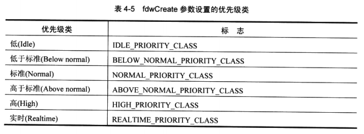

## CreateProcess

​		我们用 CreateProcess 函数来创建一个进程，如下所示:

```C
BOOL CreateProcess(
    PCTSTR pszApplicationName,
    PTSTR pszCommandLine,
    PSECURITY_ATTRIBUTES psaProcess,
    PSEOJRITY_ATTRIBUTES psaThread,
    BOOL blnheritHandles,
    DWORD fdwCreate,
    PVOID pvEnvironment,
    PCTSTR pszCurDir,
    PSTARTUPINFO psiStartlnfo,
    PPROCESS_INFORMATION ppiProcInfo
);
```

​		一个线程调用**CreateProcess**时，系统将创建一个进程内核对象，其初始使用计数为1。进程内核对象不是进程本身，而是操作系统叫来管理这个进程的一个小型数据结构——可以把进程内核对象想象成由进程统计信息构成的一个小型数据结构。然后，系统为新进程创建一个虚拟地址空间，并将可执行文件 ( 和所有必要的 DLL ) 的代码及数据加载到进程的地址空间。

​		然后，系统为新进程的主线程创建一个线程内核对象 ( 其使用计数为 1 ) 。和进程内核对象一 样，线程内核对象也是一个小型数据结构，操作系统用它来管理这个线程。这个主线程一开始就会执行C/C++运行时的启动例程，它是由链接器设为应用程序入口的，最终会调用应用程序 WinMain ，wWinMain , main 或 wmain 函数。如果系统成功创建了新进程和主线程，**CreateProcess** 将返回 TRUE 。

——————————————————————————————————————————————————说明	**CreateProcess** 在进程完全初始化好之前就返回**TRUE**。这意味着操作系统加载程序 ( loader ) 尚未尝试定位所有必要的 DLL 。如果一个 DLL 找不到或者不能正确初始化，进程就会终止，因为**CreateProcess**返回TRUE，所以父进程不会注意到任何初始化问题。——————————————————————————————————————————————————

OK,前面只是泛泛而谈，下面将分小节逐一讨论**CreateProcess**的参数。


### 1. pszApplicationName 和 pszCommandLine 参数

​		**pszApplicationName**和**pszCommandLine**参数分别指定新进程要使用的可执行文件的名称，以及要传给新进程的命令行字符串。先来谈谈**pszCommandLine**参数。

​		注意，在函数原型中，**pszCommandLine**参数的类型为**PTSTR**。这意味着**CreateProces**期望我们传入的是一个非 “ 常量字符串 ” 的地址。在内部，**CreateProcess**实际上会修改我们传给它的命令行字符串。但在**CreateProcess**返回之前，它会将这个字符串还原为原来的形式。

​		这是很重要的，因为如果命令行字符串包含在文件映像的只读部分，就会引起访问违规 ( 违例 ) 。例如，以下代码就会导致访问违规，因为 Microsoft 的 C/C++ 编译器把 ” NOTEPAD " 字符串放在只读内存中：

```c
STARTUPINFO si = { sizeof(si) };
PROCESS_INFORMATION pi;
CreateProcess(NULL, TEXT("NOTEPAD"), NULL, NULL,
	FALSE, 0, NULL, NULL, &si, &pi);
```

​		**CreateProcess**试图修改字符串时，会引起一个访问违规 ( Microsoft C/C++ 编译器的早期版本把字符串放在可读/写内存中。所以对 **CreateProcess** 函数的调用不会引起访问违规 ) 。

​		解决这个问题的最佳方式是在调用**CreateProcess**之前,把常量字符串复制到一个临时缓冲区，如下所示：

```c
STARTUPINFO si = { sizeof(si) };
PROCESS_INFORMATION pi;
TCHAR szCommandLine = TEXT("NOTEPAD");

CreateProcess(NULL, szCommandLine, NULL, NULL,
	FALSE, 0, NULL, NULL, &si, &pi);
```

​		我们可能还要注意对 Microsoft C++ 的 **/Gf** 和 **/GF** 编译器开关的使用，它们可以消除重复的字符串，并判断是否将那些字符串放在一个只读的区域。（还要注意 /ZI 开关，它允许使用 Visual Studio的 “ 编辑并继续 ”（Edit & Continue)调试功能，它包含 /GF 开关的功能。）最佳 做法是使用 /GF 编译器开关和一个临时缓冲区。目前，Microsoft最应该做的一件事情就是修正**CreateProcess** , 使它自己能创建字符串的一个临时副本，从而使我们得到解放。 Windows未来的版本或许会对此进行修复。

​		顺便提一下，如果在 Windows Vista 中调用**CreateProcess**函数的ANSI版本，是不会发生访问违规的，因为它会为命令行字符串创建一个临时副本(详情参见第2章)。

​		可以使用**pszCommandLine**参数来指定一个完整的命令行，供**CreateProcess**用于创建新进程。当**CreateProcess**解析**pszCommandLine**字符串时，它会检查字符串中的第一个标记(token),并假定此标记是我们想运行的可执行文件的名称。如果可执行文件的名称没有扩展名，就会默认是.exe扩展名。**CreateProcess**还会按照以下顺序搜索可执行文件。

1. 主调进程.EXE文件所在的目录。

2. 主调进程的当前目录。

3. Windows 系统目隶，即 **GetSystemDirectory** 返回的 System32 子文件夹。

4. Windows 目录。

5. PATH环境变量中列出的目录。

​        当然，假如文件名包含一个完整路径，系统就会利用这个完整路径来查找可执行文件，而不会搜索目录。如果系统找到了可执行文件，就创建一个新进程，并将可执行文件的代码和数据映射到新进程的地址空间。然后，系统调用由链接器设为应用程序入口点的 C/C++ 运行时启动例程。如前所述，C/C++ 运行时启动例程会检査进程的命令行，将可执行文件名之后的第一个实参的地址传给**（w)WinMain** 的**pszCmdLine**参数。

​		只要**pszAppHcationName**参数为**NULL** ( 99%以上的情况都是如此 ) ，就会发生上述情况。 但是，也可以不在**pszApplicationName**中传递**NULL**，而是传递一个字符串地址，并在字符串中包含想要运行的可执行文件的名称。但在这种情况下，必须指定文件扩展名，系统不会自动假定文件名有一个**.exe**扩展名。**CreateProcess**假定文件位于当前目录，除非文件名前有一个路径。如果没有在当前目录中找到文件，**CreateProcess**不会在其他任何目录査找文件——调用会以失败而告终。

​		然而，即使在**pszApplicationName**参数中指定了文件名，**CreateProcess**也会将 **pszCommandLine**参数中的内容作为新进程的命令行传给它。例如，假设像下面这样调用 **CreateProcess**：

```c
// Make sure that the path is in a read/write section of memory.
TCHAR szPathf[] = TEXT("WORDPAD README.TXT");

// Spawn the new process.
CreateProcess (TEXT("C: \\WINDOWS\\SYSTEM32\\NOTEPAD.EXE") ,szPath, .. .);
```

​		系统会调用记事本应用程序，但记事本应用程序的命令行是WORDPAD README.TXT。 虽然这看起来有点儿怪，但**CreateProcess**的工作机制就是这样的。之所以让我们能为 **CreateProcess** 添加 **pszApplicationName** 参数，实际是为了支持 Windows 的 POSIX 子系统。


### 2.psaProcess，psaThread 和 blnheritHandles 参数

​		为了创建一个新的进程，系统必须创建一个进程内核对象和一个线程内核对象 ( 用于进程的主线程 ) 。由于这些都是内核对象，所以父进程有机会将安全属性关联到这两个对象上。可以根据自己需要分别使用 **psaProcess** 和 **psaThread** 参数来为进程对象和线程对象指定安全性。可以为这两个参数传递**NULL** ; 在这种情况下，系统将为这两个内核对象指定默认的安全描述符。也可以分配并初始化两个**SECURITY_ATTRIBUTES**结构，以便创建安全权限，并将它们分配给进程对象和线程对象。

​		为**psaProcess**和**psaThread**参数使用**SECURITY_ATTRIBUTES**结构的另一个原因是：这两个对象句柄可由父进程将来生成的任何子进程继承 ( 第3章讨论了内核对象句柄的继承机制 ) 。

​		下面展示的 Inherit.cpp 是一个简单的程序，它演示了内核对象句柄的继承。假设现在由进程 A 来创建进程B ，它调用**CreateProcess**，并为**psaProcess**参数传入一个 **SECURITY_ATTRIBUTES** 结构的地址（在这个结构中，**blnheritHandle**成员被设为 **TRUE**)。在同一个调用中，**psaThread**参数指向另一个**SECURITY_ATTRIBUTES**结构， 该结构的**blnberitHandle**成员被设为**FALSE**。

​		系统创建进程 B 时，会同时分配一个进程内核对象和一个线程内核对象，并在 **ppiProcInfo** 参数指向的一个结构中，将句柄返回给进程 A 。**ppiProcInfo**参数的详情将在稍后讨论。现在，利用返回的这些句柄，进程 A 就可以操纵新建的进程对象和线程对象。

​		现在，假设进程 A 再次调用**CreateProcess**来创建进程 C 。进程 A 可以决定是否允许进程 C 操纵进程 A 能访问的一些内核对象。**bhiheritHandles**参数便是针对这个用途而提供的。 如果**blnheritHandles**设为**TRUE**，进程 C 将继承进程 A 中的所有可继承的句柄。在本例中，进程 B 的进程对象句柄是可继承的。进程 B 的主线程对象的句柄则是不可继承的，不管传给**CreateProcess**的**blnheritHandles**参数值是多少。另外，如果进程 A 调用 **CreateProcess** , 并为**blnheritHandles**参数传入**FALSE**,则进程 C 不会继承进程 A 当前所用的任何一个句柄。


### 3.fdwCreate 参数

​		**fdwCreate** 参数标识了影响新进程创建方式的标志 ( flag ) 。多个标志可以使用按位或起来，以便同时指定多个标志组合。可用的标志如下。

* **DEBUG_PROCESS**标志向系统表明父进程希望调试子进程以及子进程将来生成的所有进程。该标志向系统表明，在任何一个子进程 ( 现在的身份是被调试程序，或者说 debugee ) 中发生特定的事件时，要通知父进程 ( 现在的身份是调试器，或者说 debugger ) 。

* **DEBUG_ONLY_THIS_PROCESS** 标志类似于 **DEBUG_PROCESS**，但是，只有在关系最近的子进程中发生特定事件时，父进程才会得到通知。如果子进程又生成了 新的进程，那么在这些新进程中发生特定事件时，调试器是不会得到通知的。要进一步了解如何利用这两个标志来写一个调试器，并获取被调试应用程序中的 DLL 和线程的信息，请阅读MSDN的一篇文章：“Escape from DLL Hell with Custom Debugging and Instrumentation Tools a〇d Utilities，Part 2 ”，网址是 http://msdn.microsoft.eom/msdnmag/issues/02/08/EscapefromDLLHell/o

* **CREATE_SUSPENDED**标志让系统在创建新进程的同时挂起其主线程。这样一来， 父进程就可以修改子进程地址空间中的内存，更改子进程的主线程的优先级，或者在进程执行任何代码之前，将此进程添加到一个作业 ( job ) 中。父进程修改好子进程之后，可以调用**ResumeThread**函数来允许子进程执行代码。欲知这个函数的详情， 请参见第7章。

* **DETACHED_PROCESS**标志阻止一个基于 CUI ( 控制台用户界面 ) 的进程访问其父进程的控制台窗口，并告诉系统将它的输出发送到一个新的控制台窗口，如果一个基于 CUI 的进程是由另一个基于 CUI 的进程创建的，那么在默认情况下，新进程将使用父进程的控制台窗口。（ 在命令提示符中运行 C++ 编译器的时候，编译器并不会新建一个控制台窗口，而是将输出附加到现有控制台窗口的底部。）通过指定这个标志，新进程如果需要将输出发送到一个新的控制台窗口，就必须调用 **AliocConsole**函数来创建它自己的控制台。

* **CREATE_NEW_CONSOLE** 标志指示系统为新进程创建一个新的控制台窗口。如 果同时指定 **CREATE_NEW_CONSOLE** 和 **DETACHED_PROCESS** 标志，会导致—个错误。

* **CREATE_NO_WINDOW** 标志指示系统不要为应用程序创建任何控制台窗口。可以使用这个标志来执行没有用户界面的控制台应用程序。

* **CREATE_NEW_PROCESS_GROUP** 标志修改用户按 Ctrl+C 或 Ctrl+Break 时获得通知的进程列表。按下这些组合键时，假如有多个 CUI 进程正在运行，系统将通知一个进程组中的所有进程，告诉它们用户打算中断当前操作。在创建一个新的 CUI 进程时，假如指定了这个标志，就会创建一个新的进程组。组中的一个进程处于活动状态时，一旦用户按下组合键 Ctrl+C 或 Ctrl+Break，系统就只是向这个组的进程发出通知。

* **CREATE_DEFAULT_ERROR_MODE** 标志向系统表明新进程不会继承父进程所用的错误模式。（本章前面已经讨论了 **SetErrorMode**函数。）

* **CREATE_SEPARATE_WOW_VDM** 标志只有在运行 16 位 Windows 应用程序时才有用。它指示系统创建一个单独的虚拟 DOS 机 ( Virtual DOS Machine, VDM ) , 并在这个VDM 上运行16位Windows应用程序。默认情况下，所有16位Windows 应用程序都在一个共享的VDM中执行。在独立的VDM中运行的好处是，假如应用程序崩溃，它只需要“杀死”这个VDM,在其他VDM中运行的其他程序仍然 能正常工作。另外，在独立的VDM中运行的16位Windows应用程序有独立的输入队列。这意味着假如一个应用程序暂时挂起，独立VDM中运行的应用程序仍然 能接收输入。运行多个VDM的缺点在于，每个VDM都要消耗较多的物理内存。 Windows 98在荦独一个虚拟机中运行所有16位Windows应用程序——这个行为不 能蒗盖。

* CREATE_SHARED_WOW_VDM标志只冇在运行16位Windows应用程序时才有用。 默认情况下，所有16位Windows应用程序都在单独一个VDM中运行的，除非指定 广CREATE_SEPARATE_WOW_VDM标志。不过，也可以覆盖这个默认行为。办 法是在注册表中将 HK£Y_LOCAL_MACHINE\System\CurrentContro丨Set\Control\WOW 下 DefaultSeparateVDM 的值设为yes。在此之后，如果设置 CREATE一SHAREDJVVOW—VDM标志，16位Windows应用程序就会在系统的共 享VDM中运行。（修改了这个注册表设置后，必须重启电脑。）注意，为了检测在 64位操作系统下运行的32位进程，我们可以调用IsWow64Process函数。它的第 —个参数是我们要检测的进程的句柄，第二个参数则是指向一个布尔值的指针；如 果是一个32位进程在64位操作系统下运行，这个值就会被设为TRUE;否则会设 为 FALSE。

* **CREATE_UNICODE_ENVIRONMENT**标志告诉系统子进程的环境块应包含 Unicode 字符。进程的环境块默认包含的是ANSI字符串。

* **CREATE_FORCEDOS** 标志强制系统运行一个嵌入在 16 位 OS/2 应用程序中的 MS-DOS应用程序。

* **CREATE_BREAKAWAY_FROM_JOB**标志允许一个作业中的进程生成一个和作业无关的进程。（详情参见第5章。）

* **EXTENDED_STARTUPINFO_PRESENT** 标志向操作系统表明传给 **psiStartlnfo** 参数的是一个**STARTUPINFOEX**结构。

.

​        **fdwCreate**参数还允许我们指定一个优先级类 ( priority class ) 。不过，这样做没有多大必要， 而且对于大多数应用程序，都不应该这样做——系统会为新进程分配一个默认的优先级类。 表4-5展示了可能的优先级类。

