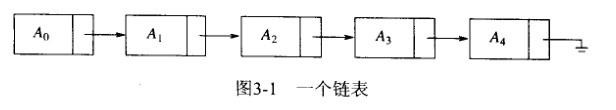
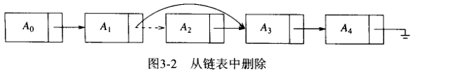
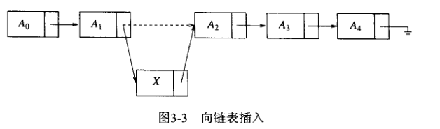
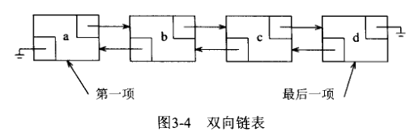

## 表 ADT

​		我们将处理形如 A(0)，A(2), A(3),…,A(N-1)的一般的表。这个表的大小是 N , 我们将称大小为 0 的表为 **空表（empty list)**。

​		对于除空表外的任何表，我们说 A(i) 后继 A(i-1) (或继 A(i-1) 之后）并称 A(i-1) ( i < N ) 前驱 A(i) ( i > 1 )。表中的第一个元素是 A(0)，而最后一个元素是 A(N-1)。我们将不定义 A(0) 的前驱元，也不定义 A(N-1) 的后继元。元素 A(i) 在表中的**位置（position)**为 i 。为了简单起见，我们在讨论中将假设表中的元素是整数，但一般说来任意的复杂元素也是允许的（而且很容易由类模板来处理）。

​		与这些 “ 定义 ” 相关的是我们要在表ADT上进行操作的集合。
​			printList 和 makeEmpty 是常用的操作，其功能是显而易见的；
​			find 返回项首次出现的位置；
​			insert 和 remove —般是从表的某个位置插入和删除一些元素；，
​			而 findKth 则返回某个位置上（作为参数而被指定）的元素。

​		如果 【34, 12 , 52 , 16 , 12】是一个表，则 find(52)会返回 2 ; insert (x, 2) 可把表变成【34, 12, X，52, 16, 12】 (如果我们在给定位置插入的话）；而 remove (52) 则将该表变为【34, 12, X，16, 12】。

​		当然，一个函数的功能怎样才算恰当，完全要由程序设计者来确定。这类似于对特殊情况的处理（例如，上述 find (1) 返回什么？）。我们还可以添加一些运算，比如 next 和 previous ，它 们会取一个位置作为参数并分别返冋其后继元和前驱元的位置。

### 1.表的简单数组实现

​		对表的所有操作都可以使用数组来实现。虽然数组是静态分配的，但是内部存储数组的 vector 类允许在需要的时候将数组的大小增加一倍。这解决了使用数组的最严重的问题。也就是在<u>使用数组时需要对表的大小的最大值进行估计的问题</u>。这个估计现在就不再需要了。

​		数组实现使得 printList 以线性时间执行，而 findKth 则花费常数时间，这是最好的结果了。然而，插入和删除的花费却有可能是昂贵的，这取决于插入和删除发生的位置。在最坏的情况下，在位置 0 (换句话说是在表的前面）插入需要将整个数组后移一个位置以空出空间来； 而删除第一个元素则需要将表中的所有元素前移一个位置，因此这两种操作的最坏情况为 O(N)。平均来看，这两种运算都需要移动表的一半的元素，因此仍然需要线性时间。另一方面， 如果所有的操作都发生在表的末尾，就不需要移动任何元素，那么添加和删除的操作都花费 O(1) 的时间。

​		在许多情况下，表是通过在末尾插入元素来建立的，之后只有数组访问（例如 findKth 操作） 发生。在这种情况下，数组是适合的。然而，如果插入和删除在整个表中都发生，特别是在表的前端发生的话，数组就不是一个好选择了。下一节讨论另一种选择：**链表**。

### 2.简单链表

​		为了避免插入和删除的线性开销，我们需要允许表可以不连续存储，否则表的部分或全部就需要整体移动。图3-1表达了**链表（linked list）**的一般思想。

​		链表由一系列不必在内存中相连的结点组成。每一个结点均含有表元素和到包含该元素后继元的结点的**链（link)**。我们称之为 next链。最后一个单元的 next链 指向NULL。

​		为了执行 printList() 或 find (x)，我们只要从表的第一个结点开始然后用 next 链遍历该表即可。与数组实现一样，这种操作显然是花费线性时间的，但是这个常数可能比用数组实现时要大。 findKth 操作不如数组实现时的效率高；findKth(i) 花费 O(N) 的时间并以明显的方式遍历链表而完成。在实践中这个界是保守的，因为调用findKth常常是以 ( 按 i ) 排序的方式进行。例如，findKth(2)、findKth(3)、findKth(4) 以及 findKth(6) 可通过对表的一次扫描同时实现。 remove 方法可以通过修改一个 next 引用来实现。图3-2给出在原表中删除第二个元素的结果。

​		insert 方法需要使用 new 操作符从系统取得一个新结点，此后执行两次引用调整。其一般想法在图3-3中给出，其中的虚线表示原来的指针。

​		一般地，正如我们所看到的，如果知道发生变化的位置，从链表中插入和删除一个元素不需要移动很多的元素，而只是对结点链接进行固定的几个改变。

​		假设链接到链表前面的链接存在，那么，添加或删除第一项的特殊情况对应常量的时间。至于在链表的末尾添加（在最后一项后添加新项）的特殊情况，如果链接到最后项的链接存在的话， 也是消耗常量的时间。这样，典型的链表保持至表的两端的链接。删除最后一项有点麻烦，因为必须找到最后项前面的项，更改其 next 链接到 NULL，然后更新这个保持为最后一项的链接。在经典的链表里每个结点存储指向下一结点的链接，但是没有提供关于上一个结点的任何信息。

​		显而易见的想法是构造第三个链接来指向上一个结点，但这是不可行的，因为每做一次删除都需要对其进行更新。取而代之，我们将链表中的每一个结点都添加一个指向上一项的链接。如 图3-4所示，这称为**双向链表（doubly linked list）**。

