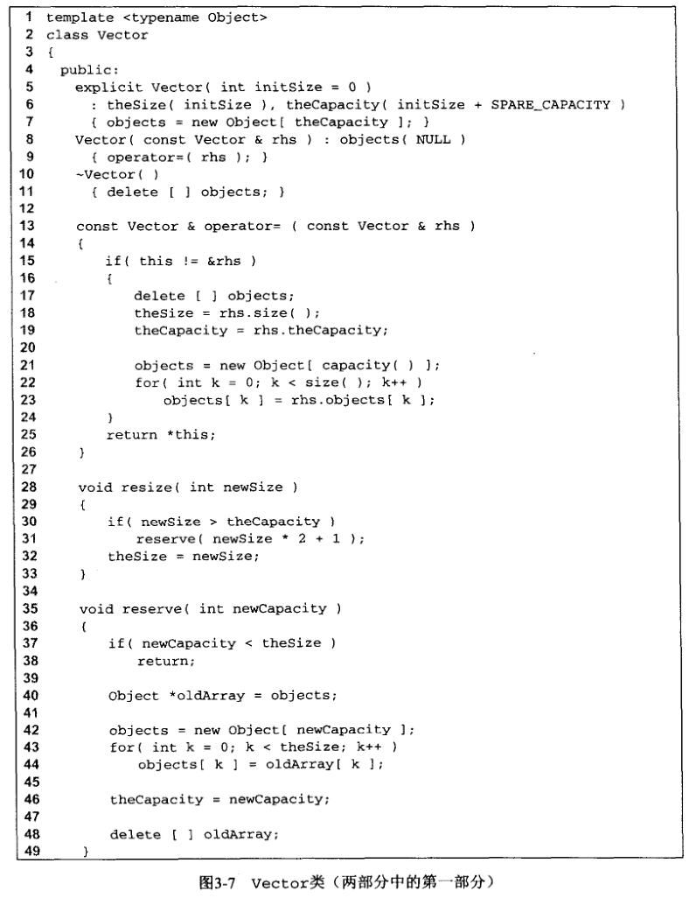
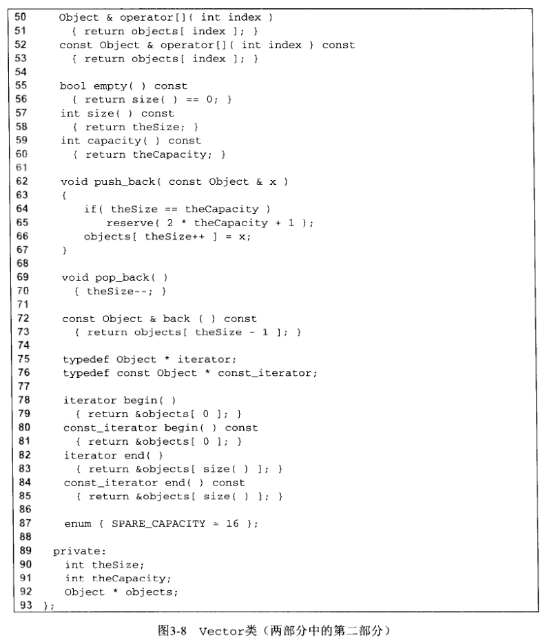

## 向量的实现

​		在本节中，给出了一个可用的 vector 类模板的实现。vector 是基本类类型，这意味着不同于 C++ 中的基本数组， vector 可以复制并且其占用的内存可以自动回收（通过其析构函数）。在 1.5.6 节，我们已经讨论了 C++ 基本数组的一些重要特性：

* 数组就是指向一块内存的指针变量；实际的数组的大小必须由程序员单独确定。

* 内存块可以通过 new [] 来分配，但是相应地也就必须用 delete [] 来释放。

* 内存块的大小不能改变（但是可以定义一个新的具有更大内存块的数组，并且用原来的数组来将其初始化，然后原来的内存块就可以释放了）。

为避免与库函数类相混淆，我们的类模板命名为 Vector。在研究（少于一百行的）Vector 代码前，先概括其主要的细节。

1. Vector 将仍然是基本数组（通过一个指针变量来指向分配的内存块）。数组的容量和当前的数组项数目存储在 Vector里。

2. Vector 将通过实现 “ 三大函数 ” ，为复制构造函数和 operator 提供深复制，同时也提供析构函数来回收基本数组。

3. Vector 将提供 resize 例程来改变 Vector 的大小（通常是更大的数）；提供 reserve 例程来改变 Vector 的容量（通常是更大的数）。容量的改变是通过为基本数组分配一个新的内存块， 然后复制旧内存块的内容到新块中，再释放旧块的内存来实现的。

4. Vector 将提供 operator [] 的实现（正如1.7.2节中所提到的，operator [] 典型的实现有访问函数和修改函数两个版本）。

5. Vector 将提供基本的例程，例如 size、empty、clear (它们是典型的一行例程）、back、 pop_back 和 push_back 。如果大小和容量都是一样的话，push_back : 例程将调用 reserve 来增大 Vector 的容量。

6. Vector 将支持嵌套的 iterator 和 const_iterator 类型，并且提供关联的 begin 和 end 方法。

​        图3-7和图3-8显示了 vector 类。作为 STL 的副本，Vector 类也有有限的错误检验。稍后我们将主要讨论如何提供错误检验的功能。

​		正如在第90〜92行所显示的，vector 将其作为数据成员来存储大小、容量和基本数组。在第 5〜7 行的构造函数允许使用者自己定义初始大小(默认值为 0 )。然后初始化数据成员，并令容量比大小稍大一点。这样就可以在不改变容量的前提下执行 push_backs。

​		第 8〜9 行显示的复制构造函数调用 operators 对已有的 Vector 进行复制。第 10〜11 行的析构函数回收基本数组的内存空间。最巧妙的例程是第 13〜26 行显示的 operators 在第 15 行的混淆检验之后，在第 17 行释放旧数组，在第 21 行生成与所复制的 Vector 同样容量的新数组。在大小被复制后，依次复制数据项。当然，代码时常不必要地进行释放和分配新的数组的操作，因为原始的数组有可能是足够大的。因为内存的重新分配的代价是很显著的，所以，对库 Vector 类编写额外的逻辑是值得的。

​		第 28〜33 行是 resize 例程。在对容量进行扩展后，代码简单地设定数据成员 theSize 。扩展容量的代价是高昂的，因此，如果容量进行扩展，除非大小也显著增长（大小为 0 时，使用 +1 ), 否则就将容量扩展为大小的两倍，以避免对容量进行再次扩展。如第 35~49 行所示，容量的扩展是通过 reserve 例程来实现的。该例程具有与 operator [] 大部分相同的逻辑：在第 42 行分配一个新数组，在第 43 和 44 行复制旧数组的内容，然后在第 48 行回收旧数组。如第 37 和 38 行所示， reserve 例程可以用来缩小基本数组。但是，所指定的新的容量必须至少和大小一样大，否则， reserve 的请求就被忽略。

​		如第 50〜53 行所不，两个版本的 operator [] 很简单（事实上，与1.7.2节中的 matrix 类中 operator [] 实现非常相似）。通过确定 index 是否在 0 至 size () - 1 的范围内（包括size() - 1 )， 错误检测功能可以很容易地实现。如果没在这个范围内就抛出一个异常。

​		第 55〜73 行是许多小例程的实现，包括：empty、size、capacity、push_back、pop_back 和 back 。在第 66 行是后缀操作符 ++，该操作符使用 theSize 来索引数组，然后自增 theSize 。在讨论迭代器的时候我们见到过相同的习惯用法：* itr ++ 使用 itr 来确定访问哪一项，然后推进 itr 。 ++ 的定位：前缀操作符 ++ 的情况，*++itr 首先推进 itr，然后用新的 itr 来确定访问哪一项；相似地，objecth[++theSizer] 将自增 theSize 并且使用这个新值来索引数组（这不是我们想要的）。 pop_back 和 back 都会受益于错误检测，因为检测的时候如果大小为零就会抛出一个异常。

​		最后，在第 75~85 行是内置类型的 iterator 和 const_iterator 的声明以及两个 begin 方法和两个 end 方法的声明。这段代码利用了在 C++ 中指针变量具有我们所期望的 iterator 应该具有的所有操作符的事实。指针变量可以复制和比较。*操作符取得指针变量所指向的对象。最特别地，当应用到指针变量的时候，如果指针是指向数组内部的，指针变量就会指向下一个顺序存储的对象——增加指针的值使之指向下一个数组元素。这些 C++ 所遵循的指针的语法可以追逆到 20 世纪70年代早期的 C 编程语言，C++ 就是在 C 语言的基础上发展起来的。STL迭代器的机制是模拟指针的操作而设计。

​		因此，在第 75〜76 行，声明 iterator 和 const_iterator 的 typedef 语句很简单地就是指针变量的别名，并且 begin 和 end 需要简单地分别返回代表第一个数组位置的内存地址和第一个无效的数组位置。

​		vector 类型的迭代器和指针的相似性意味着使用 vector 而不使用 C++ 数组会导致稍高一点的资源消耗。正如所提到的，其缺点是代码没有错误检测。如果迭代器 itr 冲出了末端标记的话， ++itr 或 *itr 都不需要标识错误。解决这个问题需要使 iterator 和 const_iterator 是真正的嵌套类类型而不是简单的指针变量。使用嵌套类类型是很普通的，这也是在3.5节List 类的部分所要讨论的。