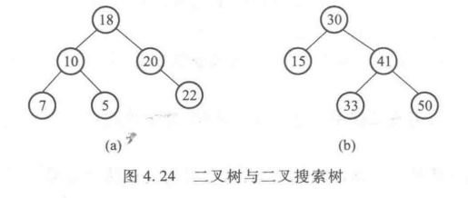

# 二叉搜索树

**定义：**

##### 1.非空左子树的所有键值小于其根节点的键值；

##### 2.非空右子树的所有键值大于其根节点的键值；

##### 3.左右子树都是二叉搜索树。




### 二叉搜索树的动态查找

**操作：**

遍历操作与普通二叉树相同。查找、插入和删除不同。

特别函数：

```c++
Position Find(BinTree BST,ElementType X);//从二叉搜索树BST中查找元素X，返回其所在节点的地址；

Position FindMind(BinTree BST);//从二叉搜索树BST中查找并返回最小元素所在节点的地址；

Position FindMax(BinTree BST);//从二叉搜索树BST中查找并返回最大元素所在节点的地址；
```

**实现：**

#### 搜索：

1.find

```c++
position find(BinTree bst, ElementType X) {
    if(!bst)
        return NULL;
    
    if(X > bst->data)
        return find(bst->right, x);
    else if(X < bst->data)
        return find(bst->left, x);
    else //=
        return x;
}
```

2.findmin

```c++
position findMin(BinTree bst) {
    if(!bst) return NULL;
    
    if(!bst->left) return bst;
    else findMin(bst->left);
}
```

3.findmax

```c++
position findMax(BinTree bst) {
    if(!bst) return NULL;
    
    if(!bst->right) return bst;
    else findMax(bst->right);
}
```


#### 插入：

​		将元素插入主要是**找到元素应该插入的位置。**可以利用find函数，
如果找到，说明元素已存在；
如果没有，那查找终止的位置就是应该插入的位置。

```c++
BinTree Insert(BinTree bst, ElementType X) {
    if(!bst) 
        bst = new BinTree(X);
    else 
        if(x < bst->data)
            bst->left = Insert(bst->left, X);
    	else if(x > bst->data)
            bst->right = Insert(bst->right, X);
    	//else 存在  则什么都不做
    
    return bst;
}
```


#### 删除：

​		二叉搜索树的删除需要考虑三种情况：

**1.**删除的叶子节点，直接删除后父节点指向置空；

**2.**删除的节点有一个孩子节点，将父节点的指向指向孩子；

**3.**删除的节点有左右两颗子树，可以选择右子树的最小元素填充删除节点，或左子树最大元素填充删除节点。

下列实现采用右子树代替策略：

```C++
BinTree Delete(BinTree bst, ElementType X){
    BinTree tmp;
    if(!bst) {
        printf("no found!");
	} else {
        if(x < bst->data) {
            bst->left = Delete(bst->left, X);
        } else if(x > bst->data){
            bst->right = Delete(bst->right, X);
        } else {//就是删除的节点
            if(bst->left && bst->right) {     //3
                //从右子树中找到最小的元素填充删除节点
                tmp = findMin(bst->right);
                bst->data = tmp->data;
                bst->right = Delete(bst->right,bst->data);
            } else {
                tmp = bst;
                if(!bst->left)                 //1
                    bst = bst->right;
                 else                          //2
                    bst = bst->left;
                 free(tmp);
            }
        }
    }
    
}
```


