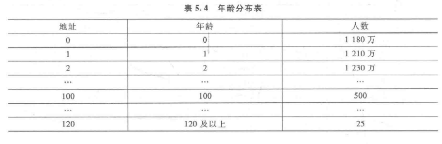
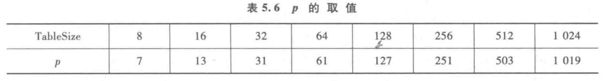

# 散列函数的构造方法

一个好的散列函数一般要考虑下列两个因素：

​		1.计算简单，以便提高转换速度；

​		2.关键词对应的地址空间分布均匀，以尽量减少冲突。即对于关键词集合中的任何一个关键字，经散列函数映射到地址集合中任何一个地址的概率是基本相等的。但实际应用中只要不过于聚集就行。

### 一、数字关键词的散列函数构造

构造这类散列函数只不过是把原来的数字按某种规律转换成另一个数字。

​		**1.直接定址法**

​		如果我们要统计人口的年龄分布情况（0~120岁），那么对年龄这个关键词，可以直接作为地址，此时
h（key）= key。

​		**2.除留余数法**

​		现实应用中比较常用的方法是除留余数法。假设散列表长为 **TableSize ( TableSize的选取，通常由关键词集合的大小 n 和允许最大装填因子 a 决定，一般将 TableSize 取为 n/a )**，选择一个正整数 p ≤ TableSize，散列函数为：
h（key）= key mod p。

即取关键词除以 p 的余数作为散列地址。使用除留余数法，选取适合的 p 很重要，一般选取 p 为小于或等于散列表表长 TableSize的某个最大素数比较好。用素数求得的余数作为散列地址，比较均匀分布在整个地址空间上的可能性较大。表5.6给出一些了TableSize 对应的 p 值。

看到有多余的空间，这块空间在冲突发生时可能会用到。

​		**3.数字分析法**

​		如果数字关键词的位数比较多，在特定的情况下，有些位数容易相同，而有的位数比较随机。

​		例：11 位手机号码，前 3 位容易相同，中间 4 位表示用户的归属地，

