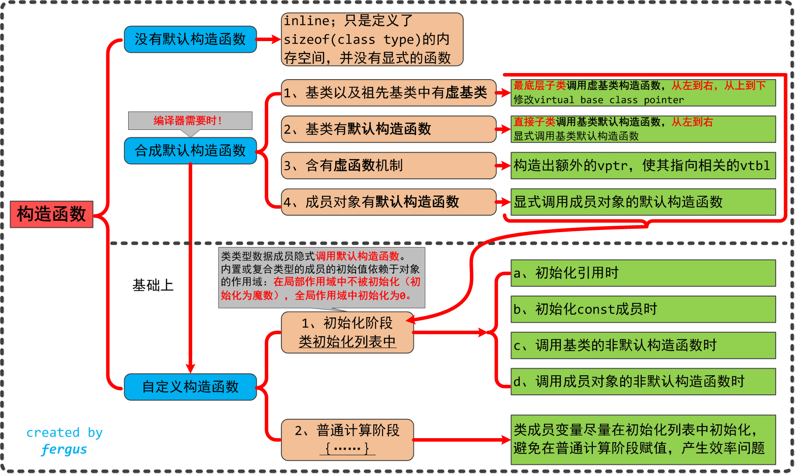
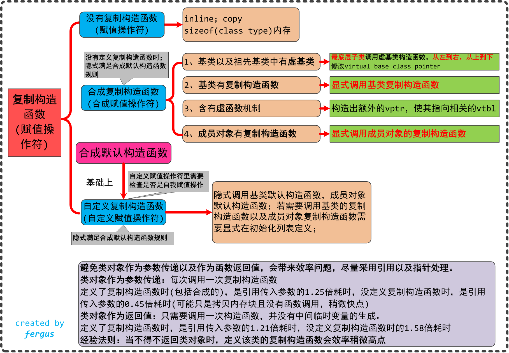

## 第1章 关于对象

- **C++ 在布局以及存取时间上的主要的额外负担是由 virtual 引起的**，包括：
  - a、virtual function 机制，引入**vptr**以及**vtbl**，支持一个有效率的 " 执行期绑定 "
  - b、virtual base class，用以实现 " 多次出现在继承体系中的base class，有一个单一而被共享的实例 "
  - c、多重继承下，派生类跟第二个以及后续基类之间的转换
- "指针的类型"会教导编译器如何解释某个特定地址中的内存内容以及其大小（void* 指针只能够持有一个地址，而不能通过它操作所指向的 object）
- **C++ 通过 class 的 pointers 和 references 来支持多态**，付出的代价就是额外的间接性。它们之所以支持多态是因为它们并不引发内存中任何"与类型有关的内存委托操作(type-dependent commitment)"，会受到改变的，只有他们所指向的内存的 " 大小和内容的解释方式 " 而已。

### C++对象模型（The C++ Object Model）

​		在此模型中，Nonstatic datamembers 被配置于每一个 class object 之内，static data members 则被存放在所有的 class object 之外，Static 和 nonstatic function members 也被放在所有的 classo bject 之外．Virtual functions 则以两个步骤支持之:

1. **每一个 class 产生出一堆指向 virtual functions 的指针，放在表格之中．这个表格被称为 virtual table ( vtbl) .**
2. 每一个 class objcct 被添加了一个指针，指向相关的 virtual table。通常这个指针被称为vptr，vptr的设定(setting）和重置（resetting)都由每一个 class 的 constructor、destructor 和 copy assignment 运算符自动完成。每个 class 所关联的 type_info object ( 用以支持runtime type identification，RTTI ) 也经由 virtual table 被指出来，通常是放在表格的第一个 slot处 。


​		上图明C++对象模型如何应用于前面所说的 Point class 身上．这个模型的

- 主要优点在于它的空间和存取时间的效率;
- 主要缺点则是，如果应用程序代码本身未曾改变，但所用到的 class objects 的 nonstatic data members 有所修改（可能是增加、移除或更改），那么那些应用程序代码同样得重新编译．关于这点，前述的双表格模型就提供了较大的弹性，因为它多提供了一层间接性，不过它也因此付出空间和执行效率两方面的代价就是了。

加上继承

​		C++ 支持单一继承和多重继承，也支撑虚拟继承。在虚拟继承的情况下，基类不管在继承链中被派生多少次，永远只会存在一个实体。

一个派生类如何在本质上模塑其基类的实体呢？

​		在 ” 简单对象模型中 “ ，每一个基类可以被派生类对象内的一个 slot 指出，该 slot 内含基类实体的地址。这个体制的主要缺点是，因为间接性而导致空间和存取时间上的额外负担，优点则是类对象的大小不会因其基类的改变而受到影响。


​		当然啦，你也可以想象另一种所谓的 base table 模型。这里所说的 base class table 被产生出来时，表格中的每一个 slot 内含一个相关的 base class 地址，这很像 virtual table 内含每一个virtual function 的地址一样.每一个 class object 内含一个bptr，它会被初始化，指向其 base class table。这种策略的主要缺点是由于间接性而导致的空间和存取时间上的额外负担，优点则是在每一个 class object中对于继承都有一致的表现方式:**每一个 class object 都应该在某个固定位置上安放一个 base table 指针，与 base classes 的大小或数目无关．第二个优点是，不需要改变class objects本身，就可以放大、缩小、或更改 base class table。**


### 对象模型如何影响程序(How the Object Model Effects Programs )

看一个例子，X 类中定义了一个拷贝构造函数、一个虚析构函数、一个虚函数foo，在此基础上有一个函数foobar

```c++
X foobar() {
    X xx;
    X* px = new X;

    // foo是一个虚函数
    xx.foo();
    px->foo();
    delete px;
    return xx;

}
```

这个函数有可能在内部被转化为：

```c++
// 可能的内部转化结果
// 虚拟C++码
void foobar(X& _result) {
    // 构造_result
    // _reslut用来取代local xx...
    _reslut.X::X();

    // 扩展
    px = _new(sizeof(X));
    if (px != 0) {
        px->X::X();
    }
     
    // 扩展xx.foo()但不使用virtual机制
    // 以_reslut取代xx
    foo(&_result);
     
    // 使用virtual机制扩展px->foo()
    (*px->vtal[2])(px)
     
    // 扩展delete
    if (px != 0) {
        (*px->vtbl)[1](px);      // 析构函数
        _delete (px);
    }
     
    // 不需要使用named return statement
    // 不需要摧毁local object xx
    return xx;
}
```

一张图解释上述代码


​		其实还是 C++ 对象模型，但是这里更具体的说明了虚函数表的第 0 个位置指向 X 的 type_info object，虚函数表的第1个位置指向虚析构函数，虚函数表的第 2 个位置指向 X::foo() 函数。

### 对象的差异(An Object Distinction)

#### 指针的类型

一个指向复合类型的指针与一个指向简单类型的指针有何不同呢？

​		以内存需求的观点来说，没有什么不同！ 它们三个都需要有足够的内存来放置一个机器地址（通常是个 word)﹒“ 指向不同类型之各指针 ” 间的差异，既不在其指针表示法不同，也不在其内容（代表一个地址）不同，**而是在其所寻址出来的 object 类型不同**。也就是说，“ 指针类型 ” 会教导编译器如何解释某个特定地址中的内存内容及其大小:

1、一个指向地址1000 的整数指针，在32位机器上，将涵盖地址空间1000~1003（因为 32 位机器上的整数是 4-bytes ) .
2．如果 String 是传统的 8-bytes （包括一个 4-bytes 的字符指针和一个用来表示字符串长度的整数），那么一个 ZooAnimal 指针将横跨地址空间 1000~1015（译注:4+8+4，如图1.4)


ZooAnimal 的代码：

```c++
class ZooAnimal {
public:
    ZooAnimal();
    virtual ~ZooAnimal();
    // ...
    virtual void rotate();

protected:
    int loc;
    String name;
};
```


​		所以，转型( cast）其实是一种编译器指令。大部分情况下它并不改变一个指针所含的真正地址，它只影响“被指出之内存的大小和其内容”的解释方式.

<!--指针间的转型其实是得到其起始位置和所占内存的大小。-->

#### 加上多态之后(Adding Polymorphism)

定义一个Bear，作为一种ZooAnimal

```c++
// ZooAnimal类
class ZooAnimal {
public:
    ZooAnimal();
    virtual ~ZooAnimal();
    // ...
    virtual void rotate();
protected:
    int loc;
    String name;
};

// Bear类
class Bear: public ZooAnimal {
public:
    Bear();
    ~Bear();
    // ...
    void rotate();
    virtual void dance();
    // ...
protected:
    enum Dances {};

    Dances dances_known;
    int cell_block;
};

// 调用
Bear b("Yogi");
Bear* pb = &b;
Bear& rb = *pb;
```

b、pb、rb 会有怎样的内存需求呢? 下图展示可能的内存布局


假设 Bear object 放在地址 1000 处，一个 Bear 指针和一个 ZooAnimal指 针有什么不同?

```c++
// 调用
Bear b;
ZooAnimal* pz = &b;
Bear& pb = &b;
```


​		它们每个都指向 Bear object 的第一个 byte，其间的差别是，pb 所涵盖的地址包含整个Bear object，而 pz 所涵盖的地址只包含Bear object 中的 ZooAnimal subobject.

下面这段代码不难理解

```c++
// 不合法
pz->cell_block;

// 合法
((Bear*)pz)->cell_block;

// 更好
if (Bear* pb2 = dynamic_cast<Bear*>(pz)) {
    pb2->cell_block;
}

// 合法
pb->cell_block;
```

这段也不难理解

```c++
pz->rotate();       // 调用ZooAnimal中的函数

Bear b;
ZooAnimal za = b;   // 这里会切割
za.rotate();        // 调用ZooAnimal中的函数
```


可能的内部分布图


​		当一个 base class object 被直接初始化为（或是被指定为）一个 derived class object 时，derived object 就会被**切割(sliced)**，以塞入较小的 base type 内存中，derived type 将没有留下任何蛛丝马迹.多态于是不再呈现，而一个严格的编译器可以在编译时期解析一个 “ 通过该 object 而触发的 virtual function 调用操作 ”，因而回避 virtual 机制．如果 virtual function 被定义为 inline，则更有效率上的大收获。


## 第2章 构造函数语意学

[](https://github.com/zfengzhen/Blog/blob/master/img/构造函数.png) [](https://github.com/zfengzhen/Blog/blob/master/img/复制构造函数.png)