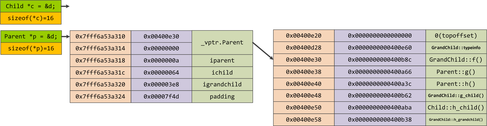
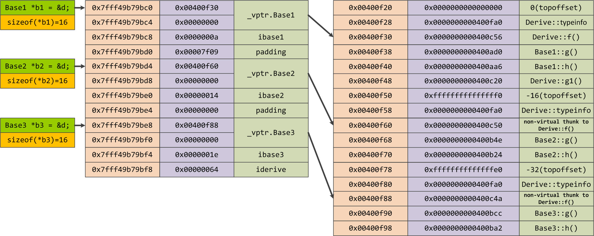
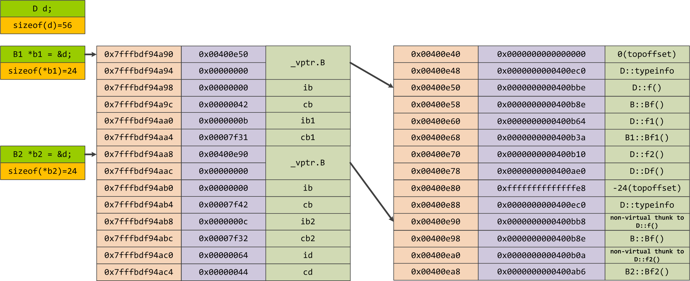
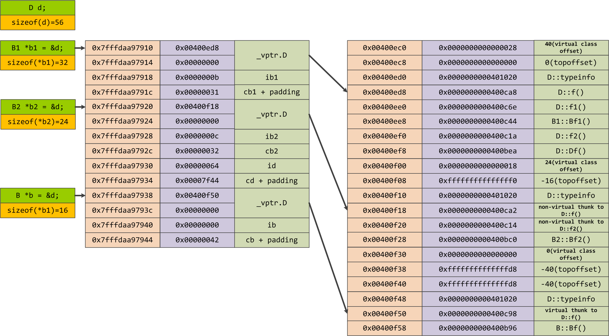

## 第1章 关于对象

- **C++ 在布局以及存取时间上的主要的额外负担是由 virtual 引起的**，包括：
  - a、virtual function 机制，引入**vptr**以及**vtbl**，支持一个有效率的 " 执行期绑定 "
  - b、virtual base class，用以实现 " 多次出现在继承体系中的base class，有一个单一而被共享的实例 "
  - c、多重继承下，派生类跟第二个以及后续基类之间的转换
- "指针的类型"会教导编译器如何解释某个特定地址中的内存内容以及其大小（void* 指针只能够持有一个地址，而不能通过它操作所指向的 object）
- **C++ 通过 class 的 pointers 和 references 来支持多态**，付出的代价就是额外的间接性。它们之所以支持多态是因为它们并不引发内存中任何"与类型有关的内存委托操作(type-dependent commitment)"，会受到改变的，只有他们所指向的内存的 " 大小和内容的解释方式 " 而已。

### C++对象模型（The C++ Object Model）

​		在此模型中，Nonstatic datamembers 被配置于每一个 class object 之内，static data members 则被存放在所有的 class object 之外，Static 和 nonstatic function members 也被放在所有的 classo bject 之外．Virtual functions 则以两个步骤支持之:

1. **每一个 class 产生出一堆指向 virtual functions 的指针，放在表格之中．这个表格被称为 virtual table ( vtbl) .**
2. 每一个 class objcct 被添加了一个指针，指向相关的 virtual table。通常这个指针被称为vptr，vptr的设定(setting）和重置（resetting)都由每一个 class 的 constructor、destructor 和 copy assignment 运算符自动完成。每个 class 所关联的 type_info object ( 用以支持runtime type identification，RTTI ) 也经由 virtual table 被指出来，通常是放在表格的第一个 slot处 。


​		上图明C++对象模型如何应用于前面所说的 Point class 身上．这个模型的

- 主要优点在于它的空间和存取时间的效率;
- 主要缺点则是，如果应用程序代码本身未曾改变，但所用到的 class objects 的 nonstatic data members 有所修改（可能是增加、移除或更改），那么那些应用程序代码同样得重新编译．关于这点，前述的双表格模型就提供了较大的弹性，因为它多提供了一层间接性，不过它也因此付出空间和执行效率两方面的代价就是了。

加上继承

​		C++ 支持单一继承和多重继承，也支撑虚拟继承。在虚拟继承的情况下，基类不管在继承链中被派生多少次，永远只会存在一个实体。

一个派生类如何在本质上模塑其基类的实体呢？

​		在 ” 简单对象模型中 “ ，每一个基类可以被派生类对象内的一个 slot 指出，该 slot 内含基类实体的地址。这个体制的主要缺点是，因为间接性而导致空间和存取时间上的额外负担，优点则是类对象的大小不会因其基类的改变而受到影响。


​		当然啦，你也可以想象另一种所谓的 base table 模型。这里所说的 base class table 被产生出来时，表格中的每一个 slot 内含一个相关的 base class 地址，这很像 virtual table 内含每一个virtual function 的地址一样.每一个 class object 内含一个bptr，它会被初始化，指向其 base class table。这种策略的主要缺点是由于间接性而导致的空间和存取时间上的额外负担，优点则是在每一个 class object中对于继承都有一致的表现方式:**每一个 class object 都应该在某个固定位置上安放一个 base table 指针，与 base classes 的大小或数目无关．第二个优点是，不需要改变class objects本身，就可以放大、缩小、或更改 base class table。**


### 对象模型如何影响程序(How the Object Model Effects Programs )

看一个例子，X 类中定义了一个拷贝构造函数、一个虚析构函数、一个虚函数foo，在此基础上有一个函数foobar

```c++
X foobar() {
    X xx;
    X* px = new X;

    // foo是一个虚函数
    xx.foo();
    px->foo();
    delete px;
    return xx;

}
```

这个函数有可能在内部被转化为：

```c++
// 可能的内部转化结果
// 虚拟C++码
void foobar(X& _result) {
    // 构造_result
    // _reslut用来取代local xx...
    _reslut.X::X();

    // 扩展
    px = _new(sizeof(X));
    if (px != 0) {
        px->X::X();
    }
     
    // 扩展xx.foo()但不使用virtual机制
    // 以_reslut取代xx
    foo(&_result);
     
    // 使用virtual机制扩展px->foo()
    (*px->vtal[2])(px)
     
    // 扩展delete
    if (px != 0) {
        (*px->vtbl)[1](px);      // 析构函数
        _delete (px);
    }
     
    // 不需要使用named return statement
    // 不需要摧毁local object xx
    return xx;
}
```

一张图解释上述代码


​		其实还是 C++ 对象模型，但是这里更具体的说明了虚函数表的第 0 个位置指向 X 的 type_info object，虚函数表的第1个位置指向虚析构函数，虚函数表的第 2 个位置指向 X::foo() 函数。

### 对象的差异(An Object Distinction)

#### 指针的类型

一个指向复合类型的指针与一个指向简单类型的指针有何不同呢？

​		以内存需求的观点来说，没有什么不同！ 它们三个都需要有足够的内存来放置一个机器地址（通常是个 word)﹒“ 指向不同类型之各指针 ” 间的差异，既不在其指针表示法不同，也不在其内容（代表一个地址）不同，**而是在其所寻址出来的 object 类型不同**。也就是说，“ 指针类型 ” 会教导编译器如何解释某个特定地址中的内存内容及其大小:

1、一个指向地址1000 的整数指针，在32位机器上，将涵盖地址空间1000~1003（因为 32 位机器上的整数是 4-bytes ) .
2．如果 String 是传统的 8-bytes （包括一个 4-bytes 的字符指针和一个用来表示字符串长度的整数），那么一个 ZooAnimal 指针将横跨地址空间 1000~1015（译注:4+8+4，如图1.4)


ZooAnimal 的代码：

```c++
class ZooAnimal {
public:
    ZooAnimal();
    virtual ~ZooAnimal();
    // ...
    virtual void rotate();

protected:
    int loc;
    String name;
};
```


​		所以，转型( cast）其实是一种编译器指令。大部分情况下它并不改变一个指针所含的真正地址，它只影响“被指出之内存的大小和其内容”的解释方式.

<!--指针间的转型其实是得到其起始位置和所占内存的大小。-->

#### 加上多态之后(Adding Polymorphism)

定义一个Bear，作为一种ZooAnimal

```c++
// ZooAnimal类
class ZooAnimal {
public:
    ZooAnimal();
    virtual ~ZooAnimal();
    // ...
    virtual void rotate();
protected:
    int loc;
    String name;
};

// Bear类
class Bear: public ZooAnimal {
public:
    Bear();
    ~Bear();
    // ...
    void rotate();
    virtual void dance();
    // ...
protected:
    enum Dances {};

    Dances dances_known;
    int cell_block;
};

// 调用
Bear b("Yogi");
Bear* pb = &b;
Bear& rb = *pb;
```

b、pb、rb 会有怎样的内存需求呢? 下图展示可能的内存布局


假设 Bear object 放在地址 1000 处，一个 Bear 指针和一个 ZooAnimal指 针有什么不同?

```c++
// 调用
Bear b;
ZooAnimal* pz = &b;
Bear& pb = &b;
```


​		它们每个都指向 Bear object 的第一个 byte，其间的差别是，pb 所涵盖的地址包含整个Bear object，而 pz 所涵盖的地址只包含Bear object 中的 ZooAnimal subobject.

下面这段代码不难理解

```c++
// 不合法
pz->cell_block;

// 合法
((Bear*)pz)->cell_block;

// 更好
if (Bear* pb2 = dynamic_cast<Bear*>(pz)) {
    pb2->cell_block;
}

// 合法
pb->cell_block;
```

这段也不难理解

```c++
pz->rotate();       // 调用ZooAnimal中的函数

Bear b;
ZooAnimal za = b;   // 这里会切割
za.rotate();        // 调用ZooAnimal中的函数
```


可能的内部分布图


​		当一个 base class object 被直接初始化为（或是被指定为）一个 derived class object 时，derived object 就会被**切割(sliced)**，以塞入较小的 base type 内存中，derived type 将没有留下任何蛛丝马迹.多态于是不再呈现，而一个严格的编译器可以在编译时期解析一个 “ 通过该 object 而触发的 virtual function 调用操作 ”，因而回避 virtual 机制．如果 virtual function 被定义为 inline，则更有效率上的大收获。


## 第2章 构造函数语意学

[](https://github.com/zfengzhen/Blog/blob/master/img/复制构造函数.png)


## 第3章 Data语意学

- 1、类对象大小受三个因素影响

  - a、virtual base 和 virtual function 带来的 vptr 影响
  - b、**EBO**（Empty Base class Optimize）空基类优化处理，**EBC**（Empty Base Class）占用一个字节，其他含有数据成员的从EBC 派生的派生类，只会算自己数据成员的大小，不受 EBC 一字节的影响
  - c、alignment 字节对齐

- 2、Nonstatic data members 在 class object 中的排列顺序将和其被声明顺序一样，**任何中间介入的 static data members 都不会被放进布局之中**。

- 3、静态成员变量 static data members

  - a、存放在程序的 data segment 之中
  - b、通过指针和对象来存取 member，完全一样，不管继承或者是虚拟继承得来，**全局也只存在唯一一个实例**
  - c、静态常量成员可以在类定义时直接初始化，而**普通静态常量成员只能在.o编译单元的全局范围内初始化**

- 4、非静态成员变量 nonstatic data members

  - a、每一个 nonstatic data member 的偏移量在编译时即可获知，不管其有多么复杂的派生，都是一样的。通过对象存取一个nonstatic data member，其效率和存取一个 C struct member 是一样的。
  - b、从对象存取 obj.x 和指针存取 pt->x 有和差异？
    - 当继承链中有虚基类时，查找虚基类的成员变量时延迟到了执行期，根据 **virtual class offset** 查找到虚基类的部分，效率稍低(成员变量的数据存取并没有 this 指针的变化）

- 5、成员变量具体分布 （代码引用陈皓 C++ 对象的内存布局

   

  http://blog.csdn.net/haoel/article/details/3081328

   

  http://blog.csdn.net/haoel/article/details/3081385

   

  分析环境：linux 2.6 gcc）

  - [](https://github.com/zfengzhen/Blog/blob/master/img/单一继承的一般继承.png)
  - [](https://github.com/zfengzhen/Blog/blob/master/img/多重继承.png)
  - [](https://github.com/zfengzhen/Blog/blob/master/img/重复继承.png)
  - [](https://github.com/zfengzhen/Blog/blob/master/img/钻石型多重继承.png)

## 第4章 Function语意学

- 1、C++的设计准则之一：nostatic member function 至少必须和一般的nonmember function有相同的效率。
  - a、改写函数原型，在参数中增加this指针
  - b、对每一个"nonstatic data member的存取操作"改为由this指针来存取
  - c、将member function重写为一个外部函数，经过"mangling"处理（不许要处理的加上 extern "C"）
- 2、覆盖（override）、重写（overload）、隐藏（hide）的区别
  - **重载**是指**不同的函数使用相同的函数名，但是函数的参数个数或类型不同**。调用的时候根据函数的参数来区别不同的函数。
  - **覆盖**（也叫重写）是指**在派生类中重新对基类中的虚函数（注意是虚函数）重新实现**。即函数名和参数都一样，只是函数的实现体不一样。
  - **隐藏**是指**派生类中的函数把基类中相同名字的函数屏蔽掉了**。隐藏与另外两个概念表面上看来很像，很难区分，其实他们的关键区别就是在多态的实现上。
- 3、静态成员函数 static member functions
  - a、不能访问非静态成员
  - b、不能声明为const、volatile或virtual
  - c、参数没有this
  - d、可以不用对象访问，直接 类名::静态成员函数 访问
- 4、**C++多态（polymorphism）**表示"以一个public base class的指针（或者reference），寻址出一个derived class object"
- 5、vtable 虚函数表一定是在编译期间获知的，其函数的个数、位置和地址是固定不变的，完全由编译器掌控，执行期间不允许任何修改。
- 6、vtable 的内容：
  - a、virtual class offset（有虚基类才有）
  - b、topoffset
  - c、typeinfo
  - d、继承基类所声明的虚函数实例，或者是覆盖（override）基类的虚函数
  - e、新的虚函数（或者是纯虚函数占位）
- 7、执行期虚函数调用步骤
  - a、通过 vptr 找到 vtbl
  - b、通过 thunk 技术以及 topoffset 调整 this 指针（因为成员函数里面可能调用了成员变量）
  - c、通过 virtual class offset 找到虚基类共享部分的成员
  - d、执行 vtbl 中对应 slot 的函数
- 8、多重继承中，一个派生类会有 n-1 个额外的 vtbl（也可能有 n 或者 n 以上个 vtbl，看是否有虚基类），它与第一父类共享 vtbl，会修改其他父类的 vtbl
- 9、函数性能 Inline Member > (Nonmember Friend, Static Member, Nonstatic Member) > Virtual Member > Virtual Member(多重继承) > Virtual Member(虚拟继承)
- 10、Inline对编译器只是请求，并非命令。inline中的局部变量+有表达式参数-->大量临时变量-->程序规模暴涨

## 第5章 构造、析构、拷贝语意学

- 1、**析构函数不能定义为纯虚函数**，因为每个子类的析构函数都会被编译器扩展调用基类的析构函数以及再上层的基类的析构函数。因为只要缺乏任何一个基类的析构函数的定义，就会导致链接失败。（实际上纯虚函数是可以被定义以及静态调用-类名::函数，但是C++标准为纯虚函数就是代表没有定义）
- 2、继承体系下带有数据成员的构造顺序
  - a、虚基类构造函数，从左到右，从顶层到底层。它和非虚基类不同：是由最底层子类调用的。
  - b、非虚基类构造函数，按照基类被声明的顺序从左到右调用。它与虚基类不同：是由直接之类调用的。
  - c、如果类中有虚表指针，则设置vptr初值，若有新增虚函数或者是覆盖基类虚函数，修改vtbl内容（实际上vtble在编译时，类定义时就已经建立好了）
  - d、成员变量以其声明顺序进行初始化构造
  - e、构造函数中，用户自定义代码最后被执行
- 3、如果类没有定义析构函数，那么只有在类中含有成员对象或者是基类中含有析构函数的情况下，编译器才会自动合成一个出来
- 4、析构函数的顺序跟构造函数的顺序完全相反，如果是为了多态的析构函数，设置为虚析构函数
- 5、**不要在构造函数和析构函数中调用虚函数**

## 第6章 执行期语意学

- 1、**尽量推迟变量定义，避免不必要的构造和析构**（虽然C++编译器会尽量保证在调用变量的时候才进行构造，推迟变量定义会使得代码好阅读）
- 2、全局类变量在编译期间被放置于data段中并被置为0
  - GOOGLE C++编程规范：禁止使用class类型的静态或全局变量，只允许使用POD型静态变量(Plain Old Data)和原生数据类型。因为它们会导致很难发现的bug和不确定的构造和析构函数调用顺序
  - 解决：改成在static函数中，产生局部static对象
- 3、如果有表达式产生了临时对象，那么应该对完整表达式求值结束之后才摧毁这些创建的临时对象。有两个例外：1）该临时对象被refer为另外一个对象的引用；2）该对象作为另一对象的一部分被使用，而另一对象还没有被释放。

## 第7章 站在对象模型的尖端

- 1、对于RTTI的支持，在vtbl中增加一个**type_info**的slot
- 2、dynamic_cast比static_cast要花费更多的性能（检查RTTI释放匹配、指针offset等），但是安全性更好。
- 3、对引用施加dynamic_cast：1）成功；或2）抛出bad_cast异常；对指针施加：1）成功；2）返回0指针。
- 4、使用**typeid()**进行判断，合法之后再进行dynamic_cast，这样就能够避免对引用操作导致的bad_cast异常： if(typeid(rt) == typeid(rt2)) …。但是如果rt和rt2本身就是合法兼容的话，就会损失了一次typeid的操作性能。


