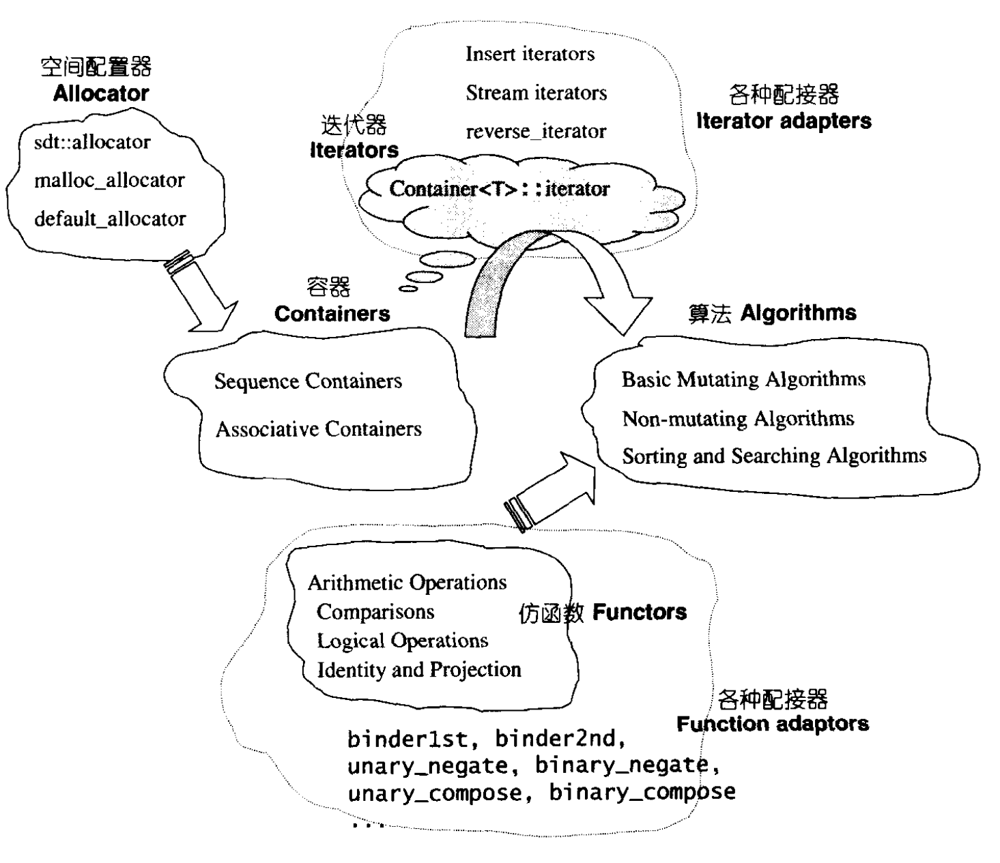

[TOC]

# STL概论与版本简介

### STL 六大组件

- **容器(containers)** : vector.list.deque,set,map等数据存放的类。
- **算法(algorithms)** : 各种排序算法;sort、search、copy、erase..等
- **迭代器(iterators)** ：扮演容器与算法之间的胶合剂，是所谓的“泛型指针。共有五种类型，以及其它衍生变化。从实现的角度来看，迭代器是一种将 operator*，operator--，operator->， operator++，等指针相关操作予以重载的class template。所有STL容器都附带有自己专属的选代器——是的，只有容器设计者才知道如何遍历自己的元素。**原生指针 (native pointer)也是一种选代器**。
- **仿函数(functors)** ：行为类似函数，可以视为算法的某种策略。从实现的角度来看，仿函数是一种重载了 operator() 的 class 或 class template。**一般的函数指针可视为狭义的仿函数。**
- **配接器(adapters) **：一种用来修饰容器(containers)或仿函数(functors)或迭代器(iterators)接口的东西。
- **配置器(allocators)** : 负责空间配置与管理。

六大组件的交互关系：

